## 第一节 持久化总体介绍

> **我们知道Redis是一个内存型数据库,内存的特性是掉电或者程序退出则不保存数据,但是经过实测我们发现,Redis重启服务后,之前存储的数据仍然在,那么这就是通过持久化的方式实现的.**
>
> 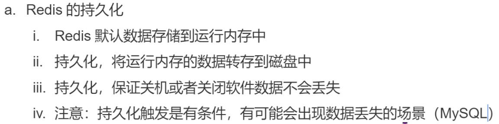

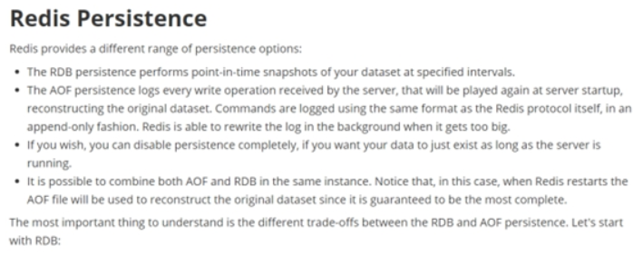

> Redis 提供了2个不同形式的持久化方式。

-   **RDB（Redis DataBase）定时数据快照 `默认方式`**
    
    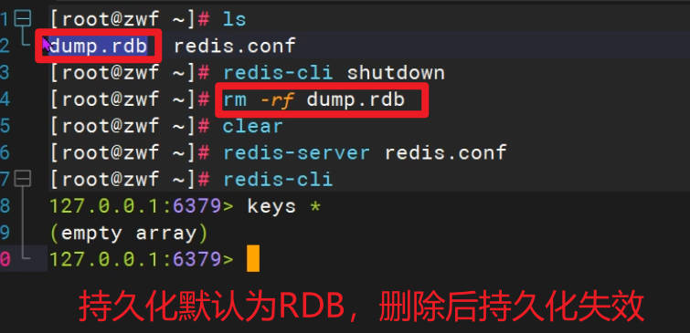
    
    -   **RDB持久化是`一种周期性将Redis数据集快照保存到磁盘的机制`。它会创建一个二进制文件（以`.rdb`为扩展名），其中包含了当前数据库中的所有键值对的快照。**RDB持久化有以下特点：
        - 快速恢复：RDB文件是一个快照，恢复时可以快速加载整个数据集，适合用于备份和灾难恢复。
        - 紧凑的文件格式：RDB文件采用二进制格式，文件相对较小，节省存储空间。
        - 高性能：由于RDB是周期性执行的快照操作，可以提供很好的性能，不会对数据库的读写操作产生额外的负担。
        - 可配置的触发机制：可以通过配置触发RDB持久化的方式，如根据时间间隔、写操作次数或者同时满足两者等。
    
-   **AOF（Append Of File） 指令日志文件 `手动开启`**
    
    - **AOF持久化通过`将Redis的写操作追加到一个日志文件（Append-Only File）中来记录数据库状态的持久化方式`。AOF文件以文本方式保存 Redis 数据库的操作命令，它可以通过重新执行这些命令来还原数据集。**
    
      AOF持久化有以下特点：
    
      - 高数据完整性：通过记录每个写操作命令，可以将数据库的状态完全还原。
      - 恢复方式灵活：可以选择完全根据AOF文件来还原数据库状态，也可以选择在启动时将AOF文件的内容重放到内存数据库中。
      - 默认是追加模式：在默认情况下，Redis以追加模式将写操作追加到AOF文件中，即使文件很大，也不会对系统性能产生明显影响。
      - 文件体积相对较大：由于AOF文件保存了系统的写操作历史，相比RDB文件，AOF文件的体积通常要大。
      - 可能会有较高的写入延迟：由于每个写操作都需要追加到AOF文件，如果AOF文件较大，可能会导致写入延迟增加。


## 第二节 RDB持久化

### 2.1 RDB简介

> 在指定的时间间隔内将内存中的数据集快照写入磁盘,也就是行话讲的Snapshot快照，它恢复时是将快照文件直接读到内存里.

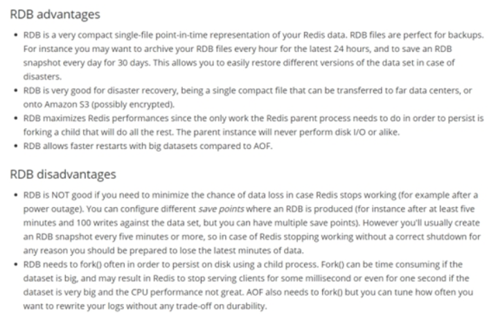

### 2.2 RDB持久化流程

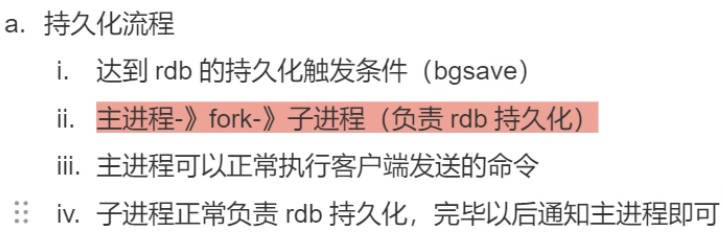

> 执行流程

&#x20;   Redis会单独创建（fork）一个子进程来进行持久化，会先将数据写入到 一个临时文件中，待持久化过程都结束了，再用这个临时文件替换上次持久化好的文件。 整个过程中，主进程是不进行任何IO操作的，这就确保了极高的性能 如果需要进行大规模数据的恢复，且对于数据恢复的完整性不是非常敏感，那RDB方式要比AOF方式更加的高效。RDB的缺点是最后一次持久化后的数据可能丢失（服务器宕机，最后一次不会缓存，正常关闭会进行缓存）。

> Fork子进程

-   Fork的作用是复制一个与当前进程一样的进程。新进程的所有数据（变量、环境变量、程序计数器等） 数值都和原进程一致，但是是一个全新的进程，并作为原进程的子进程
-   在Linux程序中，fork()会产生一个和父进程完全相同的子进程，但子进程在此后多会exec系统调用，出于效率考虑，Linux中引入了“写时复制技术”
-   一般情况父进程和子进程会共用同一段物理内存，只有进程空间的各段的内容要发生变化时，才会将父进程的内容复制一份给子进程。

> **RDB持计划流程图**

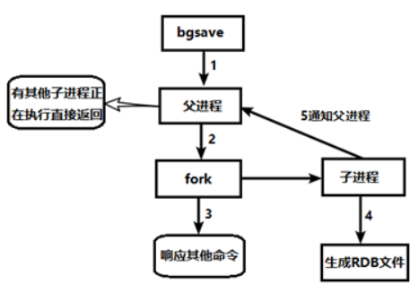

### 2.3 RDB相关配置与操作

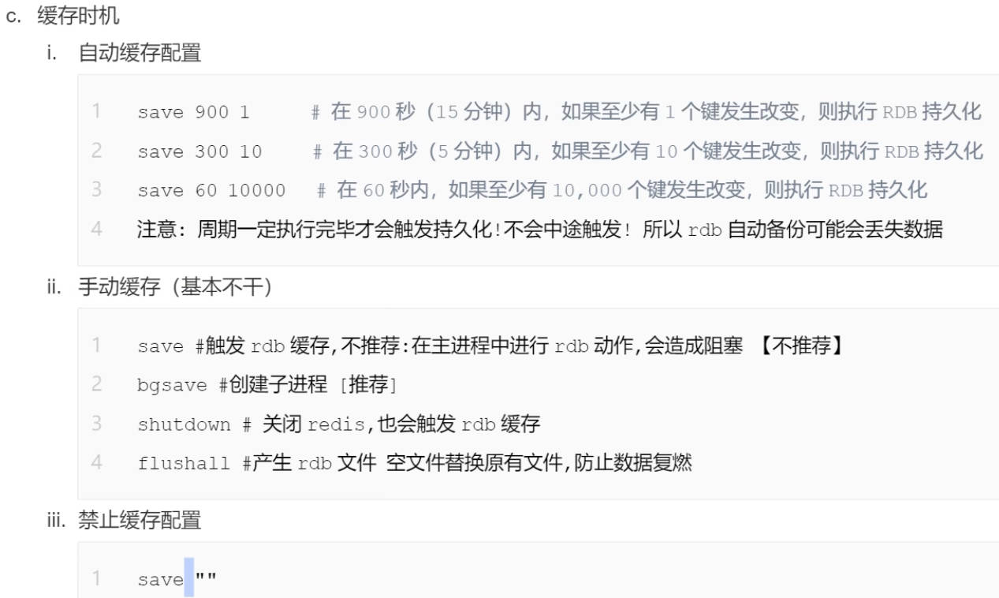

> RDB文件名配置

-   &#x20;在redis.conf中配置文件名称，默认为dump.rdb

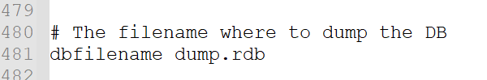


> RDB文件位置配置

-   rdb文件的保存路径，也可以修改。默认为Redis启动时命令行所在的目录下.
-   可以通过修改该配置,将RDB文件存到系统的制定目录下dir "/root/myredis/"

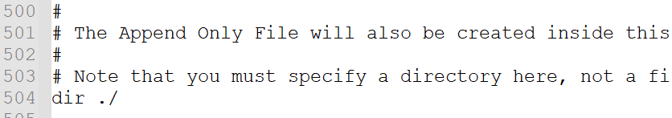


> RDB自动执行快照策略

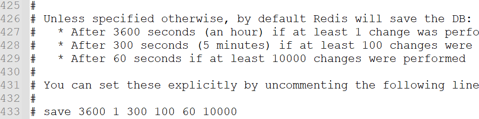

::: tip 

- save命令临时这只快照执行策略

  - 格式：save 秒钟 写操作次数 RDB是整个内存的压缩过的Snapshot，RDB的数据结构，可以配置复合的快照触发条件， 默认是1分钟至少1万个key发生变化，或5分钟至少100个key发生变化，或1个小时至少1个key发生变化。

  - 禁用 不设置save指令，或者给save传入空字符串

  - 以下是一些常见的建议：

    1. **保证数据安全**：至少设置一个`save`规则，以便在Redis发生意外情况（如未预料的断电、宕机等）时，能够通过RDB持久化文件恢复数据。
    2. **平衡性能和持久化频率**：过于频繁的RDB持久化操作可能对性能产生负面影响，因此需要在性能和数据安全之间进行平衡。可以根据系统负载、数据更新频率等因素来调整`save`规则的时间间隔和改变的键的数量。
    3. **避免数据丢失**：确保至少有一个`save`规则能够覆盖一段时间内的数据更新，以免数据丢失过多。

  - 例如，以下是一种常见的`save`规则配置：

    ``` 
    save 900 1      # 在900秒（15分钟）内，如果至少有1个键发生改变，则执行RDB持久化
    save 300 10     # 在300秒（5分钟）内，如果至少有10个键发生改变，则执行RDB持久化
    save 60 10000   # 在60秒内，如果至少有10,000个键发生改变，则执行RDB持久化
    ```

    这个配置意味着在不同时间范围内，Redis会根据改变的键的数量执行RDB持久化操作，以实现数据的定期持久化和保护。

    总之，`save`规则的设置应该根据具体的应用和业务需求进行调整，并在性能、数据安全和数据可用性之间进行权衡。

    注意：在`save`指令中，时间参数（如900秒）是指Redis服务器从上一次成功执行持久化操作开始计时。

> shuwRDB手动执行快照命令

- save VS bgsave

  -   save ：使用主进行进行持久化指令,save时只管保存，其它不管，全部阻塞。手动保存。不建议。
  -   bgsave：Redis会在后台异步进行快照操作，快照同时还可以响应客户端请求。
      可以通过lastsave 命令获取最后一次成功执行快照的时间
      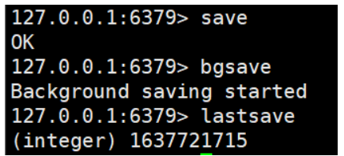

- flushall命令

  -   执行flushall命令，也会产生dump.rdb文件，但里面是空的，无意义

- shutdown命令

  - shutdown命令在关闭服务的时候也会进行自动的持久化


:::


> RDB备份异常策略

-   stop-writes-on-bgsave-error 配置
    -   当Redis无法写入磁盘的话，直接关掉Redis的写操作。推荐yes.

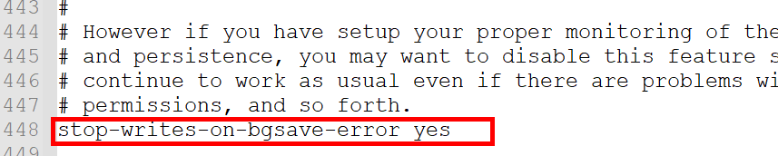


> RDB 文件压缩配置

-   rdbcompression配置
    -   对于存储到磁盘中的快照，可以设置是否进行压缩存储。如果是的话，redis会采用LZF算法进行压缩。如果你不想消耗CPU来进行压缩的话，可以设置为关闭此功能。推荐yes.
        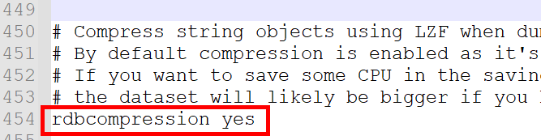


> RDB文件检查完整性配置

-   rdbchecksum配置
    -   在存储快照后，还可以让redis使用CRC64算法来进行数据校验，但是这样做会增加大约10%的性能消耗，如果希望获取到最大的性能提升，可以关闭此功能.推荐yes.

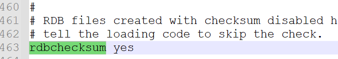


> RDB手动备份操作

- 查询rdb文件的目录 将 \*.rdb的文件拷贝到别的地方

- rdb的恢复

  - 关闭Redis

  - 先把备份的文件拷贝到工作目录下 cp dump2.rdb dump.rdb

  - 启动Redis, 备份数据会直接加载

    

> RDB禁用操作

-   修改配置文件永久禁用

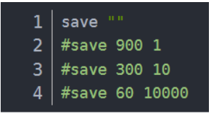

-   通过指令临时禁用

```纯文本
动态停止RDB：redis-cli config set save ""  save后给空值，表示禁用保存策略(不建议)
```


### 2.4 RDB的优势和劣势

#### 2.4.1 优势

-   适合大规模的数据恢复
-   对数据完整性和一致性要求不高更适合使用
-   **节省磁盘空间**
-   **恢复速度快**

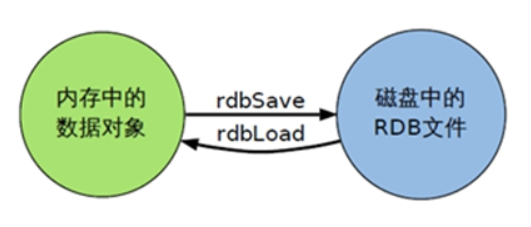

#### 2.4.2 劣势

-   Fork的时候，内存中的数据被克隆了一份，大致2倍的膨胀性需要考虑
-   虽然Redis在fork时使用了**写时拷贝技术**,但是如果数据庞大时还是比较消耗性能。
-   在备份周期在一定间隔时间做一次备份，所以如果Redis意外down掉的话，就会丢失最后一次快照后的所有修改。


### 2.5 RDB小总结

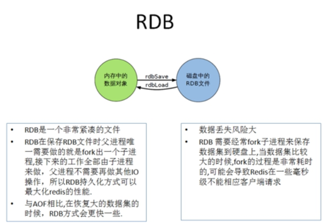


## 第三节 AOF持久化

### 3.1 AOF简介

&#x20;      Append Only File 以日志的形式来记录每个写操作（增量保存），将Redis执行过的所有写指令记录下来(读操作不记录)， 只许追加文件但不可以改写文件，redis启动之初会读取该文件重新构建数据，换言之，redis 重启的话就根据日志文件的内容将写指令从前到后执行一次以完成数据的恢复工作

### 3.2 AOF持计划流程

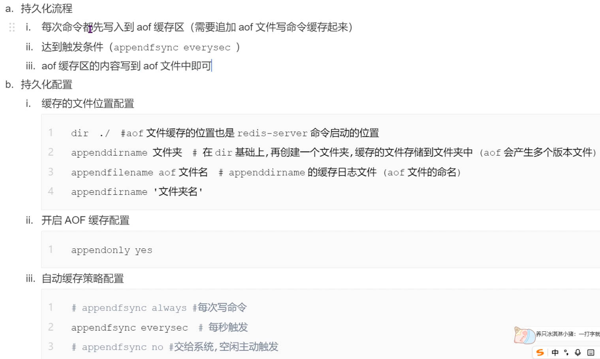

（1）客户端的请求写命令会被append追加到AOF缓冲区内；

（2）AOF缓冲区根据AOF持久化策略\[always,everysec,no]将操作sync同步到磁盘的AOF文件中；

（3）AOF文件大小超过重写策略或手动重写时，会对AOF文件rewrite重写，压缩AOF文件容量；

（4）Redis服务重启时，会重新load加载AOF文件中的写操作达到数据恢复的目的；

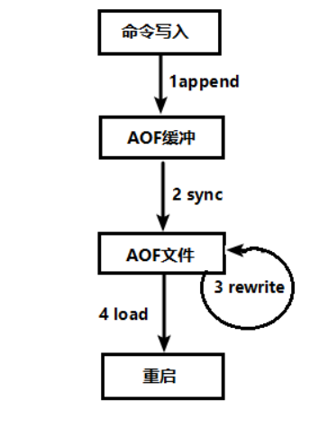

### 3.3 AOF相关配置与操作

> AOF文件名配置

-   可以在redis.conf中配置文件名称，默认为 appendonly.aof

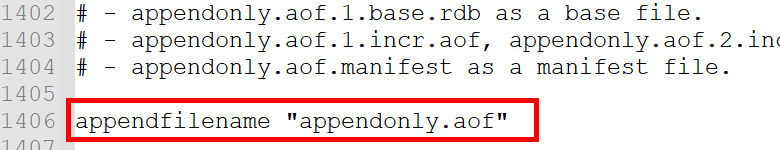


> AOF文件位置路径

- Redis6中，AOF文件的保存路径，同RDB的路径一致。

- Redis7有变化：

  base：基本文件

  incr：增量文件

  manifest：清单文件

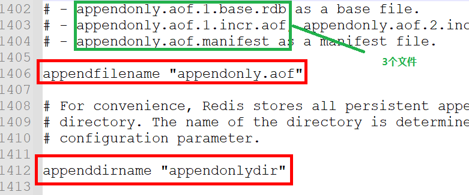


> AOF开启-修复-恢复操作

```纯文本
AOF的备份机制和性能虽然和RDB不同, 但是备份和恢复的操作同RDB一样，都是拷贝备份文件，需要恢复时再拷贝到Redis工作目录下，启动系统即加载。
```

- 正常恢复数据

  - 修改默认的appendonly no，改为yes,开启AOF方式

    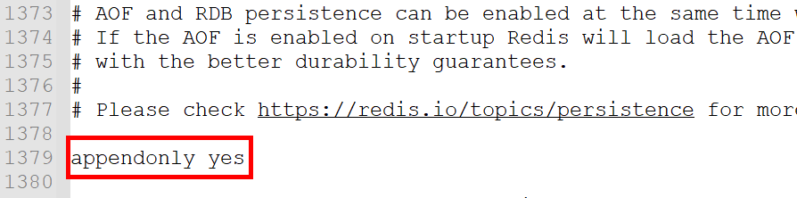

  - 将有数据的aof文件复制一份保存到对应目录(查看目录：config get dir)

  - 恢复：重启redis然后重新加载

    

- 异常修复数据

  - 修改默认的appendonly no，改为yes

  - 如遇到AOF文件损坏，通过/usr/local/bin/redis-check-aof --fix appendonly.aof.1.incr.aof进行恢复

  - 备份被写坏的AOF文件

  - 恢复：重启redis，然后重新加载

    

> AOF同步频率设置

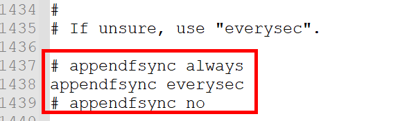

- appendfsync always

  -   始终同步，每次Redis的写入都会立刻记入日志；性能较差但数据完整性比较好

- appendfsync everysec

  -   每秒同步，每秒记入日志一次，如果宕机，本秒的数据可能丢失。

- appendfsync no

  - redis不主动进行同步，把同步时机交给操作系统。


::: tip 

> AOF压缩配置

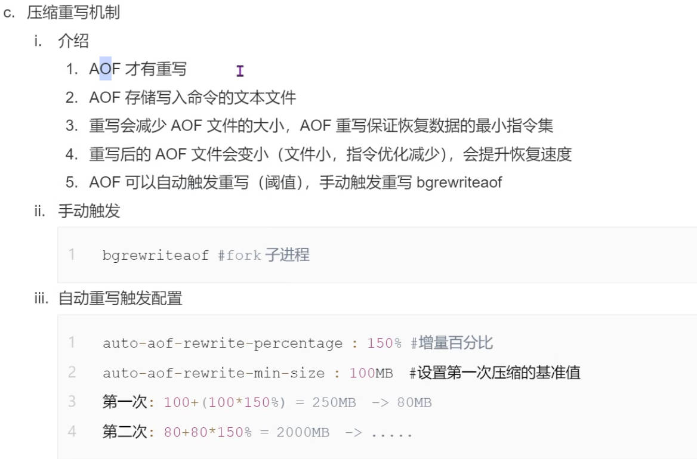

- 什么是文件压缩 rewrite重写?

  ```纯文本
  AOF采用文件追加方式，文件会越来越大为避免出现此种情况，新增了重写机制, 当AOF文件的大小超过所设定的阈值时，Redis就会启动AOF文件的内容压缩， 只保留可以恢复数据的最小指令集.可以使用命令bgrewriteaof!
  ```

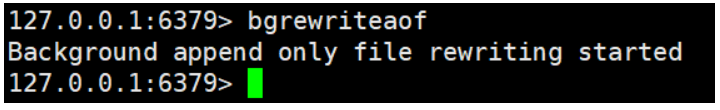

效果：

原始数据：

``` 
  SET key1 value1
  SET key2 value2
  SET key3 value3
  ...
  SET key100000 value100000
```

这个AOF文件包含了10万个`SET`命令，每个命令都以完整的形式记录在文件中。文件的大小可能相对较大。

执行`BGREWRITEAOF`命令重写AOF文件后，新生成的AOF文件可能会被优化如下：

压缩数据：

``` 
  *10\r\n
  $3\r\nSET\r\n
  $4\r\nkey1\r\n
  $6\r\nvalue1\r\n
  $3\r\nSET\r\n
  $4\r\nkey2\r\n
  $6\r\nvalue2\r\n
  ...
  $3\r\nSET\r\n
  $6\r\nkey100000\r\n
  $8\r\nvalue100000\r\n
```

新的AOF文件采用了类似于RESP（REdis Serialization Protocol）的格式，使用更紧凑的表示方式。这里使用了特殊的RESP表示法来表示命令参数，其中`*`表示参数数量，`$`表示参数长度，`\r\n`表示参数结束。

通过这种优化方式，新的AOF文件相对于原始AOF文件可能会更小，因为相同的命令参数被重复使用，并且使用了更紧凑的格式。

这种优化的效果在于减小AOF文件的体积和提高读取性能。AOF文件越小，加载和恢复数据所需的时间就越短，而且读取AOF文件时无需解压缩，可以更快地恢复数据。

需要注意的是，优化的效果会受到AOF文件中命令种类和数量的影响。一些特定情况下，比如AOF文件中存在大量相同的命令，优化效果可能会更加显著。但是，如果AOF文件中包含很少的重复命令或者大量不同类型的命令，优化效果可能相对较小。

总之，通过进行AOF文件重写和优化，Redis可以使用更紧凑的表示方式来减小AOF文件的大小，提高读取性能，并在加载AOF文件时更快地恢复数据。

- 重写策略设置!

  - no-appendfsync-on-rewrite 设置重写策略

    ``` 
    在 AOF 重写期间，Redis 会将新的写命令追加到新的 AOF 文件中，同时也会将这些写命令同步到磁盘（执行文件同步操作）。这样可以确保数据的持久性，但也会带来一定的性能损耗，因为磁盘同步是比较慢的操作。
    
    通过设置 no-appendfsync-on-rewrite 为 "yes"，Redis 在 AOF 重写过程中将不会执行文件同步操作。这意味着重写期间新的写命令只会追加到新的 AOF 文件中，而不会立即同步到磁盘。这样可以提高 AOF 重写的性能!但是数据安全性低!
    no-appendfsync-on-rewrite 默认情况下，该选项为 "no"，即执行文件同步操作以确保数据的持久性。数据安全,但是性能低! 
    ```

- 何时自动触发重写?

  ```纯文本
  Redis会记录上次重写时的AOF大小，默认配置是当AOF文件大小是上次rewrite后大小的一倍且文件大于64M时触发,重写虽然可以节约大量磁盘空间，减少恢复时间。但是每次重写还是有一定的负担的，因此设定Redis要满足一定条件才会进行重写。
  ```

  -   auto-aof-rewrite-percentage : 100% 设置重写基准值的百分比
      -   该配置选项表示 AOF 文件大小相对于上次重写后的大小的增长百分比。默认值为 100，表示当 AOF 文件的大小增长到上次重写后大小的两倍时，将触发自动 AOF 重写。
  -   auto-aof-rewrite-min-size : 100MB 设置重写基准值
      -   该配置选项表示 AOF 文件的最小大小阈值。默认值为 64MB。即使 AOF 文件的增长百分比超过了 `auto-aof-rewrite-percentage` 的设定值，但如果 AOF 文件的大小仍然低于 `auto-aof-rewrite-min-size`，则不会触发自动 AOF 重写。

  ```纯文本
  例如：文件达到70MB开始重写，降到50MB，下次什么时候开始重写？100MB
  系统载入时或者上次重写完毕时，Redis会记录此时AOF大小，设为base_size,如果Redis的AOF当前大小>= base_size +base_size*100% (默认)且当前大小>=64mb(默认)的情况下，Redis会对AOF进行重写。 
  ```

- 重写的流程是?

  -   （1）bgrewriteaof触发重写，判断是否当前有bgsave或bgrewriteaof在运行，如果有，则等待该命令结束后再继续执行。
  -   （2）主进程fork出子进程执行重写操作，保证主进程不会阻塞。
  -   （3）子进程遍历redis内存中数据到临时文件，客户端的写请求同时写入aof\_buf缓冲区和aof\_rewrite\_buf重写缓冲区,保证原AOF文件完整以及新AOF文件生成期间的新的数据修改动作不会丢失。
  -   （4）子进程写完新的AOF文件后，向主进程发信号，父进程更新统计信息。
  -   （5）使用新的AOF文件覆盖旧的AOF文件，完成AOF重写。

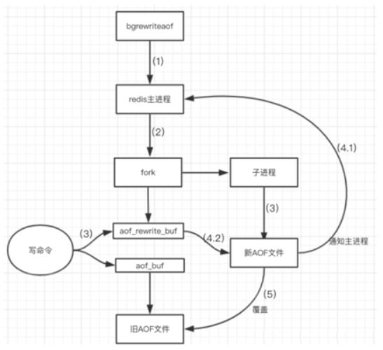

:::


### 3.4 AOF的优势

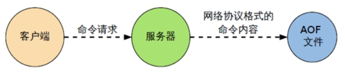

-   备份机制更稳健，丢失数据概率更低。
-   可读的日志文本，通过操作AOF稳健，可以处理误操作。

### 3.5 AOF的劣势

-   比起RDB占用更多的磁盘空间。
-   恢复备份速度要慢。
-   每次读写都同步的话，有一定的性能压力。
-   存在个别Bug，造成无法恢复。

### 3.6 AOF小总结

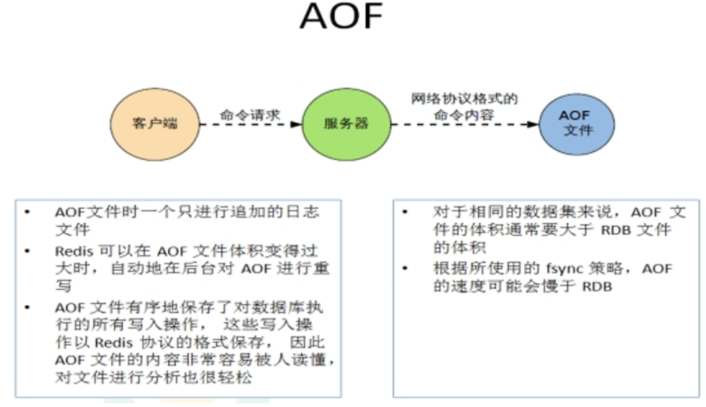


### 3.7 持久化方案选择

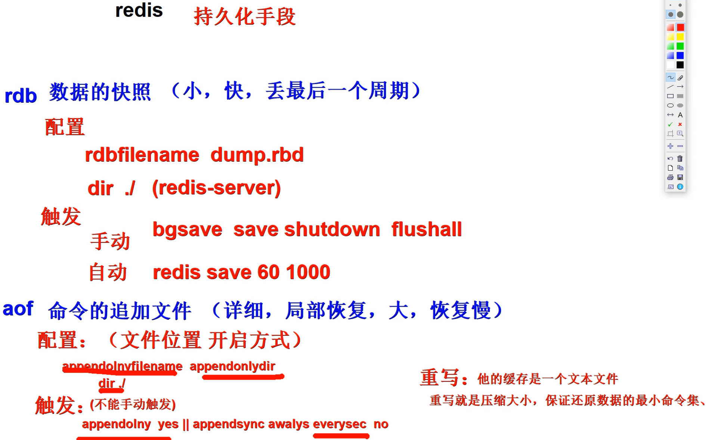

> RDB和AOF用哪个好?

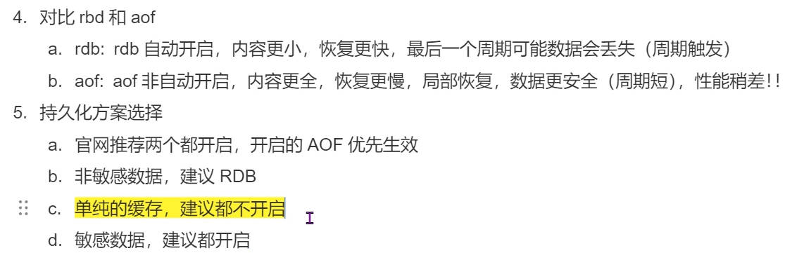

-   官方推荐两个都启用。
-   如果对数据不敏感，可以选单独用RDB。
-   不建议单独用 AOF，因为可能会出现Bug。
-   如果只是做纯内存缓存，可以都不用。
-   AOF和RDB如果同时开启,系统默认取AOF中的持久化数据

> 官网建议

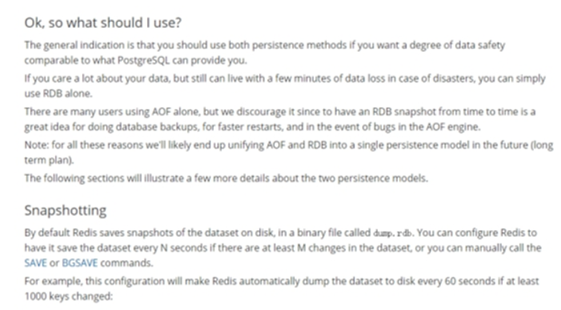

- RDB持久化方式能够在指定的时间间隔能对你的数据进行快照存储

- AOF持久化方式记录每次对服务器写的操作,当服务器重启的时候会重新执行这些命令来恢复原始的数据,AOF命令以redis协议追加保存每次写的操作到文件末尾.

- Redis还能对AOF文件进行后台重写,使得AOF文件的体积不至于过大

- 只做缓存：如果你只希望你的数据在服务器运行的时候存在,你也可以不使用任何持久化方式.

- 同时开启两种持久化方式

- 在这种情况下,当redis重启的时候会优先载入AOF文件来恢复原始的数据, 因为在通常情况下AOF文件保存的数据集要比RDB文件保存的数据集要完整.

- RDB的数据不实时，同时使用两者时服务器重启也只会找AOF文件。那要不要只使用AOF呢？

- 建议不要，因为RDB更适合用于备份数据库(AOF在不断变化不好备份)， 快速重启，而且不会有AOF可能潜在的bug，留着作为一个万一的手段。

- 性能建议

  因为RDB文件只用作后备用途，建议只在Slave上持久化RDB文件，而且只要15分钟备份一次就够了，只保留save 900 1这条规则。

  如果使用AOF，好处是在最恶劣情况下也只会丢失不超过两秒数据，启动脚本较简单只load自己的AOF文件就可以了。
  代价,一是带来了持续的IO，二是AOF rewrite的最后将rewrite过程中产生的新数据写到新文件造成的阻塞几乎是不可避免的。
  只要硬盘许可，应该尽量减少AOF rewrite的频率，AOF重写的基础大小默认值64M太小了，可以设到5G以上。
  默认超过原大小100%大小时重写可以改到适当的数值。
