## 第一节 网络配置相关&#x20;

### （1） bind绑定连接IP

```纯文本
默认情况bind=127.0.0.1只能接受本机的访问请求,不写的情况下，无限制接受任何ip地址的访问,生产环境肯定要写你应用服务器的地址；服务器是需要远程访问的，所以需要将其注释掉.如果开启了protected-mode，那么在没有设定bind ip且没有设密码的情况下，Redis只允许接受本机的响应
```

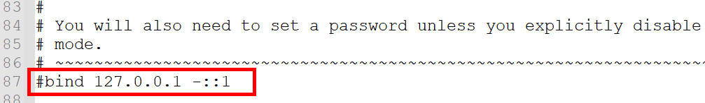

```纯文本
保存配置，停止服务，重启启动查看进程，不再限制是本机访问了。
```

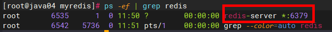

```纯文本
这里完成之后,就可以在window上安装一个redis客户端,连接虚拟机上的redis服务了
```


### （2） 端口号： 6379

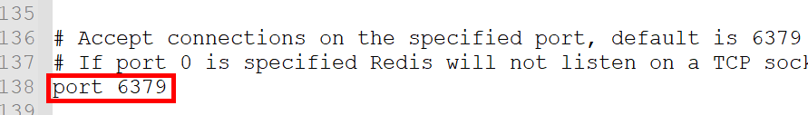


### （3）tcp-backlog 连接队列

```纯文本
  设置tcp的backlog，backlog其实是一个连接队列，backlog队列总和=未完成三次握手队列 + 已经完成三次握手队列。在高并发环境下你需要一个高backlog值来避免慢客户端连接问题。

​  注意Linux内核会将这个值减小到/proc/sys/net/core/somaxconn的值（128），所以需要确认增大/proc/sys/net/core/somaxconn和/proc/sys/net/ipv4/tcp_max_syn_backlog（128）两个值来达到想要的效果
```

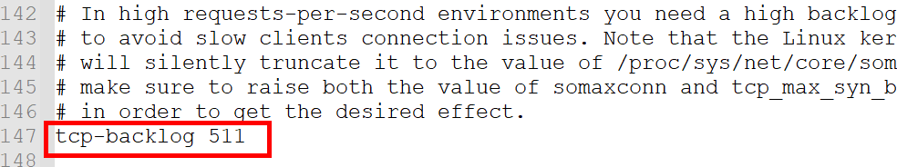


### （4）timeout连接超时

```纯文本
一个空闲的客户端维持多少秒会关闭，0表示关闭该功能。即永不关闭。
```

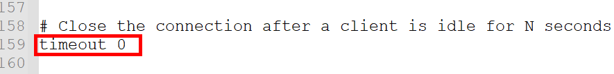


### （5）tcp-keepalive  连接心跳检测

```纯文本
对访问客户端的一种心跳检测，每个n秒检测一次。
单位为秒，如果设置为0 则不会进行Keepalive检测，建议设置成60  
```

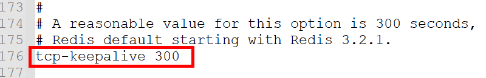


## 第二节 GENREAL通用配置

### （1）UNITS单位

```纯文本
 配置大小单位,开头定义了一些基本的度量单位，只支持bytes，不支持bit,大小写不敏感
```

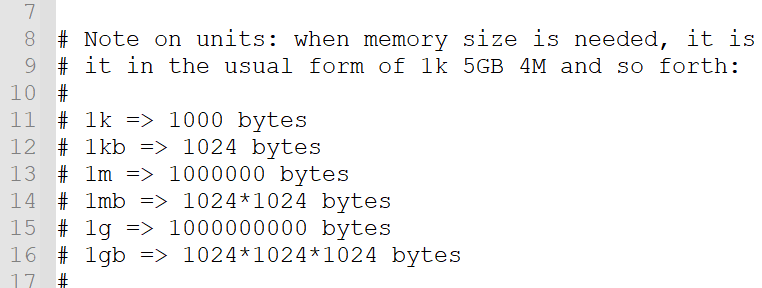


### （2）INCLUDES包含

```纯文本
在当前配置文件中引入其他配置文件中的内容,一般都是引入一些公共配置
```

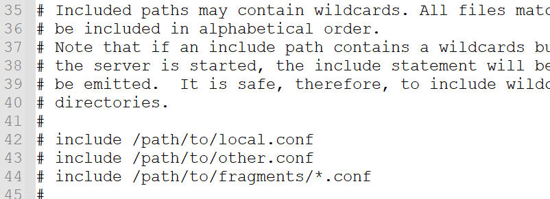


### （3）daemonize 后台进程

```纯文本
是否为后台进程，设置为yes ,守护进程，后台启动
```

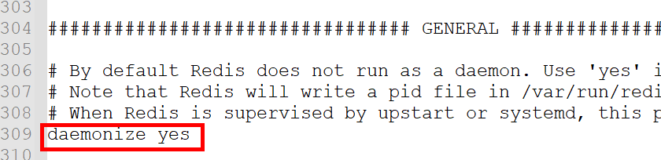


### （4）pidfile 进程ID文件

```纯文本
存放pid文件的位置，每个实例会产生一个不同的pid文件
```

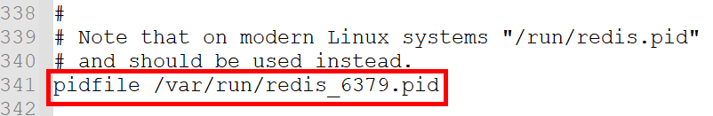


### （5）databases 16&#x20;

```纯文本
设定库的数量 默认16，默认数据库为0，可以使用SELECT <dbid>命令在连接上指定数据库id
```

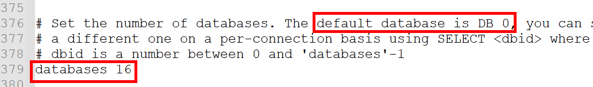


## 第三节 SECURITY安全配置

> 1.**设置密码**

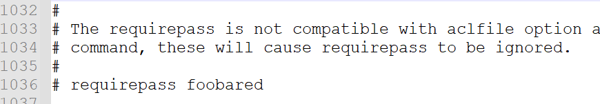

```纯文本
访问密码的查看、设置和取消
在命令中设置密码，只是临时的。重启redis服务器，密码就还原了。
永久设置，需要再配置文件中进行设置。
```

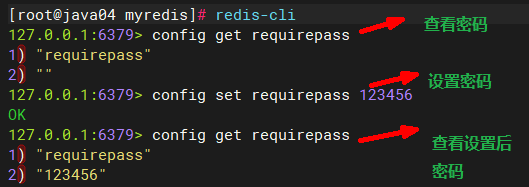

**重新连接客户端测试**

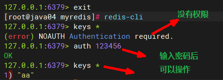


## 第四节 LIMIT限制

### （1）maxclients 客户端最大连接数

::: tip

-   设置redis同时可以与多少个客户端进行连接。
-   默认情况下为10000个客户端。
-   如果达到了此限制，redis则会拒绝新的连接请求，并且向这些连接请求方发出“max number of clients reached”以作回应。

:::

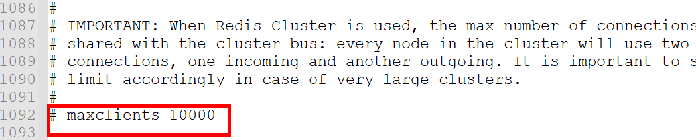


### （2）maxmemory 最大占用内存 

::: tip

-   建议**必须设置**，否则，将内存占满，造成服务器宕机
-   设置redis可以使用的内存量。一旦到达内存使用上限，redis将会试图移除内部数据，移除规则可以通过maxmemory-policy来指定。
-   如果redis无法根据移除规则来移除内存中的数据，或者设置了“不允许移除”，那么redis则会针对那些需要申请内存的指令返回错误信息，比如SET、LPUSH等。
-   但是对于无内存申请的指令，仍然会正常响应，比如GET等。如果你的redis是主redis（说明你的redis有从redis），那么在设置内存使用上限时，需要在系统中留出一些内存空间给同步队列缓存，只有在你设置的是“不移除”的情况下，才不用考虑这个因素。

:::

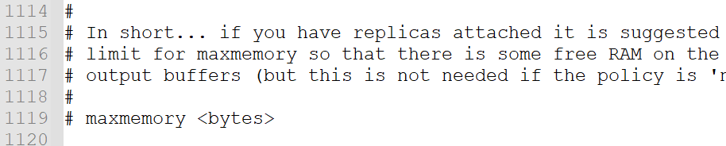


### （3）maxmemory-policy  置换策略

​	maxmemory-policy` 是 Redis 的配置选项之一，用于指定内存达到最大限制时的置换策略。当 Redis 的内存占用超过了 `maxmemory` 的设置值时，Redis 会根据所配置的 `maxmemory-policy` 策略来选择哪些键进行置换或删除以释放内存空间。

::: tip

以下是常见的 `maxmemory-policy` 的取值和每个值的作用：

1. `noeviction`（默认值 皇上不纳新）：当内存达到最大限制时，Redis 将拒绝新的写操作，直到有足够的内存空间可用。这是一种保护性策略，它确保不会删除任何键，但可能会导致写操作失败。
2. `allkeys-lru`（按照翻牌子的间隔时间淘汰）：当内存达到最大限制时，Redis 会优先选择最近最少使用（Least Recently Used）的键进行删除。这是一种常见的置换策略，适用于内存中存储的大量键具有不同的访问频率的情况。
3. `allkeys-lfu`（按照翻牌子次数淘汰）：当内存达到最大限制时，Redis 会优先选择最不经常使用（Least Frequently Used）的键进行删除。此策略假设不经常访问的键可能是不需要的，适用于需要主要关注对频繁访问键的保留的情况。
4. `allkeys-random`（大家一起随机淘汰，有可能把皇后淘汰了）：当内存达到最大限制时，Redis 会随机选择要删除的键。这种策略是一种简单的随机删除策略，可以用于不需要特定的键置换顺序的情况。
5. `volatile-lru`：当内存达到最大限制时，Redis 会优先选择最近最少使用的带有过期时间的键进行删除。这种策略适用于特定键具有过期时间，并且对过期键进行清理的需求较高的情况。
6. `volatile-lfu`：当内存达到最大限制时，Redis 会优先选择最不经常使用的带有过期时间的键进行删除。和 `volatile-lru` 类似，但是根据访问频率来确定键的优先级。
7. `volatile-random`：当内存达到最大限制时，Redis 会随机选择要删除的带有过期时间的键。

:::

`maxmemory-policy` 可根据您的具体需求进行配置，选择适合您应用程序的置换策略。请注意，设置不当的策略可能会导致数据丢失或性能问题，因此建议根据具体场景进行测试和评估。

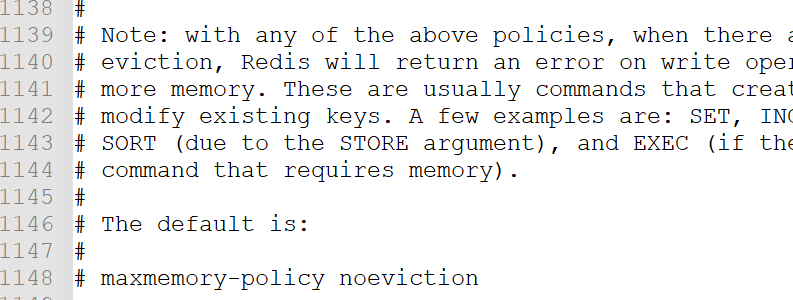


### （4）maxmemory-samples

::: tip

-   设置样本数量，LRU算法和最小TTL算法都并非是精确的算法，而是估算值，所以你可以设置样本的大小，redis默认会检查这么多个key并选择其中LRU的那个。
-   一般设置3到7的数字，数值越小样本越不准确，但性能消耗越小。

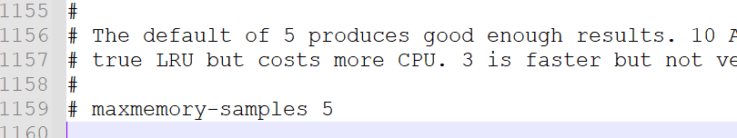

-   设置为 10，那么 Redis 将会增加额外的 CPU 开销以保证接近真正的 LRU 性能

:::
