## 1.目前面临问题分析

-   容量不够，redis如何进行扩容？
-   并发写操作， redis如何分摊？
-   另外，主从模式，薪火相传模式，主机宕机，导致ip地址发生变化，应用程序中配置需要修改对应的主机地址、端口等信息。
-   之前通过代理主机来解决，但是redis3.0中提供了解决方案。就是无中心化集群配置。


## 2.什么是集群

> Redis 集群实现了对Redis的水平扩容，即启动N个redis节点，将整个数据库分布存储在这N个节点中，每个节点存储总数据的1/N。

> Redis 集群通过分区（partition）来提供一定程度的可用性（availability ）：即使集群中有一部分节点失效或者无法进行通讯，集群也可以继续处理命令请求。


## 3.集群的搭建

### （1）第一步,搭建前的准备

-   之前操作产生的rdb和aof文件删除
-   appendonly 修改回 no
-   清空主从复制和哨兵模式留下的一些文件
-   开启daemonize yes
-   protected-mode no
-   注释掉bind


### （2）第二步,制作六个实例的配置文件

- 集群开启命令

  ```text
  redis-cli --cluster create --cluster-replicas 1 
  --cluster create：该命令参数表明你要创建一个 Redis 集群。Redis 集群是由多个 Redis 节点组成的分布式系统，用于实现高可用性和横向扩展。通过指定 create 参数，你告诉 redis-cli 工具你想要创建一个 Redis 集群。
  --cluster-replicas 1：该命令参数指定了每个主节点应该具有的副本数。在 Redis 集群中，每个主节点可以有若干个从节点作为其副本，用于提供数据冗余和故障转移。通过设置 --cluster-replicas 1，你告诉 redis-cli 工具每个主节点应该有一个从节点副本。
  
  ```

- 集群配置文件

  ```text
  include /root/myredis/redis.conf #引用公共的配置文件
  port 6379 # 设置端口号
  pidfile "/var/run/redis_6379.pid" # 设置pid进程文件
  dbfilename "dump6379.rdb" # 设置rdb持久化问价名
  cluster-enabled yes 
  cluster-config-file nodes-6379.conf
  cluster-node-timeout 15000 
  ```

- 创建6379 6380 6381  6389 6390 6391 六个结点的配置文件

  ```text
  创建一个配置文件后,进行复制即可,然后再vim下,通过 :%s/6379/目标端口 来批量替换每个配置文件中的端口号
  ```

  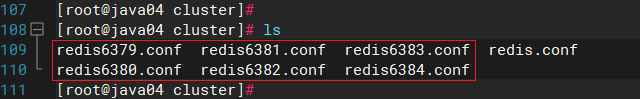


### （3）第三步,启动六个服务

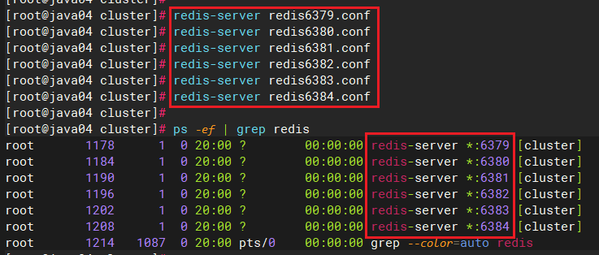

-   组合之前，请确保所有redis实例启动后，nodes-xxxx.conf文件都生成正常。

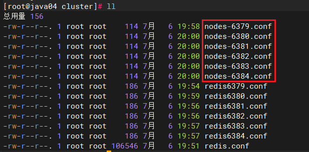


### （4）第四步 ,将六个服务合并为一个集群

- 切换目录到redis的src下

  ```text
  cd /opt/redis-7.0.10/src
  ```

- 运行如下指令

  ```text
  redis-cli --cluster create --cluster-replicas 1 192.168.6.131:6379 192.168.6.131:6380 192.168.6.131:6381 192.168.6.131:6382 192.168.6.131:6383 192.168.6.131:6384
  
  ifconfig -> 192.168.6.100  云服务器 不能用公网ip  / 内网ip
  ```


  **此处不要用127.0.0.1， 请用真实IP地址    --replicas 1 采用最简单的方式配置集群，一台主机，一台从机，正好三组。**

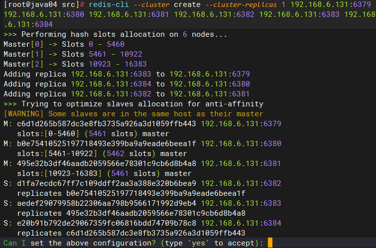

输入 yes 继续

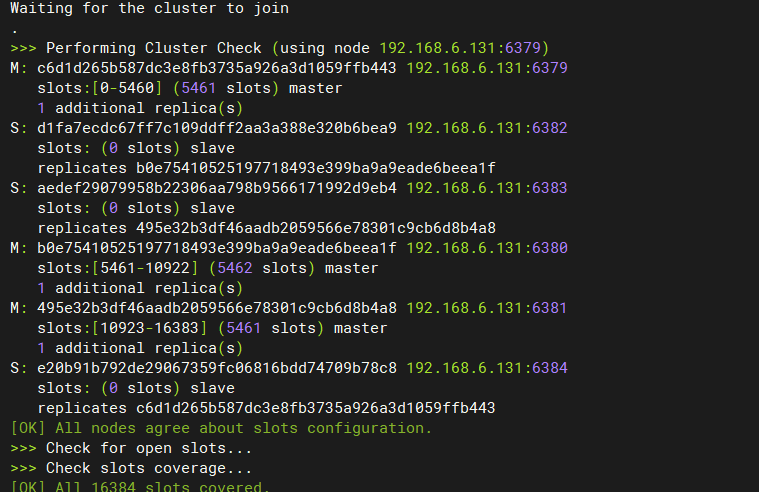


## 4.集群的登录

### （1）集群登录方式

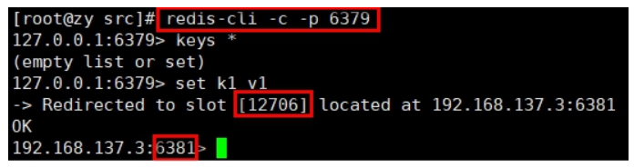

-   登录指令添加 -c 代表以集群方式登录


### （2）登录后查看集群信息

- 一个集群至少要有三个主节点。选项 --cluster-replicas 1 表示我们希望为集群中的每个主节点创建一个从节点。

- 分配原则尽量保证每个主数据库运行在不同的IP,每个从库和主库不在一个IP地址上。

  ```text
  cluster nodes
  ```


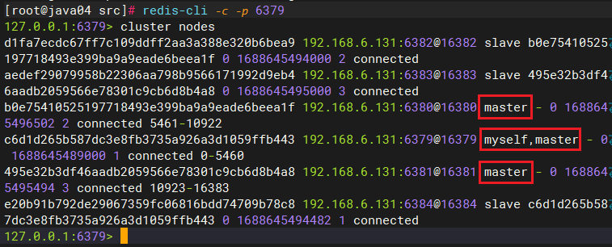


## 5.集群的slots

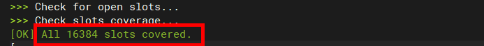

-   一个 Redis 集群包含 16384 个插槽（hash slot）， 数据库中的每个键都属于这 16384 个插槽的其中一个，
-   集群使用公式 CRC16(key) % 16384 来计算键 key 属于哪个槽， 其中 CRC16(key) 语句用于计算键 key 的 CRC16 校验和 。
-   集群中的每个节点负责处理一部分插槽。 举个例子， 如果一个集群可以有主节点， 其中：
    -   节点 A 负责处理 0 号至 5460 号插槽。
    -   节点 B 负责处理 5461 号至 10922 号插槽。
    -   节点 C 负责处理 10923 号至 16383 号插槽。


## 6.集群中录入值

-   在redis-cli每次录入、查询键值，redis都会计算出该key应该送往的插槽，如果不是该客户端对应服务器的插槽，redis会报错，并告知应前往的redis实例地址和端口。
-   redis-cli客户端提供了 –c 参数实现自动重定向。
-   如 redis-cli -c –p 6379 登入后，再录入、查询键值对可以自动重定向。

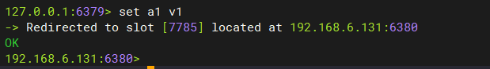


-   不在一个slot下的键值，是不能使用mget,mset等多键操作。

-   可以通过{}来定义组的概念，从而使key中{}内相同内容的键值对放到一个slot中去。

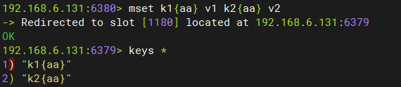


## 7.集群中查找值

-   cluster keyslot key 计算key应该保存在那个插槽
-   cluster countkeysinslot slot的值 计算某个插槽中保存的key的数量
-   CLUSTER GETKEYSINSLOT \<slot>\<count> 返回 count 个 slot 槽中的键。

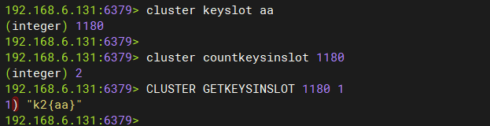


## 8.集群故障恢复

-   如果主节点下线？从节点能否自动升为主节点？注意：**15秒超时**

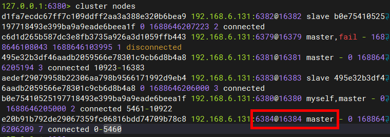

-   主节点恢复后，主从关系会如何？主节点回来变成从机。

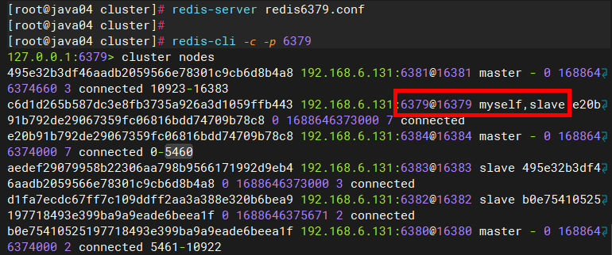

-   如果所有某一段插槽的主从节点都宕掉，redis服务是否还能继续?
    -   redis.conf中cluster-require-full-coverage 为yes 那么 ，整个集群都挂掉
    -   redis.conf中cluster-require-full-coverage 为no 那么，只有该插槽数据全都不能使用。


## 9.集群提供的好处

-   实现扩容
-   分摊压力
-   无中心配置相对简单


## 10.集群的不足

-   多键操作是不被支持的 {key}
-   多键的Redis事务是不被支持的。lua脚本不被支持 {key}


## 11.RedisTemplate的集群配置

> 本地虚拟机可以配置集群,云服务器集群后面需要负载均衡等特殊处理暂时不可链接!

``` yaml
spring:
  redis:
    cluster:
      nodes:
        - 集群ip:端口[6]
        - 集群ip:端口

# 如果是properties格式
spring.redis.cluster.nodes=ip:端口,ip:端口....
```
