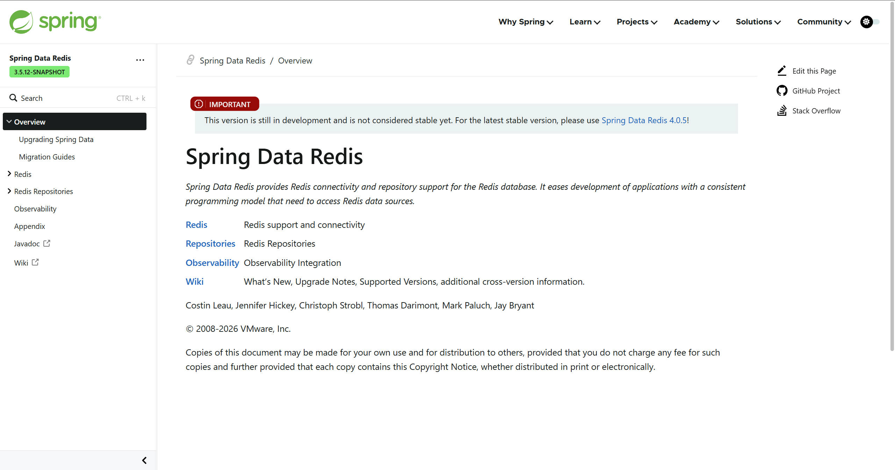
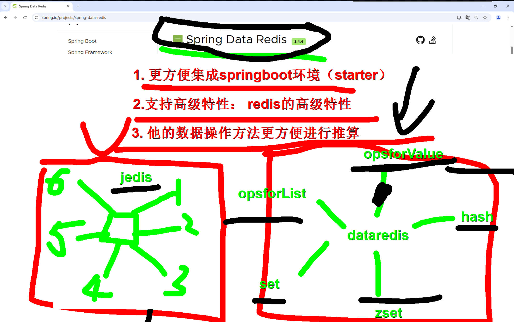
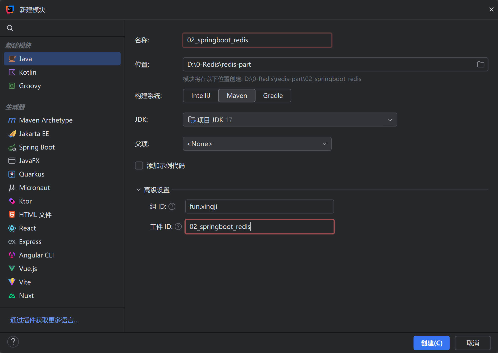
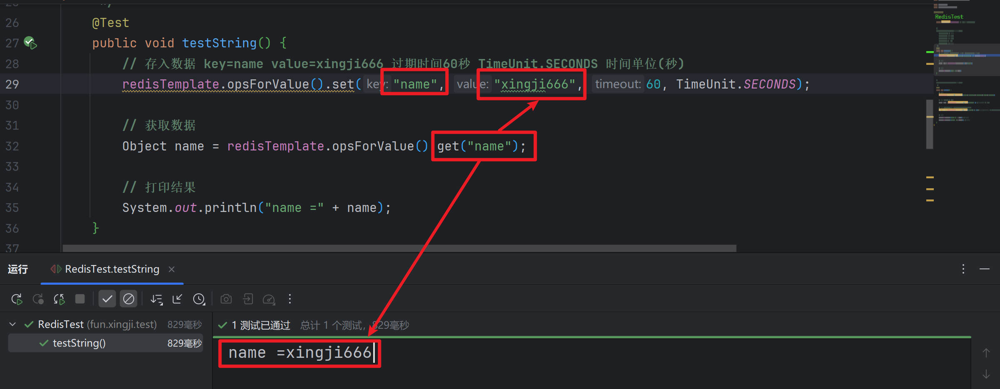
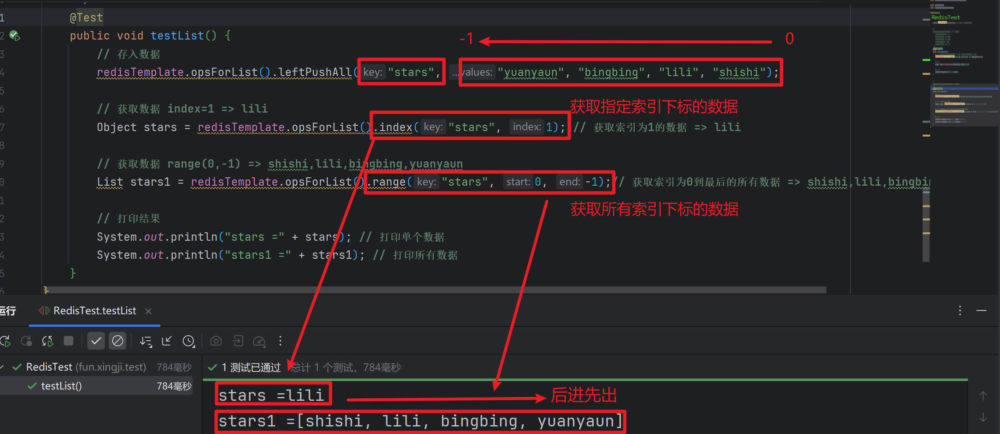
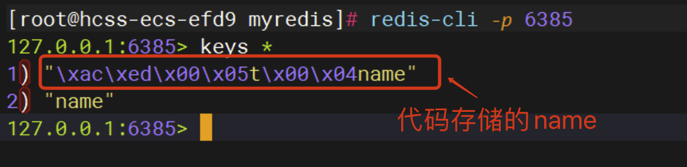
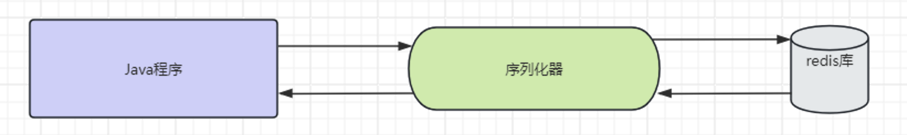
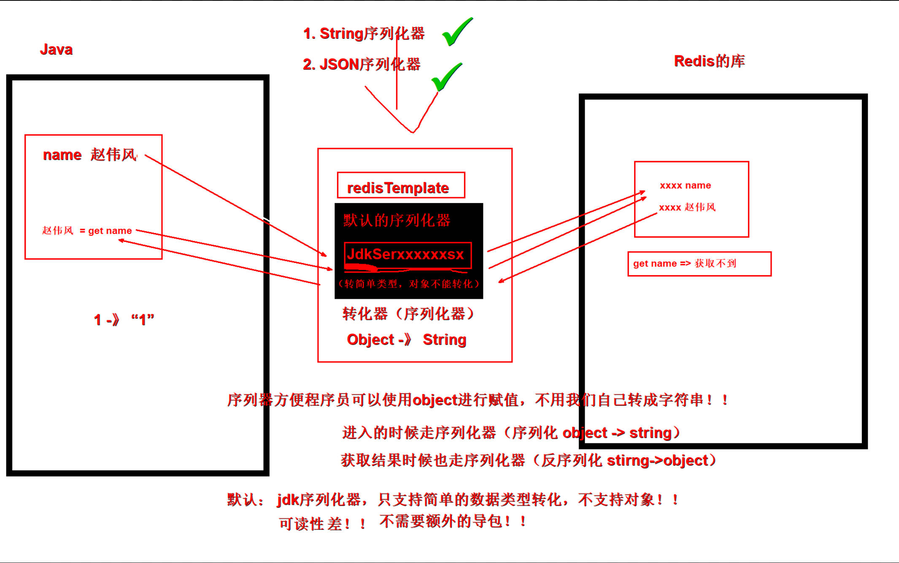

## 1.SpringDataRedis介绍

### 1.1 SpringData-Redis介绍

::: tip

https://spring.io/projects/spring-data-redis#overview



> **SpringData模块是SpringBoot中对各种数据操作的单元,集成对各种数据库的`简化操作方式`,其中对Redis数据库操作的模块叫做`spring-data-redis`!**



* **提供了`不同Redis客户端的整合(Jedis和Lettuce)`**
* **提供了`简化操作api对象`,RedisTemplate**
* **支持Redis`高级场景应用(集群,哨兵等配置)`**
* **支持数据`序列化和反序列化存储(核心是String)`**
* **更方便`集成到SpringBoot环境`等等**

:::


### 1.2 SpringDataRedis方法分组介绍

>  **SpringDataRedis提供的直接操作api对象为`RedisTemplate`,我们先了解下,他针对数据操作的方法有哪些!**

|             方法名              |       操作数据类型       |
| :-----------------------------: | :----------------------: |
| **redisTemplate.opsForValue()** | **操作`String数据类型`** |
| **redisTemplate.opsForHash()**  |  **操作`Hash数据类型`**  |
| **redisTemplate.opsForList()**  |  **操作`List数据类型`**  |
|  **redisTemplate.opsForSet()**  |  **操作`Set数据类型`**   |
| **redisTemplate.opsForZSet()**  |  **操作`ZSet数据类型`**  |


## 2.创建工程




## 3.添加依赖

```xml
<parent>
        <groupId>org.springframework.boot</groupId>
        <artifactId>spring-boot-starter-parent</artifactId>
        <version>3.0.5</version>
</parent>

<dependencies>

        <!-- web -->
        <dependency>
            <groupId>org.springframework.boot</groupId>
            <artifactId>spring-boot-starter-web</artifactId>
        </dependency>

        <!-- 测试 -->
        <dependency>
            <groupId>org.springframework.boot</groupId>
            <artifactId>spring-boot-starter-test</artifactId>
        </dependency>

        <!-- redis -->
        <dependency>
            <groupId>org.springframework.boot</groupId>
            <artifactId>spring-boot-starter-data-redis</artifactId>
        </dependency>

        <!-- 连接池-->
        <dependency>
            <groupId>org.apache.commons</groupId>
            <artifactId>commons-pool2</artifactId>
        </dependency>
</dependencies>
```


## 4.创建配置文件

+ **application.properties**

```properties
# redis单机连接的基本信息
spring.data.redis.host=localhost
spring.data.redis.port=6379

# 配置客户端类型(springboot2以后,默认切换到lettuce)
spring.data.redis.client-type=lettuce

# redis连接池配置
# 含义：这个属性指定是否启用 Lettuce 连接池。
spring.data.redis.lettuce.pool.enabled=true
# 含义：这个属性定义了连接池中允许的最大活动连接数。
spring.data.redis.lettuce.pool.max-active=8
# 含义：这个属性定义了连接池中允许的最大空闲连接数。
spring.data.redis.lettuce.pool.max-idle=5
# 含义：这个属性定义了在获取连接时最长的等待时间（以毫秒为单位）。
spring.data.redis.lettuce.pool.max-wait=100

#切换jedis
spring.data.redis.client-type=jedis
spring.data.redis.jedis.pool.enabled=true
spring.data.redis.jedis.pool.max-active=8
```

::: tip

**RedisTemplate、StringRedisTemplate： 操作redis的工具类**

- **要从redis的连接工厂`获取链接`才能`操作redis`**
- **Redis客户端**

- - **Lettuce： `默认`**
  - Jedis：可以使用以下切换

```xml
<dependency>
    <groupId>org.springframework.boot</groupId>
    <artifactId>spring-boot-starter-data-redis</artifactId>
    <exclusions>
        <exclusion>
            <groupId>io.lettuce</groupId>
            <artifactId>lettuce-core</artifactId>
        </exclusion>
    </exclusions>
</dependency>

<!-- 切换 jedis 作为操作redis的底层客户端-->
<dependency>
    <groupId>redis.clients</groupId>
    <artifactId>jedis</artifactId>
</dependency>
```

:::


## 5.创建启动类

```java
package fun.xingji;


import org.springframework.boot.SpringApplication;
import org.springframework.boot.autoconfigure.SpringBootApplication;

// 启动类
@SpringBootApplication
public class Main {
    public static void main(String[] args) {

        // 注入ioc容器
        SpringApplication.run(Main.class, args);
    }
}
```


## 6.测试Template代码

```java
@SpringBootTest
public class RedisTest {

    @Autowired
    private RedisTemplate redisTemplate; // 注入ioc容器中的redisTemplate

    /*
    redisTemplate.opsForValue().字符串的相关方法......
        .opsForValue(); // 操作字符串
        .opsForHash(); // 操作hash
        .opsForList(); // 操作list
        .opsForSet(); // 操作set
        .opsForZSet(); // 操作有序集合
     */
    @Test
    public void testString() {
        // 存入数据 key=name value=xingji666 过期时间60秒 TimeUnit.SECONDS 时间单位(秒)
        redisTemplate.opsForValue().set("name", "xingji666", 60, TimeUnit.SECONDS);

        // 获取数据
        Object name = redisTemplate.opsForValue().get("name");

        // 打印结果
        System.out.println("name =" + name);
    }

    /*
    redisTemplate.opsForList().list的相关方法......
     */
    @Test
    public void testList() {
        // 存入数据
        redisTemplate.opsForList().leftPushAll("stars", "yuanyaun", "bingbing", "lili", "shishi");

        // 获取数据 index=1 => lili
        Object stars = redisTemplate.opsForList().index("stars", 1); // 获取索引为1的数据 => lili

        // 获取数据 range(0,-1) => shishi,lili,bingbing,yuanyaun
        List stars1 = redisTemplate.opsForList().range("stars", 0, -1);// 获取索引为0到最后的所有数据 => shishi,lili,bingbing,yuanyaun

        // 打印结果
        System.out.println("stars =" + stars); // 打印单个数据
        System.out.println("stars1 =" + stars1); // 打印所有数据
    }
}
```

+ **测试效果:**






## 7.序列化定制

#### 7.1 RedisTemplate序列化需求介绍

1. 问题演示和解释

   

   我们发现,代码存储key="name"到了redis变了样,这是因为redis有自带的序列化器转化的时的问题!

   

   

   序列化器配置位置和默认配置代码:

   ```Java
   private @Nullable RedisSerializer<?> defaultSerializer;
   private @Nullable ClassLoader classLoader;
   //配置序列化器的四个位置
   //key - value
   private @Nullable RedisSerializer keySerializer = null;
   private @Nullable RedisSerializer valueSerializer = null;
   private @Nullable RedisSerializer hashKeySerializer = null;
   private @Nullable RedisSerializer hashValueSerializer = null;
   
   private RedisSerializer<String> stringSerializer = RedisSerializer.string();
   //....
   /**
     * Constructs a new <code>RedisTemplate</code> instance.
     */
   public RedisTemplate() {}
   
   @Override
   public void afterPropertiesSet() {
   
       super.afterPropertiesSet();
   
       boolean defaultUsed = false;
   
       if (defaultSerializer == null) {
   		//如果没有配置序列化器,使用的是jdk序列化器
           //将数据转成byte字节进行存储
           defaultSerializer = new JdkSerializationRedisSerializer(
               classLoader != null ? classLoader : this.getClass().getClassLoader());
       }
   
       if (enableDefaultSerializer) {
   
           if (keySerializer == null) {
               keySerializer = defaultSerializer;
               defaultUsed = true;
           }
           if (valueSerializer == null) {
               valueSerializer = defaultSerializer;
               defaultUsed = true;
           }
           if (hashKeySerializer == null) {
               hashKeySerializer = defaultSerializer;
               defaultUsed = true;
           }
           if (hashValueSerializer == null) {
               hashValueSerializer = defaultSerializer;
               defaultUsed = true;
           }
       }
   	//....
       initialized = true;
   }
   
   ```

   `JdkSerializationRedisSerializer` 是 Spring Data Redis 提供的一种 Redis 数据序列化器，它的主要作用是将 Java 对象序列化为字节流，以便将其存储在 Redis 中，或者从 Redis 中读取字节流并反序列化为 Java 对象。

2. 常见序列化器

   |             序列化器名             |                  作用                  |      备注       |
   | :--------------------------------: | :------------------------------------: | :-------------: |
   |  JdkSerializationRedisSerializer   |        将数据转化字节流进行存储        |      默认       |
   | GenericJackson2JsonRedisSerializer | jackson序列化器,数据进行json方式序列化 | 导入依赖jackson |
   |       StringRedisSerializer        |       字符串形式存储,一般用于key       |  注意utf-8格式  |


#### 7.2 RedisTemplate序列化具体配置

``` java
@Configuration
public class RedisTemplateConfig {

    @Bean
    public RedisTemplate<String, Object> redisTemplate(RedisConnectionFactory connectionFactory){
        // 创建RedisTemplate对象
        RedisTemplate<String, Object> template = new RedisTemplate<>();
        // 设置连接工厂
        template.setConnectionFactory(connectionFactory);
        // 创建JSON序列化工具
        GenericJackson2JsonRedisSerializer jsonRedisSerializer = 
            							new GenericJackson2JsonRedisSerializer();
        // 设置Key的序列化
        template.setKeySerializer(RedisSerializer.string());
        template.setHashKeySerializer(RedisSerializer.string());
        // 设置Value的序列化
        template.setValueSerializer(jsonRedisSerializer);
        template.setHashValueSerializer(jsonRedisSerializer);
        // 返回修改的模板对象
        return template;
    }
}
```


## 8.RedisTemplate其他方法

> 测试使用redisTemplate其他的方法! 

```java
@SpringBootTest(classes = Main.class)
public class SpringRedisTest {

    @Autowired
    private RedisTemplate redisTemplate;

    @Test
    public void testRedis2(){

        //字符串操作
        redisTemplate.opsForValue().set("name","zwf");
        Object name = redisTemplate.opsForValue().get("name");
        System.out.println("name = " + name);

        List list = new ArrayList<>();
        list.add("lucy");
        list.add("mary");
        redisTemplate.opsForValue().set("abc",list);
        System.out.println(redisTemplate.opsForValue().get("abc"));

        System.out.println("----------------------------------------------");

        //集合操作
        redisTemplate.opsForList().rightPushAll("names","1","2","3");
        List names = redisTemplate.opsForList().range("names", 0, -1);
        System.out.println("names = " + names);

        System.out.println("----------------------------------------------");

        // 存储哈希表
        String hashKey = "myHash";
        String field1 = "name";
        String value1 = "John";
        String field2 = "age";
        String value2 = "25";

        redisTemplate.opsForHash().put(hashKey, field1, value1);
        redisTemplate.opsForHash().put(hashKey, field2, value2);

        // 获取哈希表
        Object retrievedValue1 = redisTemplate.opsForHash().get(hashKey, field1);
        System.out.println("retrievedValue1 = " + retrievedValue1);
        Object retrievedValue2 = redisTemplate.opsForHash().get(hashKey, field2);
        System.out.println("retrievedValue2 = " + retrievedValue2);

        System.out.println("----------------------------------------------");

        // 存储集合
        String setKey = "mySet";
        value1 = "Apple";
        value2 = "Banana";
        String value3 = "Orange";
        redisTemplate.opsForSet().add(setKey, value1);
        redisTemplate.opsForSet().add(setKey, value2);
        redisTemplate.opsForSet().add(setKey, value3);
        // 获取集合
        Set<Object> retrievedSet = redisTemplate.opsForSet().members(setKey);
        System.out.println("Retrieved set: " + retrievedSet); // Output: Retrieved set: [Apple, Banana, Orange]

        System.out.println("----------------------------------------------");

        // 添加元素到 Sorted Set
        redisTemplate.opsForZSet().add("myZSet", "value1", 1.0);
        redisTemplate.opsForZSet().add("myZSet", "value2", 2.0);
        redisTemplate.opsForZSet().add("myZSet", "value3", 3.0);

        // 获取 Sorted Set 的元素数量
        Long size = redisTemplate.opsForZSet().size("myZSet");
        System.out.println("Sorted Set size: " + size);

        // 获取指定元素的分数
        Double score = redisTemplate.opsForZSet().score("myZSet", "value2");
        System.out.println("Value2 score: " + score);

        // 获取指定范围的元素（按分数排序）
        Set<String> range = redisTemplate.opsForZSet().range("myZSet", 0, -1);
        System.out.println("Sorted Set range: " + range);

        // 移除指定元素
        Long removedCount = redisTemplate.opsForZSet().remove("myZSet", "value1");
        System.out.println("Removed count: " + removedCount);
    }
}
```
