## JdbcTemplate

+ **环境：导入sql文件**

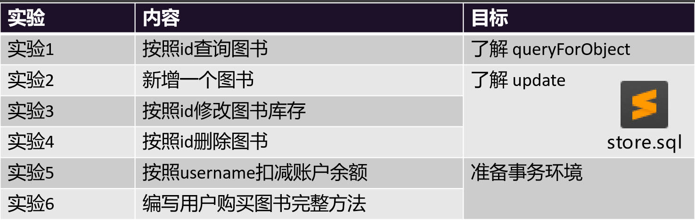

::: tip 

**操作数据库：**

1、**导入包： spring-boot-starter-data-jdbc、mysql-connector-java**

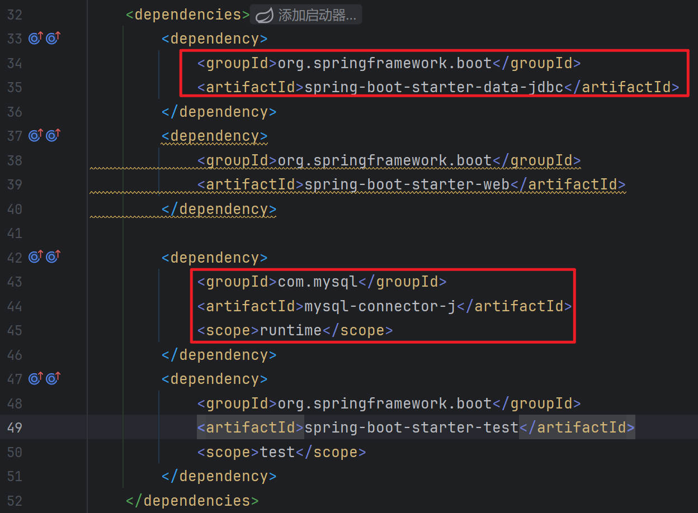

2、**配置数据库连接信息：在application.properties 中  spring.datasource.***

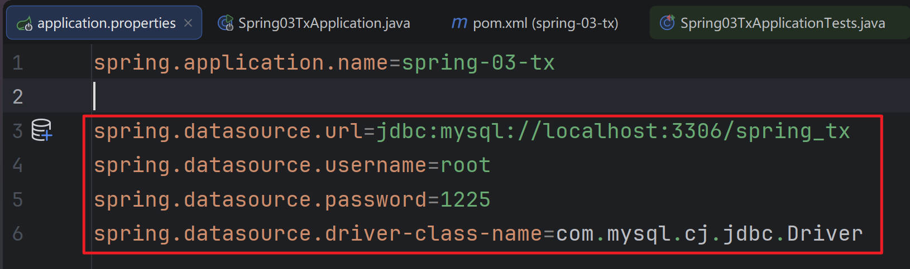

3、**可以直接使用  DataSource、  JdbcTemplate**

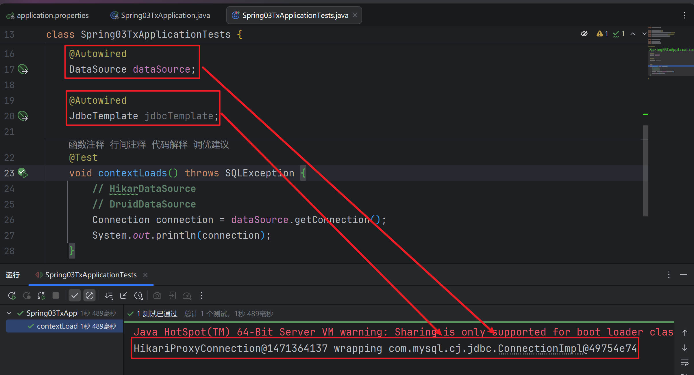

:::

+ **Account.java**

```java
package fun.xingji.spring.tx.bean;

import lombok.Data;

import java.math.BigDecimal;

@Data
public class Account {
    private Integer id;
    private String username;
    private Integer age;
    private BigDecimal balance;
}
```


+ **Book.java**

```java
package fun.xingji.spring.tx.bean;

import lombok.Data;

import java.math.BigDecimal;

@Data
public class Book {
    private Integer id;
    private String bookname;
    private BigDecimal price;
    private Integer stock;
}
```


### 实验1：按照id查询图书(JdbcTemplate)

+ **BookDao.java**

```java
package fun.xingji.spring.tx.dao;

import fun.xingji.spring.tx.bean.Book;
import org.springframework.beans.factory.annotation.Autowired;
import org.springframework.jdbc.core.BeanPropertyRowMapper;
import org.springframework.jdbc.core.JdbcTemplate;
import org.springframework.stereotype.Component;

@Component
public class BookDao {

    @Autowired
    JdbcTemplate jdbcTemplate;

    /**
     * 按照id查询图书
     * @param id
     * @return
     */
    public Book getBookById(Integer id) {

        // 1.查询图书的id
        String sql = "select * from book where id = ?";

        // 2.执行查询
        Book book = jdbcTemplate.queryForObject(sql, new BeanPropertyRowMapper<>(Book.class), id);

        // 3.返回结果
        return book;
    }
}
```

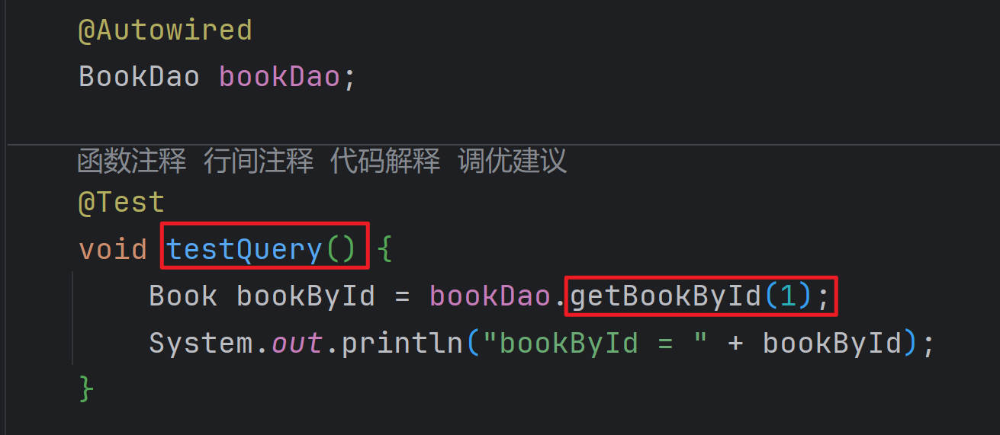

+ **测试:**

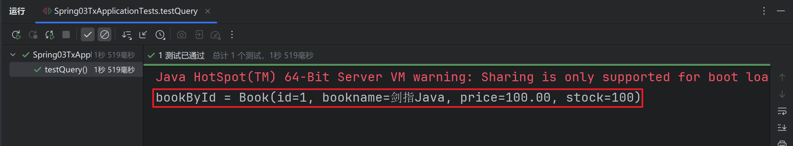


### 实验2：添加图书

+ **BookDao.java**

```java
package fun.xingji.spring.tx.dao;

import fun.xingji.spring.tx.bean.Book;
import org.springframework.beans.factory.annotation.Autowired;
import org.springframework.jdbc.core.JdbcTemplate;
import org.springframework.stereotype.Component;

@Component
public class BookDao {

    @Autowired
    JdbcTemplate jdbcTemplate;

    /**
     * 添加图书
     * @param book
     */
    public void addBook(Book book) {
        String sql = "insert into book(bookname, price, stock) values (?, ?, ?)";

        int add = jdbcTemplate.update(sql, book.getBookname(), book.getPrice(), book.getStock());

        // 添加的数据
        System.out.println("添加了" + add + "条数据");
    }
}
```

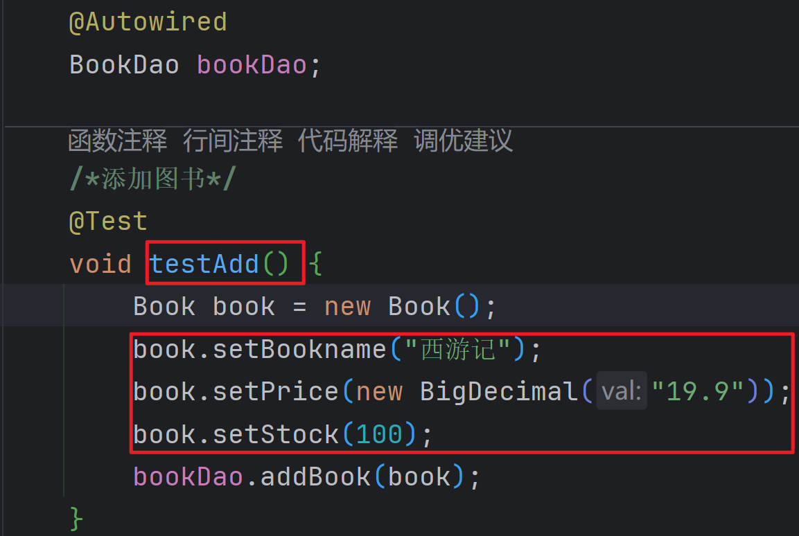

+ **测试:**

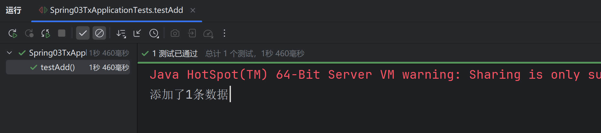

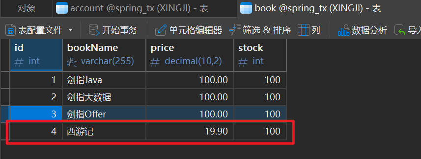


### 实验3：按照id修改图书库存

+ **BookDao.java**

```java
package fun.xingji.spring.tx.dao;

import fun.xingji.spring.tx.bean.Book;
import org.springframework.beans.factory.annotation.Autowired;
import org.springframework.jdbc.core.JdbcTemplate;
import org.springframework.stereotype.Component;


@Component
public class BookDao {

    @Autowired
    JdbcTemplate jdbcTemplate;

    /**
     * 按照图书id修改图书库存
     * @param bookId 图书id
     * @param num 要减几个
     */
    public void updateBookStock(Integer bookId, Integer num) {
        String sql = "update book set stock = stock - ? where id = ?";

        int update = jdbcTemplate.update(sql, num, bookId);

        System.out.println("更新了" + update + "条数据");
    }
}
```

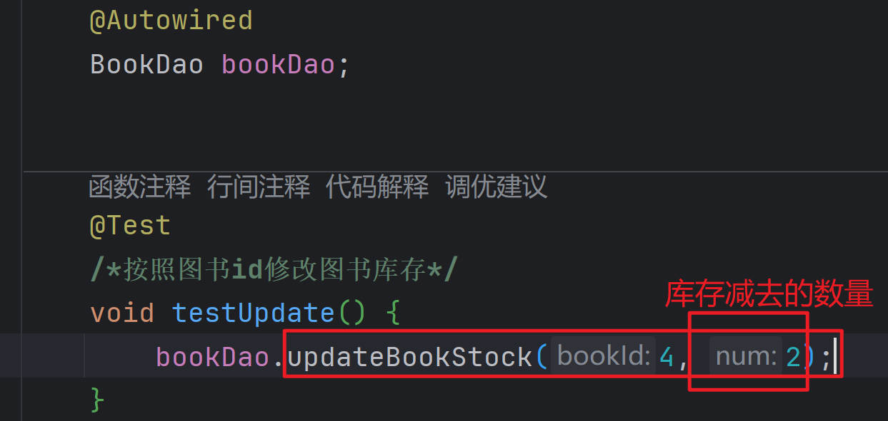

+ **测试:**

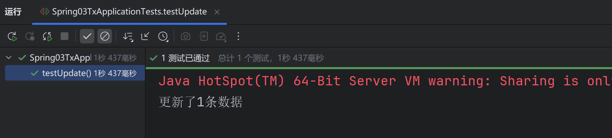

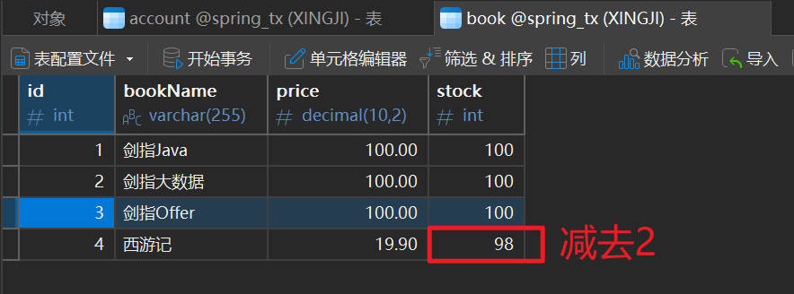


### 实验4：按照id删除图书

+ **BookDao.java**

```java
package fun.xingji.spring.tx.dao;

import fun.xingji.spring.tx.bean.Book;
import org.springframework.beans.factory.annotation.Autowired;
import org.springframework.jdbc.core.JdbcTemplate;
import org.springframework.stereotype.Component;

@Component
public class BookDao {

    @Autowired
    JdbcTemplate jdbcTemplate;

    /**
     * 按照id删除图书
     * @param id
     */
    public void deleteBook(Integer id) {
        String sql = "delete from book where id = ?";

        int delete = jdbcTemplate.update(sql, id);

        System.out.println("删除了" + delete + "条数据");
    }
}
```

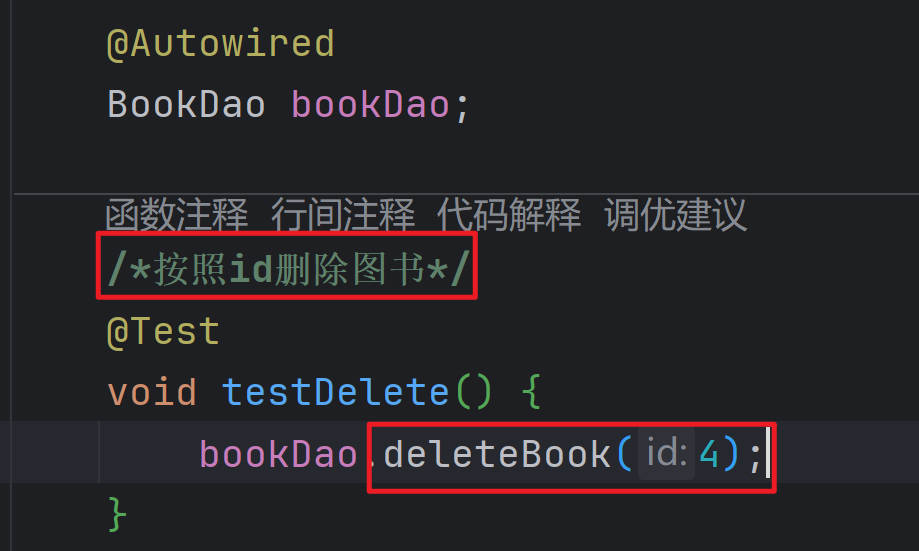

+ **测试:**

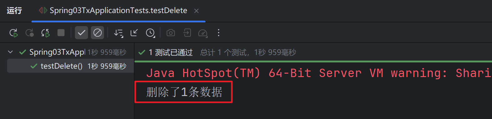

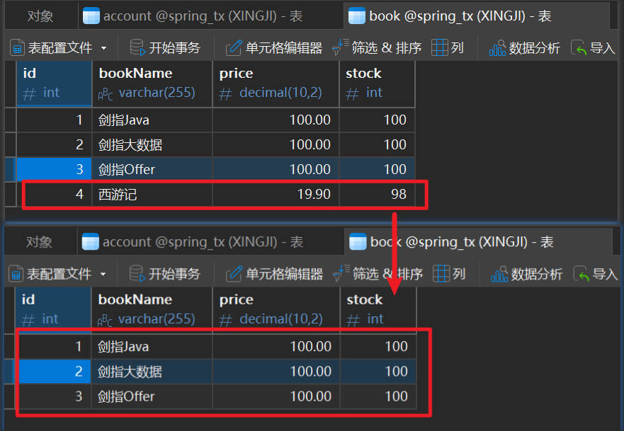


### 实验5：按照username扣减账户余额

+ **AccountDao.java**

```java
package fun.xingji.spring.tx.dao;

import org.springframework.beans.factory.annotation.Autowired;
import org.springframework.jdbc.core.JdbcTemplate;
import org.springframework.stereotype.Component;

import java.math.BigDecimal;

@Component
public class AccountDao {

    @Autowired
    JdbcTemplate jdbcTemplate;

    /**
     * 按照username扣减账户余额
     * @param username 用户名
     * @param delta 扣减的金额
     */
    public void updateUsername(String username , BigDecimal delta){
        String sql="update account set balance = balance - ? where username = ?";

        // 执行SQL
        int update = jdbcTemplate.update(sql, delta, username);

        System.out.println("更新行数：" + update);
    }
}
```

+ **AccountDaoTest.java**

```java
package fun.xingji.spring.tx;

import fun.xingji.spring.tx.dao.AccountDao;
import org.junit.jupiter.api.Test;
import org.springframework.beans.factory.annotation.Autowired;
import org.springframework.boot.test.context.SpringBootTest;

import java.math.BigDecimal;

@SpringBootTest
public class AccountDaoTest {

    @Autowired
    AccountDao accountDao;

    @Test
    void testUpdate() {
        accountDao.updateUsername("zhangsan", new BigDecimal("9.9"));
    }
}
```

+ **测试:**

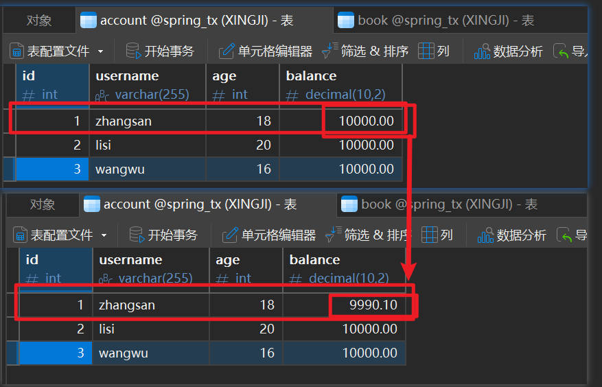


### 实验6：编写用户购买图书完整方法(结账操作)

+ **UserService.java**

```java
package fun.xingji.spring.tx.service;

public interface UserService {

    /**
     * 用户结账
     * @param username  用户名
     * @param bookId    图书id
     * @param buyNum    购买数量
     */
    void checkout(String username, Integer bookId, Integer buyNum);
}
```

+ **UserServiceImpl.java**

```java
package fun.xingji.spring.tx.service.impl;

import fun.xingji.spring.tx.bean.Book;
import fun.xingji.spring.tx.dao.AccountDao;
import fun.xingji.spring.tx.dao.BookDao;
import fun.xingji.spring.tx.service.UserService;
import org.springframework.beans.factory.annotation.Autowired;
import org.springframework.stereotype.Service;

import java.math.BigDecimal;

@Service
public class UserServiceImpl implements UserService {


    @Autowired
    BookDao bookDao;

    @Autowired
    AccountDao accountDao;

    @Override
    public void checkout(String username, Integer bookId, Integer buyNum) {
        // 1. 查询图书信息
        Book bookById = bookDao.getBookById(bookId);

        BigDecimal price = bookById.getPrice();
        // 2. 计算扣减额度
        BigDecimal total = new BigDecimal(buyNum).multiply(price);

        // 3. 扣减余额
        accountDao.updateBalanceByUsername(username, total);
        // 4. 扣减库存
        bookDao.updateBookStock(bookId, buyNum);
    }
}
```

+ **AccountDao.java**

```java
package fun.xingji.spring.tx.dao;

import org.springframework.beans.factory.annotation.Autowired;
import org.springframework.jdbc.core.JdbcTemplate;
import org.springframework.stereotype.Component;

import java.math.BigDecimal;

@Component
public class AccountDao {

    @Autowired
    JdbcTemplate jdbcTemplate;

    /**
     * 按照username扣减账户余额
     * @param username 用户名
     * @param delta 扣减的金额
     */
    public void updateBalanceByUsername(String username , BigDecimal delta){
        String sql="update account set balance = balance - ? where username = ?";

        // 执行SQL
        int update = jdbcTemplate.update(sql, delta, username);

        System.out.println("更新行数：" + update);
    }
}
```

+ **AccountDaoTest.java**

```java
package fun.xingji.spring.tx;

import fun.xingji.spring.tx.dao.AccountDao;
import fun.xingji.spring.tx.service.UserService;
import org.junit.jupiter.api.Test;
import org.springframework.beans.factory.annotation.Autowired;
import org.springframework.boot.test.context.SpringBootTest;

import java.math.BigDecimal;

@SpringBootTest
public class AccountDaoTest {

    @Autowired
    AccountDao accountDao;

    @Autowired
    UserService userService;

    /*结账操作*/
    @Test
    void testcheckout() {
        userService.checkout("zhangsan",1,3);
    }

    @Test
    void testUpdate() {
        accountDao.updateBalanceByUsername("zhangsan", new BigDecimal("9.9"));
    }
}
```


+ **测试:**

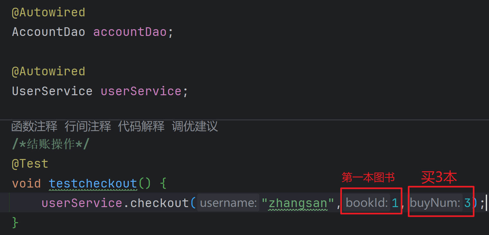

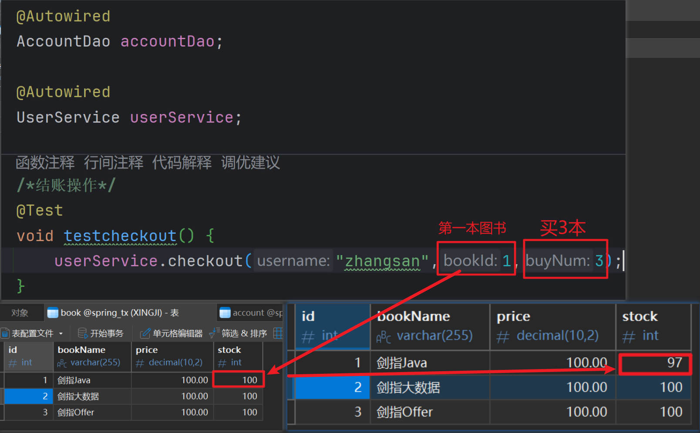

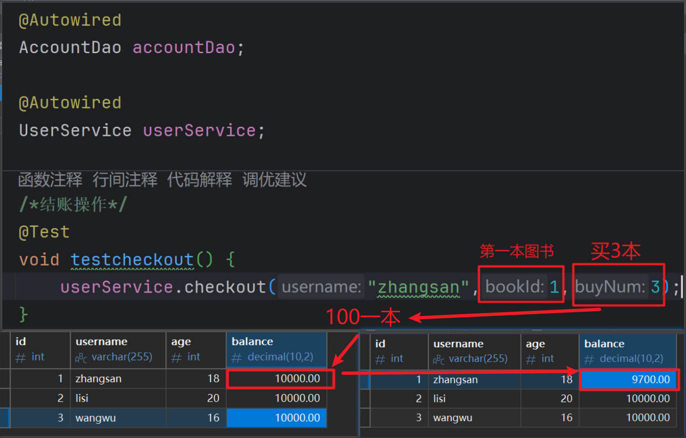


## 声明式事务

::: tip 

1. **声明式 vs 编程式**

​	**编程式：通过编写业务代码，程序员自行完成指定功能**

​	**声明式：通过声明业务需求，框架自动完成指定功能**

2.**声明式事务：**

​	**定义：只需要告诉框架，这个方法`需要事务`，框架会自动在运行方法时执行事务的`流程控制逻辑`。**

​	**Spring支持：`@Transactional`**

3.**@Transactional 属性**

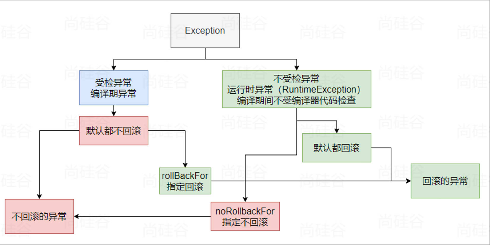

:::

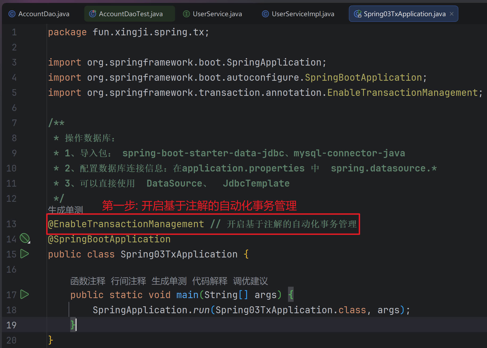

+ **UserServiceImpl.java**

```java
package fun.xingji.spring.tx.service.impl;

import fun.xingji.spring.tx.bean.Book;
import fun.xingji.spring.tx.dao.AccountDao;
import fun.xingji.spring.tx.dao.BookDao;
import fun.xingji.spring.tx.service.UserService;
import org.springframework.beans.factory.annotation.Autowired;
import org.springframework.stereotype.Service;
import org.springframework.transaction.annotation.Transactional;

import java.math.BigDecimal;

@Service
public class UserServiceImpl implements UserService {


    @Autowired
    BookDao bookDao;

    @Autowired
    AccountDao accountDao;

    @Transactional // 开启事务管理
    @Override
    public void checkout(String username, Integer bookId, Integer buyNum) {
        // 1. 查询图书信息
        Book bookById = bookDao.getBookById(bookId);

        BigDecimal price = bookById.getPrice();
        // 2. 计算扣减额度
        BigDecimal total = new BigDecimal(buyNum).multiply(price);

        // 3. 扣减余额
        accountDao.updateBalanceByUsername(username, total);
        // 4. 扣减库存
        bookDao.updateBookStock(bookId, buyNum);

        int i = 10 / 0;
    }
}
```

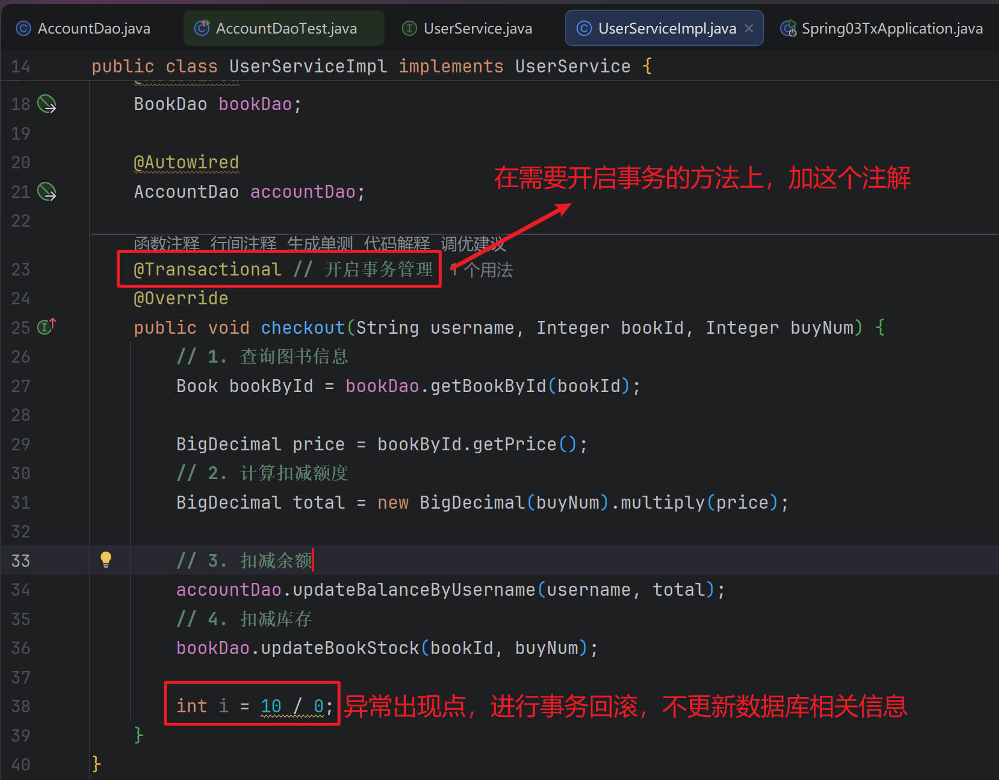

+ **测试:**

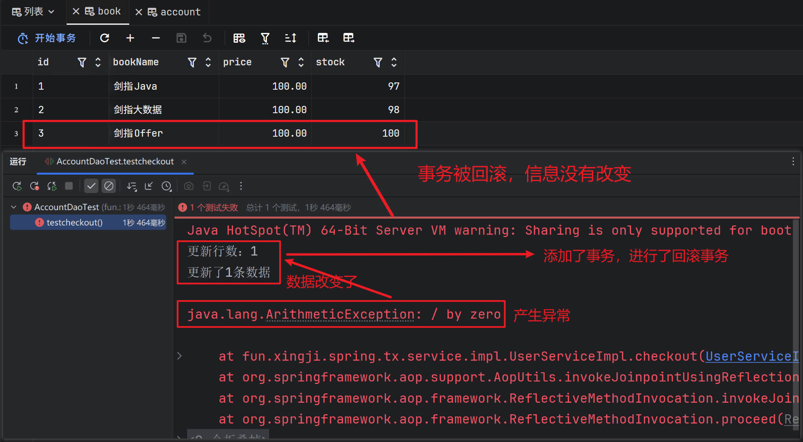


### 事务管理器的原理

::: tip 

**事务细节：**

**transactionManager：`事务管理器`; 控制事务的`获取、提交、回滚`。**

**底层默认使用哪个事务管理器？默认使用 `JdbcTransactionManager`；**

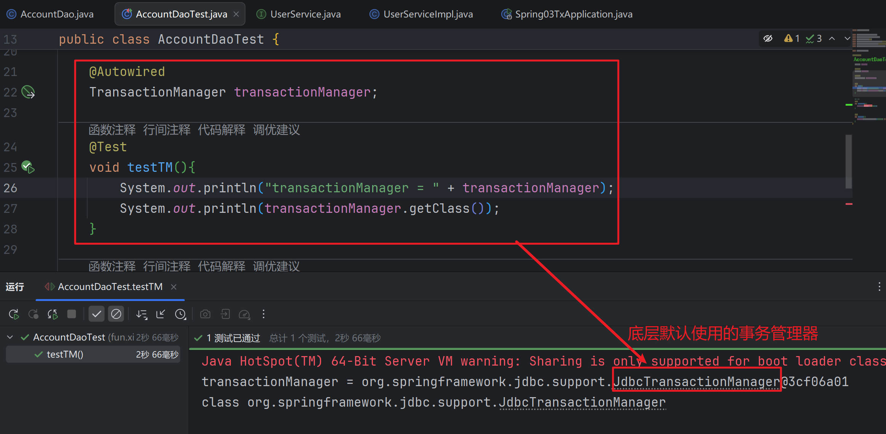

> **原理：**
>
> 1、**事务管理器：`TransactionManager`； 控制`提交和回滚`**
>
> 2、**事务拦截器：`TransactionInterceptor`： 控制`何时提交和回滚`**
>
>  * **`completeTransactionAfterThrowing(txInfo, ex); ` 在这个时候`回滚`**
>  * **`commitTransactionAfterReturning(txInfo);`  在这个时候`提交`**

:::

+ **Spring事务面试题**

::: note 


:::


+ **一些注意事项**

::: tip 

1.timeout（同 timeoutString）：超时时间； 事务超时，秒为单位；

+ 一旦超过约定时间，事务就会回滚。
+ 超时时间是指：从方法开始，到最后一次数据库操作结束的时间。

2.readOnly：只读优化

3.rollbackFor（同rollbackForClassName）：指明哪些异常需要回滚。不是所有异常都一定引起事务回滚。

异常：

运行时异常（unchecked exception【非受检异常】）

编译时异常（checked exception【受检异常】）

【回滚的默认机制】

运行时异常：回滚

编译时异常：不回滚

【可以指定哪些异常需要回滚】；

【回滚 = 运行时异常 + 指定回滚异常】

4.noRollbackFor（同 noRollbackForClassName）：指明哪些异常不需要回滚。

+ 【不回滚 = 编译时异常 + 指定不回滚异常】

:::

```java
package fun.xingji.spring.tx.service.impl;

import fun.xingji.spring.tx.bean.Book;
import fun.xingji.spring.tx.dao.AccountDao;
import fun.xingji.spring.tx.dao.BookDao;
import fun.xingji.spring.tx.service.UserService;
import org.springframework.beans.factory.annotation.Autowired;
import org.springframework.stereotype.Service;
import org.springframework.transaction.annotation.Transactional;

import java.io.IOException;
import java.math.BigDecimal;

@Service
public class UserServiceImpl implements UserService {


    @Autowired
    BookDao bookDao;

    @Autowired
    AccountDao accountDao;


    /**
     * 事务细节：
     * 1、transactionManager：事务管理器; 控制事务的获取、提交、回滚。
     *     底层默认使用哪个事务管理器？默认使用 JdbcTransactionManager；
     *     原理：
     *     1、事务管理器：TransactionManager； 控制提交和回滚
     *     2、事务拦截器：TransactionInterceptor： 控制何时提交和回滚
     *              completeTransactionAfterThrowing(txInfo, ex);  在这个时候回滚
     *              commitTransactionAfterReturning(txInfo);  在这个时候提交
     *
     * 2、propagation：传播行为； 事务的传播行为。
     *
     * 3、isolation：隔离级别
     *
     * 4、timeout（同 timeoutString）：超时时间； 事务超时，秒为单位；
     *      一旦超过约定时间，事务就会回滚。
     *      超时时间是指：从方法开始，到最后一次数据库操作结束的时间。
     * 5、readOnly：只读优化
     * 6、rollbackFor（同rollbackForClassName）：指明哪些异常需要回滚。不是所有异常都一定引起事务回滚。
     *     异常：
     *          运行时异常（unchecked exception【非受检异常】）
     *          编译时异常（checked exception【受检异常】）
     *     【回滚的默认机制】
     *          运行时异常：回滚
     *          编译时异常：不回滚
     *
     *    【可以指定哪些异常需要回滚】；
     *    【回滚 = 运行时异常 + 指定回滚异常】
     *
     * 7、noRollbackFor（同 noRollbackForClassName）：指明哪些异常不需要回滚。
     *    【不回滚 = 编译时异常 + 指定不回滚异常】
     */

    @Transactional(timeout = 3,
            /*readOnly = true,*/
            /*rollbackFor = {IOException.class},
            rollbackForClassName = {"java.lang.Exception"} ,指定那些异常需要回滚*/
            noRollbackFor = {ArithmeticException.class}
    ) // 开启事务管理
    @Override
    public void checkout(String username, Integer bookId, Integer buyNum) throws InterruptedException, IOException {
        // 1. 查询图书信息
        Book bookById = bookDao.getBookById(bookId);

        BigDecimal price = bookById.getPrice();
        // 2. 计算扣减额度
        BigDecimal total = new BigDecimal(buyNum).multiply(price);

        // 3. 扣减余额
        accountDao.updateBalanceByUsername(username, total);

        /*// 模拟网络延迟
        Thread.sleep(3000);*/

        // 4. 扣减库存
        bookDao.updateBookStock(bookId, buyNum);

        //5、抛出异常
        // int i = 10/0;

       /* FileInputStream stream = new FileInputStream("D:\\123.txt");
        System.out.println("stream.available() = " + stream.available());*/
    }
}
```


## 隔离级别

::: tip 

读未提交（Read Uncommitted）

+ **事务可以读取未被提交的数据，易产生脏读、不可重复读和幻读等问题**

读已提交（Read Committed）

+ **事务只能读取已经提交的数据，可避免脏读，但可能引发不可重复读和幻读。**

可重复读（Repeatable Read）

+ **同一事务期间多次重复读取的数据相同。避免脏读和不可重复读，但仍有幻读的问题

串行化（Serializable）

+ **最高隔离级别，完全禁止了并发，只允许一个事务执行完毕之后才能执行另一个事务**

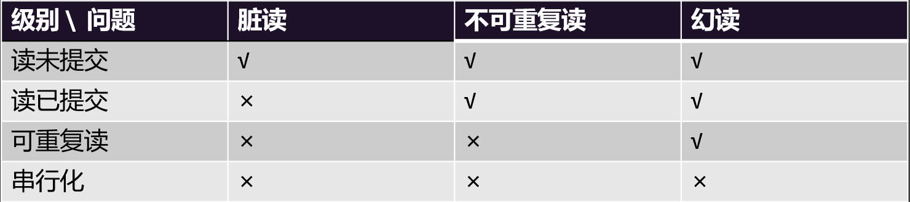

:::


### 读未提交（Read Uncommitted）产生脏读

::: tip 

**缺点：产生脏读和不可重复读(多次读取，数据不一致)**

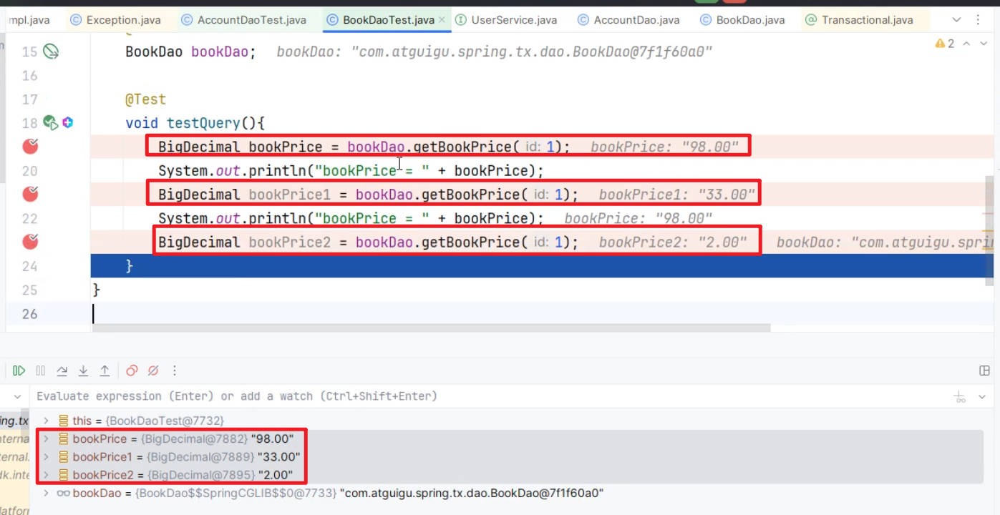

:::

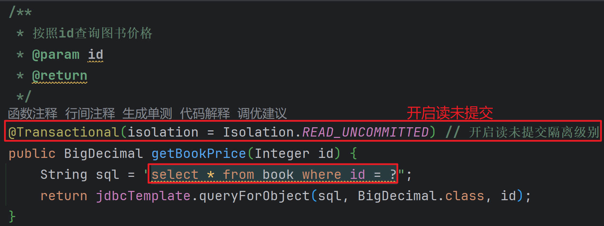

+ **开启事务**

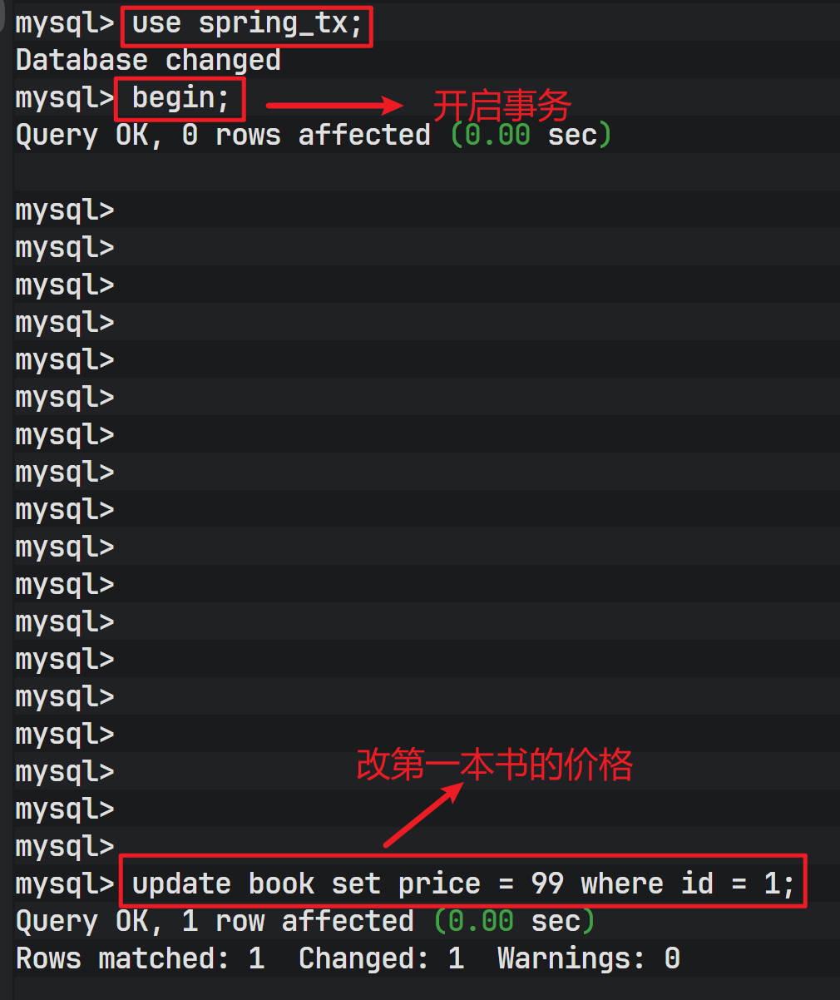

+ **BookDaoTest.java**

```java
package fun.xingji.spring.tx;

import fun.xingji.spring.tx.dao.BookDao;
import org.junit.jupiter.api.Test;
import org.springframework.beans.factory.annotation.Autowired;
import org.springframework.boot.test.context.SpringBootTest;

import java.math.BigDecimal;

@SpringBootTest
public class BookDaoTest {
    @Autowired
    BookDao bookDao;

    @Test
    void testQuery() {
        BigDecimal bookPrice = bookDao.getBookPrice(1);
        System.out.println("bookPrice" + bookPrice);
    }
}
```


+ **测试:**

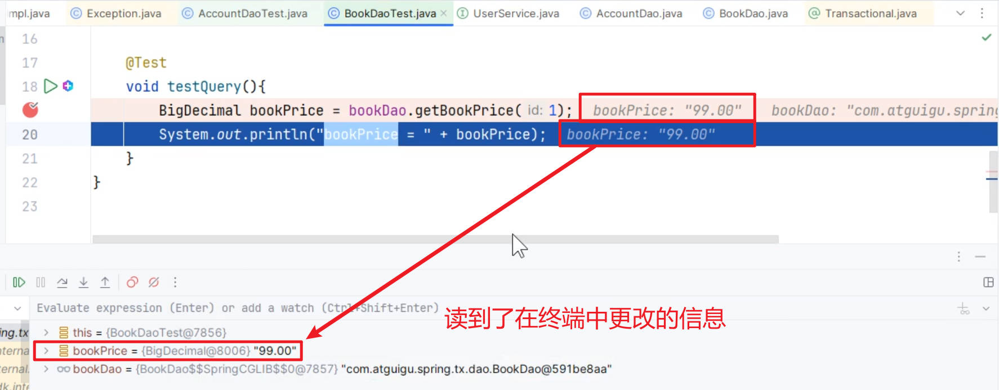


### 读已提交（Read Committed）

::: tip 

**优点：解决了脏读**

**缺点：不可重复读(多次读取，数据不一致)**

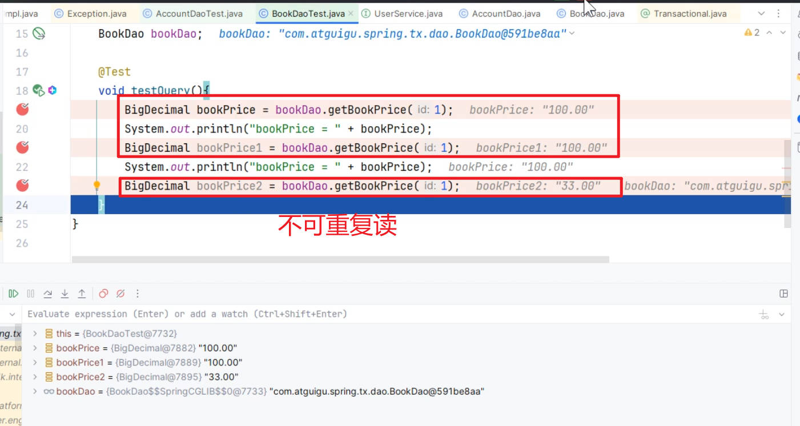

:::

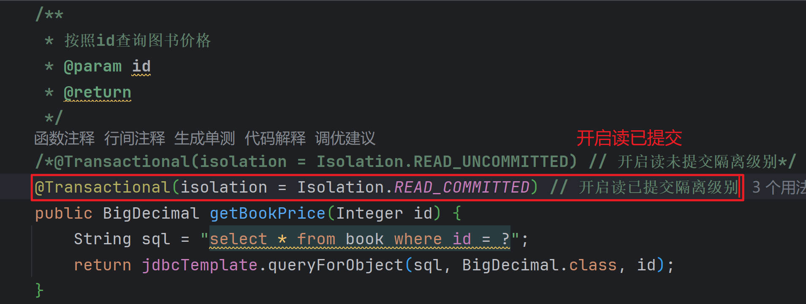

+ **BookDaoTest.java**

```java
package fun.xingji.spring.tx;

import fun.xingji.spring.tx.dao.BookDao;
import org.junit.jupiter.api.Test;
import org.springframework.beans.factory.annotation.Autowired;
import org.springframework.boot.test.context.SpringBootTest;

import java.math.BigDecimal;

@SpringBootTest
public class BookDaoTest {
    @Autowired
    BookDao bookDao;

    @Test
    void testQuery() {
        BigDecimal bookPrice = bookDao.getBookPrice(1);
        System.out.println("bookPrice = " + bookPrice);
        BigDecimal bookPrice1 = bookDao.getBookPrice(1);
        System.out.println("bookPrice = " + bookPrice);
        BigDecimal bookPrice2 = bookDao.getBookPrice(1);
    }
}
```


+ **测试:**

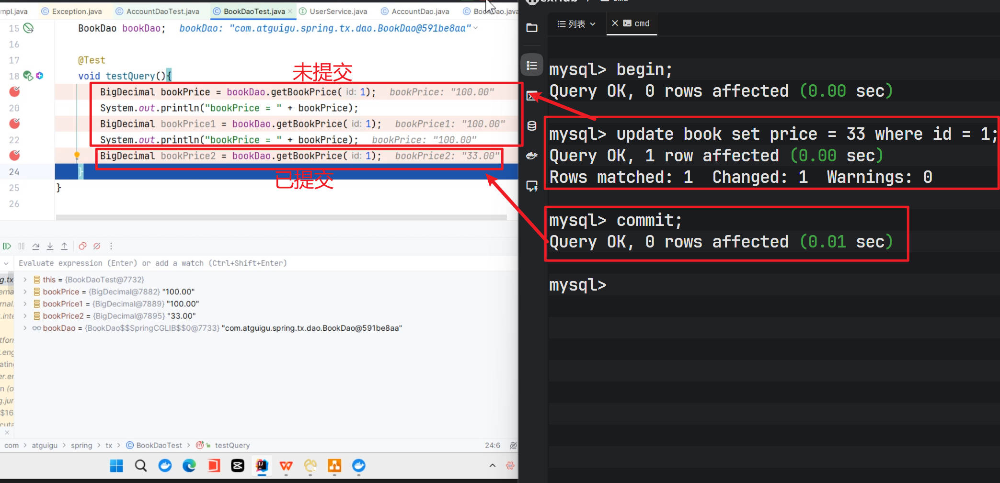


### 可重复读（Repeatable Read）

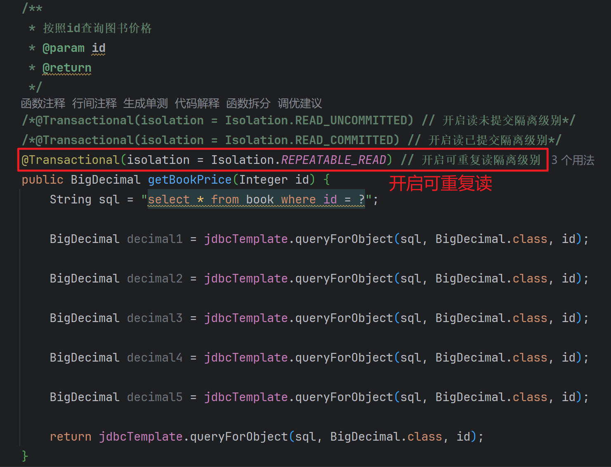

+ **测试:**

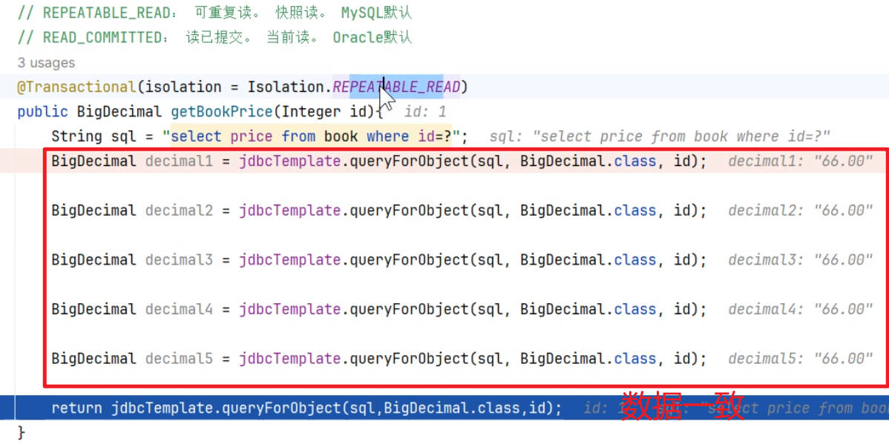


## 传播行为

> **定义：当一个事务方法被另一个事务方法调用时，事务该以何种状态存在？事务属性该如何传播下去？**
>
> 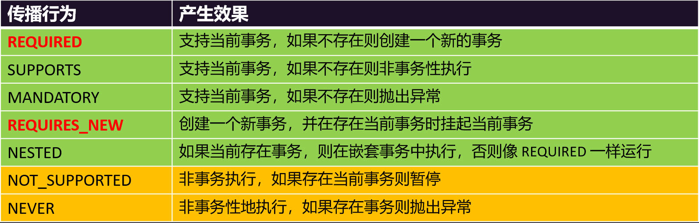


::: tip 

```java
场景：用户结账，炸了以后，金额扣减回滚，库存不回滚。
注意：【一定关注异常的传播链】
实现：
    checkout(){
        //自己的操作；
        扣减金额： //REQUIRED
        扣减库存： //REQUIRES_NEW
    }
```

```java
  A {
      B(){  //REQUIRED
          F();//REQUIRES_NEW
          G();//REQUIRED
          H();//REQUIRES_NEW
      }
      C(){  //REQUIRES_NEW
         I();//REQUIRES_NEW
         J();//REQUIRED
      }
      D(){   //REQUIRES_NEW
          K();//REQUIRES_NEW
          L();//REQUIRES_NEW //点位2： 10/0； K,F,H,C(i,j) = ok, E整个代码走不到，剩下炸
      }
      E(){   //REQUIRED
          M();//REQUIRED
          //点位3：10/0；  F,H,C(i,j),D(K,L)= ok
          N();//REQUIRES_NEW
      }

      int i = 10/0;  //点位1：C（I，J）,D(K，L) ，F，H,N= ok
  }
```

:::

+ **UserServiceImpl.java**

```java
package fun.xingji.spring.tx.service.impl;

import fun.xingji.spring.tx.bean.Book;
import fun.xingji.spring.tx.dao.AccountDao;
import fun.xingji.spring.tx.dao.BookDao;
import fun.xingji.spring.tx.service.UserService;
import org.springframework.beans.factory.annotation.Autowired;
import org.springframework.stereotype.Service;
import org.springframework.transaction.annotation.Transactional;

import java.io.IOException;
import java.math.BigDecimal;

@Service
public class UserServiceImpl implements UserService {


    @Autowired
    BookDao bookDao;

    @Autowired
    AccountDao accountDao;


    /**
     * 事务细节：
     * 1、transactionManager：事务管理器; 控制事务的获取、提交、回滚。
     *     底层默认使用哪个事务管理器？默认使用 JdbcTransactionManager；
     *     原理：
     *     1、事务管理器：TransactionManager； 控制提交和回滚
     *     2、事务拦截器：TransactionInterceptor： 控制何时提交和回滚
     *              completeTransactionAfterThrowing(txInfo, ex);  在这个时候回滚
     *              commitTransactionAfterReturning(txInfo);  在这个时候提交
     *
     * 2、propagation：传播行为； 事务的传播行为。
     *
     * 3、isolation：隔离级别
     *
     * 4、timeout（同 timeoutString）：超时时间； 事务超时，秒为单位；
     *      一旦超过约定时间，事务就会回滚。
     *      超时时间是指：从方法开始，到最后一次数据库操作结束的时间。
     * 5、readOnly：只读优化
     * 6、rollbackFor（同rollbackForClassName）：指明哪些异常需要回滚。不是所有异常都一定引起事务回滚。
     *     异常：
     *          运行时异常（unchecked exception【非受检异常】）
     *          编译时异常（checked exception【受检异常】）
     *     【回滚的默认机制】
     *          运行时异常：回滚
     *          编译时异常：不回滚
     *
     *    【可以指定哪些异常需要回滚】；
     *    【回滚 = 运行时异常 + 指定回滚异常】
     *
     * 7、noRollbackFor（同 noRollbackForClassName）：指明哪些异常不需要回滚。
     *    【不回滚 = 编译时异常 + 指定不回滚异常】
     *
     *
     *
     *
     *
     * 场景：用户结账，炸了以后，金额扣减回滚，库存不回滚。
     * 注意：【一定关注异常的传播链】
     * 实现：
     *    checkout(){
     *        //自己的操作；
     *        扣减金额： //REQUIRED
     *        扣减库存： //REQUIRES_NEW
     *    }
     *
     *
     *  A {
     *      B(){  //REQUIRED
     *          F();//REQUIRES_NEW
     *          G();//REQUIRED
     *          H();//REQUIRES_NEW
     *      }
     *      C(){  //REQUIRES_NEW
     *         I();//REQUIRES_NEW
     *         J();//REQUIRED
     *      }
     *      D(){   //REQUIRES_NEW
     *          K();//REQUIRES_NEW
     *          L();//REQUIRES_NEW //点位2： 10/0； K,F,H,C(i,j) = ok, E整个代码走不到，剩下炸
     *      }
     *      E(){   //REQUIRED
     *          M();//REQUIRED
     *          //点位3：10/0；  F,H,C(i,j),D(K,L)= ok
     *          N();//REQUIRES_NEW
     *      }
     *
     *      int i = 10/0;  //点位1：C（I，J）,D(K，L) ，F，H,N= ok
     *  }
     *
     * @param username  用户名
     * @param bookId    图书id
     * @param buyNum    购买数量
     *
     * 传播行为：参数设置项也会传播：如果小事务和大事务公用一个事务，小事务要按照大事务的设置，小事务自己的设置失效
     */

    @Transactional(timeout = 3
            /*readOnly = true,*/
            /*rollbackFor = {IOException.class},
            rollbackForClassName = {"java.lang.Exception"} ,指定那些异常需要回滚*/
            /*noRollbackFor = {ArithmeticException.class}*/
    ) // 开启事务管理
    @Override
    public void checkout(String username, Integer bookId, Integer buyNum) throws InterruptedException, IOException {
        // 1. 查询图书信息
        Book bookById = bookDao.getBookById(bookId);

        BigDecimal price = bookById.getPrice();
        // 2. 计算扣减额度
        BigDecimal total = new BigDecimal(buyNum).multiply(price);

        // 3. 扣减余额 //REQUIRED
        accountDao.updateBalanceByUsername(username, total);

        /*// 模拟网络延迟
        Thread.sleep(3000);*/

        // 4. 扣减库存 //REQUIRES_NEW
        bookDao.updateBookStock(bookId, buyNum);

        //5、抛出异常
        int i = 10/0;

       /* FileInputStream stream = new FileInputStream("D:\\123.txt");
        System.out.println("stream.available() = " + stream.available());*/
    }
}
```

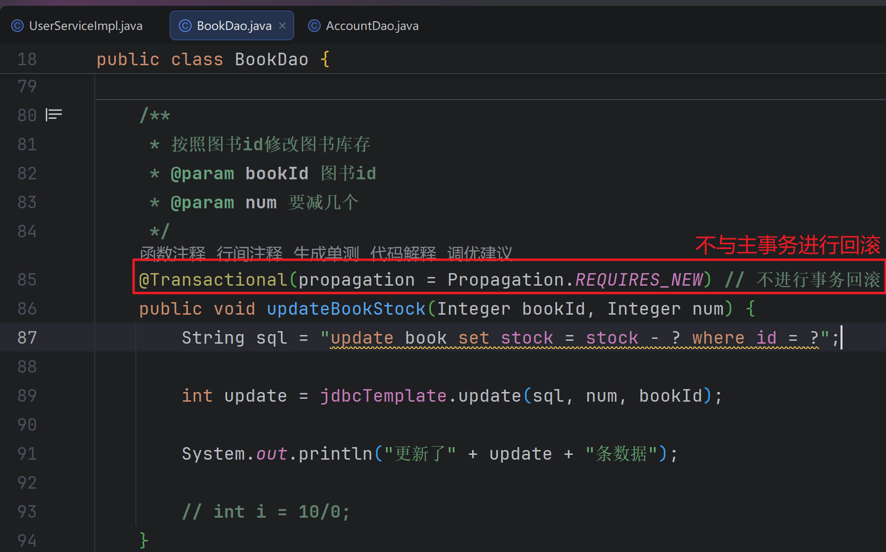

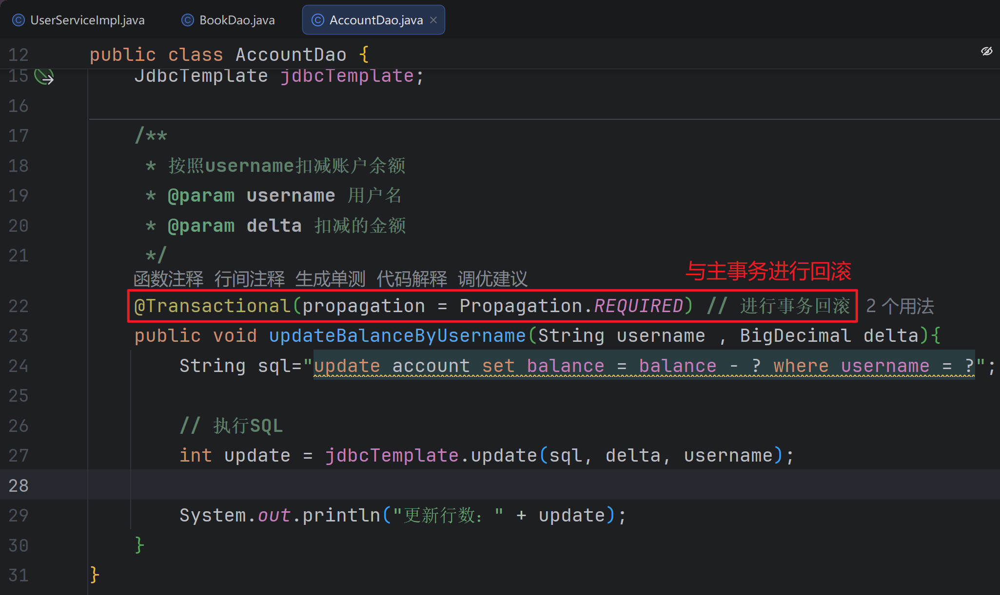

+ **AccountDaoTest.java**

```java
/*结账操作*/
@Test
void testcheckout() throws Exception {
     userService.checkout("wangwu",3,4);
}
```

> **测试:**

+ **扣减库存 //REQUIRES_NEW(不进行事务回滚)**

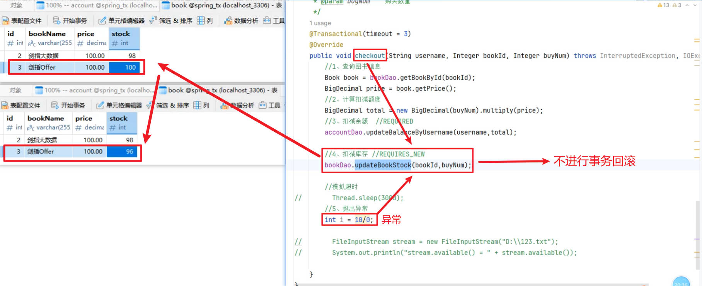

+ **扣减余额 //REQUIRED(进行事务回滚)**

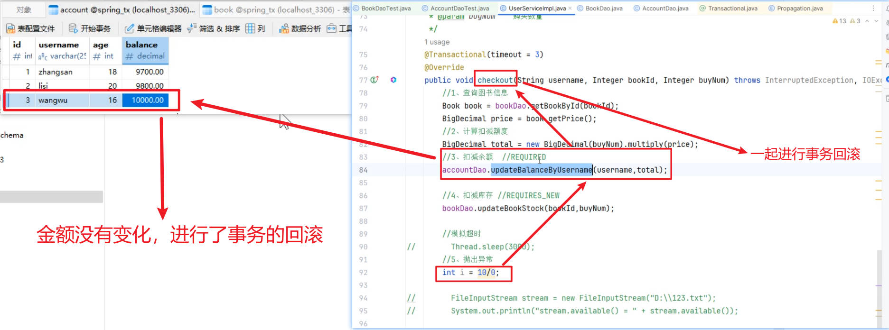
