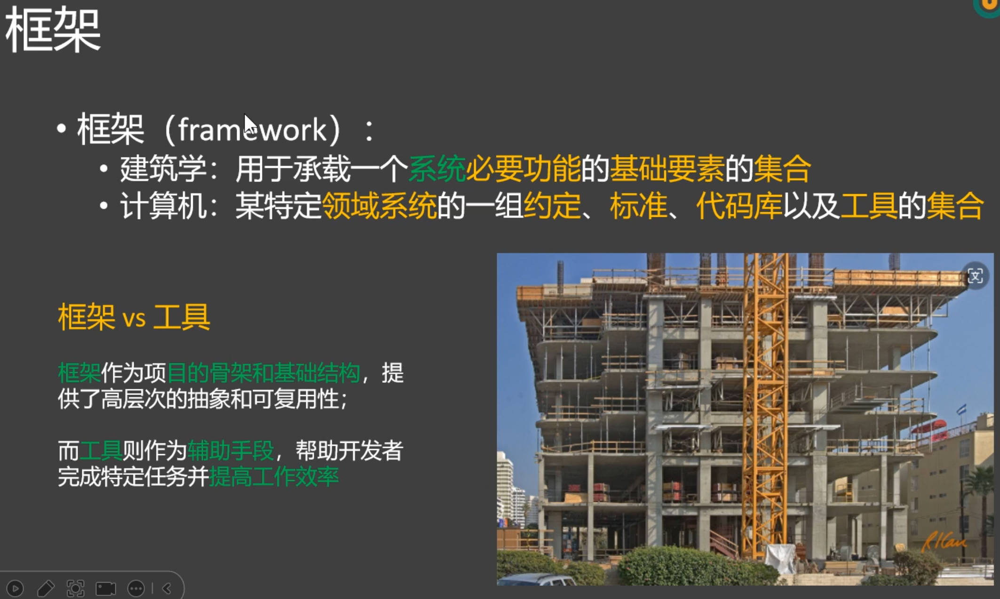
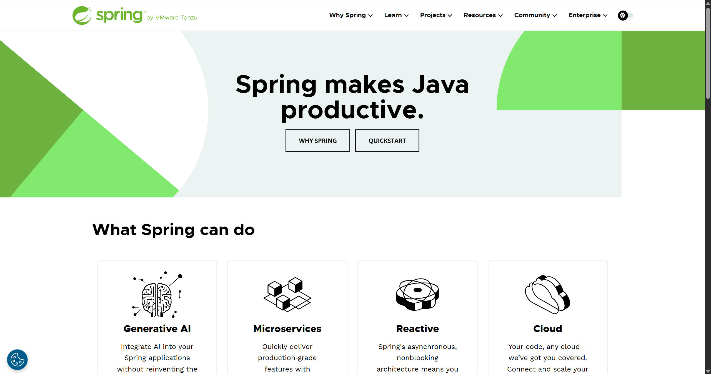
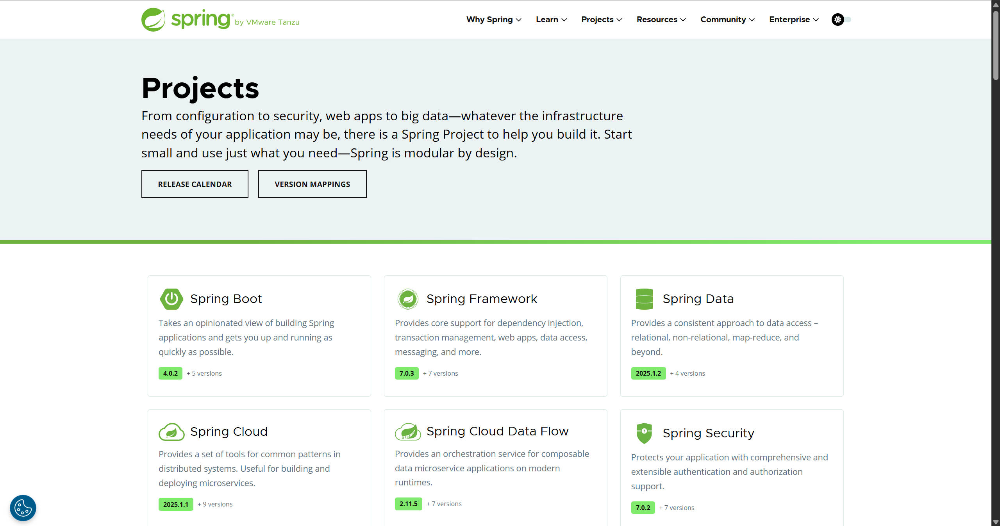
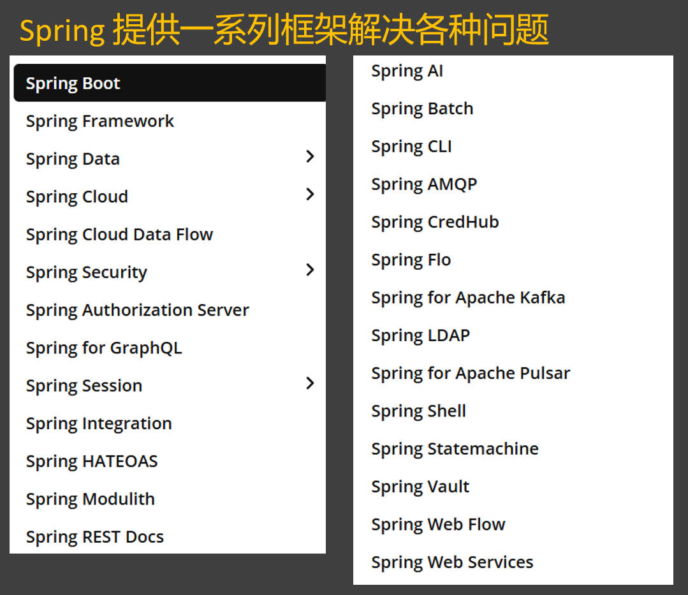
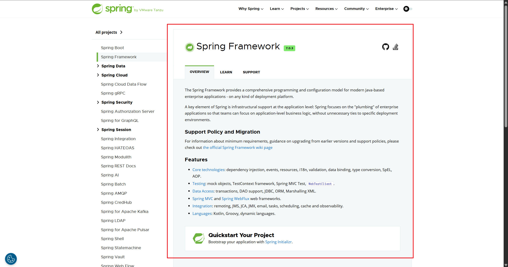
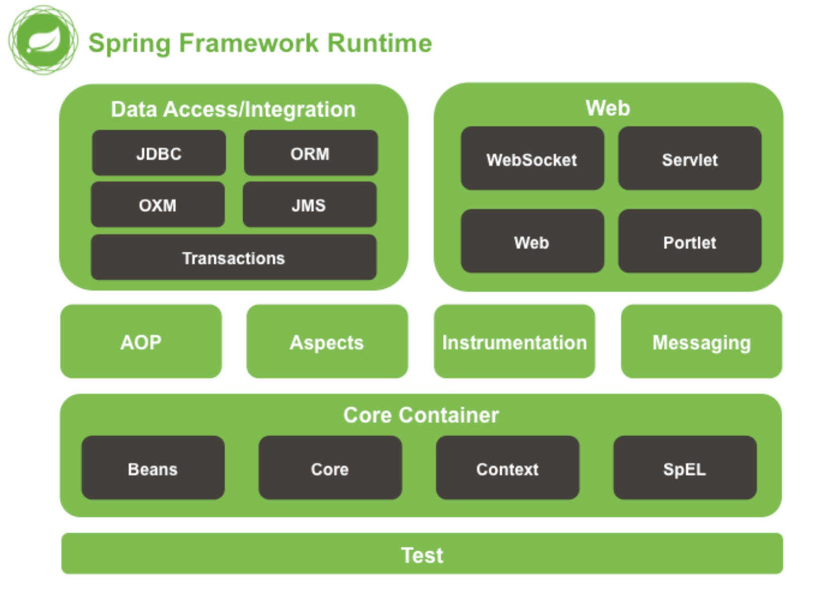
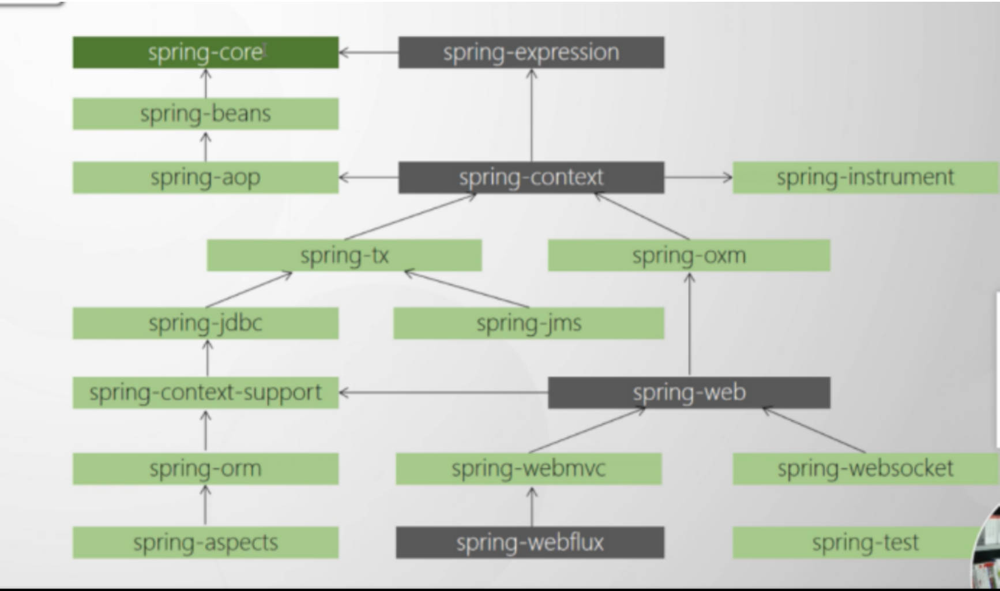
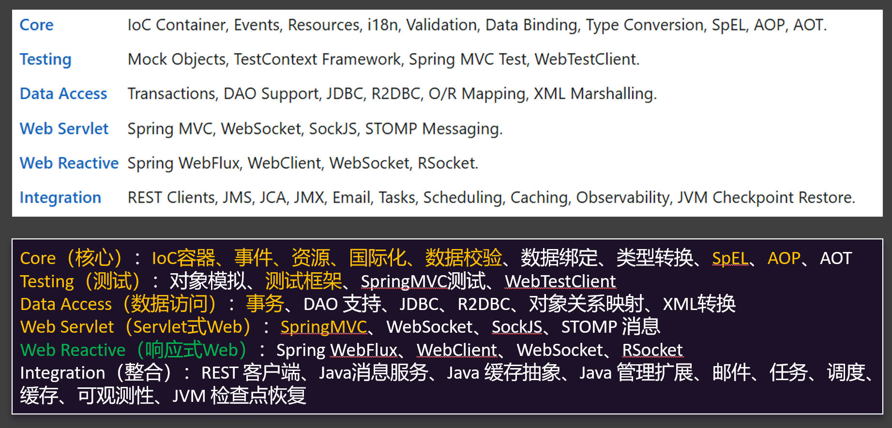
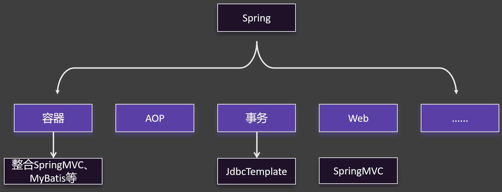

## 框架是什么

框架( Framework )是一个集成了基本结构、规范、设计模式、编程语言和程序库等基础组件的软件系统，它可以用来构建更高级别的应用程序。框架的设计和实现旨在解决特定领域中的常见问题，帮助开发人员更高效、更稳定地实现软件开发目标。

## Spring 体系

<https://spring.io>

### **广义的 Spring：Spring 技术栈**（全家桶）

<https://spring.io/projects>

广义上的 Spring 泛指以 Spring Framework 为基础的 Spring 技术栈。

经过十多年的发展，Spring 已经不再是一个单纯的应用框架，而是逐渐发展成为一个由多个不同子项目（模块）组成的成熟技术，例如 Spring Framework、Spring MVC、SpringBoot、Spring Cloud、Spring Data、Spring Security 等，其中 Spring Framework 是其他子项目的基础。

这些子项目涵盖了从企业级应用开发到云计算等各方面的内容，能够帮助开发人员解决软件发展过程中不断产生的各种实际问题，给开发人员带来了更好的开发体验。

### **狭义的 Spring：Spring Framework**（基础框架）

<https://spring.io/projects/spring-framework>

狭义的 Spring 特指 Spring Framework，通常我们将它称为 Spring 框架。

Spring Framework（Spring框架）是一个开源的应用程序框架，由SpringSource公司开发，最初是为了解决企业级开发中各种常见问题而创建的。它提供了很多功能，例如：依赖注入（Dependency Injection）、面向切面编程（AOP）、声明式事务管理（TX）等。其主要目标是使企业级应用程序的开发变得更加简单和快速，并且Spring框架被广泛应用于Java企业开发领域。

Spring全家桶的其他框架都是以SpringFramework框架为基础！

> **对比理解：**
>
> QQ 和 腾讯
>
> 腾讯 = Spring
>
> QQ = SpringFramework

## Spring Framework

1. Spring是一个 **IOC(DI)** 和 **AOP** 框架

2. Spring有很多优良特性

+ 非侵入式：基于Spring开发的应用中的对象可以不依赖于Spring的API

+ 依赖注入：DI（Dependency Injection）是反转控制（IOC）最经典的实现

+ 面向切面编程：Aspect Oriented Programming - AOP

+ 容器：Spring是一个容器，包含并管理应用对象的生命周期

+ 组件化：Spring通过将众多简单的组件配置组合成一个复杂应用。

+ 一站式：Spring提供了一系列框架，解决了应用开发中的众多问题

## Spring 模块划分

SpringFramework框架结构图：

> **各个模块之间的相互依赖关系图:**

| 功能模块       | 功能介绍                                                    |
| -------------- | ----------------------------------------------------------- |
| Core Container | 核心容器，在 Spring 环境下使用任何功能都必须基于 IOC 容器。 |
| AOP\&Aspects   | 面向切面编程                                                |
| TX             | 声明式事务管理。                                            |
| Spring MVC     | 提供了面向Web应用程序的集成功能。                           |

> 这些特点现在可能还不能体会，学习完成，再来看一遍，才能理解。

1. 轻量级
   - Spring 框架的设计目标之一是保持轻量级，它不会对应用程序带来过多的负担，使得开发人员可以专注于业务逻辑的实现，而不必担心框架本身的复杂性。
   - 相比于一些传统的企业级框架，Spring 的启动速度较快，资源占用相对较少。
2. 控制反转（IoC）
   - Spring 实现了控制反转的设计模式，通过依赖注入（Dependency Injection）的方式来**管理对象之间的依赖关系**。
   - 开发人员**不再需要手动创建和管理对象的实例，而是由 Spring 容器负责创建对象，并将其注入到需要的地方**。这样可以降低对象之间的耦合度，提高代码的可维护性和可测试性。
3. 面向切面编程（AOP）
   - Spring 提供了强大的面向切面编程支持，可以将横切关注点（如日志记录、事务管理、安全控制等）从业务逻辑中分离出来。
   - **通过 AOP，可以在不修改原来代码的情况下，在代码执行之前或之后去执行另外的代码，对业务方法进行增强和扩展，提高代码的复用性和可维护性**。
4. 数据访问
   - Spring 提供了统一的数据访问抽象层，支持多种数据访问技术，如 JDBC、Hibernate、MyBatis 等。
   - 开发人员可以根据项目的需求选择合适的数据访问技术，而不必担心底层数据库的差异。
5. 事务管理
   - Spring 提供了声明式事务管理和编程式事务管理两种方式，可以方便地管理数据库事务。
   - 声明式事务管理通过在方法上添加注解或在配置文件中配置事务属性来实现，**无需在业务代码中显式地编写事务控制代码**，提高了开发效率和代码的可读性。