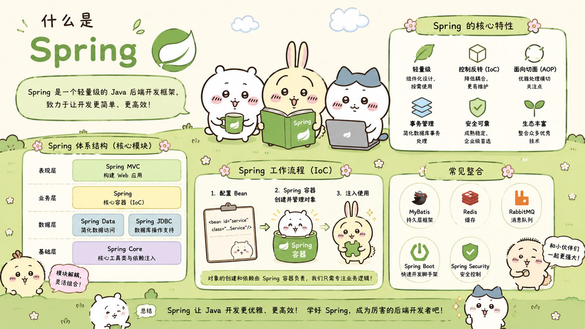

## 组件和容器

**组件**

生活中的组件


> 组件只能用来存储，没有更多功能。
> 程序中的组件
>
> -   数组
> -   集合：List
> -   集合：Set


**容器**
生活中的容器

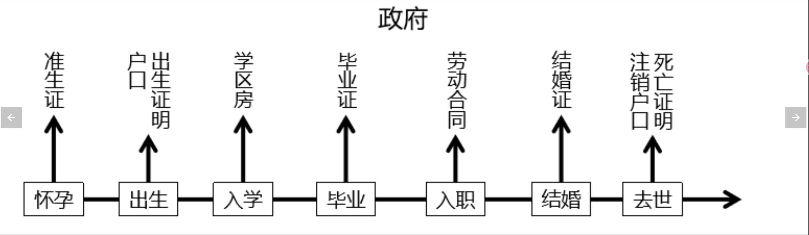

> 政府管理我们的一生，生老病死都和政府有关。
>
> 程序中的容器
>
> > Servlet 容器能够管理 Servlet(init,service,destroy)、Filter、Listener 这样的组件的一生，所以它是一个容器。
>
> |    名称    |                             时机                             | 次数 |
> | :--------: | :----------------------------------------------------------: | ---- |
> |  创建对象  | 默认情况：接收到第一次请求 &#xA;修改启动顺序后：Web应用启动过程中 | 一次 |
> | 初始化操作 |                         创建对象之后                         | 一次 |
> |  处理请求  |                          接收到请求                          | 多次 |
> |  销毁操作  |                       Web应用卸载之前                        | 一次 |
>
> **我们即将要学习的`SpringIoC 容器`也是一个`容器`。它们不仅要负责`创建组件的对象、存储组件的对象，还要负责调用组件的方法让它们工作`，最终在特定情况下`销毁组件`。**

**总结：Spring管理组件的容器，就是一个复杂容器，不仅存储组件，也可以管理组件之间依赖关系，并且创建和销毁组件等！**


### 一个常见的容器

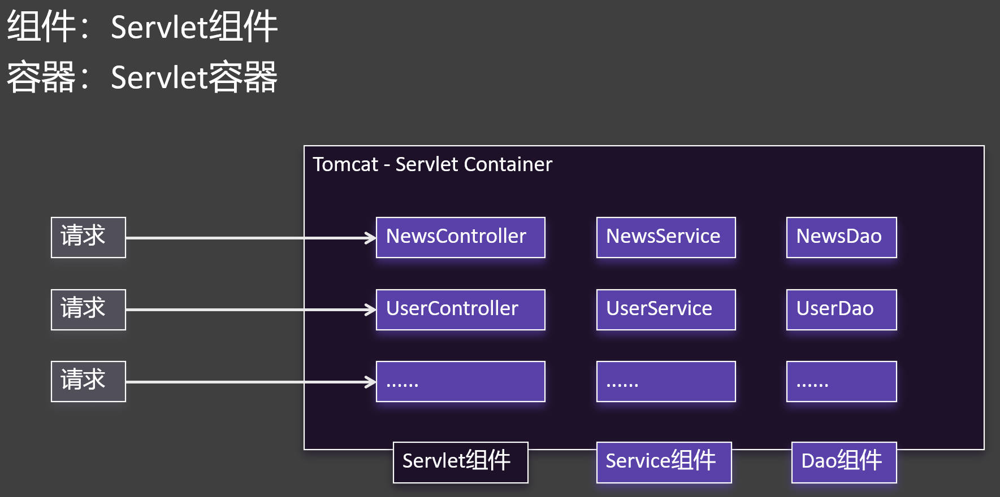

回顾常规的三层架构处理请求流程：

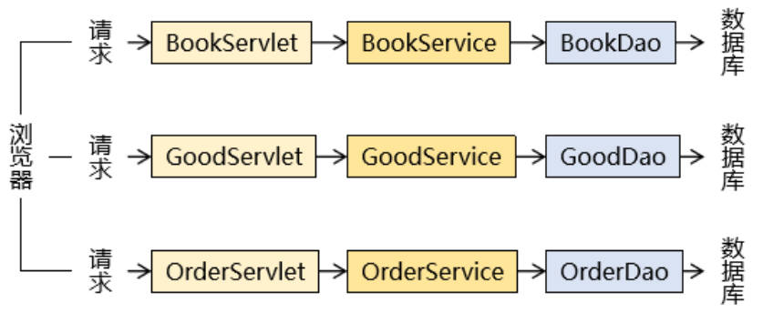

整个项目就是由各种组件搭建而成的：

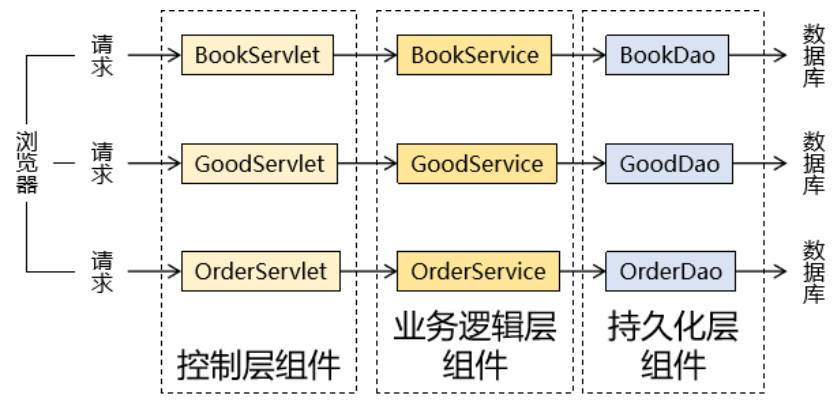


## IoC、DI

### IoC 容器

**Spring IoC 容器，负责`实例化`、`配置`和`组装 bean（组件）`核心容器。容器通过`读取配置元数据`来获取有关要`实例化、配置和组装组件`的`指令`**

**IoC：Inversion of Control（控制反转）**

+ **控制：资源的控制权（资源的创建、获取、销毁等）**

+ **反转：和传统的方式不一样了**

> **IoC 主要是针对对象的`创建和调用控制`而言的，也就是说，当应用程序需要使用一个对象时，`不再是应用程序直接创建该对象`，而是由 `IoC 容器来创建和管理`，即控制权由`应用程序`转移到` IoC 容器`中，也就是`“反转”了控制权`。这种方式基本上是通过`依赖查找的方式来实现的`，即 IoC 容器维护着`构成应用程序的对象`，并负责`创建这些对象`。**


**DI ：Dependency Injection（依赖注入）**

+ **依赖：组件的依赖关系，如 NewsController 依赖 NewsServices**

+ **注入：通过setter方法、构造器、等方式自动的注入（赋值）**

> **DI 是指`在组件之间传递依赖关系`的过程中，将`依赖关系`在`容器内部进行处理`，这样就`不必在`应用程序代码中`硬编码对象之间的依赖关系`，实现了`对象之间的解耦合`。在 Spring 中，DI 是通过 `XML 配置文件`或`注解的方式实现`的。它提供了三种形式的`依赖注入`：`构造函数注入`、`Setter 方法注入`和`接口注入`。**


### 演示第一个IoC案例

#### 配置脚手架相关信息

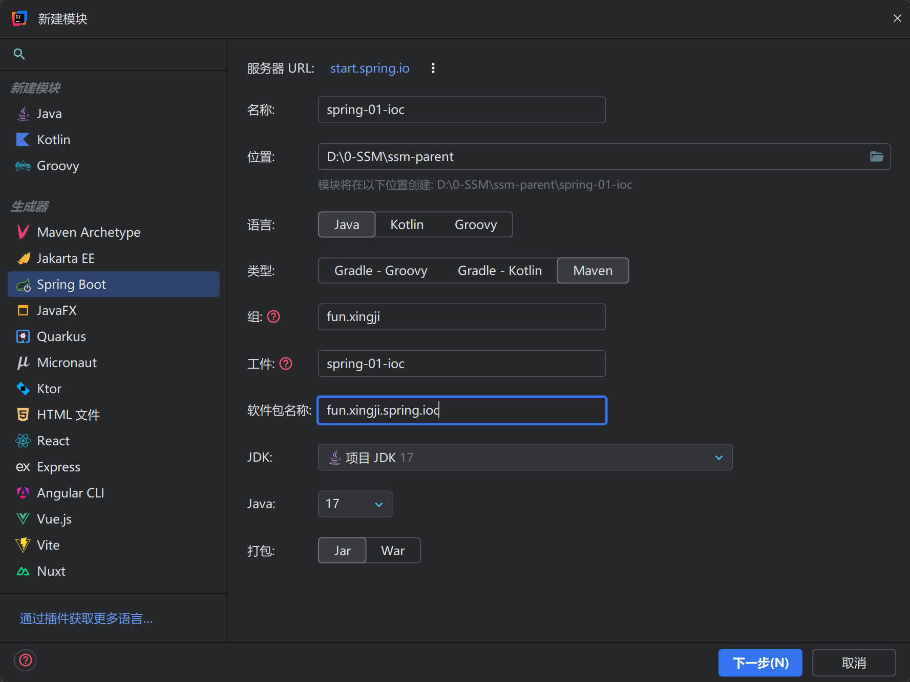


#### 选择相关依赖

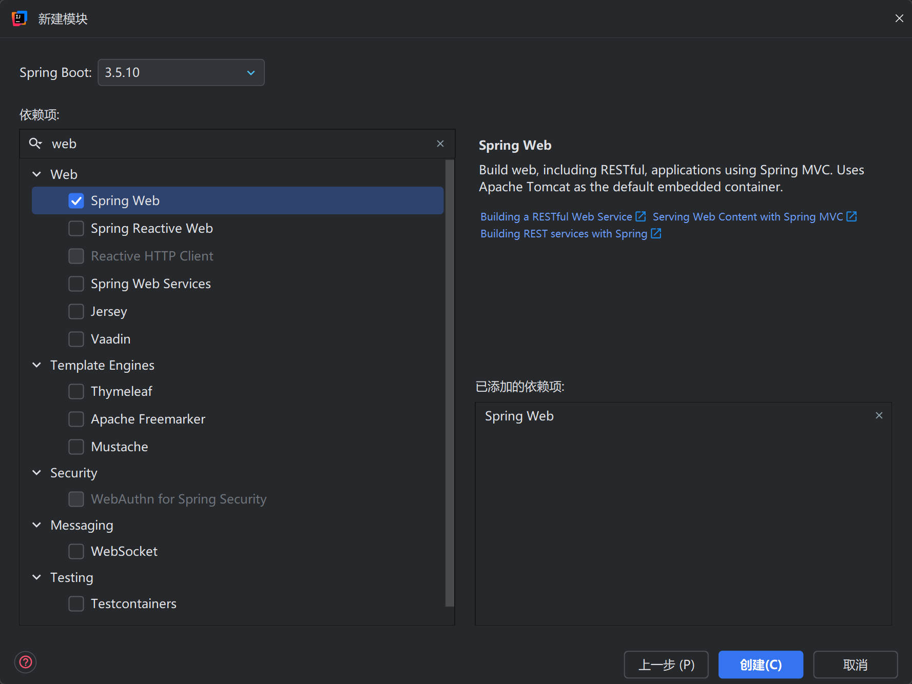


#### 项目结构

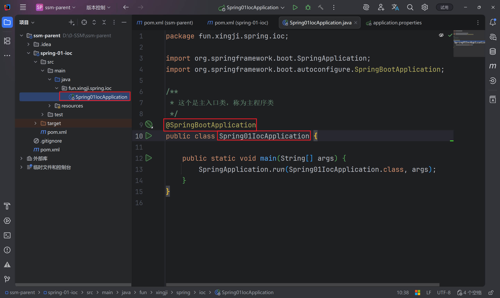


#### 运行第一个ioc容器

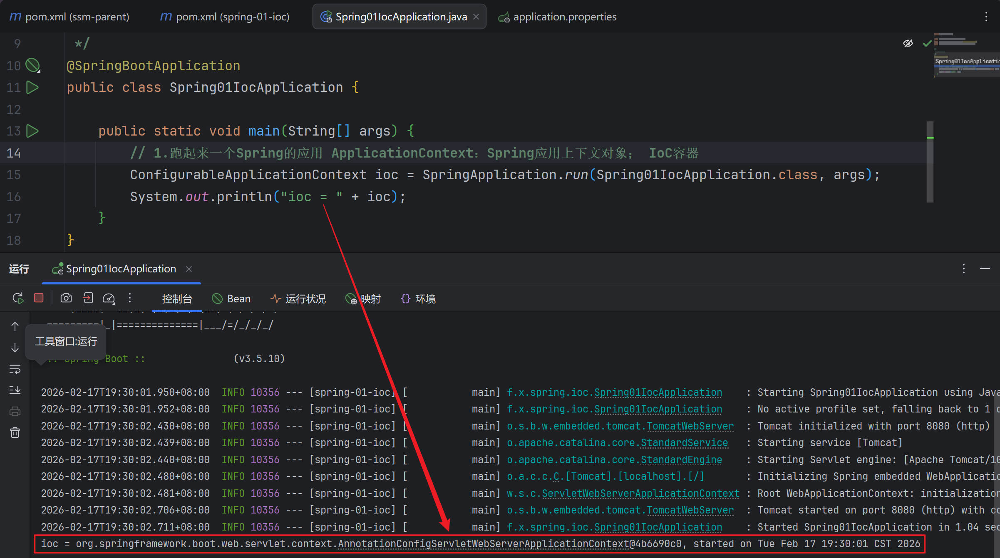


## 注册组件

> **注册组件的各种方式**

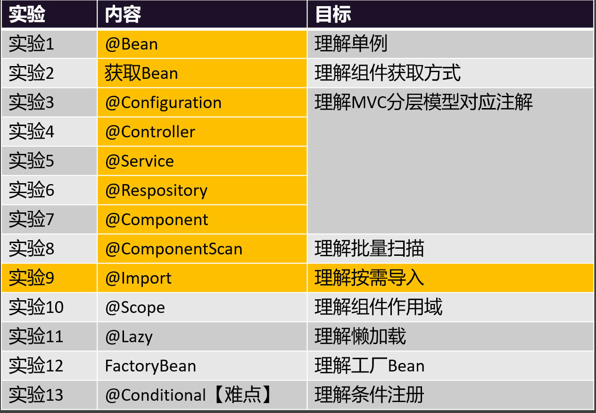


### 实验1：@Bean - 把组件放到容器

+ **Person.java**

```java
package fun.xingji.spring.ioc.bean;

import lombok.Data;

@Data
public class Person {

    private String name;

    private int age;

    private String gender;
}
```

+ **Spring01IocApplication.java**

```java
package fun.xingji.spring.ioc;

import fun.xingji.spring.ioc.bean.Person;
import org.springframework.boot.SpringApplication;
import org.springframework.boot.autoconfigure.SpringBootApplication;
import org.springframework.context.ConfigurableApplicationContext;
import org.springframework.context.annotation.Bean;

/**
 * 这个是主入口类，称为主程序类
 */
@SpringBootApplication
public class Spring01IocApplication {

    public static void main(String[] args) {
        // 1.跑起来一个Spring的应用 ApplicationContext：Spring应用上下文对象； IoC容器
        ConfigurableApplicationContext ioc = SpringApplication.run(Spring01IocApplication.class, args);
        System.out.println("ioc = " + ioc);

        System.out.println("=============================");
        // 2.获取到容器中所有组件的名字；容器中装了哪些组件； Spring启动会有很多默认组件
        String[] names = ioc.getBeanDefinitionNames();
        for (String name : names) {
            System.out.println("name = " + name);
        }
    }

    // 3.给容器中注册一个自己的组件；容器中的每个组件都有自己的名字，方法名就是组件的名字
    @Bean("hahaha")
    public Person zhangsan(){
        Person person = new Person();
        person.setName("张三");
        person.setAge(20);
        person.setGender("男");

        return person;
    }
}
```

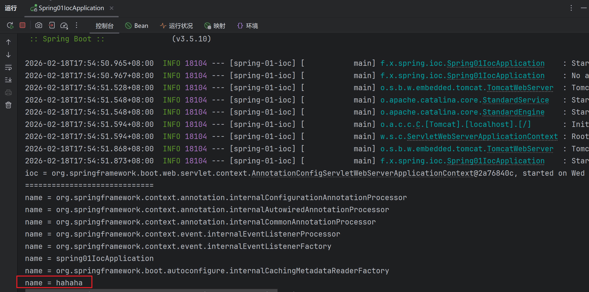


### 实验2：从容器中获取组件(按照名字、类型)

:::tip

> **获取容器中的组件对象；精确获取某个组件**

组件的四大特性：**`(名字、类型)`、`对象`、`作用域`**

> **组件名字`全局唯一`；`组件名重复`了，一定`只会给容器中放`一个`最先声明`的哪个。**
>
> ::: warning
>
> **新版Spring已经不允许使用这个语法了,如果要使用请添加如下配置信息到`application.properties`文件中:**
>
> + **application.properties**
>
> ```properties
> spring.main.allow-bean-definition-overriding=true
> ```
>
> 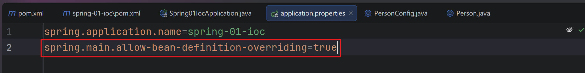
>
> :::
>
> 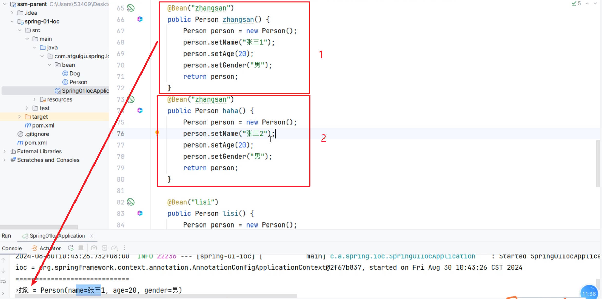

小结：
从容器中获取组件，
  1）组件不存在，抛异常：NoSuchBeanDefinitionException

  2）组件不唯一，
      按照类型只要一个，抛异常：NoUniqueBeanDefinitionException
      按照名字只要一个：精确获取到指定对象
      按照类型获取多个：返回所有组件的集合（Map）

  3）组件唯一存在，正确返回。

:::

#### 组件不存在，抛异常

> **抛`NoSuchBeanDefinitionException(组件不存在)`异常**

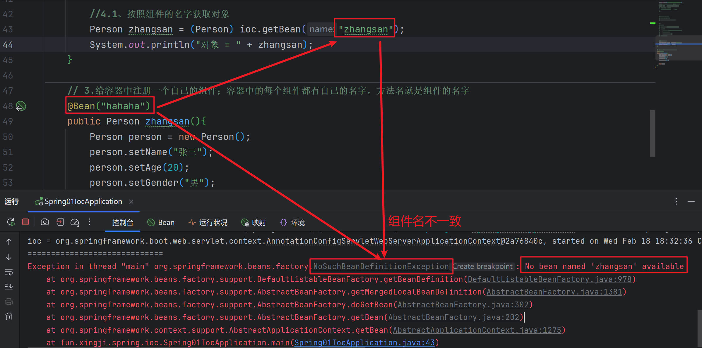


#### 组件不唯一

+ **按照类型只要一个，抛异常：NoUniqueBeanDefinitionException(组件不唯一)**

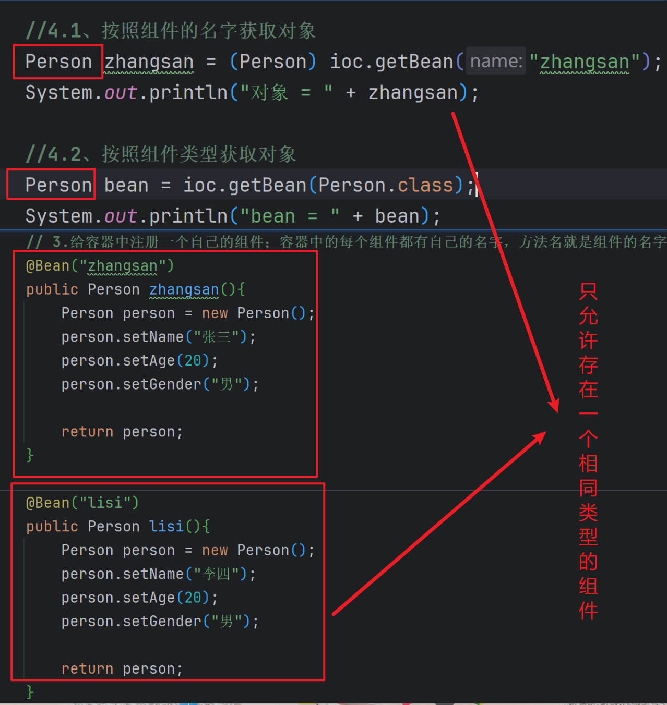

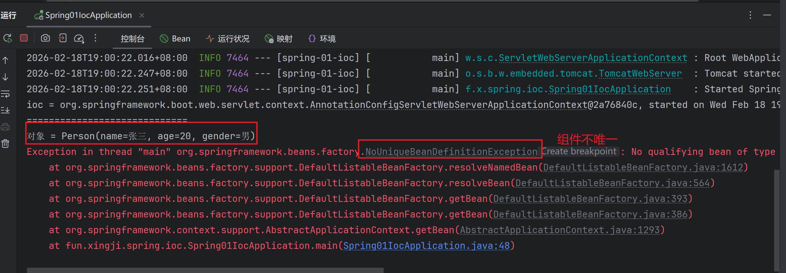

+ **按照名字只要一个：精确获取到指定对象**

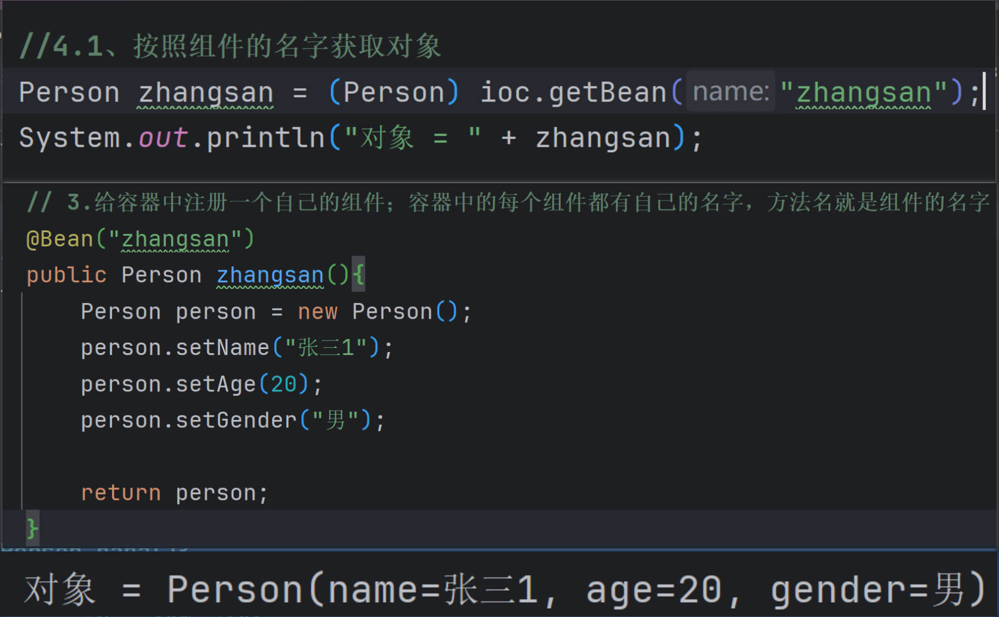


+ **按照类型获取多个：返回所有组件的集合（Map）**

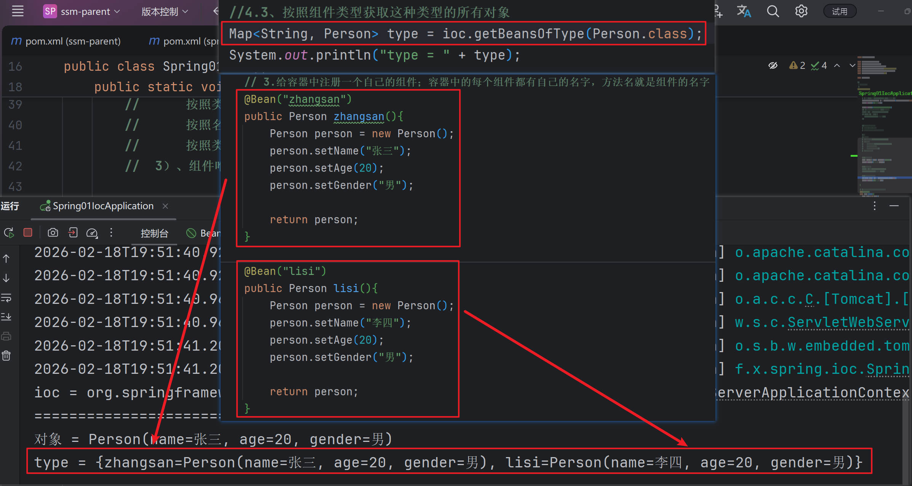


### 实验2.1：组件创建时机和单例特性

+ **Dog.java**

```java
package fun.xingji.spring.ioc.bean;

public class Dog {

    public Dog(){
        System.out.println("Dog构造器...");
    }
}
```

+ **Spring01IocApplication.java**

```java
	/**
     * 创建时机：容器启动过程中就会创建组件对象
     * 单实例特性：所有组件默认是单例的，每次获取直接从容器中拿。容器提前会创建组件
     * @param args
     */
    public static void main(String[] args) {
        // 1.跑起来一个Spring的应用 ApplicationContext：Spring应用上下文对象； IoC容器
        ConfigurableApplicationContext ioc = SpringApplication.run(Spring01IocApplication.class, args);

        System.out.println("=================ioc容器创建完成===================");

        // 2.获取组件
        Dog bean = ioc.getBean(Dog.class);
        System.out.println("bean = " + bean);

        Dog bean1 = ioc.getBean(Dog.class);
        System.out.println("bean1 = " + bean1);

        Dog bean2 = ioc.getBean(Dog.class);
        System.out.println("bean2 = " + bean2);
    }
```

:::tip

+ **创建时机：容器`启动过程中`就会`创建组件对象`**

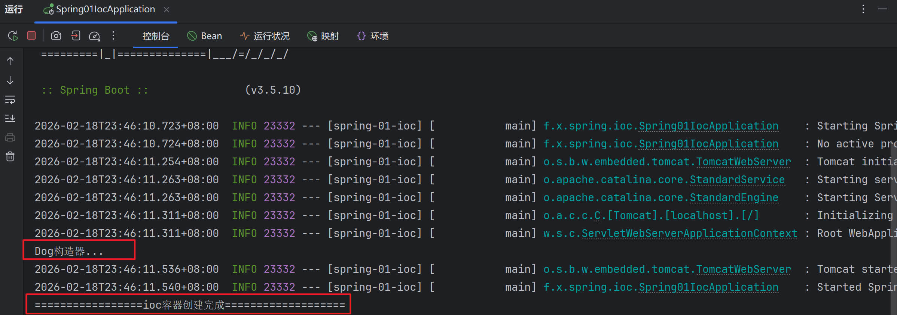

+ **单实例特性：所有组件默认是`单例的`，每次获取`直接从容器中拿`。容器`提前会创建组件`**

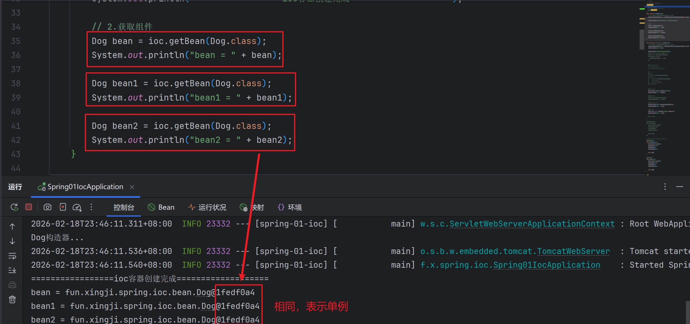

:::


### 实验3：@Configuration - 配置类

+ **PersonConfig.java**

```java
package fun.xingji.spring.ioc.config;

import fun.xingji.spring.ioc.bean.Person;
import org.springframework.context.annotation.Bean;
import org.springframework.context.annotation.Configuration;

@Configuration //告诉Spring容器，这是一个配置类
public class PersonConfig {

    @Bean("zhangsan")
    public Person haha(){
        Person person = new Person();
        person.setName("张三2");
        person.setAge(20);
        person.setGender("男");

        return person;
    }

    // 给容器中注册一个自己的组件；容器中的每个组件都有自己的名字，方法名就是组件的名字
    @Bean("zhangsan")
    public Person zhangsan(){
        Person person = new Person();
        person.setName("张三1");
        person.setAge(20);
        person.setGender("男");

        return person;
    }

    @Bean("lisi")
    public Person lisi(){
        Person person = new Person();
        person.setName("李四");
        person.setAge(20);
        person.setGender("男");

        return person;
    }
}
```

+ **DogConfig.java**

```java
package fun.xingji.spring.ioc.config;

import fun.xingji.spring.ioc.bean.Dog;
import org.springframework.context.annotation.Bean;
import org.springframework.context.annotation.Configuration;

@Configuration
public class DogConfig {

    @Bean
    public Dog dog(){
        return new Dog();
    }
}
```

+ **Spring01IocApplication.java**

```java
/**
 * 组件：框架的底层配置；
 *   配置文件：指定配置
 *   配置类：分类管理组件的配置，配置类也是容器中的一种组件。
 *
 * 创建时机：容器启动过程中就会创建组件对象
 * 单实例特性：所有组件默认是单例的，每次获取直接从容器中拿。容器提前会创建组件
 * @param args
 */
public static void main(String[] args) {
    // 1.跑起来一个Spring的应用 ApplicationContext：Spring应用上下文对象； IoC容器
    ConfigurableApplicationContext ioc = SpringApplication.run(Spring01IocApplication.class, args);

    System.out.println("=================ioc容器创建完成===================");

    // 2.获取组件
    Dog bean = ioc.getBean(Dog.class);
    System.out.println("bean = " + bean);

    Dog bean1 = ioc.getBean(Dog.class);
    System.out.println("bean1 = " + bean1);

    Dog bean2 = ioc.getBean(Dog.class);
    System.out.println("bean2 = " + bean2);
    

    Person zhangsan = (Person) ioc.getBean("zhangsan");
    System.out.println("对象 = " + zhangsan);

    System.out.println("=============================");

    for(String definitionName : ioc.getBeanDefinitionNames()) {
        System.out.println("definitionName = " + definitionName);
    }
}
```

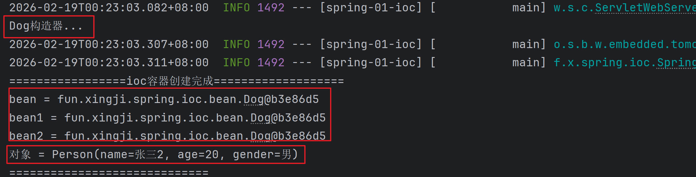

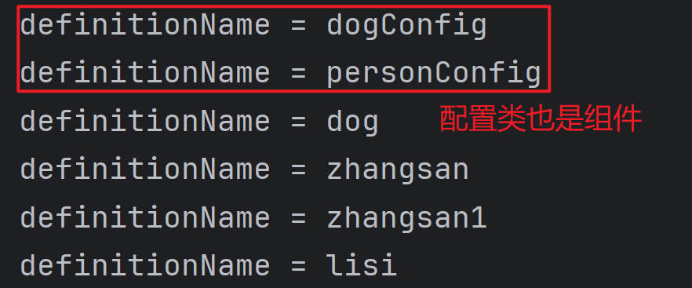


### 实验4-7：@Controller、@Service、@Respository、@Component - MVC分层注解

+ **UserController.java**

```java
package fun.xingji.spring.ioc.controller;

import org.springframework.stereotype.Controller;

@Controller
public class UserController {
}
```

+ **UserService.java**

```java
package fun.xingji.spring.ioc.service;

import org.springframework.stereotype.Service;

@Service
public class UserService {
}
```

+ **UserDao.java**

```java
package fun.xingji.spring.ioc.dao;

import org.springframework.stereotype.Repository;

@Repository
public class UserDao {
}
```

+ **Spring01IocApplication.java**

```java
/**
     * 默认，分层注解能起作用的前提是：这些组件必须在主程序所在的包及其子包结构下
     * Spring 为我们提供了快速的 MVC分层注解
     *      1、@Controller 控制器
     *      2、@Service 服务层
     *      3、@Repository 持久层
     *      4、@Component 组件(出现在非MVC三层的任何地方且包含MVC三层)
     * @param args
     */
    public static void main(String[] args) {
        ConfigurableApplicationContext ioc = SpringApplication.run(Spring01IocApplication.class, args);

        System.out.println("=====================================================");

        UserController bean = ioc.getBean(UserController.class);
        System.out.println("bean = " + bean);

        UserService bean2 = ioc.getBean(UserService.class);
        System.out.println("bean2 = " + bean2);

        UserDao bean3 = ioc.getBean(UserDao.class);
        System.out.println("bean3 = " + bean3);
    }
```

>**使用`@Component注解`也行**

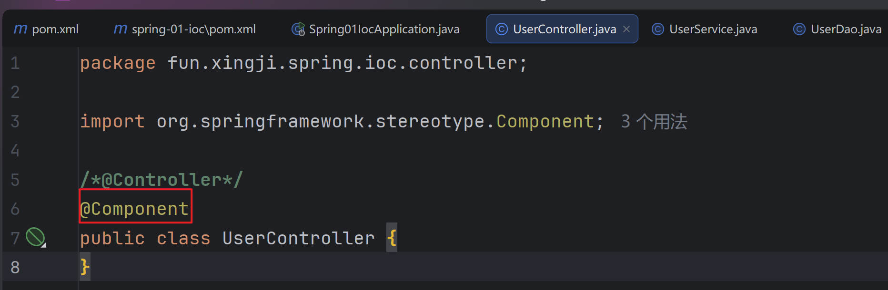

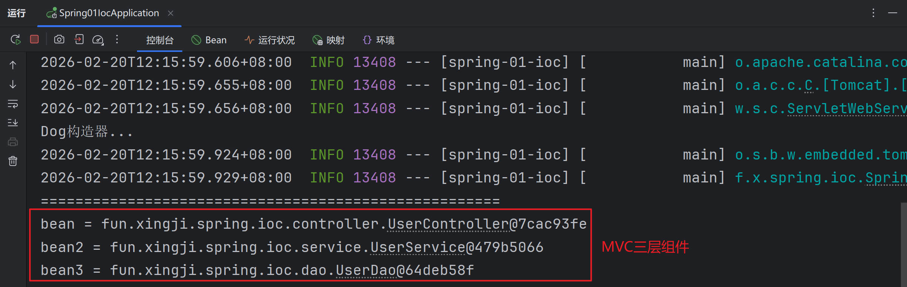

:::tip

> **分层注解底层都是 `@Component`**
>
> 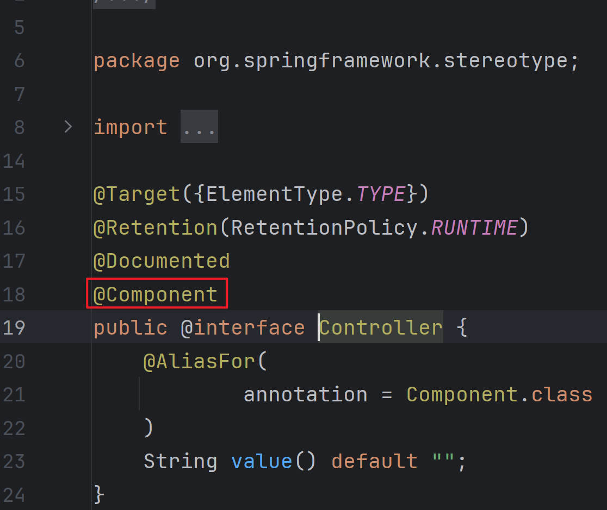
>
> 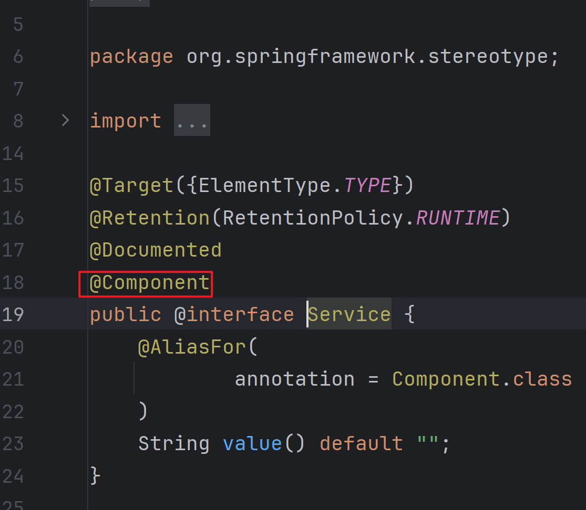
>
> 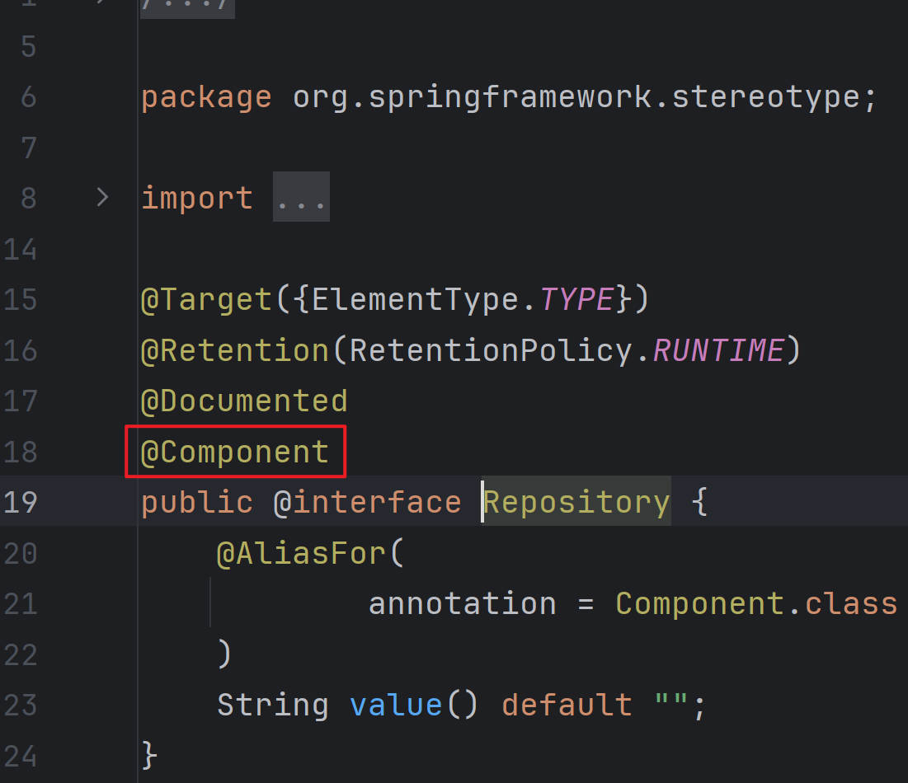


### 实验8：@ComponentScan - 批量扫描

+ **Spring01IocApplication.java**

```java
package fun.xingji.spring.ioc;

import fun.xingji.spring.ioc.bean.Dog;
import fun.xingji.spring.ioc.bean.Person;
import fun.xingji.spring.ioc.controller.UserController;
import fun.xingji.spring.ioc.dao.UserDao;
import fun.xingji.spring.ioc.service.UserService;
import org.springframework.boot.SpringApplication;
import org.springframework.boot.autoconfigure.SpringBootApplication;
import org.springframework.context.ConfigurableApplicationContext;
import org.springframework.context.annotation.ComponentScan;

import java.util.Map;

/**
 * 这个是主入口类，称为主程序类
 */
@ComponentScan(basePackages = "fun.xingji.spring") // 组件批量扫描；只扫利用Spring相关注解注册到容器中的组件
@SpringBootApplication
public class Spring01IocApplication {


    /**
     * 默认，分层注解能起作用的前提是：这些组件必须在主程序所在的包及其子包结构下
     * Spring 为我们提供了快速的 MVC分层注解
     *      1、@Controller 控制器
     *      2、@Service 服务层
     *      3、@Repository 持久层
     *      4、@Component 组件(出现在非MVC三层的任何地方且包含MVC三层)
     * @param args
     */
    public static void main(String[] args) {
        ConfigurableApplicationContext ioc = SpringApplication.run(Spring01IocApplication.class, args);

        System.out.println("=====================================================");

        UserController bean = ioc.getBean(UserController.class);
        System.out.println("bean = " + bean);

        UserService bean2 = ioc.getBean(UserService.class);
        System.out.println("bean2 = " + bean2);

        UserDao bean3 = ioc.getBean(UserDao.class);
        System.out.println("bean3 = " + bean3);
    }
}
```

:::tip

+ 扫描的范围

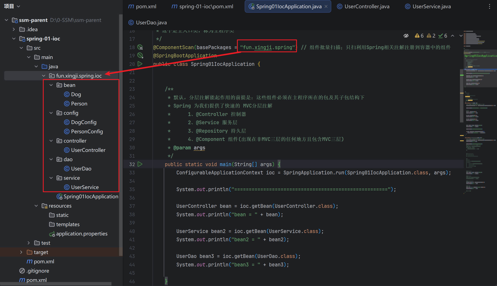

:::


### 实验9：@Import - 按需导入第三方库

:::tip

**第三方组件想要导入容器中：`没办法快速标注分层注解`**

 * 1、**@Bean：自己new，注册给容器**

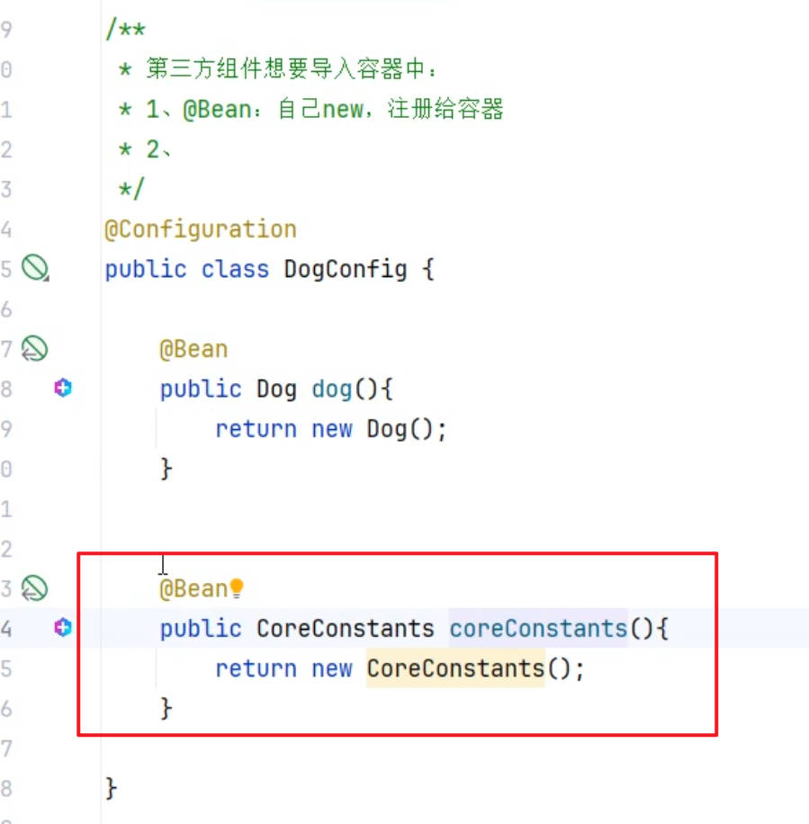

 * 2、**@Component 等分层注解(没办法快速标注分层注解)**
 * 3、**@Import：快速导入组件**

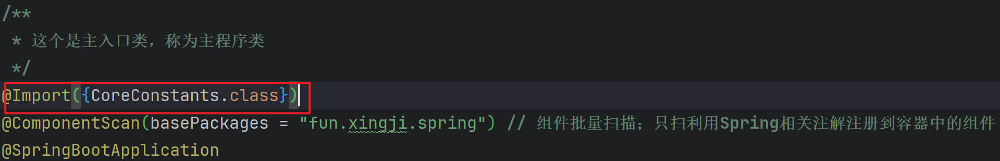

:::

> **编写一个`放置相关注解`的配置类**

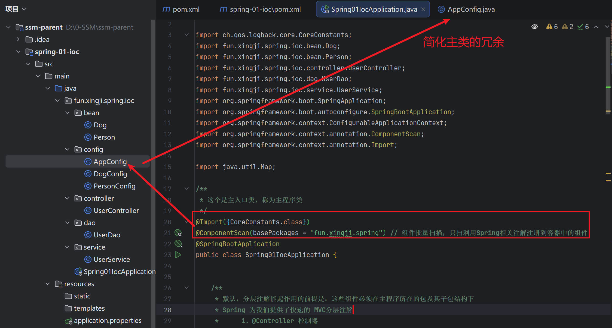

+ **AppConfig.java**

```java
package fun.xingji.spring.ioc.config;


import ch.qos.logback.core.CoreConstants;
import org.springframework.context.annotation.ComponentScan;
import org.springframework.context.annotation.Configuration;
import org.springframework.context.annotation.Import;

@Import({CoreConstants.class})
@Configuration
@ComponentScan(basePackages = "fun.xingji.spring") // 组件批量扫描；只扫利用Spring相关注解注册到容器中的组件
public class AppConfig {
}
```

> **查看刚才导入的第三方库有没有导入相关组件**
>
> 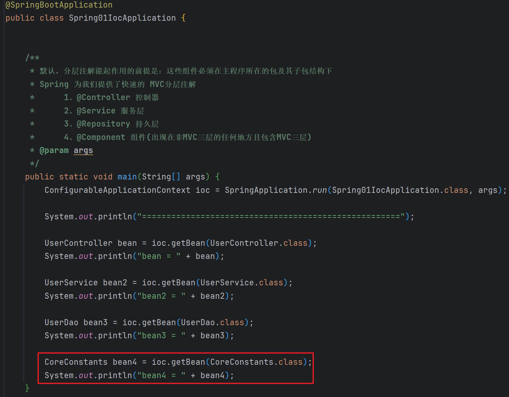
>
> 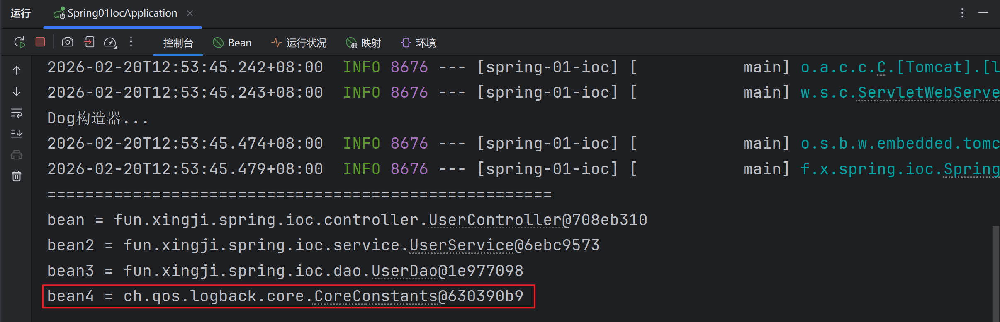
>
> > **ok,已经完美导入**


### 实验10：@Scope - 调整组件作用域

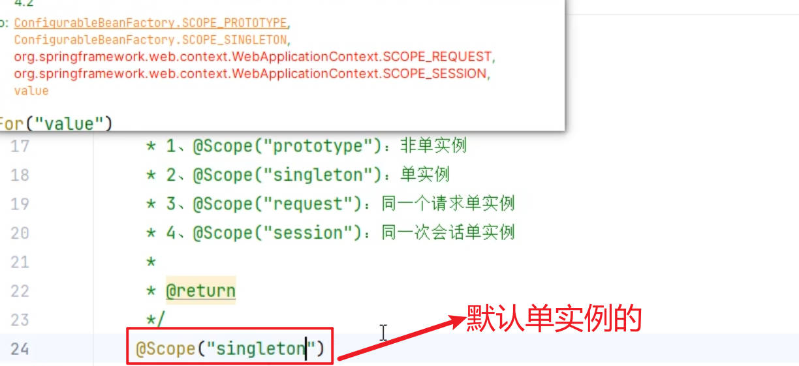

::: tip

**@Scope 调整组件的作用域：**
1、**@Scope("prototype")：非单实例:**
		**容器启动的时候不会创建非单实例组件的对象。**
       	 **`什么时候获取，什么时候创建`**
 2、**@Scope("singleton")：单实例： 默认值**
         	**容器启动的时候会创建单实例组件的对象。**
                 **`容器启动完成之前`就会创建好**
       @**Lazy：懒加载**
 		**`容器启动完成之前`不会`创建懒加载组件`的对象**
                 **什么时候获取，什么时候创建**
3、**@Scope("request")：同一个请求单实例**
4、**@Scope("session")：同一次会话单实例**

:::

+ **@Scope("singleton")：单实例： 默认值**

::: tip

**singleton**：容器启动时（或第一次获取时）创建，整个应用生命周期内`只有一个实例`。适合`无状态或只读的Bean`。

:::

```java
package fun.xingji.spring.ioc.config;

import fun.xingji.spring.ioc.bean.Person;
import org.springframework.context.annotation.Bean;
import org.springframework.context.annotation.Configuration;
import org.springframework.context.annotation.Scope;

@Configuration //告诉Spring容器，这是一个配置类
public class PersonConfig {

    @Scope("singleton")
    @Bean("zhangsan")
    public Person haha(){
        Person person = new Person();
        person.setName("张三2");
        person.setAge(20);
        person.setGender("男");

        return person;
    }

    // 3.给容器中注册一个自己的组件；容器中的每个组件都有自己的名字，方法名就是组件的名字
    @Bean("zhangsan")
    public Person zhangsan(){
        Person person = new Person();
        person.setName("张三1");
        person.setAge(20);
        person.setGender("男");

        return person;
    }

    @Bean("lisi")
    public Person lisi(){
        Person person = new Person();
        person.setName("李四");
        person.setAge(20);
        person.setGender("男");

        return person;
    }
}
```

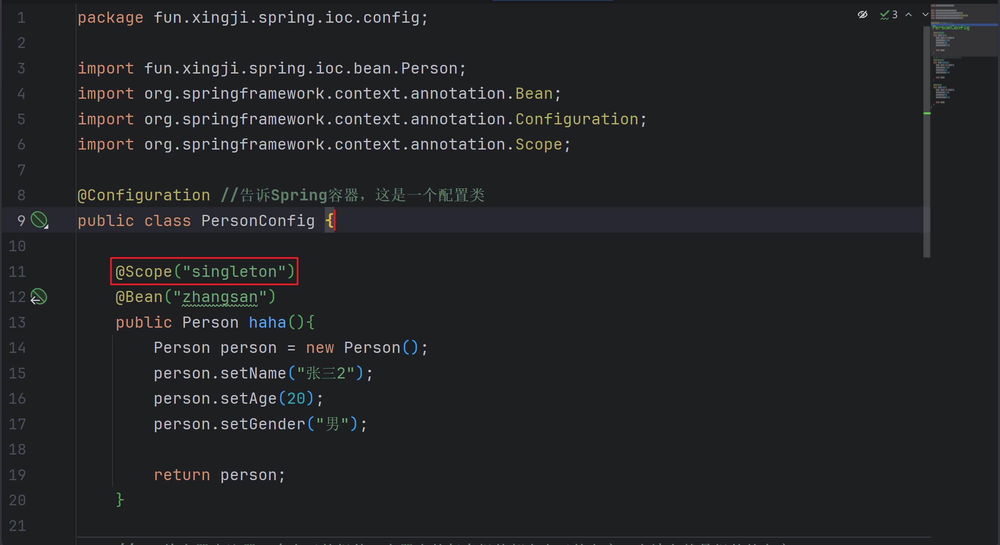

```java
/**
     * @Scope 调整组件的作用域：
     * 1、@Scope("prototype")：非单实例:
     *      容器启动的时候不会创建非单实例组件的对象。
     *      什么时候获取，什么时候创建
     * 2、@Scope("singleton")：单实例： 默认值
     *      容器启动的时候会创建单实例组件的对象。
     *      容器启动完成之前就会创建好
     *    @Lazy：懒加载
     *      容器启动完成之前不会创建懒加载组件的对象
     *      什么时候获取，什么时候创建
     * 3、@Scope("request")：同一个请求单实例
     * 4、@Scope("session")：同一次会话单实例
     *
     * @return
     */
    public static void main(String[] args) {
        ConfigurableApplicationContext ioc = SpringApplication.run(Spring01IocApplication.class, args);

        System.out.println("=================ioc容器创建完成===================");
        Object zhangsan1 = ioc.getBean("zhangsan");
        System.out.println("zhangsan1 = " + zhangsan1);

        Object zhangsan2 = ioc.getBean("zhangsan");
        System.out.println("zhangsan2 = " + zhangsan2);

        // 容器创建的时候(完成之前)就把所有的单例对象创建完成
        System.out.println(zhangsan1 == zhangsan2);
    }
```

> **验证:**
>
> 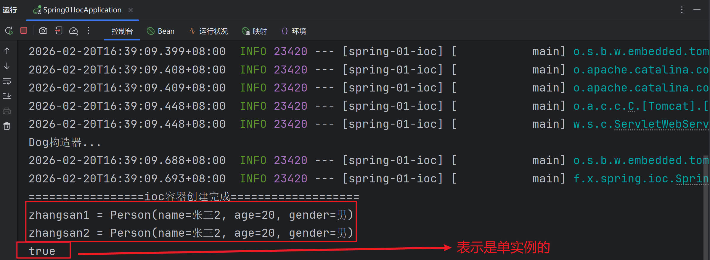


+ **@Scope("prototype")：非单实例**

::: tip

**prototype**：每次通过`getBean()`或`注入`（注意：注入时`只在初始化时创建一次`，若需每次新建需配合`ObjectFactory`或`@Lookup`）都会`创建新实例`。适合`有状态的Bean`。

:::

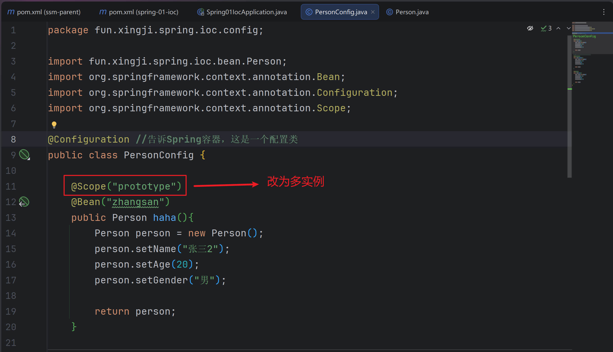

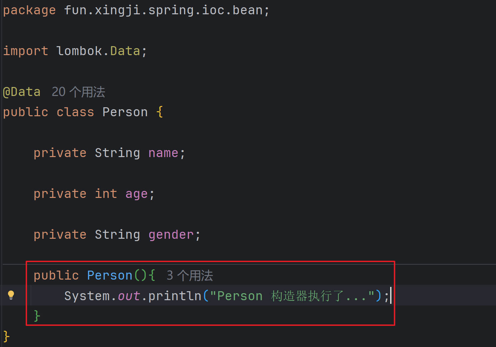

> **验证:**
>
> 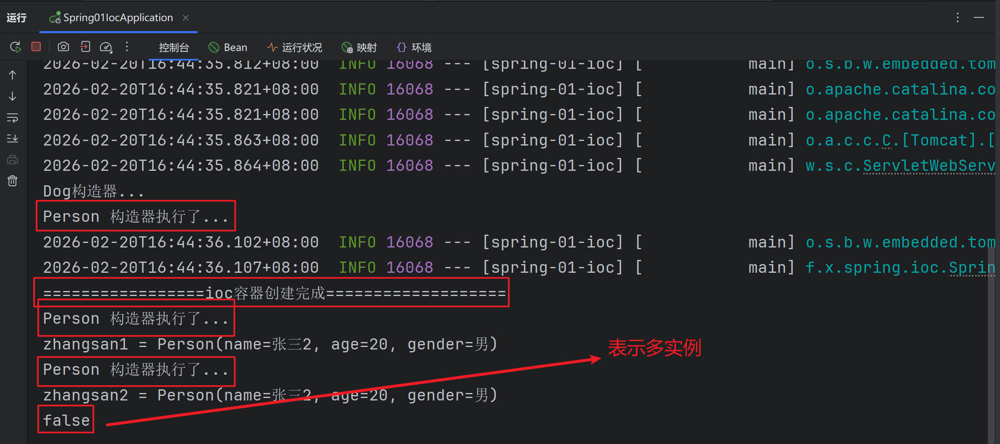


### 实验11：@Lazy - 单例情况下的懒加载

::: tip
**@Scope("singleton")：单实例： 默认值**
	**容器启动的时候会创建单实例组件的对象。**
	**`容器启动完成之前`就会创建好**
**@Lazy：懒加载**
	**容器`启动完成之前`不会`创建懒加载组件`的对象**
	**什么时候获取，什么时候创建**

:::

+ **@Scope("singleton")：单实例： 默认值**

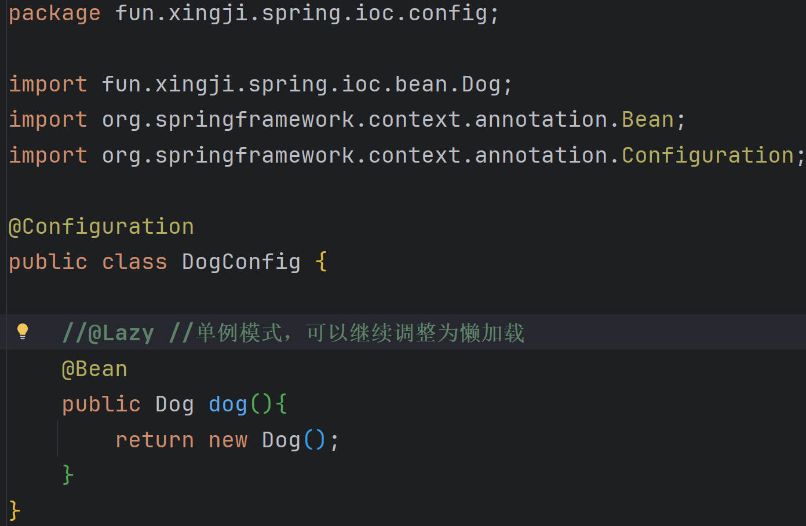

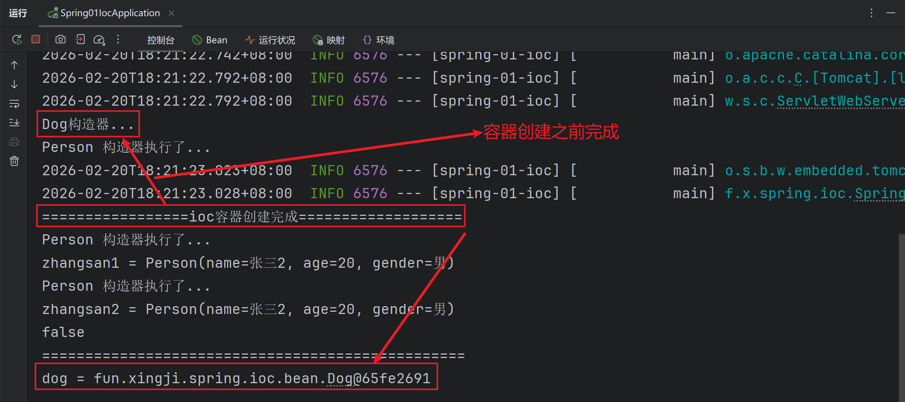


+ **@Lazy：懒加载**

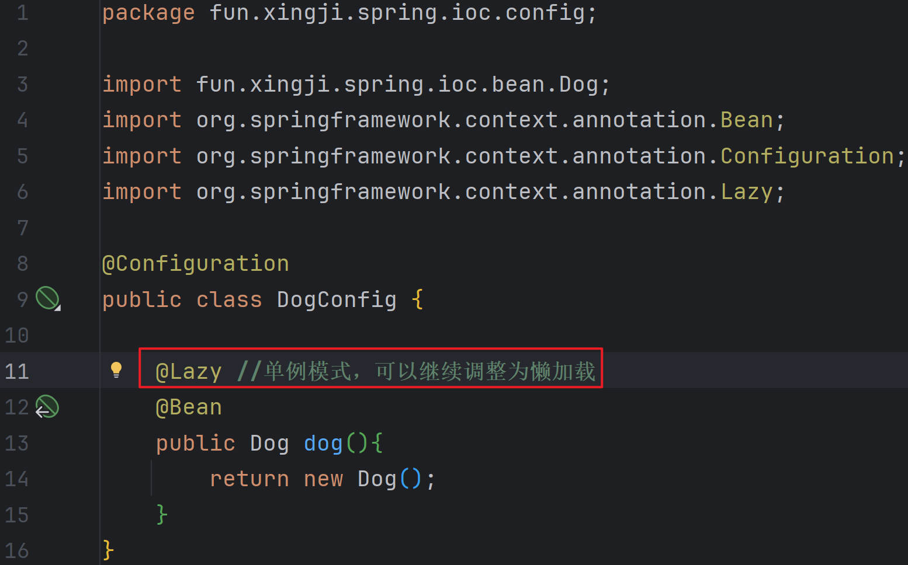

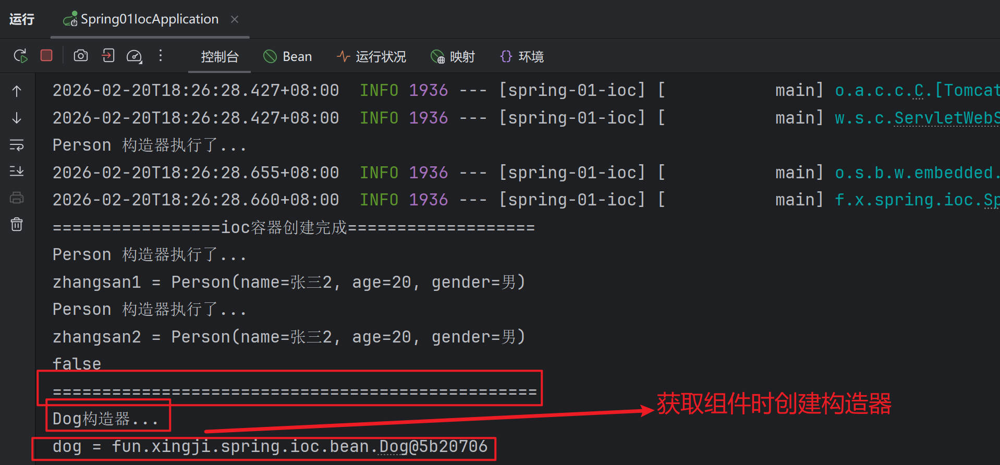


### 实验12：FactoryBean - 利用工厂制作复杂Bean

+ **BYDFactory.java**

```java
package fun.xingji.spring.ioc.factory;

import fun.xingji.spring.ioc.bean.Car;
import org.springframework.beans.factory.FactoryBean;
import org.springframework.stereotype.Component;

// 场景：如果制造某些对象比较复杂的时候，利用工厂方法进行创建。
@Component
public class BYDFactory implements FactoryBean<Car> {

    /**
     * 调用此方法给容器中制造对象
     * @return
     * @throws Exception
     */
    @Override
    public Car getObject() throws Exception {
        System.out.println("BYDFactory 正在制造Car对象...");
        Car car = new Car();
        return car;
    }

    /**
     * 说明造的东西的类型
     * @return
     */
    @Override
    public Class<?> getObjectType() {
        return Car.class;
    }

    /**
     * 是单例？
     *      true: 是单例的
     *      false： 不是单例的
     * @return
     */
    @Override
    public boolean isSingleton() {
        return true;
    }
}
```


+ **Spring01IocApplication.java**

```java
// FactoryBean在容器中放的组件的类型，是接口中泛型指定的类型，组件的名字是 工厂自己的名字
    public static void main(String[] args) {
        ConfigurableApplicationContext ioc = SpringApplication.run(Spring01IocApplication.class, args);

        System.out.println("=================ioc容器创建完成===================");

        Car bean1 = ioc.getBean(Car.class);
        Car bean2 = ioc.getBean(Car.class);
        System.out.println(bean1 == bean2);

        Map<String, Car> beansOfType = ioc.getBeansOfType(Car.class);
        System.out.println("beansOfType:" + beansOfType);
    }
```


### 实验13：@Conditional【难点】 - 条件注册

::: info

+ **源码层面**

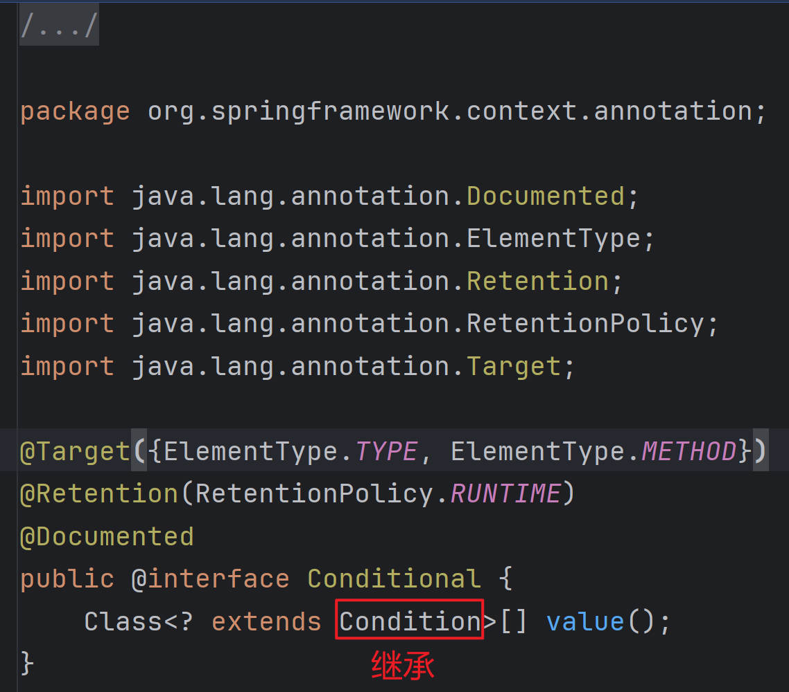

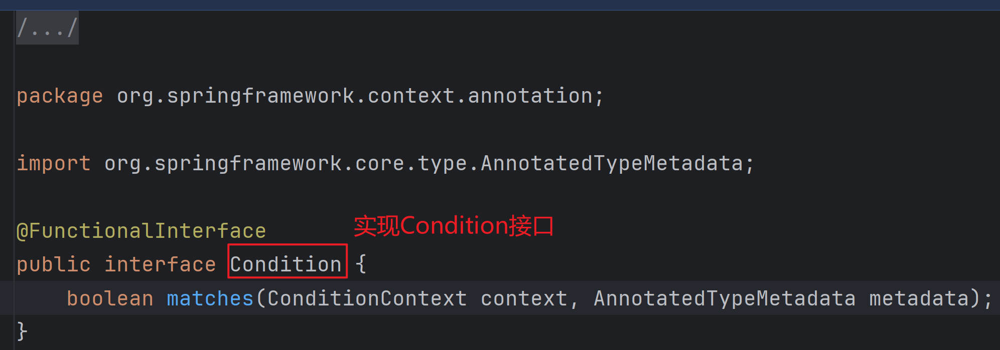

:::

+ **WindowsCondition.java**

```java
package fun.xingji.spring.ioc.condition;

import org.springframework.context.annotation.Condition;
import org.springframework.context.annotation.ConditionContext;
import org.springframework.core.env.Environment;
import org.springframework.core.type.AnnotatedTypeMetadata;

public class WindowsCondition implements Condition {
    @Override
    public boolean matches(ConditionContext context, AnnotatedTypeMetadata metadata) {
        // 判断环境变量中的OS 包含windows，就是windows系统
        // 获取到环境变量
        Environment environment = context.getEnvironment();
        // 获取环境变量属性
        String property = environment.getProperty("OS");

        // 判断语句
        /*if (property != null && property.contains("Windows")) {
            return true;
        }
        return false;*/
        // 合并语句
        return property.contains("Windows");
    }
}
```

+ **MacCondition.java**

```java
package fun.xingji.spring.ioc.condition;

import org.springframework.context.annotation.Condition;
import org.springframework.context.annotation.ConditionContext;
import org.springframework.core.env.Environment;
import org.springframework.core.type.AnnotatedTypeMetadata;

public class MacCondition implements Condition {
    @Override
    public boolean matches(ConditionContext context, AnnotatedTypeMetadata metadata) {
        // 判断环境变量中的OS 包含windows，就是windows系统
        // 获取到环境变量
        Environment environment = context.getEnvironment();
        // 获取环境变量属性
        String property = environment.getProperty("OS");

        return property.contains("mac");
    }
}
```

+ 

```java
package fun.xingji.spring.ioc.config;

import fun.xingji.spring.ioc.bean.Person;
import fun.xingji.spring.ioc.condition.MacCondition;
import fun.xingji.spring.ioc.condition.WindowsCondition;
import org.springframework.context.annotation.Bean;
import org.springframework.context.annotation.Conditional;
import org.springframework.context.annotation.Configuration;

@Configuration //告诉Spring容器，这是一个配置类
public class PersonConfig {

    //场景：判断当前电脑的操作系统是windows还是mac
    //  windows 系统，容器中有 bill
    //  mac 系统，容器中有 joseph

    @Conditional(MacCondition.class)
    @Bean("joseph")
    public Person joseph() {
        Person person = new Person();
        person.setName("乔布斯");
        person.setAge(20);
        person.setGender("男");

        return person;
    }


    @Conditional(WindowsCondition.class)
    @Bean("bill")
    public Person bill() {
        Person person = new Person();
        person.setName("比尔盖茨");
        person.setAge(20);
        person.setGender("男");

        return  person;
    }


    /*@Scope("prototype")*/
    @Bean("zhangsan")
    public Person haha(){
        Person person = new Person();
        person.setName("张三2");
        person.setAge(20);
        person.setGender("男");

        return person;
    }

    // 3.给容器中注册一个自己的组件；容器中的每个组件都有自己的名字，方法名就是组件的名字
    @Bean("zhangsan")
    public Person zhangsan(){
        Person person = new Person();
        person.setName("张三1");
        person.setAge(20);
        person.setGender("男");

        return person;
    }

    @Bean("lisi")
    public Person lisi(){
        Person person = new Person();
        person.setName("李四");
        person.setAge(20);
        person.setGender("男");

        return person;
    }
}
```

::: note

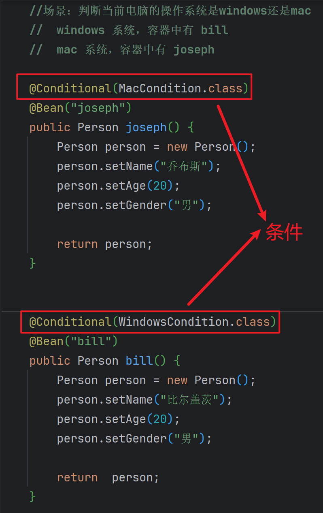

:::

+ **Spring01IocApplication.java**

```java
	/**
     * 条件注册
     * @param args
     */
    public static void main(String[] args) {
        ConfigurableApplicationContext ioc = SpringApplication.run(Spring01IocApplication.class, args);

        // 获取Person.class类型的所有对象
        Map<String, Person> beans = ioc.getBeansOfType(Person.class);
        System.out.println("beans = " + beans);

        //拿到环境变量
        ConfigurableEnvironment environment = ioc.getEnvironment();

        String property = environment.getProperty("OS");
        System.out.println("property = " + property);
    }
```

> **验证:**
>
> 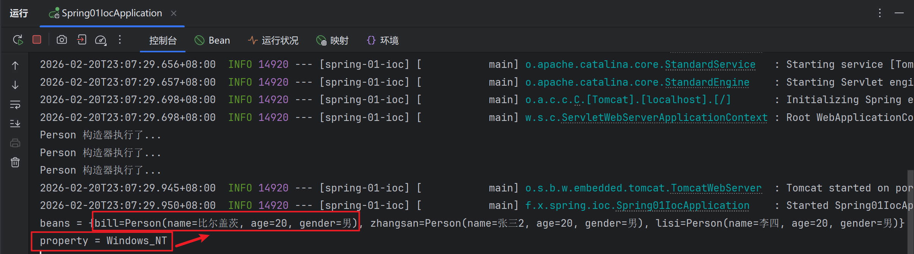
>
> 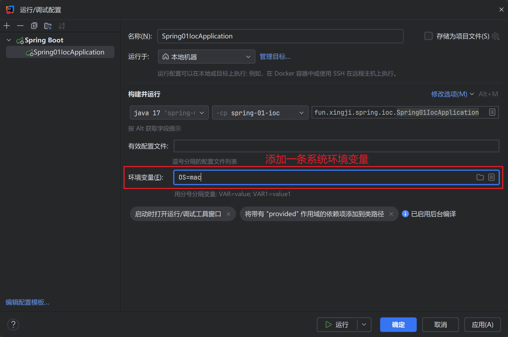
>
> 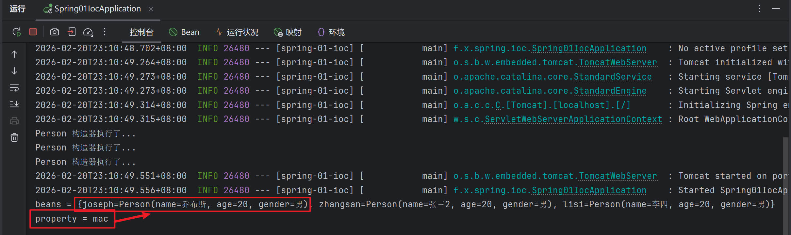


### Conditional 派生注解

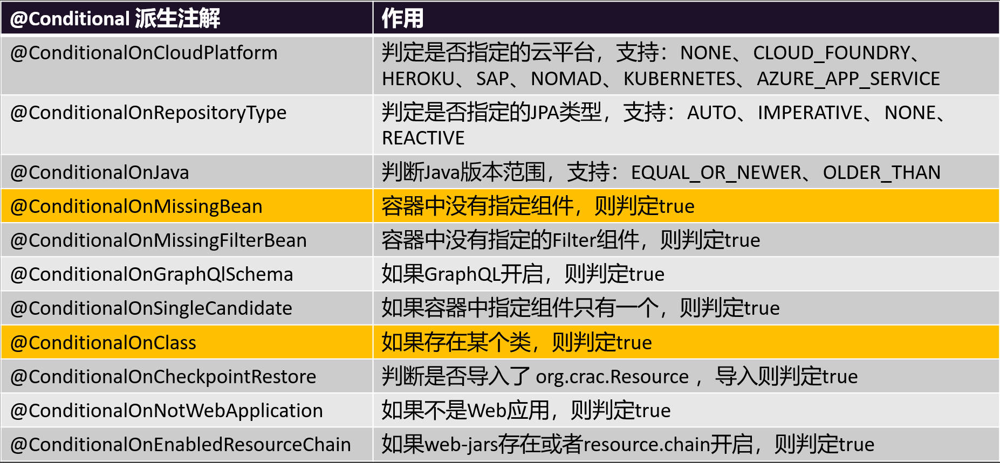

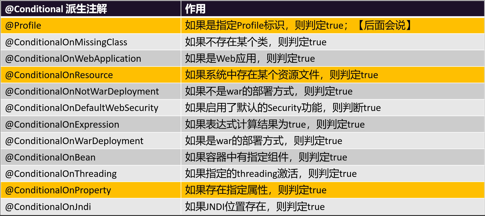

+ **ConditionalOnMissingBean - 容器中没有指定组件，则判断true**

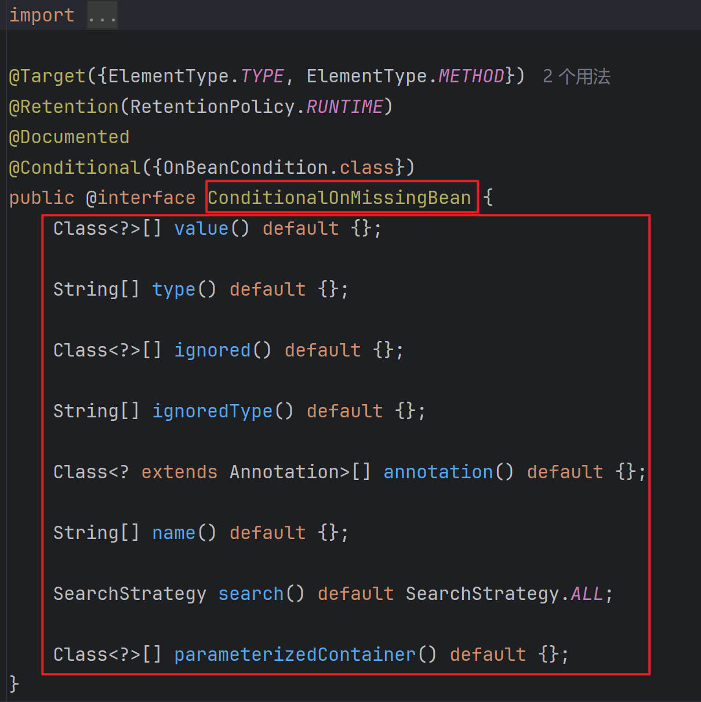

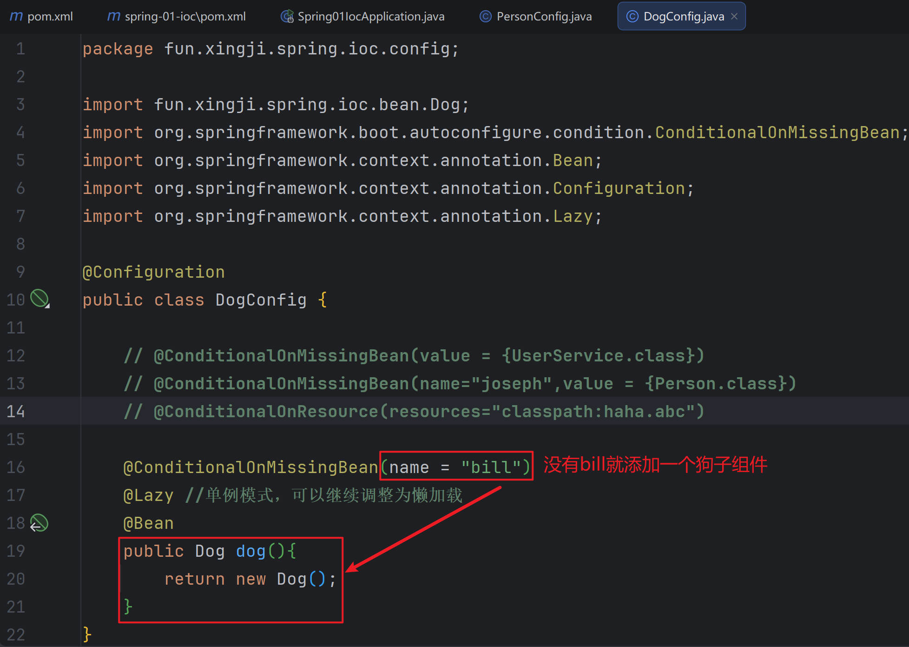

+ **添加一条系统环境变量(OS=mac)**


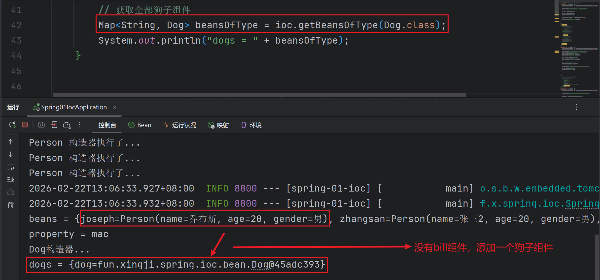

+ **ConditionalOnClass - 如果存在某个类，则判定true**

+ **Profile - 如果是指定Profile标识，则判定true**

+ **ConditionalOnResource - 如果系统中存在某个资源文件，则判断true**

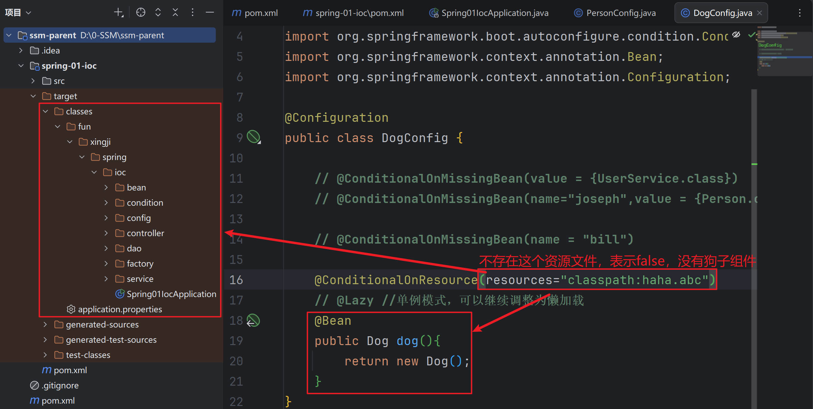

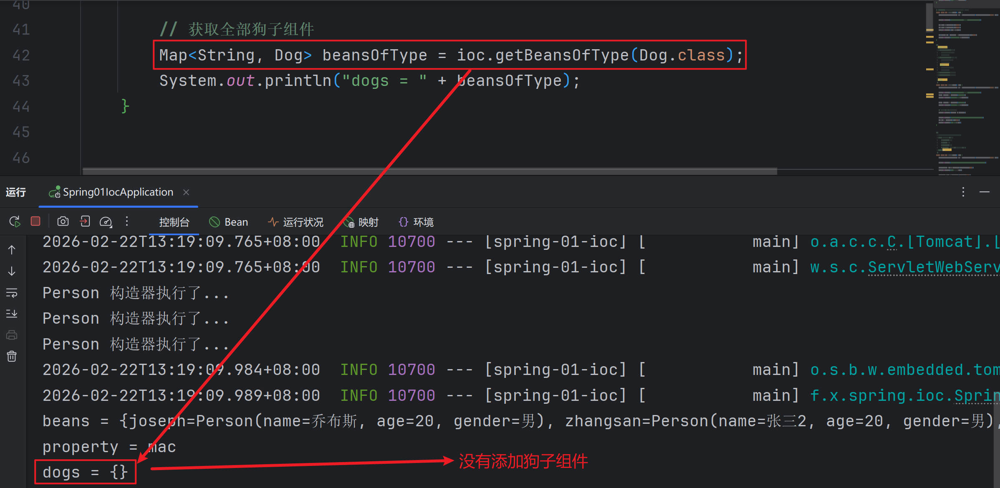

+ **ConditionalOnProperty - 如果存在指定属性，则判断true**


## 注入组件

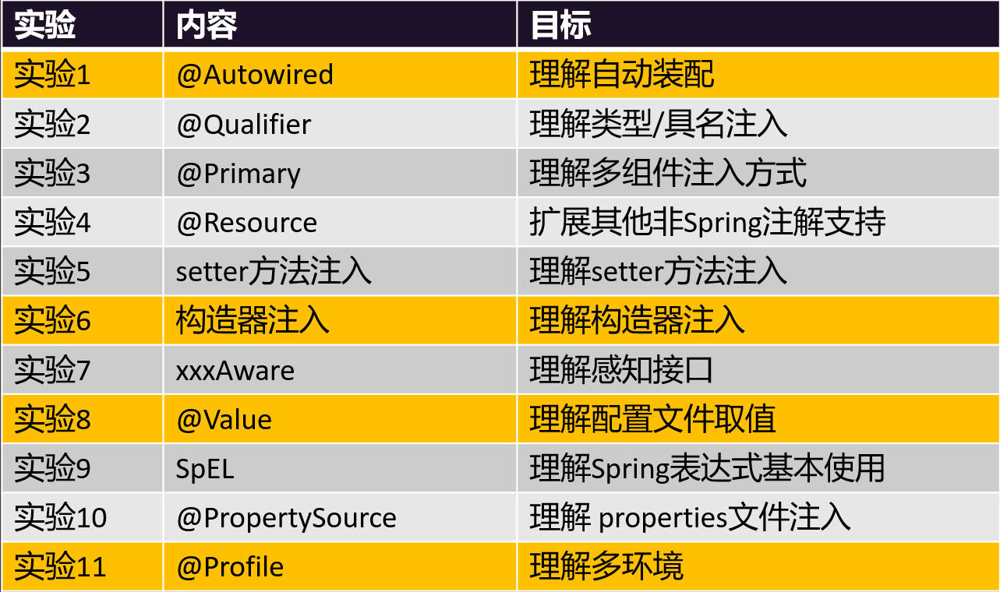


### 实验1：@Autowired

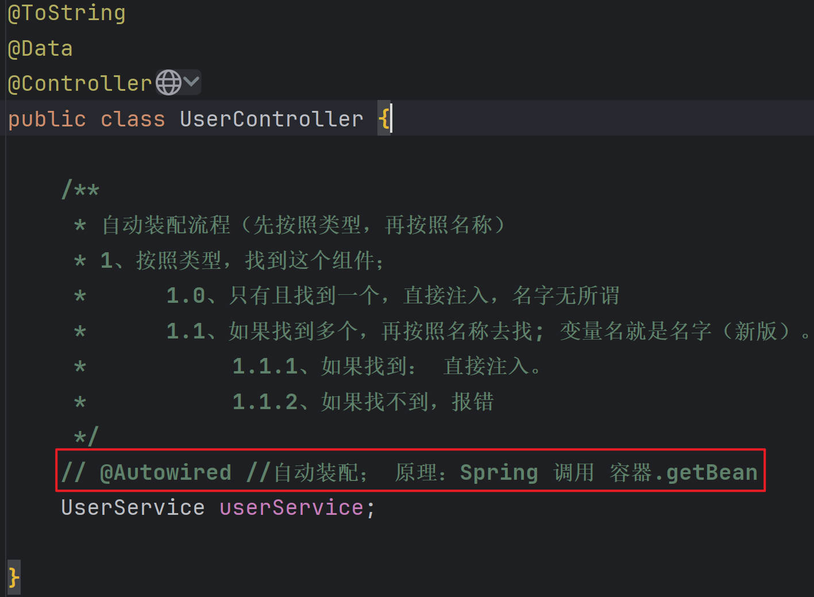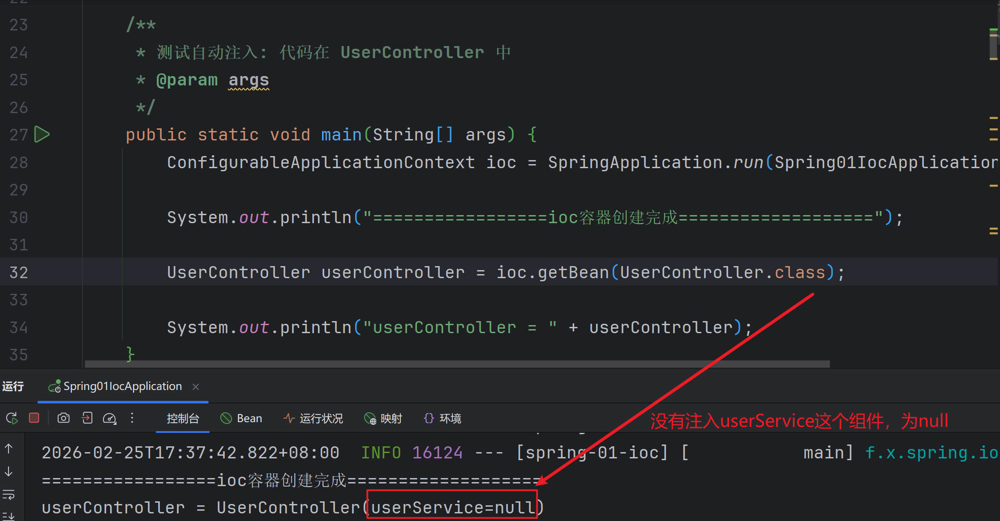

+ **Spring01IocApplication.java**

```java
/**
     * 测试自动注入: 代码在 UserController 中
     * @param args
     */
    public static void main(String[] args) {
        ConfigurableApplicationContext ioc = SpringApplication.run(Spring01IocApplication.class, args);

        System.out.println("=================ioc容器创建完成===================");

        UserController userController = ioc.getBean(UserController.class);

        System.out.println("userController = " + userController);
    }
```

+ **UserController**

```java
package fun.xingji.spring.ioc.controller;

import fun.xingji.spring.ioc.bean.Person;
import fun.xingji.spring.ioc.service.UserService;
import lombok.Data;
import lombok.ToString;
import org.springframework.beans.factory.annotation.Autowired;
import org.springframework.context.ApplicationContext;
import org.springframework.stereotype.Controller;

import java.util.List;
import java.util.Map;

@ToString
@Data
@Controller
public class UserController {

    /**
     * 自动装配流程（先按照类型，再按照名称）
     * 1、按照类型，找到这个组件；
     *      1.0、只有且找到一个，直接注入，名字无所谓
     *      1.1、如果找到多个，再按照名称去找; 变量名就是名字（新版）。
     *           1.1.1、如果找到： 直接注入。
     *           1.1.2、如果找不到，报错
     */
    @Autowired //自动装配； 原理：Spring 调用 容器.getBean
    UserService abc;

    @Autowired
    Person bill;

    @Autowired //把这个类型的所有组件都拿来
    List<Person> personList;

    @Autowired
    Map<String,Person> personMap;

    @Autowired //注入ioc容器自己
    ApplicationContext applicationContext;
}
```

::: info

**自动装配流程（先按照`类型`，再按照`名称`）:**

**按照类型，找到这个组件；**

1. 只有且找到一个，直接注入，名字无所谓

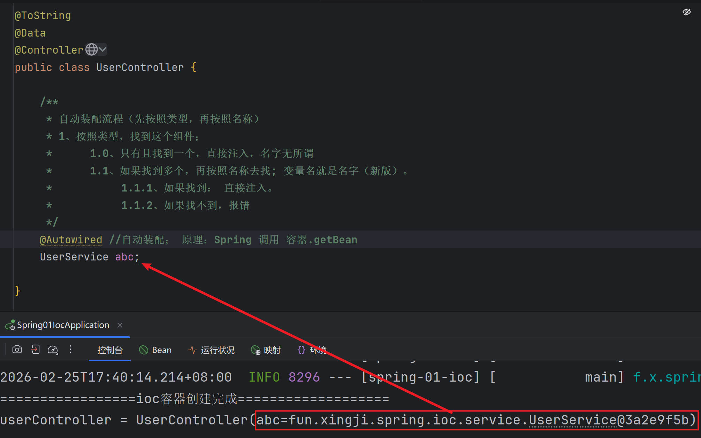

2.如果找到多个，再按照名称去找; 变量名就是名字（新版）。

+ 如果找到： 直接注入。

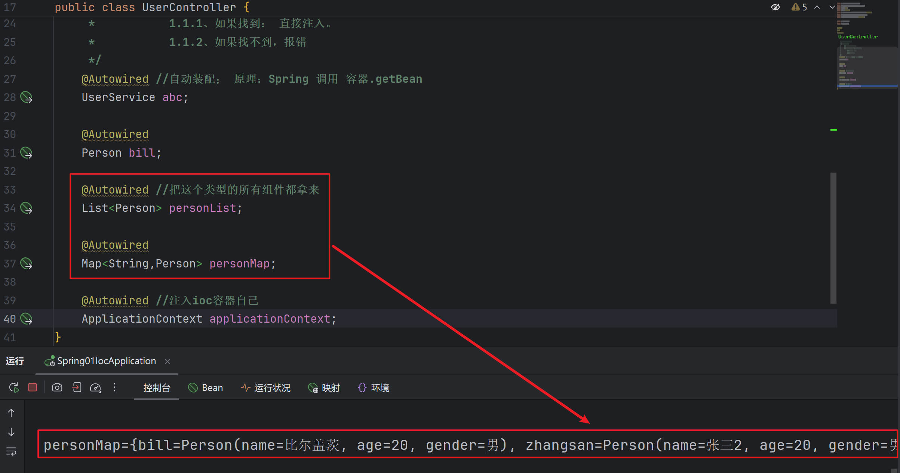

+ 如果找不到，报错 

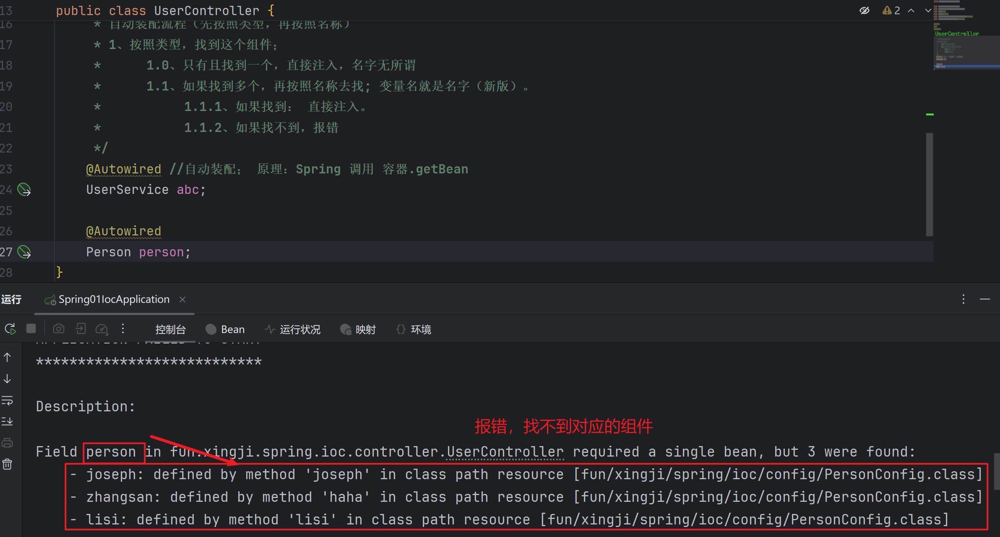

:::


### 实验2-3：@Qualifier、@Primary

+ **Spring01IocApplication.java**

```java
/**
     * 测试自动注入: 代码在 UserService 中
     * @param args
     */
    public static void main(String[] args) {
        ConfigurableApplicationContext ioc = SpringApplication.run(Spring01IocApplication.class, args);

        System.out.println("=================ioc容器创建完成===================");

        UserService bean = ioc.getBean(UserService.class);
        System.out.println("UserService = " + bean);
    }
```

+ **UserService.java**

```java
package fun.xingji.spring.ioc.service;

import fun.xingji.spring.ioc.bean.Person;
import lombok.Data;
import lombok.ToString;
import org.springframework.beans.factory.annotation.Autowired;
import org.springframework.beans.factory.annotation.Qualifier;
import org.springframework.stereotype.Service;

@ToString
@Data
@Service
public class UserService {

    /**
     * Consider marking one of the beans as @Primary,
     * updating the consumer to accept multiple beans,
     * or using @Qualifier to identify the bean that should be consumed
     */
    //    @Qualifier("bill") //精确指定：如果容器中这样的组件存在多个，则使用@Qualifier精确指定组件名

    @Qualifier("bill") //精确指定：如果容器中这样的组件存在多个，且有默认组件。我们可以使用 @Qualifier 切换别的组件。
    @Autowired
    Person atom; // @Primary 一旦存在，改属性名就不能实现组件切换了。
}
```

::: tip

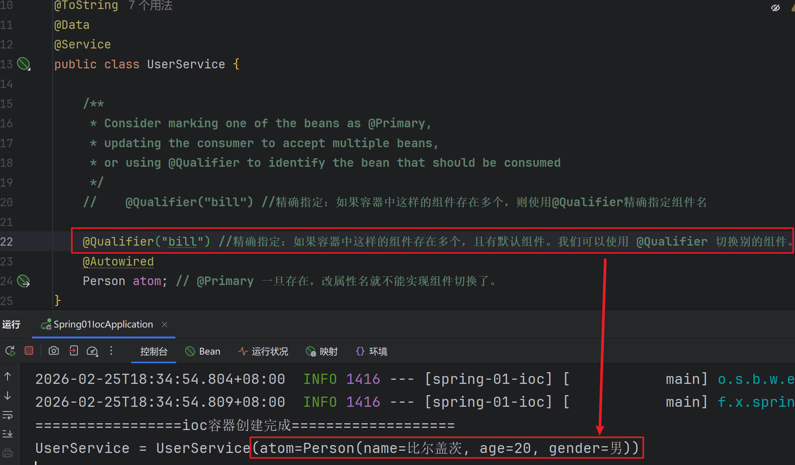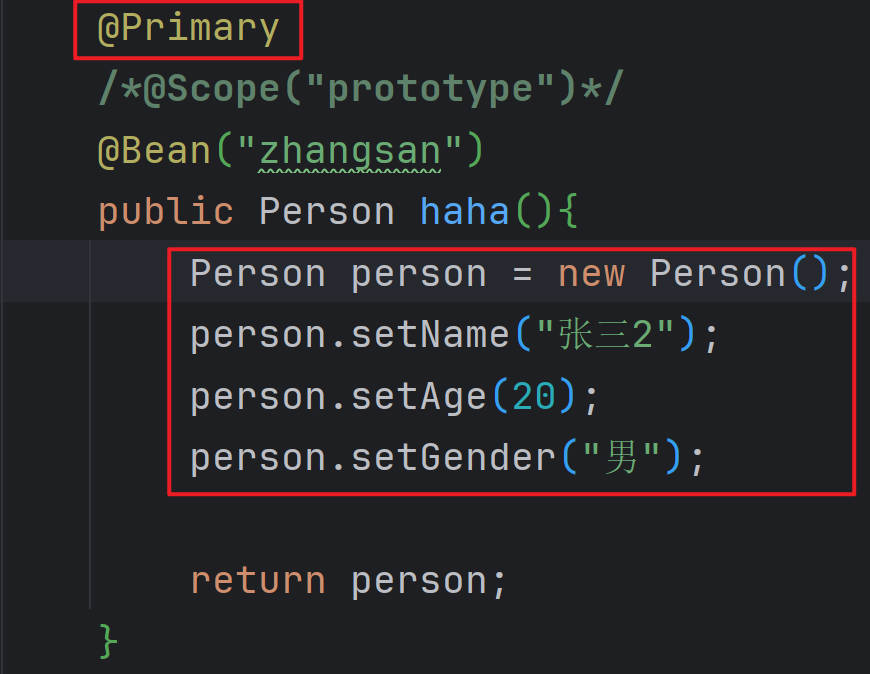

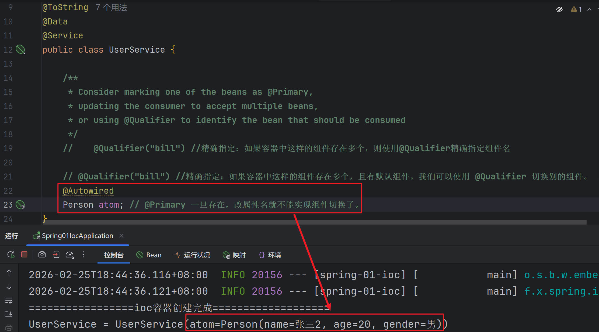

:::


### 实验4：@Resource()

+ **Spring01IocApplication.java**

```java
/**
     * 测试自动注入: 代码在 UserDao 中
     * @param args
     */
    public static void main(String[] args) {
        ConfigurableApplicationContext ioc = SpringApplication.run(Spring01IocApplication.class, args);

        System.out.println("=================ioc容器创建完成===================");

        UserDao bean = ioc.getBean(UserDao.class);
        System.out.println("bean = " + bean);
    }
```

::: tip

> **扩展其他`非Spring注解`支持**
>
> 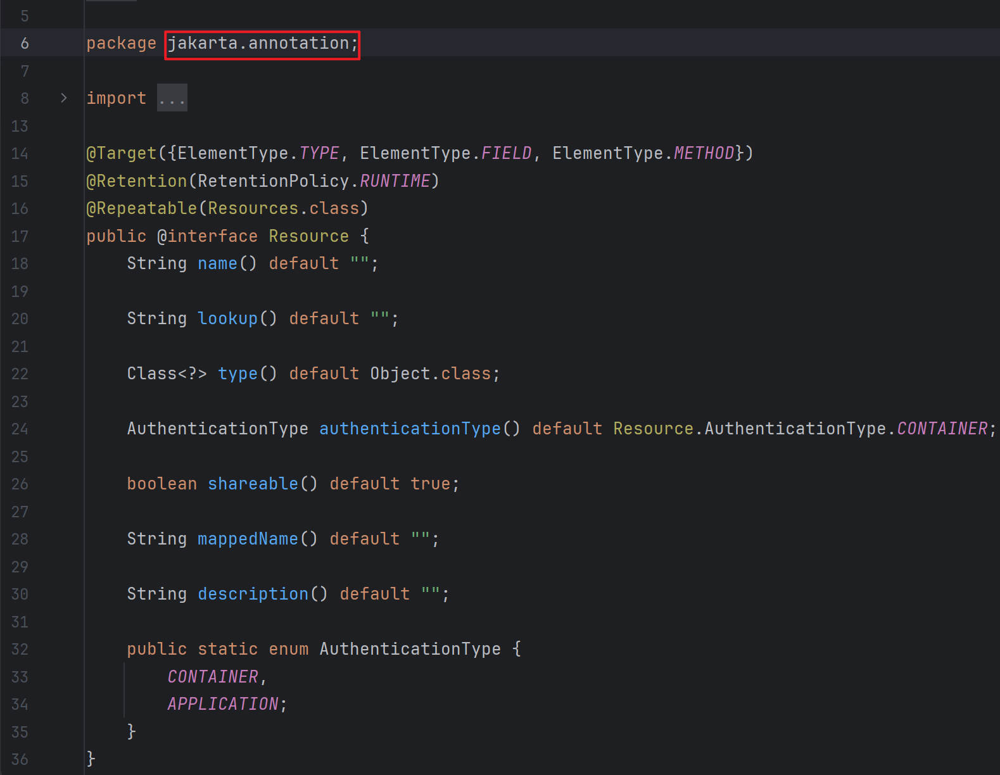

**面试题：`@Resource` 和 `@Autowired` 区别？**
1、**@Autowired 和 @Resource 都是做`bean的注入`用的，都可以放在属性上**
2、**@Resource 具有`更强的通用性`**

:::

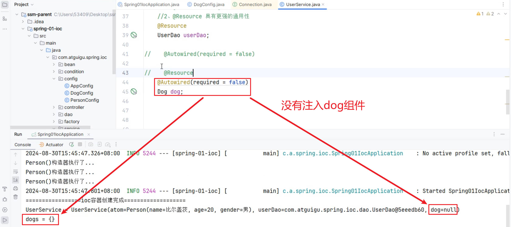


### 实验5：setter方法注入

+ **Spring01IocApplication.java**

```java
/**
     * 测试自动注入: 代码在 UserDao 中
     * @param args
     */
    public static void main(String[] args) {
        ConfigurableApplicationContext ioc = SpringApplication.run(Spring01IocApplication.class, args);

        System.out.println("=================ioc容器创建完成===================");

        UserDao bean = ioc.getBean(UserDao.class);
        System.out.println("bean = " + bean);
    }
```

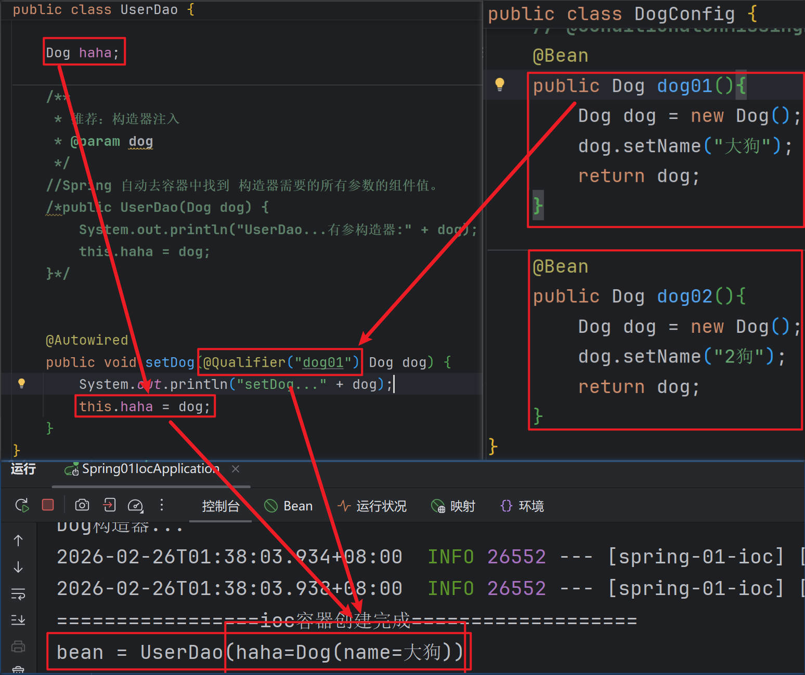


### 实验6：构造器注入

+ **Spring01IocApplication.java**

```java
/**
     * 测试自动注入: 代码在 UserDao 中
     * @param args
     */
    public static void main(String[] args) {
        ConfigurableApplicationContext ioc = SpringApplication.run(Spring01IocApplication.class, args);

        System.out.println("=================ioc容器创建完成===================");

        UserDao bean = ioc.getBean(UserDao.class);
        System.out.println("bean = " + bean);
    }
```

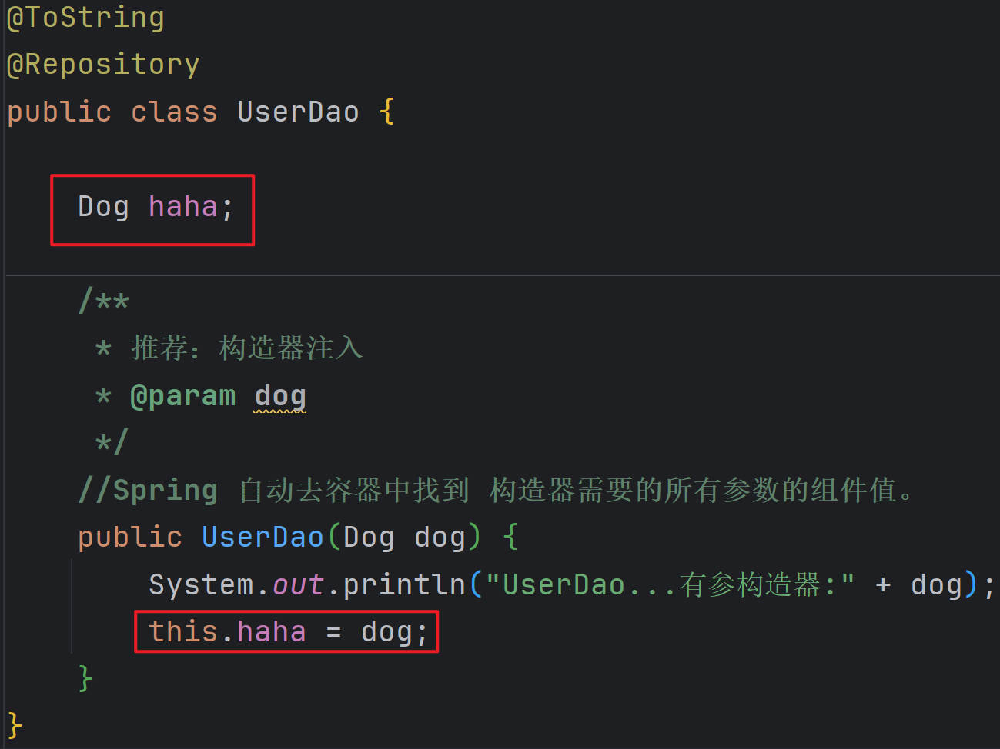

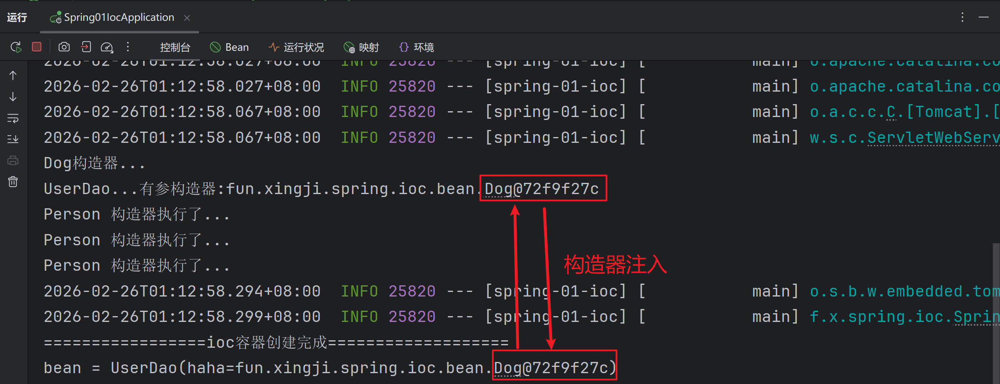


### 实验7：xxxAware(感知接口)

+ **Spring01IocApplication.java**

```java
public static void main(String[] args) {
        ConfigurableApplicationContext ioc = SpringApplication.run(Spring01IocApplication.class, args);
        System.out.println("=================ioc容器创建完成===================");


        HahaService hahaService = ioc.getBean(HahaService.class);
        System.out.println("hahaService = " + hahaService);


        String osType = hahaService.getOsType();
        System.out.println("osType = " + osType);


        String myName = hahaService.getMyName();
        System.out.println("myName = " + myName);
    }
```

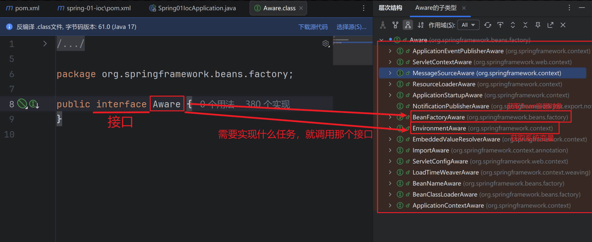

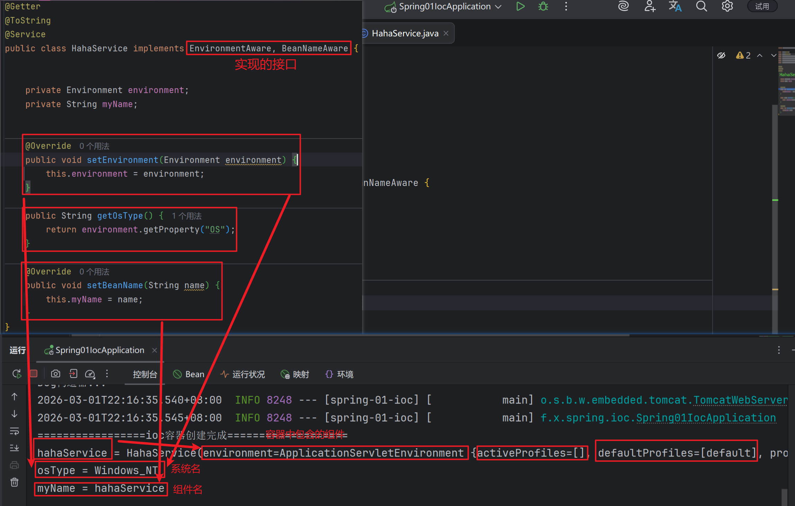


### 实验8：@Value(配置文件取值)

+ **Spring01IocApplication.java**

```java
public static void main(String[] args) {
        ConfigurableApplicationContext ioc = SpringApplication.run(Spring01IocApplication.class, args);
        System.out.println("=================ioc容器创建完成===================");

        Dog bean = ioc.getBean(Dog.class);
        System.out.println("bean = " + bean);
    }
```

+ **Dog.java**

```java
@Data
@ToString
@Component // 扫描组件加入
public class Dog {

    //  @Autowired // 自动注入组件的。基本类型，自己搞。


    /**
     * 1、@Value("字面值"): 直接赋值
     * 2、@Value("${key}")：动态从配置文件中取出某一项的值。
     * 3、@Value("#{SpEL}")：Spring Expression Language；Spring 表达式语言
     *      更多写法：https://docs.spring.io/spring-framework/reference/core/expressions.html
     */
    @Value("旺财") // 直接赋值
    private String name;

    @Value("18")
    // @Value("${dog.age}") 需要在application.propertices文件中配置花括号中的key及对应的值(如key=10)
    private Integer age;

    public Dog(){
        String string = UUID.randomUUID().toString();
        System.out.println("Dog构造器...");
    }
}
```


### 实验9：SpEL(Spring表达式基本使用)

+ **Spring01IocApplication.java**

```java
public static void main(String[] args) {
        ConfigurableApplicationContext ioc = SpringApplication.run(Spring01IocApplication.class, args);
        System.out.println("=================ioc容器创建完成===================");

        Dog bean = ioc.getBean(Dog.class);
        System.out.println("bean = " + bean);
    }
```

+ **Dog.java**

```java
@Data
@ToString
@Component // 扫描组件加入
public class Dog {

    //  @Autowired // 自动注入组件的。基本类型，自己搞。


    /**
     * 1、@Value("字面值"): 直接赋值
     * 2、@Value("${key}")：动态从配置文件中取出某一项的值。
     * 3、@Value("#{SpEL}")：Spring Expression Language；Spring 表达式语言
     *      更多写法：https://docs.spring.io/spring-framework/reference/core/expressions.html
     */
    
    // @Value("#{SqEL}") 进行数据运算
    @Value("#{10*20}")
    private String color;

    // 获取不同的UUID
    @Value("#{T(java.util.UUID).randomUUID().toString()}")
    private String id;

    // 截取字符串
    @Value("#{'Hello World!'.substring(0, 5)}")
    private String msg;

    // 进行三元运算
    @Value("#{1>2?'haha':'hehe'}")
    private String flag;

    // 将小写字母转换为大写字母
    @Value("#{new String('haha').toUpperCase()}")
    private String flag1;

    // 创建数组
    @Value("#{new int[] {1, 2, 3}}")
    private int[] hahaha;

    public Dog(){
        String string = UUID.randomUUID().toString();
        System.out.println("Dog构造器...");
    }
}
```


## 组件生命周期
