## AOP 场景

::: tip 

**AOP：Aspect Oriented Programming（面向切面编程）**

**OOP：Object Oriented Programming（面向对象编程）**

> **场景设计:**
>
> + **设计：编写一个计算器`接口`和`实现类`，提供`加减乘除`四则运算**
>
> + **需求：在加减乘除运算的时候需要记录操作**日志**（运算前参数、运算后结果）**
>
> + **实现：**
>   + **静态代理**
>   + **动态代理**
>   + **AOP**

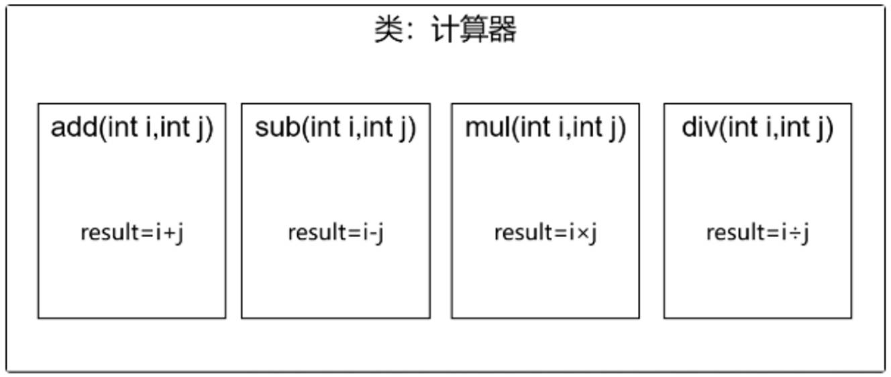

:::

+ **MathCalculator.java(计算器接口)**

```java
package fun.xingji.spring.aop.calculator;

public interface MathCalculator {

    //定义 四则运算
    int add(int i,int j);

    //减法
    int sub(int i,int j);

    //乘法
    int mul(int i,int j) ;

    //除法
    int div(int i,int j);
}
```


+ **MathCalculatorImpl.java(计算器实现类)**

```java
package fun.xingji.spring.aop.calculator.impl;

import fun.xingji.spring.aop.calculator.MathCalculator;
import org.springframework.stereotype.Component;

/**
 * 日志：
 * 1、硬编码： 不推荐； 耦合：（通用逻辑 + 专用逻辑）希望不要耦合； 耦合太多就是维护地狱
 * 2、静态代理：
 *      定义：定义一个代理对象，包装这个组件。以后业务的执行，从代理开始，不直接调用组件；
 *      特点：定义期间就指定好了互相代理关系
 */

@Component
public class MathCalculatorImpl implements MathCalculator {

    @Override
    public int add(int i, int j) {
        // System.out.println("【日志】add 开始：参数："+i+","+j);
        int result = i + j;
        // System.out.println("【日志】add 返回：结果："+result);
        return result;
    }

    @Override
    public int sub(int i, int j) {

        int result = i - j;

        return result;
    }

    @Override
    public int mul(int i, int j) {

        int result = i * j;

        return result;
    }

    @Override
    public int div(int i, int j) {

        int result = i / j;

        return result;
    }
}
```


### 日志 - 硬编码与静态代理

::: note 

**日志：**

1、**硬编码：` 不推荐`； `耦合`：（通用逻辑 + 专用逻辑）希望`不要耦合`； 耦合太多就是`维护地狱`**

2、**静态代理：**

 * **定义：定义一个`代理对象`，包装`这个组件`。以后业务的执行，从`代理开始`，不`直接调用组件`；**
 * **特点：定义期间就指定好了`互相代理关系`**

:::

+ **硬编码**

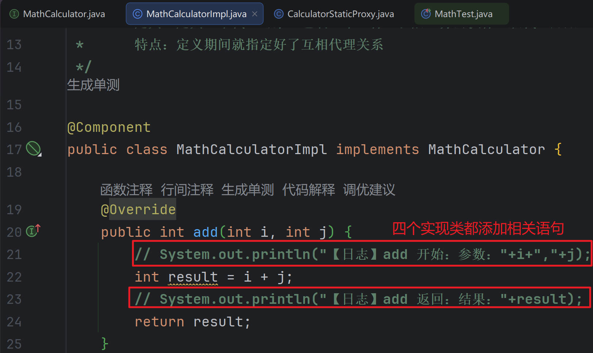


+ **静态代理**

::: tip  

**扩展：静态代理**

> **概念：编码时介入：`包装真实对象`，对外提供`静态代理对象`**

**实现步骤：**

**1、包装被代理对象**

> **在代理类中`定义一个成员变量`，用于`持有被代理对象的引用`，并通过`构造器传入具体的被代理对象实例`，实现`包装`。**

+ **CalculatorStaticProxy.java**

```java
public class CalculatorStaticProxy implements MathCalculator {
    private MathCalculator target; // 包装被代理对象

    public CalculatorStaticProxy(MathCalculator target) {
        this.target = target; // 通过构造器注入目标对象
    }
    // ...
}
```


**2、实现被代理对象的接口**

> **代理类必须`实现与被代理对象`相同的`接口`，以确保代理对象可以`无缝替代目标对象`，客户端`无需感知代理的存在`。**

+ **CalculatorStaticProxy.java**

```java
public class CalculatorStaticProxy implements MathCalculator {
    // ... 实现接口中的所有方法
    @Override
    public int add(int i, int j) {
        System.out.println("【日志】add 开始：参数："+i+","+j);
        int result = target.add(i, j);
        System.out.println("【日志】add 返回：结果："+result);
        return result;
    }

    @Override
    public int sub(int i, int j) {
        int result = target.sub(i, j);
        return result;
    }

    @Override
    public int mul(int i, int j) {
        int result = target.mul(i, j);
        return result;
    }

    @Override
    public int div(int i, int j) {
        int result = target.div(i, j);
        return result;
    }
}
```


**3、运行时调用被代理对象的真实方法**

> **在代理类实现的接口方法中，调用目标对象的同名方法执行核心业务逻辑，同时可在调用前后添加增强功能（如日志、权限校验等）**

+ **对应代码**（以`add`方法为例）：

```java
@Override
public int add(int i, int j) {
    // 前置增强
    System.out.println("【日志】add 开始：参数："+i+","+j);
    // 调用被代理对象的真实方法
    int result = target.add(i, j);
    // 后置增强
    System.out.println("【日志】add 返回：结果："+result);
    return result;
}
```


**4、外部使用代理对象调用**

> **客户端代码不再直接调用目标对象，而是通过代理对象来执行方法，从而获得增强后的行为。**

```java
// 创建目标对象
MathCalculator target = new MathCalculatorImpl();
// 创建代理对象，并包装目标对象
MathCalculator proxy = new CalculatorStaticProxy(target);
// 通过代理对象调用方法（实际执行的是增强后的逻辑）
int add = proxy.add(1, 2);
System.out.println(add);
```


::: info

优点：实现简单

缺点：需要为不同类型编写不同代理类，导致扩展维护性差  

::: 

:::

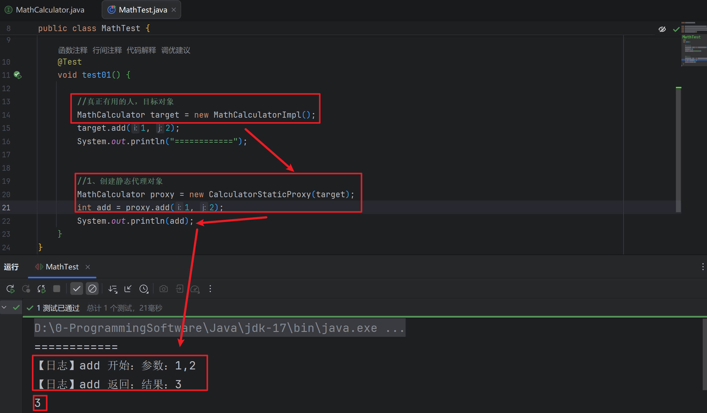


### 动态代理

::: tip  

> **动态代理：`运行期间`才决定好了`代理关系`（`拦截器：拦截所有`）**

 *    **定义：目标对象在执行期间会被`动态拦截`，插入`指定逻辑`**
 *    **优点：可以`代理世间万物`**
 *    **缺点：`不好写`**

:::

```java
import java.lang.reflect.InvocationHandler;
import java.lang.reflect.Method;
import java.lang.reflect.Proxy;
import java.util.Arrays;

// 1. 业务接口
interface MathCalculator {
    int add(int a, int b);
}

// 2. 目标类（实现业务接口）
class MathCalculatorImpl implements MathCalculator {
    @Override
    public int add(int a, int b) {
        System.out.println("目标方法执行: " + a + " + " + b);
        return a + b;
    }
}

public class DynamicProxyDemo {
    public static void main(String[] args) {
        // 创建目标对象（真正执行业务逻辑的对象）
        MathCalculator target = new MathCalculatorImpl(); // 用于获取类加载器和接口
        MathCalculator wangyuan = new MathCalculatorImpl(); // 实际被代理的对象

        // 定义调用处理器
        InvocationHandler h = new InvocationHandler() {
            @Override
            public Object invoke(Object proxy, Method method, Object[] args) throws Throwable {
                // 前置处理：打印原始参数
                System.out.println("代理拦截: 原始参数 = " + Arrays.asList(args));

                // 修改参数（将第二个参数改为0）
                args[1] = 0;
                System.out.println("代理拦截: 修改后参数 = " + Arrays.asList(args));

                // 通过反射调用目标对象的方法
                Object result = method.invoke(wangyuan, args);

                // 后置处理（此处省略）
                return result;
            }
        };

        // 生成动态代理对象
        MathCalculator proxyInstance = (MathCalculator) Proxy.newProxyInstance(
                target.getClass().getClassLoader(),     // 类加载器
                target.getClass().getInterfaces(),      // 目标实现的接口
                h                                       // 调用处理器
        );

        // 通过代理对象调用方法
        System.out.println("===== 开始调用代理对象的 add 方法 =====");
        int add = proxyInstance.add(1, 2);
        System.out.println("最终结果: " + add);
    }
}
```

```text
===== 开始调用代理对象的 add 方法 =====
代理拦截: 原始参数 = [1, 2]
代理拦截: 修改后参数 = [1, 0]
目标方法执行: 1 + 0
最终结果: 1
```

::: note  

1. **接口 `MathCalculator`**：定义了业务方法 `add`。
2. **实现类 `MathCalculatorImpl`**：提供具体的加法逻辑，并在方法内打印执行信息。
3. **动态代理生成**：
   - 使用 `Proxy.newProxyInstance` 创建代理对象，传入目标对象的类加载器和接口，以及自定义的 `InvocationHandler`。
   - 在 `invoke` 方法中，可以拦截方法调用，修改参数，然后通过反射调用真实目标对象的方法。
4. **调用效果**：代理对象 `proxyInstance.add(1, 2)` 被拦截后，参数被修改为 `(1, 0)`，因此实际计算结果为 `1`。

:::


### 动态代理 - 加日志


+ **定义业务接口和实现类**

```java
// 业务接口
interface Calculator {
    int add(int a, int b);
    int subtract(int a, int b);
}

// 真实实现类
class CalculatorImpl implements Calculator {
    @Override
    public int add(int a, int b) {
        return a + b;
    }

    @Override
    public int subtract(int a, int b) {
        return a - b;
    }
}
```


+ **创建日志调用处理器**

```java
import java.lang.reflect.InvocationHandler;
import java.lang.reflect.Method;
import java.util.Arrays;

class LoggingInvocationHandler implements InvocationHandler {
    private final Object target; // 目标对象

    public LoggingInvocationHandler(Object target) {
        this.target = target;
    }

    @Override
    public Object invoke(Object proxy, Method method, Object[] args) throws Throwable {
        // 前置日志：记录方法名和参数
        System.out.println("[LOG] 调用方法: " + method.getName() + 
                           ", 参数: " + Arrays.toString(args));

        // 调用目标方法
        Object result = method.invoke(target, args);

        // 后置日志：记录返回值
        System.out.println("[LOG] 方法返回: " + result);

        return result;
    }
}
```


+ **生成代理对象并使用**

```java
import java.lang.reflect.Proxy;

public class DynamicProxyLoggingDemo {
    public static void main(String[] args) {
        // 创建目标对象
        Calculator target = new CalculatorImpl();

        // 创建调用处理器
        LoggingInvocationHandler handler = new LoggingInvocationHandler(target);

        // 动态生成代理对象
        Calculator proxy = (Calculator) Proxy.newProxyInstance(
                target.getClass().getClassLoader(),
                target.getClass().getInterfaces(),
                handler
        );

        // 通过代理对象调用方法
        int sum = proxy.add(5, 3);
        System.out.println("add结果: " + sum);

        int difference = proxy.subtract(10, 4);
        System.out.println("subtract结果: " + difference);
    }
}
```


```text
[LOG] 调用方法: add, 参数: [5, 3]
[LOG] 方法返回: 8
add结果: 8
[LOG] 调用方法: subtract, 参数: [10, 4]
[LOG] 方法返回: 6
subtract结果: 6
```

::: note 

1. **`InvocationHandler` 的实现**：`LoggingInvocationHandler` 持有一个目标对象，在 `invoke` 方法中，我们可以在调用目标方法前后添加自定义逻辑（这里就是打印日志）。
2. **日志记录的内容**：
   - **方法名**：通过 `method.getName()` 获取。
   - **参数列表**：`Arrays.toString(args)` 格式化输出。
   - **返回值**：调用 `method.invoke` 后得到的结果。
3. **通用性**：该日志处理器可以应用于任何接口的实现类，因为它是通过反射调用目标方法，且日志逻辑与具体业务无关。
4. **代理对象的生成**：`Proxy.newProxyInstance` 创建了一个实现了 `Calculator` 接口的代理对象，所有对代理对象方法的调用都会被转发到 `handler.invoke` 方法。

:::


### 日志工具类

+ **LogUtils.java**

```java
package fun.xingji.spring.aop.log;

import java.util.Arrays;

public class LogUtils {

    public static void logStart(String name,Object... args){
        System.out.println("【日志】：【"+name+"】开始；参数："+ Arrays.toString(args));
    }
    public static void logEnd(String name){
        System.out.println("【日志】：【"+name+"】结束；");
    }

    public static void logException(String name,Throwable e){
        System.out.println("【日志】：【"+name+"】异常；异常信息："+e.getCause());
    }

    public static void logReturn(String name,Object result){
        System.out.println("【日志】：【"+name+"】返回；返回值："+result);
    }
}
```


+ **DynamicProxy.java**

```java
package fun.xingji.spring.aop.proxy.dynamic;

import fun.xingji.spring.aop.log.LogUtils;

import java.lang.reflect.Proxy;

/**
 * 动态代理： JDK动态代理；
 * 强制要求，目标对象必有接口。代理的也只是接口规定的方法。
 *
 */
public class DynamicProxy {

    //获取目标对象的代理对象
    public static Object getProxyInstance(Object target) {
        return Proxy.newProxyInstance(target.getClass().getClassLoader(),
                target.getClass().getInterfaces(),
                (proxy, method, args) -> {
                    String name = method.getName();
                    //记录开始
                    LogUtils.logStart(name, args);
                    Object result = null;
                    try{
                        result = method.invoke(target, args);
                        //记录返回值
                        LogUtils.logReturn(name, result);
                    }catch (Exception e){
                        //记录异常
                        LogUtils.logException(name, e);
                    }finally {
                        //记录结束
                        LogUtils.logEnd(name);
                    }
                    return result;
                }
        );
    }
}
```

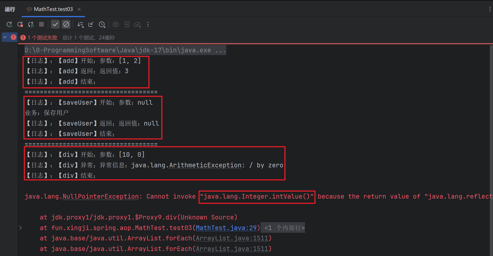


## 专业术语

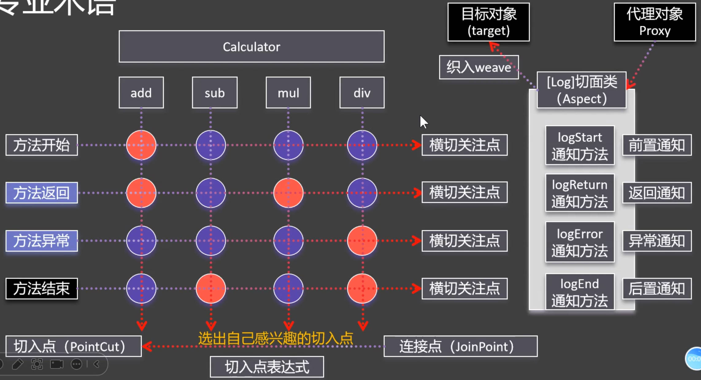

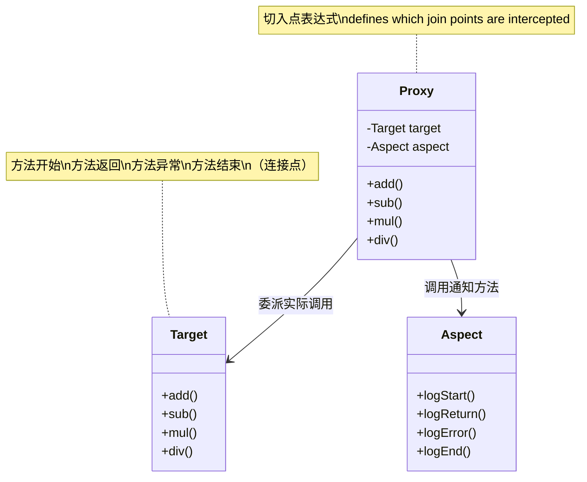
```mermaid
classDiagram
    class Target {
        +add()
        +sub()
        +mul()
        +div()
    }

    class Aspect {
        +logStart()
        +logReturn()
        +logError()
        +logEnd()
    }

    class Proxy {
        -Target target
        -Aspect aspect
        +add()
        +sub()
        +mul()
        +div()
    }

    Proxy --> Target : 委派实际调用
    Proxy --> Aspect : 调用通知方法

    note for Target "方法开始\n方法返回\n方法异常\n方法结束\n（连接点）"
    note for Proxy "切入点表达式\ndefines which join points are intercepted"
```

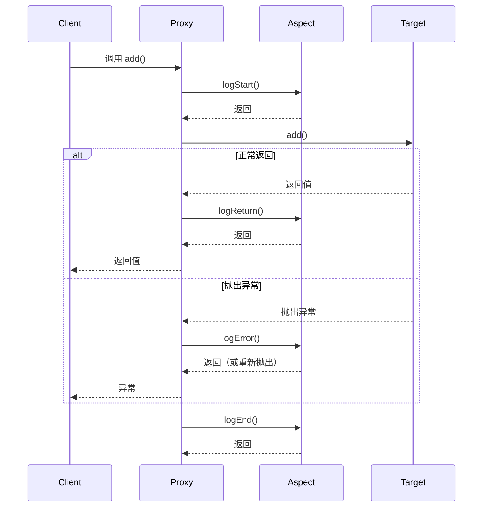
```mermaid
sequenceDiagram
    participant Client
    participant Proxy
    participant Aspect
    participant Target

    Client->>Proxy: 调用 add()
    Proxy->>Aspect: logStart()
    Aspect-->>Proxy: 返回
    Proxy->>Target: add()

    alt 正常返回
        Target-->>Proxy: 返回值
        Proxy->>Aspect: logReturn()
        Aspect-->>Proxy: 返回
        Proxy-->>Client: 返回值
    else 抛出异常
        Target-->>Proxy: 抛出异常
        Proxy->>Aspect: logError()
        Aspect-->>Proxy: 返回（或重新抛出）
        Proxy-->>Client: 异常
    end

    Proxy->>Aspect: logEnd()
    Aspect-->>Proxy: 返回
```


## AOP 实现

+ **导入 AOP 依赖**

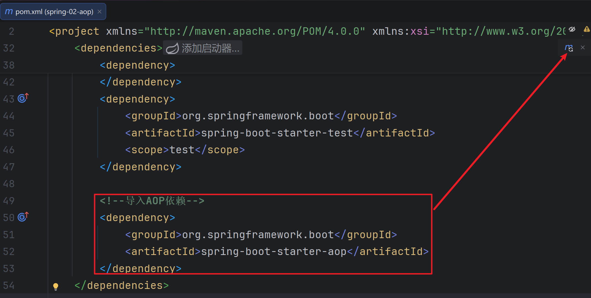

+ **编写切面 Aspect**

```java
package fun.xingji.spring.aop.aspect;

import org.aspectj.lang.annotation.Aspect;
import org.springframework.stereotype.Component;

@Component
@Aspect // 告诉Spring这个组件是个切面
public class LogAspect {

    public void logStart(){
        System.out.println("[切面 - 日志]开始...");
    }

    public void logEnd(){
        System.out.println("[切面 - 日志]结束...");
    }

    public void logReturn(){
        System.out.println("[切面 - 日志]返回...");
    }

    public void logException(){
        System.out.println("[切面 - 日志]异常...");
    }
}
```

+ **编写通知方法**

::: tip  

>  **告诉Spring，以下通知`何时运行`？**

   *         **@Before：方法`执行之前`运行。**
   *         **@AfterReturning：方法`执行正常返回结果`运行。**
   *         **@AfterThrowing：方法`抛出异常`运行。**
   *         **@After：方法`执行之后`运行**

:::

+ **LogAspect.java**

```java
package fun.xingji.spring.aop.aspect;

import org.aspectj.lang.annotation.*;
import org.springframework.stereotype.Component;

@Component
@Aspect // 告诉Spring这个组件是个切面
public class LogAspect {

    /**
     * 1、告诉Spring，以下通知何时何地运行？
     *      何时？
     *         @Before：方法执行之前运行。
     *         @AfterReturning：方法执行正常返回结果运行。
     *         @AfterThrowing：方法抛出异常运行。
     *         @After：方法执行之后运行
     */
    @Before
    public void logStart(){
        System.out.println("[切面 - 日志]开始...");
    }

    @After
    public void logEnd(){
        System.out.println("[切面 - 日志]结束...");
    }

    @AfterReturning
    public void logReturn(){
        System.out.println("[切面 - 日志]返回...");
    }

    @AfterThrowing
    public void logException(){
        System.out.println("[切面 - 日志]异常...");
    }
}
```

+ **指定切入点表达式**

::: tip 

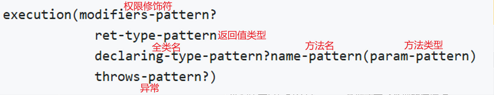

```java
何地？
切入点表达式：
execution(方法的全签名)：
全写法：[public] int
[fun.xingji.spring.aop.calculator.MathCalculator].add(int,int) [throws ArithmeticException]

省略写法：int add(int i,int j)
通配符：
	*：表示任意字符
    ..：
		1）、参数位置：表示多个参数，任意类型
		2）、类型位置：代表多个层级
    最省略: * *(..)
```

:::

+ **LogAspect.java**

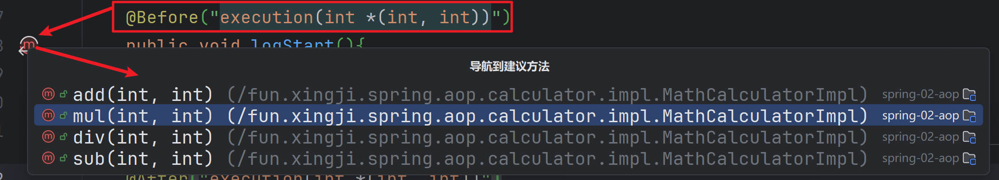

```java
package fun.xingji.spring.aop.aspect;

import org.aspectj.lang.annotation.*;
import org.springframework.stereotype.Component;

@Component
@Aspect // 告诉Spring这个组件是个切面
public class LogAspect {

    /**
     * 1、告诉Spring，以下通知何时何地运行？
     *      何时？
     *         @Before：方法执行之前运行。
     *         @AfterReturning：方法执行正常返回结果运行。
     *         @AfterThrowing：方法抛出异常运行。
     *         @After：方法执行之后运行
     *      何地？
     *         切入点表达式：
     *           execution(方法的全签名)：
     *             全写法：[public] int [fun.xingji.spring.aop.calculator.MathCalculator].add(int,int) [throws ArithmeticException]
     *             省略写法：int add(int i,int j)
     *             通配符：
     *               *：表示任意字符
     *               ..：
     *                   1）、参数位置：表示多个参数，任意类型
     *                   2）、类型位置：代表多个层级
     *             最省略: * *(..)
     */


    @Before("execution(int *(int, int))")
    public void logStart(){
        System.out.println("[切面 - 日志]开始...");
    }

    @After("execution(int *(int, int))")
    public void logEnd(){
        System.out.println("[切面 - 日志]结束...");
    }

    @AfterReturning("execution(int *(int, int))")
    public void logReturn(){
        System.out.println("[切面 - 日志]返回...");
    }

    @AfterThrowing("execution(int *(int, int))")
    public void logException(){
        System.out.println("[切面 - 日志]异常...");
    }
}
```

+ **测试 AOP 动态织入**

+ AopTest.java

```java
package fun.xingji.spring.aop;

import fun.xingji.spring.aop.calculator.MathCalculator;
import org.junit.jupiter.api.Test;
import org.springframework.beans.factory.annotation.Autowired;
import org.springframework.boot.test.context.SpringBootTest;

@SpringBootTest
public class AopTest {

    @Autowired
    MathCalculator mathCalculator;

    @Test
    void test01() {
        System.out.println(mathCalculator); // 实现类

        mathCalculator.add(10, 20);

        System.out.println("============");

        mathCalculator.div(10, 20);
    }
}
```

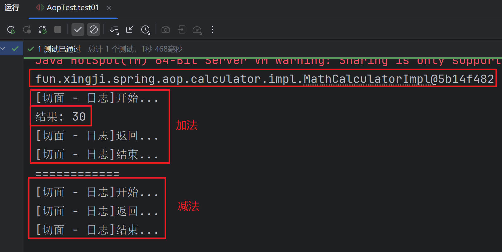


## AOP 细节

```java
1.切入点表达式更多写法
	https://docs.spring.io/spring-framework/reference/core/aop/ataspectj/pointcuts.html

2.通知方法&连接点
	前置通知、返回通知、异常通知、后置通知
	环绕通知 

3.多切面顺序
	@Order、多切面原理

4.扩展了解：@EnableAspectJAutoProxy
	暴露代理对象
	AopContext
```

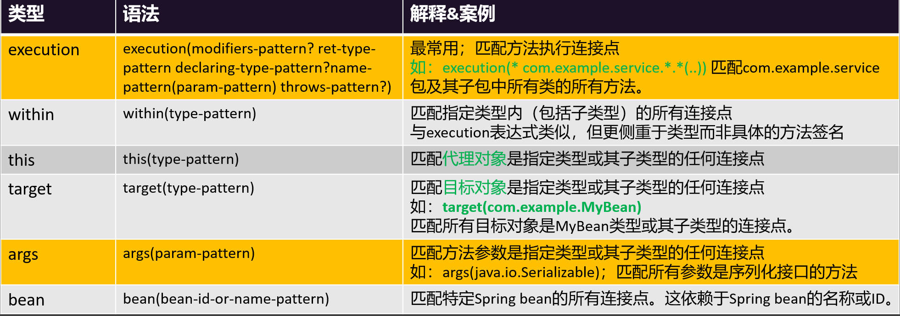

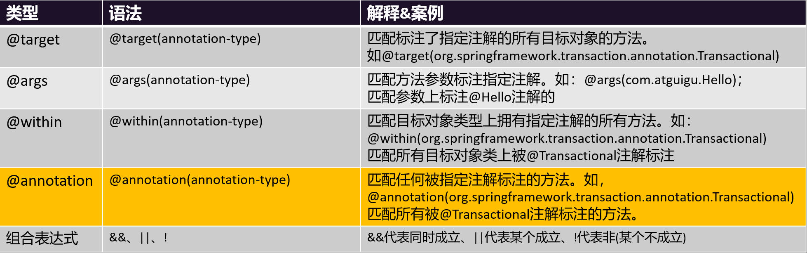


### 切入点表达式 - 通配符(execution)

|     类型      |                             语法                             |                          解释&案例                           |
| :-----------: | :----------------------------------------------------------: | :----------------------------------------------------------: |
| **execution** | **execution(modifiers-pattern?  ret-type-pattern declaring-type-pattern?name-pattern(param-pattern)  throws-pattern?)** | **最常用；匹配方法执行连接点**  **如：execution(\*  com.example.service.\*.\*(..))**  **匹配com.example.service包及其子包中所有类的所有方法。** |

::: tip 

```java
通配符：
	*：表示任意字符
	..：
		1）、参数位置：表示多个参数，任意类型
		2）、类型位置：代表多个层级
	最省略: * *(..)
```

:::

+ **LogAspect.java**

```java
package fun.xingji.spring.aop.aspect;

import org.aspectj.lang.annotation.*;
import org.springframework.stereotype.Component;

@Component
@Aspect // 告诉Spring这个组件是个切面
public class LogAspect {

    /**
     * 1、告诉Spring，以下通知何时何地运行？
     *      何时？
     *         @Before：方法执行之前运行。
     *         @AfterReturning：方法执行正常返回结果运行。
     *         @AfterThrowing：方法抛出异常运行。
     *         @After：方法执行之后运行
     *      何地？
     *         切入点表达式：
     *           execution(方法的全签名)：
     *             全写法：[public] int [fun.xingji.spring.aop.calculator.MathCalculator].add(int,int) [throws ArithmeticException]
     *             省略写法：int add(int i,int j)
     *             通配符：
     *               *：表示任意字符
     *               ..：
     *                   1）、参数位置：表示多个参数，任意类型
     *                   2）、类型位置：代表多个层级
     *             最省略: * *(..)
     */


    @Before("execution(int fun.xingji.spring.aop.calculator.MathCalculator.*(..))")
    public void logStart(){
        System.out.println("[切面 - 日志]开始...");
    }

    @After("execution(int fun.xingji.spring.aop.calculator.MathCalculator.*(..))")
    public void logEnd(){
        System.out.println("[切面 - 日志]结束...");
    }

    @AfterReturning("execution(int fun.xingji.spring.aop.calculator.MathCalculator.*(..))")
    public void logReturn(){
        System.out.println("[切面 - 日志]返回...");
    }

    @AfterThrowing("execution(int fun.xingji.spring.aop.calculator.MathCalculator.*(..))")
    public void logException(){
        System.out.println("[切面 - 日志]异常...");
    }
}
```


### 切入点表达式 - 其他写法(args、@annotation)

+ **args**

|   类型   |          语法           |                          解释&案例                           |
| :------: | :---------------------: | :----------------------------------------------------------: |
| **args** | **args(param-pattern)** | **匹配方法参数是指定类型或其子类型的任何连接点**  **如：args(java.io.Serializable)；匹配所有参数是序列化接口的方法** |

> **参数`带什么`就`切什么`**

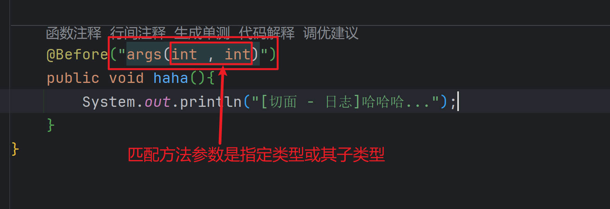

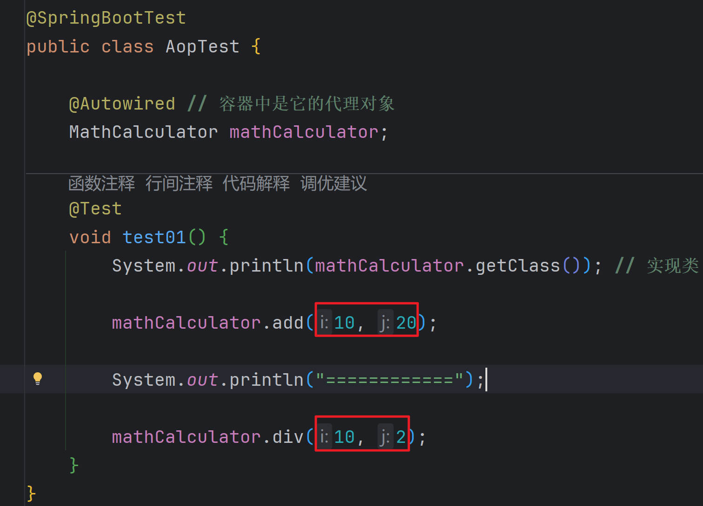

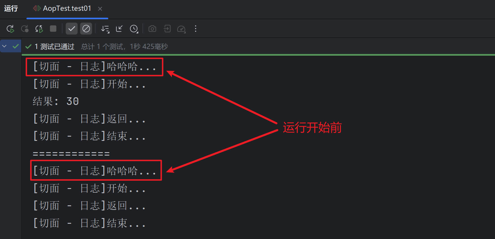


+ **@annotation(匹配任何被指定注解标注的方法)**

|      类型       |               语法               |                          解释&案例                           |
| :-------------: | :------------------------------: | :----------------------------------------------------------: |
| **@annotation** | **@annotation(annotation-type)** | **匹配任何被指定注解标注的方法。如，@annotation(org.springframework.transaction.annotation.Transactional)  匹配所有被@Transactional注解标注的方法。** |

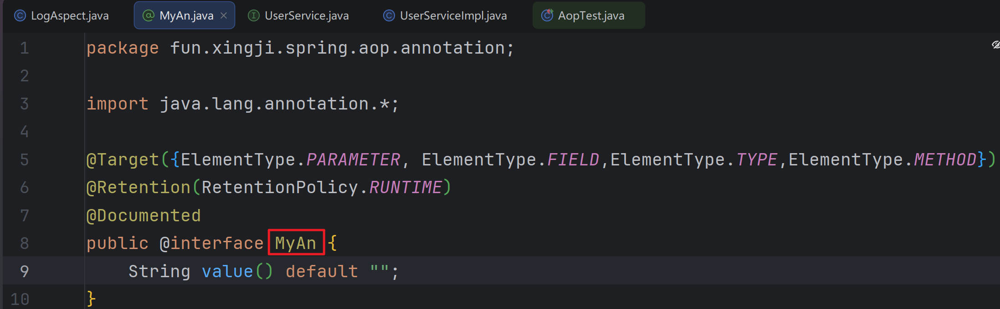

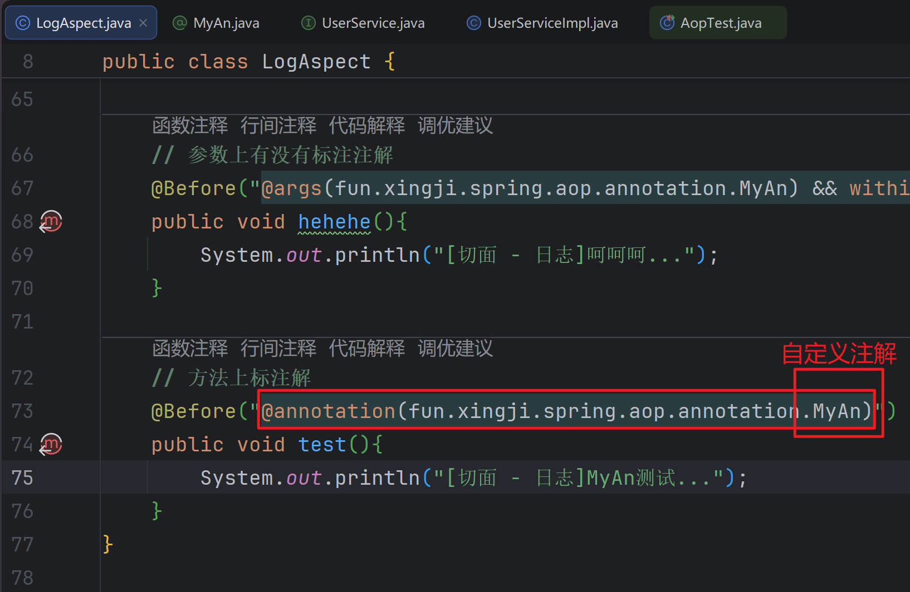

+ **UserService.java**

```java
package fun.xingji.spring.aop.service;

public interface UserService {

    void saveUser();

    void getUserhaha(int i, int j);

    void updateUser();
}
```


+ **UserServiceImpl.java**

```java
package fun.xingji.spring.aop.service.impl;

import fun.xingji.spring.aop.annotation.MyAn;
import fun.xingji.spring.aop.service.UserService;
import org.springframework.stereotype.Component;

@Component
public class UserServiceImpl implements UserService {

    @Override
    public void saveUser() {
        System.out.println("业务：保存用户");
    }

    @Override
    public void getUserhaha(int i, int j) {
        System.out.println("业务：查询用户");
    }
    
    @MyAn
    @Override
    public void updateUser() {
        System.out.println("哈哈哈.....有@MyAn");
    }
}
```


+ **测试:**

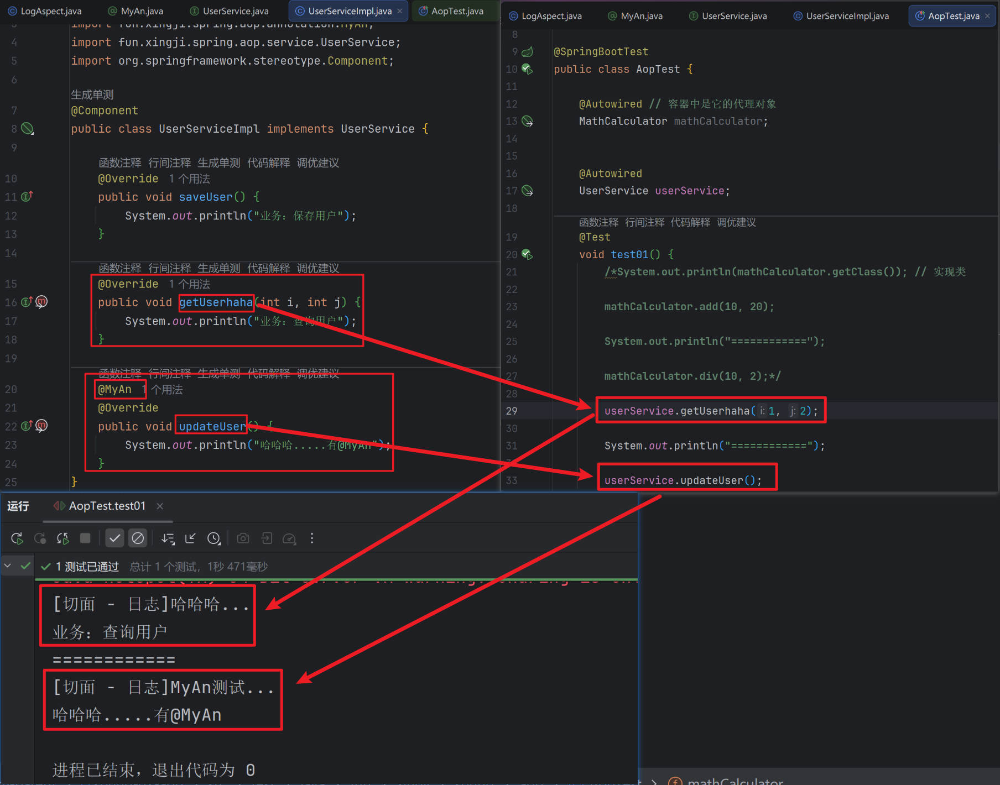


### 组件在容器中其实是代理对象

```java
1.增强器链： 切面中的所有通知方法其实就是增强器。他们被组织成一个链路放到集合中。目标方法真正执行前后，会去增强器链中执行哪些需要提前执行的方法。

2.AOP 的底层原理
	1、Spring会为每个被切面切入的组件创建代理对象(Spring CGLIB 创建的代理对象，无视接口)。
	2、代理对象中保存了切面类里面所有通知方法构成的增强器链。
	3、目标方法执行时，会先去执行增强器链中拿到需要提前执行的通知方法去执行
```

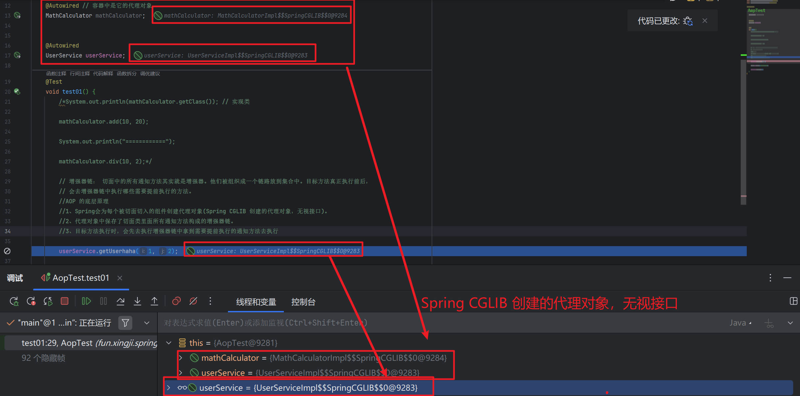


### 通知方法执行流程

::: tip 

> **通知方法的执行顺序**

+ **正常：前置通知 ==》目标方法 ==》返回通知 ==》后置通知**

+ **异常：前置通知 ==》目标方法 ==》异常通知 ==》后置通知**

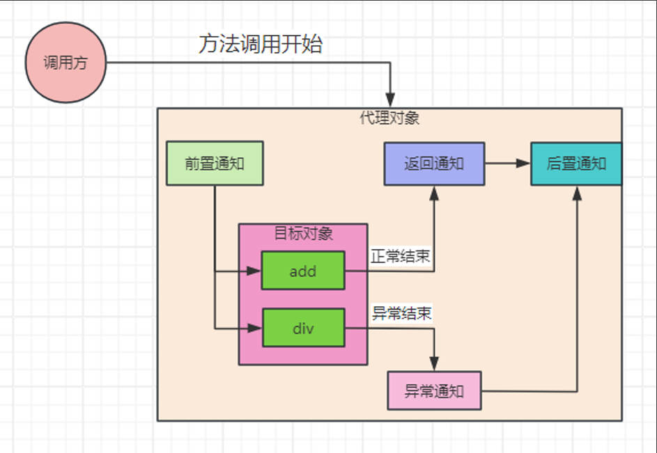

:::

+ **正常：前置通知 ==》目标方法 ==》返回通知 ==》后置通知**

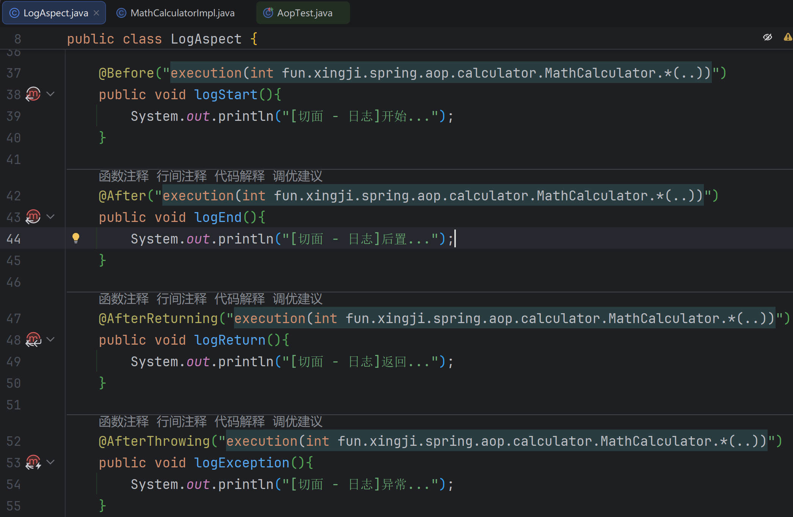

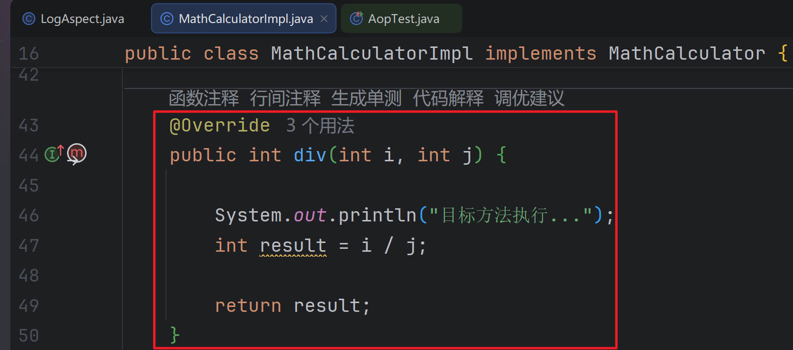

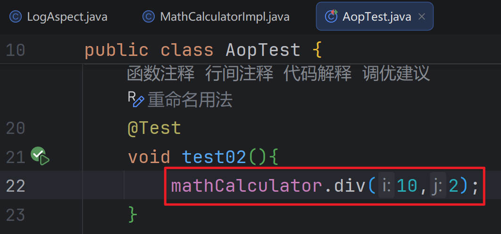

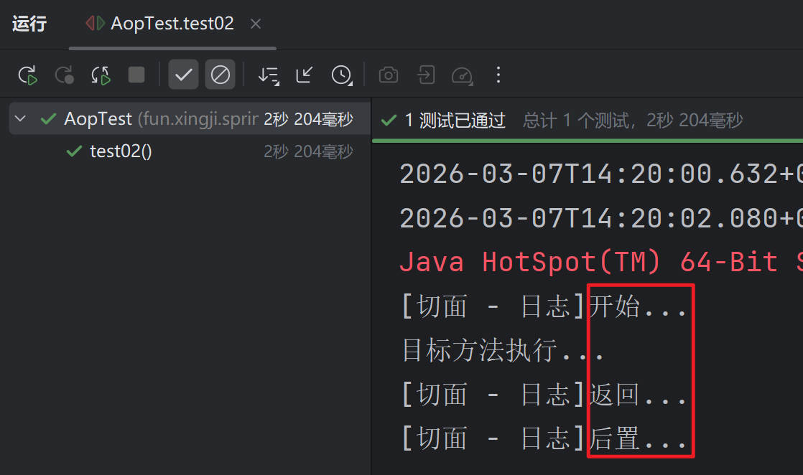


+ **异常：前置通知 ==》目标方法 ==》异常通知 ==》后置通知**


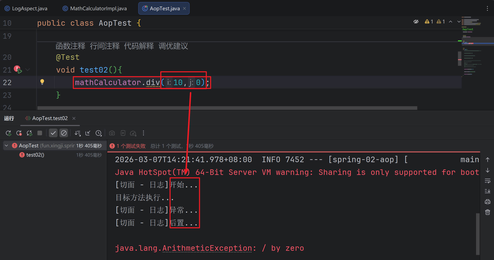


### JoinPoint连接点信息

> **包装了当前`目标方法的所有信息`**

+ **LogAspect.java**

```java
/**
    JoinPoint： 包装了当前目标方法的所有信息
*/
@Before("execution(int fun.xingji.spring.aop.calculator.MathCalculator.*(..))")
    public void logStart(JoinPoint joinPoint){
        //1、拿到方法全签名
        MethodSignature signature = (MethodSignature) joinPoint.getSignature();

        //方法名
        String name = signature.getName();
        //目标方法传来的参数值
        Object[] args = joinPoint.getArgs();

        System.out.println("【切面 - 日志】【"+name+"】开始：参数列表：【"+ Arrays.toString(args) +"】");
    }

    @After("execution(int fun.xingji.spring.aop.calculator.MathCalculator.*(..))")
    public void logEnd(JoinPoint joinPoint){
        MethodSignature signature = (MethodSignature) joinPoint.getSignature();
        String name = signature.getName();
        System.out.println("【切面 - 日志】【"+name+"】后置...");
    }


    @AfterReturning(value = "execution(int fun.xingji.spring.aop.calculator.MathCalculator.*(..))",
            returning = "result") //returning="result" 获取目标方法返回值
    public void logReturn(JoinPoint joinPoint,Object result){
        MethodSignature signature = (MethodSignature) joinPoint.getSignature();

        String name = signature.getName();

        System.out.println("【切面 - 日志】【"+name+"】返回：值："+result);
    }


    @AfterThrowing(
            value = "execution(int fun.xingji.spring.aop.calculator.MathCalculator.*(..))",
            throwing = "e" //throwing="e" 获取目标方法抛出的异常
    )
    public void logException(JoinPoint joinPoint,Throwable e){
        MethodSignature signature = (MethodSignature) joinPoint.getSignature();
        String name = signature.getName();

        System.out.println("【切面 - 日志】【"+name+"】异常：错误信息：【"+e.getMessage()+"】");
    }
```

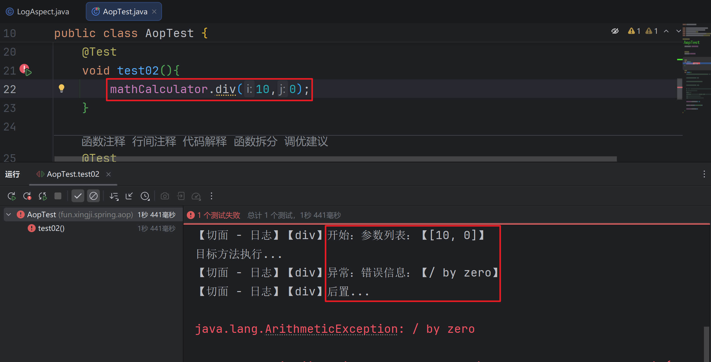


### Pointcut抽取切入点的表达式

+ **LogAspect.java**

```java
    @Pointcut("execution(int fun.xingji.spring.aop.calculator.MathCalculator.*(..))")
    public void pointCut(){}

    /**
    JoinPoint： 包装了当前目标方法的所有信息
     */

    @Before("pointCut()")
    public void logStart(JoinPoint joinPoint){
        //1、拿到方法全签名
        MethodSignature signature = (MethodSignature) joinPoint.getSignature();

        //方法名
        String name = signature.getName();
        //目标方法传来的参数值
        Object[] args = joinPoint.getArgs();

        System.out.println("【切面 - 日志】【"+name+"】开始：参数列表：【"+ Arrays.toString(args) +"】");
    }

    @After("pointCut()")
    public void logEnd(JoinPoint joinPoint){
        MethodSignature signature = (MethodSignature) joinPoint.getSignature();
        String name = signature.getName();
        System.out.println("【切面 - 日志】【"+name+"】后置...");
    }


    @AfterReturning(value = "pointCut()",
            returning = "result") //returning="result" 获取目标方法返回值
    public void logReturn(JoinPoint joinPoint,Object result){
        MethodSignature signature = (MethodSignature) joinPoint.getSignature();

        String name = signature.getName();

        System.out.println("【切面 - 日志】【"+name+"】返回：值："+result);
    }


    @AfterThrowing(
            value = "pointCut()",
            throwing = "e" //throwing="e" 获取目标方法抛出的异常
    )
    public void logException(JoinPoint joinPoint,Throwable e){
        MethodSignature signature = (MethodSignature) joinPoint.getSignature();
        String name = signature.getName();

        System.out.println("【切面 - 日志】【"+name+"】异常：错误信息：【"+e.getMessage()+"】");
    }
```


### 多切面执行顺序

::: tip 

> **按照切面的`优先级`，优先级`越高`，`越先执行`，越是代理的`最外层`**

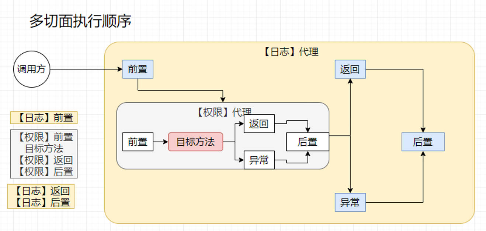

:::

```java
@Order(1) //数字越小，优先级越高，数字越大，优先级越低; 数字越小，越先执行，就必须套到最外层
```

+ **AuthAspect.java(权限)**

```java
package fun.xingji.spring.aop.aspect;


import org.aspectj.lang.annotation.*;
import org.springframework.core.annotation.Order;
import org.springframework.stereotype.Component;

@Order(100)
@Aspect
@Component
public class AuthAspect {

    @Pointcut("execution(int fun.xingji.spring.aop.calculator.MathCalculator.*(..))")
    public void pointCut(){};


    @Before("pointCut()")
    public void before(){
        System.out.println("【切面 - 权限】前置");
    }

    @After("pointCut()")
    public void after(){
        System.out.println("【切面 - 权限】后置");
    }

    @AfterReturning("pointCut()")
    public void afterReturning(){
        System.out.println("【切面 - 权限】返回");
    }

    @AfterThrowing("pointCut()")
    public void afterThrowing(){
        System.out.println("【切面 - 权限】异常");
    }

}
```


+ **LogAspect.java(日志)**

```java
package fun.xingji.spring.aop.aspect;

import org.aspectj.lang.JoinPoint;
import org.aspectj.lang.annotation.*;
import org.aspectj.lang.reflect.MethodSignature;
import org.springframework.core.annotation.Order;
import org.springframework.stereotype.Component;

import java.util.Arrays;

@Order(10000) //数字越小，优先级越高，数字越大，优先级越低; 数字越小，越先执行，就必须套到最外层
@Component
@Aspect // 告诉Spring这个组件是个切面
public class LogAspect {

    @Pointcut("execution(int fun.xingji.spring.aop.calculator.MathCalculator.*(..))")
    public void pointCut(){}


    @Before("pointCut()")
    public void logStart(JoinPoint joinPoint){
        //1、拿到方法全签名
        MethodSignature signature = (MethodSignature) joinPoint.getSignature();

        //方法名
        String name = signature.getName();
        //目标方法传来的参数值
        Object[] args = joinPoint.getArgs();

        System.out.println("【切面 - 日志】【"+name+"】开始：参数列表：【"+ Arrays.toString(args) +"】");
    }

    @After("pointCut()")
    public void logEnd(JoinPoint joinPoint){
        MethodSignature signature = (MethodSignature) joinPoint.getSignature();
        String name = signature.getName();
        System.out.println("【切面 - 日志】【"+name+"】后置...");
    }


    @AfterReturning(value = "pointCut()",
            returning = "result") //returning="result" 获取目标方法返回值
    public void logReturn(JoinPoint joinPoint,Object result){
        MethodSignature signature = (MethodSignature) joinPoint.getSignature();

        String name = signature.getName();

        System.out.println("【切面 - 日志】【"+name+"】返回：值："+result);
    }


    @AfterThrowing(
            value = "pointCut()",
            throwing = "e" //throwing="e" 获取目标方法抛出的异常
    )
    public void logException(JoinPoint joinPoint,Throwable e){
        MethodSignature signature = (MethodSignature) joinPoint.getSignature();
        String name = signature.getName();

        System.out.println("【切面 - 日志】【"+name+"】异常：错误信息：【"+e.getMessage()+"】");
    }
}
```

+ **测试:**

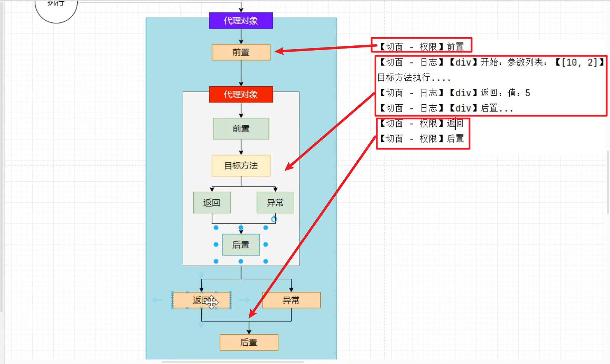


## AOP 环绕通知

> **`@Around`：环绕通知；可以控制`目标方法是否执行`，修改目标`方法参数`、`执行结果`等。**

+ **AroundAspect.java**

```java
package fun.xingji.spring.aop.aspect;

import org.aspectj.lang.ProceedingJoinPoint;
import org.aspectj.lang.annotation.Around;
import org.aspectj.lang.annotation.Aspect;
import org.aspectj.lang.annotation.Pointcut;
import org.springframework.stereotype.Component;

import java.util.Arrays;

@Aspect
@Component
public class AroundAspect {

    @Pointcut("execution(int fun.xingji.spring.aop.calculator.MathCalculator.*(..))")
    public void pointCut(){}

    /*
    环绕通知固定写法如下：
        Object: 返回值
        ProceedingJoinPoint: 可以继续推进的切点
     */
    @Around("pointCut()")
    public Object around(ProceedingJoinPoint pjp) throws Throwable {

        Object[] args = pjp.getArgs();// 获取目标方法的参数

        // 前置
        System.out.println("环绕 - 前置通知：参数" + Arrays.toString(args));
        Object proceed = null;
        try {
            // 接受传入参数的 procceed ，实现修改目标方法执行用的参数
            proceed = pjp.proceed();// 继续执行目标方法,反射 method.invoke();
            System.out.println("环绕 - 返回通知：返回值" + proceed);
        } catch (Exception e) {
            System.out.println("环绕 - 异常通知：" + e.getMessage());
            throw e; // 抛出异常，跳出环绕通知
        }finally {
            System.out.println("环绕 - 后置通知");
        }
        // 修改返回值
        return proceed;
    }
}
```

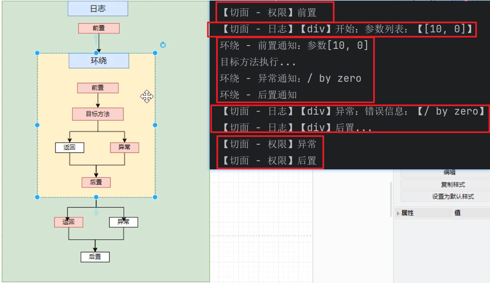


## AOP小结

```java
1.熟悉 切面与通知方法 编写；
普通通知
环绕通知
    
2.掌握 切入点表达式
execution()
@annotation()
    
3.理解 切面执行流程
	单切面：
		正常：前置 ==》目标 ==》返回 ==》后置
		异常：前置 ==》目标 ==》异常 ==》后置
	多切面：
		按照切面优先级，@Order指定优先级，数字越小，优先级越高，越是代理最外层
```


### AOP应用场景

```java
AOP 的使用场景：
1、日志记录【√】：
在不修改业务代码的情况下，为方法调用添加日志记录功能。这有助于跟踪方法调用的时间、参数、返回值以及异常信息等。

2、事务管理【√】：
在服务层或数据访问层的方法上应用事务管理，确保数据的一致性和完整性。通过AOP，可以自动地为需要事务支持的方法添加事务开始、提交或回滚的逻辑。

3、权限检查【√】：
在用户访问某些资源或执行某些操作之前，进行权限检查。通过AOP，可以在不修改业务逻辑代码的情况下，为方法调用添加权限验证的逻辑。

4、性能监控：专业框架
对方法的执行时间进行监控，以评估系统的性能瓶颈。AOP 可以帮助在不修改业务代码的情况下，为方法调用添加性能监控的逻辑。

5、异常处理【√】：
集中处理业务逻辑中可能抛出的异常，并进行统一的日志记录或错误处理。通过AOP，可以为方法调用添加异常捕获和处理的逻辑。

6、缓存管理【√】：
在方法调用前后添加缓存逻辑，以提高系统的响应速度和吞吐量。AOP 可以帮助实现缓存的自动加载、更新和失效等逻辑。

7、安全审计：
记录用户操作的历史记录，以便进行安全审计。通过AOP，可以在不修改业务逻辑代码的情况下，为方法调用添加安全审计的逻辑。

8、自动化测试：
在测试阶段，通过AOP为方法调用添加模拟（mock）或桩（stub）对象，以便进行单元测试或集成测试。
```
