## 属性绑定

::: tip 

**将容器中`任意组件`的`属性值`和`配置文件的配置项的值`进行绑定**

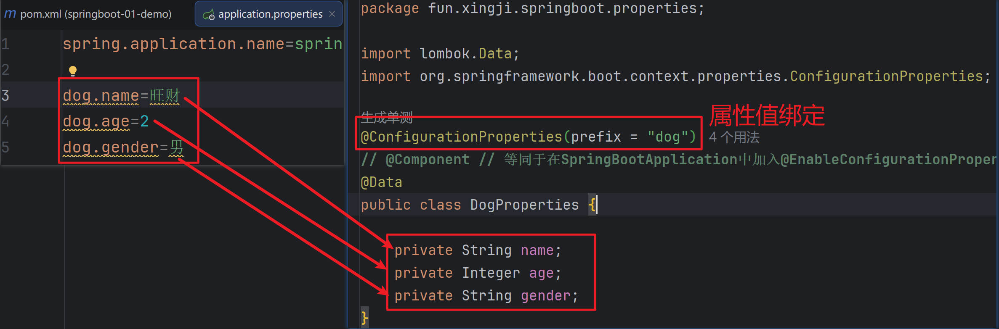

1、**给容器中注册组件`（@Component、@Bean）`**

2、**使用 `@ConfigurationProperties `声明组件和配置文件的`哪些配置项进行绑定`**

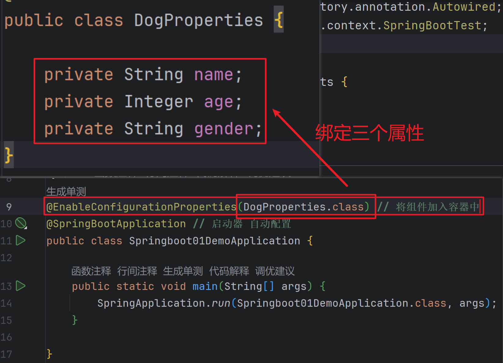

:::

+ **application.properties**

```properties
spring.application.name=springboot-01-demo

dog.name=旺财
dog.age=2
dog.gender=男
```


+ **DogProperties,java**

```java
package fun.xingji.springboot.properties;

import lombok.Data;
import org.springframework.boot.context.properties.ConfigurationProperties;

@ConfigurationProperties(prefix = "dog")
// @Component // 等同于在SpringBootApplication中加入@EnableConfigurationProperties(DogProperties.class)
@Data
public class DogProperties {

    private String name;
    private Integer age;
    private String gender;
}
```


+ **Springboot01DemoApplication.java**

```java
package fun.xingji.springboot;

import fun.xingji.springboot.properties.DogProperties;
import org.springframework.boot.SpringApplication;
import org.springframework.boot.autoconfigure.SpringBootApplication;
import org.springframework.boot.context.properties.EnableConfigurationProperties;


@EnableConfigurationProperties(DogProperties.class) // 将组件加入容器中
@SpringBootApplication // 启动器 自动配置
public class Springboot01DemoApplication {

    public static void main(String[] args) {
        SpringApplication.run(Springboot01DemoApplication.class, args);
    }

}
```


+ **Springboot01DemoApplicationTests.java**

```java
package fun.xingji.springboot;

import fun.xingji.springboot.properties.DogProperties;
import org.junit.jupiter.api.Test;
import org.springframework.beans.factory.annotation.Autowired;
import org.springframework.boot.test.context.SpringBootTest;

@SpringBootTest
class Springboot01DemoApplicationTests {

    @Autowired
    DogProperties dogProperties;

    @Test
    void contextLoads() {
        System.out.println("dogProperties" + dogProperties);
    }

}
```


+ **测试:**

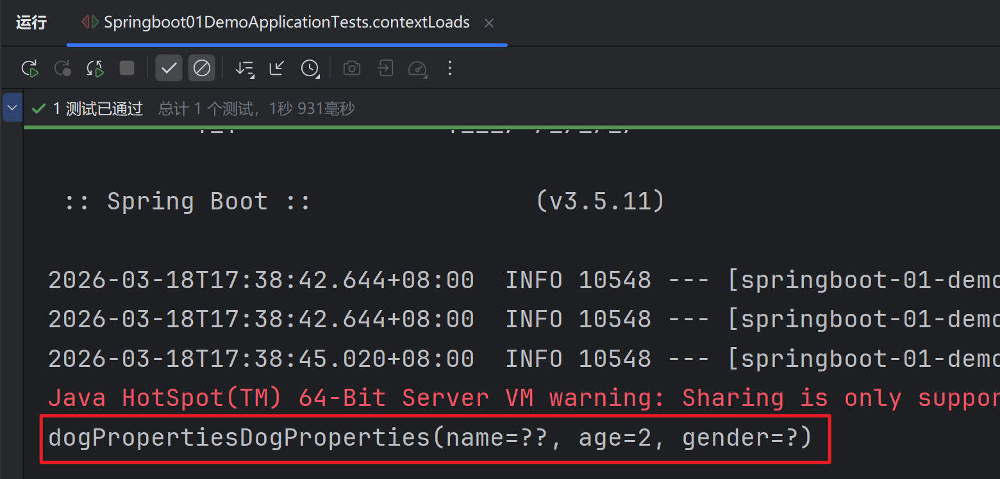


## YAML文件

::: tip 

**痛点：SpringBoot 集中化管理配置，application.properties**

**问题：配置多以后难阅读和修改，层级结构辨识度不高**

**YAML: YAML Ain't Markup Language™**

+ **设计目标，就是方便人类读写**

+ **层次分明，更适合做配置文件**

+ **使用.yaml或 .yml作为文件后缀**

:::

### 基础语法

::: tip 

1.**大小写敏感**

2.**键值对写法 k: v，使用空格分割k,v**

3.**使用缩进表示层级关系**

+ **缩进时不允许使用Tab键，只允许使用空格。换行**

+ **缩进的空格数目不重要，只要相同层级的元素左侧对齐即可**

4.**# 表示注释，从这个字符一直到行尾，都会被解析器忽略。**

5.**Value支持的写法**

+ **对象：键值对的集合，如：映射（map）/ 哈希（hash） / 字典（dictionary）**

+ **数组：一组按次序排列的值，如：序列（sequence） / 列表（list）**

+ **字面量：单个的、不可再分的值，如：字符串、数字、bool、日期**

:::

+ **Person.java**

```java
package fun.xingji.springboot.bean;

import lombok.Data;
import org.springframework.boot.context.properties.ConfigurationProperties;
import org.springframework.stereotype.Component;

import java.util.Date;
import java.util.List;
import java.util.Map;

@Data
@Component
@ConfigurationProperties(prefix = "person") // 配置文件中我们的配置文件必须要有的前缀
public class Person {
    private String name;
    private Integer age;
    private Date birthDay;
    private Boolean like;
    private Child child;
    private List<Dog> dogs;
    private Map<String, Cat> cats;
}

@Data
class Dog {
    private String name;
    private Integer age;
}

@Data
class Child {
    private String name;
    private Integer age;
    private Date birthDay;
    private List<String> text;
}

@Data
class Cat {
    private String name;
    private Integer age;
}
```


+ **application.yaml**

```yaml
# 如果yaml和properties 同时出现相同配置，则properties的优先级更高
person:
  name: 张三
  age: 20
  birth-day: 2019/03/04 12:00:00
  like: true
  child:
    name: 李四
    age: 18
    birth-day: 2019/03/04 12:00:00
    text: ["haa", "bbb", "ccc"]
  dogs:
    - name: 旺财
      age: 1
    - name: 旺财2
      age: 2
    - {name: 旺财3, age: 3}
  cats:
    bluecat:
      name: 蓝猫
      age: 1
    redcat:
      name: 红猫
      age: 2
    blackcat: {name: 黑猫, age: 3}
```

> **如果`yaml和properties`同时出现`相同配置`，则`properties的优先级更高`**

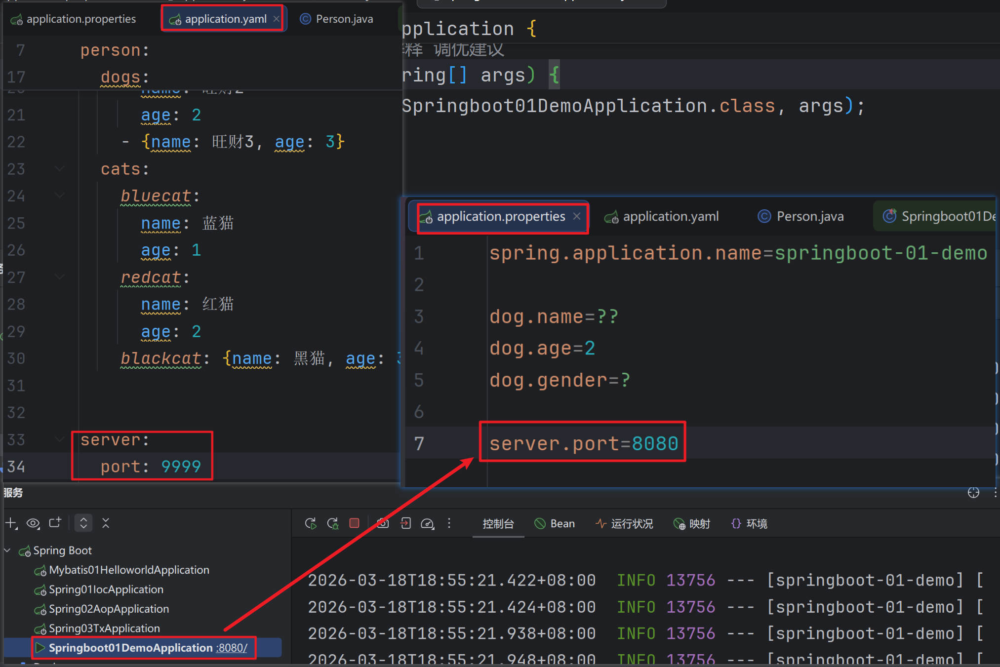


### 数据表示

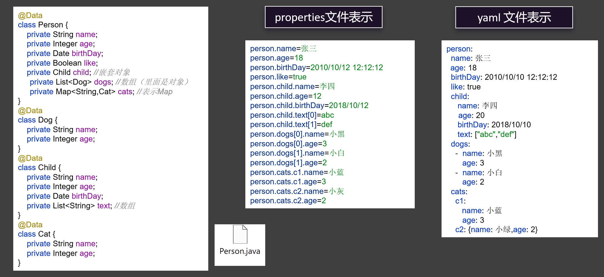


## SpringApplication

::: tip 

1.**自定义 banner**

+ **类路径添加banner.txt或设置spring.banner.location就可以定制banner**

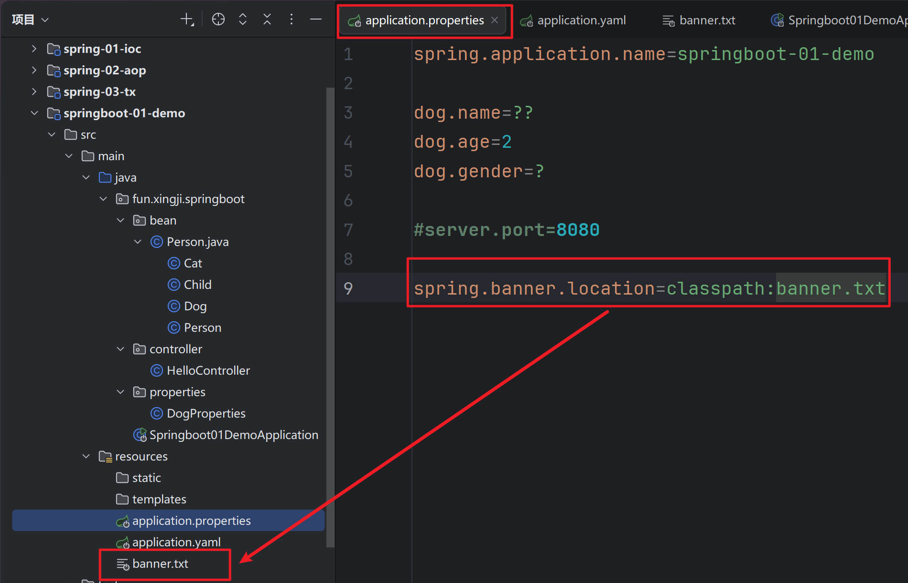

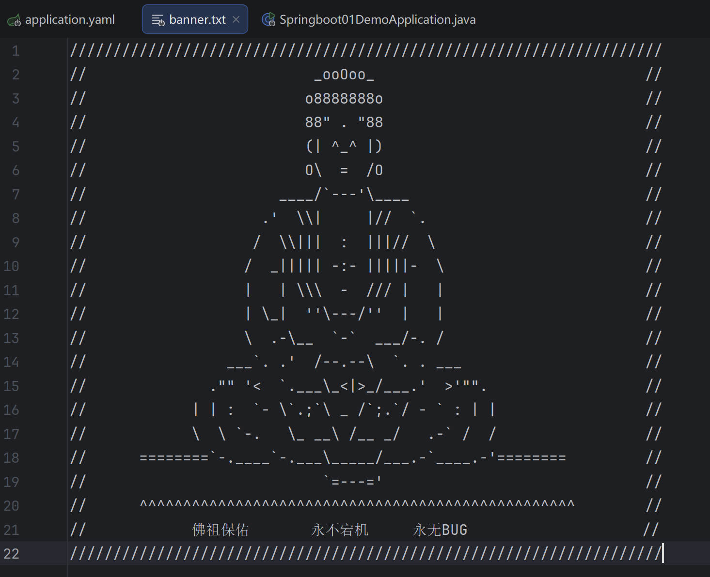

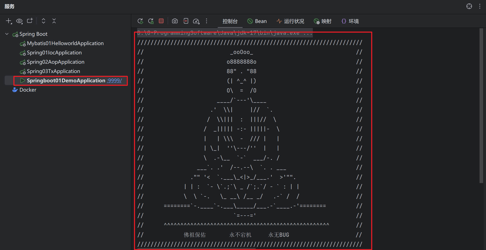

+ https://www.bootschool.net/ascii

2.**自定义 SpringApplication**

+ **new SpringApplication**

```java
package fun.xingji.springboot;

import fun.xingji.springboot.properties.DogProperties;
import org.springframework.boot.Banner;
import org.springframework.boot.SpringApplication;
import org.springframework.boot.autoconfigure.SpringBootApplication;
import org.springframework.boot.context.properties.EnableConfigurationProperties;


@EnableConfigurationProperties(DogProperties.class) // 将组件加入容器中
@SpringBootApplication // 启动器 自动配置
public class Springboot01DemoApplication {

    //1、以前： war 包； webapps
    public static void main(String[] args) {
        //应用启动
//        SpringApplication.run(Springboot01DemoApplication.class, args);

        //1、创建SpringApplication对象
        SpringApplication application = new SpringApplication(Springboot01DemoApplication.class);

        //3、关闭banner
        application.setBannerMode(Banner.Mode.OFF);
        //4、设置监听器
//          application.setListeners();
        //5、设置环境
//          application.setEnvironment();

        //2、启动
        application.run(args);
    }
}
```

+ **new SpringApplicationBuilder**

```java
package fun.xingji.springboot;

import fun.xingji.springboot.properties.DogProperties;
import org.springframework.boot.Banner;
import org.springframework.boot.autoconfigure.SpringBootApplication;
import org.springframework.boot.builder.SpringApplicationBuilder;
import org.springframework.boot.context.properties.EnableConfigurationProperties;


@EnableConfigurationProperties(DogProperties.class) // 将组件加入容器中
@SpringBootApplication // 启动器 自动配置
public class Springboot01DemoApplication {

    //1、以前： war 包； webapps
    public static void main(String[] args) {
        //应用启动
//        SpringApplication.run(Springboot01DemoApplication.class, args);

        SpringApplicationBuilder builder = new SpringApplicationBuilder();

        //链式调用
        builder
                .sources(Springboot01DemoApplication.class)
                .bannerMode(Banner.Mode.CONSOLE)
                .environment(null)
//                .listeners(null)
                .run(args);
    }
}
```

:::


## 日志系统


### 简介

::: tip

**规范：项目开发`不要写System.out.println()`，用`日志记录`信息**

**SpringBoot 默认使用`slf4j + logback`**

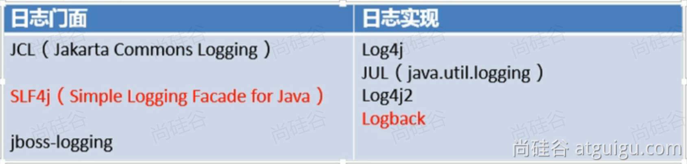

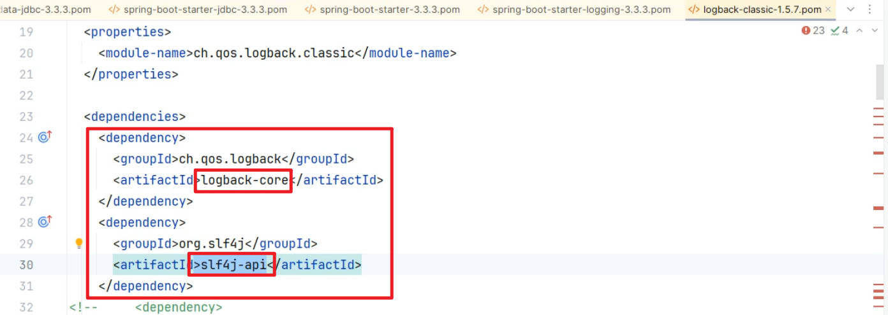

:::


### 日志格式

::: tip

1.**默认输出格式：**

+ **时间和日期：毫秒级精度**

+ **日志级别：ERROR, WARN, INFO, DEBUG, or TRACE.**

+ **进程 ID**

+ **---： 消息分割符**

+ **线程名： 使用[]包含**

+ **Logger 名： 通常是产生日志的类名**

+ **消息： 日志记录的内容**

2.**注意：logback 没有FATAL级别，对应的是ERROR**

:::

+ **LogTest.java**

```java
package fun.xingji.springboot;

import lombok.extern.slf4j.Slf4j;
import org.junit.jupiter.api.Test;
import org.springframework.boot.test.context.SpringBootTest;

@Slf4j
@SpringBootTest
public class LogTest {

    // 1.获取一个日志记录器
    // Logger logger = LoggerFactory.getLogger(LogTest.class);

    @Test
    void test01(){
        System.out.println("测试日志");

        // 2.记录日志
        log.trace("跟踪日志......");
        log.debug("调试日志......");
        log.info("信息日志......");
        log.warn("警告日志......");
        log.error("错误日志......");

        //格式： 时间  级别  进程id --- 项目名 --- 线程名 --- 当前类名: 日志内容
    }
}
```

```java
测试日志
2026-03-19T00:36:01.637+08:00  INFO 9792 --- [springboot-01-demo] [           main] fun.xingji.springboot.LogTest            : 信息日志......
    
2026-03-19T00:36:01.637+08:00  WARN 9792 --- [springboot-01-demo] [           main] fun.xingji.springboot.LogTest            : 警告日志......
    
2026-03-19T00:36:01.637+08:00 ERROR 9792 --- [springboot-01-demo] [           main] fun.xingji.springboot.LogTest            : 错误日志......
```


### 日志级别

::: tip 

1.**由低到高：`ALL,TRACE, DEBUG, INFO, WARN, ERROR,FATAL,OFF`；**

2.**只会打印指定级别及以上级别的日志**

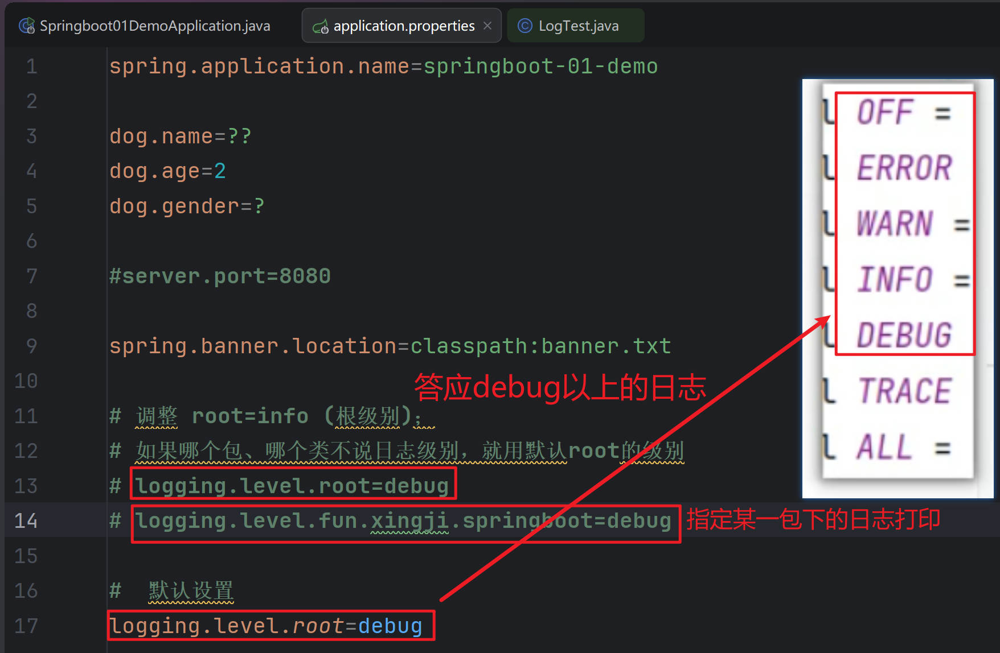

+ **ALL：打印所有日志**

+ **TRACE：追踪框架详细流程日志，一般不使用**

+ **DEBUG：开发调试细节日志**

+ **INFO：关键、感兴趣信息日志**

+ **WARN：警告但不是错误的信息日志，比如：版本过时**

+ **ERROR：业务错误日志，比如出现各种异常**

+ **FATAL：致命错误日志，比如jvm系统崩溃**

+ **OFF：关闭所有日志记录**

3.**不指定级别的所有类，都使用`root 指定的级别`作为`默认级别`**


4.**SpringBoot日志默认级别是 INFO**

:::

+ **LogTest.java**

```java
package fun.xingji.springboot;

import lombok.extern.slf4j.Slf4j;
import org.junit.jupiter.api.Test;
import org.springframework.boot.test.context.SpringBootTest;

@Slf4j
@SpringBootTest
public class LogTest {

    // 1.获取一个日志记录器
    // Logger logger = LoggerFactory.getLogger(LogTest.class);

    @Test
    void test01(){
        System.out.println("测试日志");

        // 2.记录日志
        //级别：由低到高：ALL -- TRACE -- DEBUG -- INFO -- WARN -- ERROR -- OFF
        //越打印，越粗糙； 日志有一个默认级别（INFO）；只会打印这个级别之上的所有信息；

        log.trace("跟踪日志......");
        log.debug("调试日志......");
        log.info("信息日志......");
        log.warn("警告日志......");
        log.error("错误日志......");

        //格式： 时间  级别  进程id --- 项目名 --- 线程名 --- 当前类名: 日志内容
    }
}
```

```java
测试日志
2026-03-19T01:13:30.695+08:00 DEBUG 11224 --- [springboot-01-demo] [           main] fun.xingji.springboot.LogTest            : 调试日志......
    
2026-03-19T01:13:30.695+08:00  INFO 11224 --- [springboot-01-demo] [           main] fun.xingji.springboot.LogTest            : 信息日志......
    
2026-03-19T01:13:30.695+08:00  WARN 11224 --- [springboot-01-demo] [           main] fun.xingji.springboot.LogTest            : 警告日志......
    
2026-03-19T01:13:30.695+08:00 ERROR 11224 --- [springboot-01-demo] [           main] fun.xingji.springboot.LogTest            : 错误日志......
```


+ **debug时的用法**

```java
package fun.xingji.springboot;

import lombok.extern.slf4j.Slf4j;
import org.junit.jupiter.api.Test;
import org.springframework.boot.test.context.SpringBootTest;

@Slf4j
@SpringBootTest
public class LogTest {

    // 1.获取一个日志记录器
    // Logger logger = LoggerFactory.getLogger(LogTest.class);

    @Test
    void test01(){
        //System.out.println("测试日志");

        // 2.记录日志
        //级别：由低到高：ALL -- TRACE -- DEBUG -- INFO -- WARN -- ERROR -- OFF
        //越打印，越粗糙； 日志有一个默认级别（INFO）；只会打印这个级别之上的所有信息；

        //格式： 时间  级别  进程id --- 项目名 --- 线程名 --- 当前类名: 日志内容


        log.trace("追踪日志......");
        if("1".equals(log)){
            log.debug("调试日志.......");
            //业务流程

            try {
                //关键点
                log.info("信息日志........");

                //容易出问题点
//                aa.bb(){
//                    log.warn("警告日志........");
//                };

            }catch (Exception e){
                log.error("错误日志......"+e.getMessage());
            }

        }
    }
}
```


### 日志分组

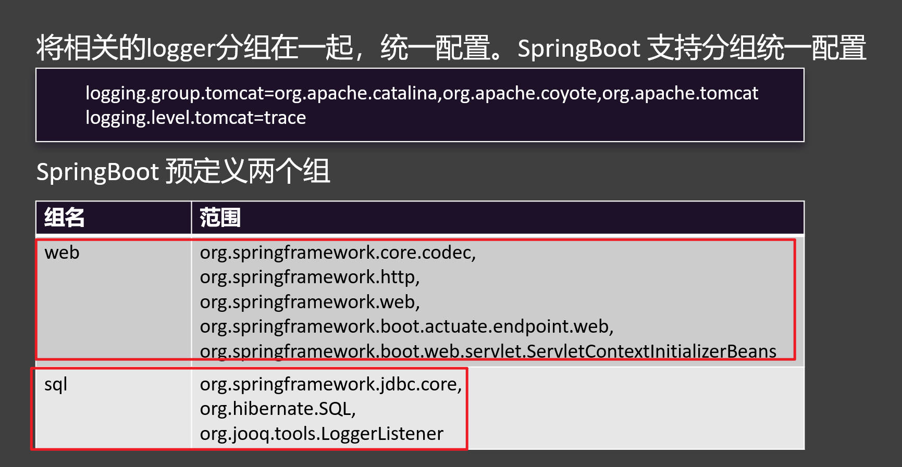

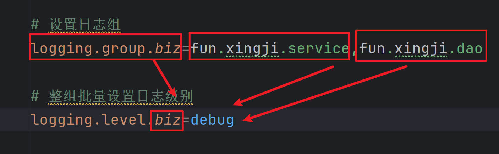


### 日志输出到文件

::: tip 

+ **SpringBoot 默认只把日志写在`控制台`，如果想额外`记录到文件`，可以在`application.properties`中添加`logging.file.name`或 `logging.file.path`配置项。**

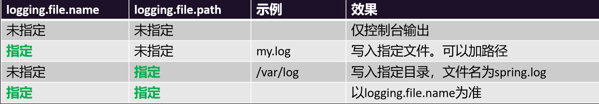

:::

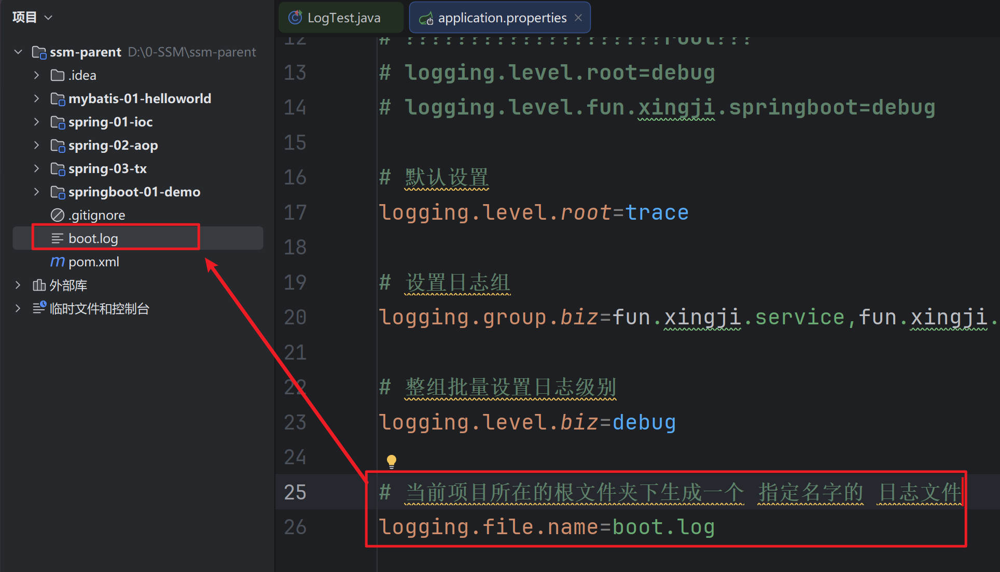

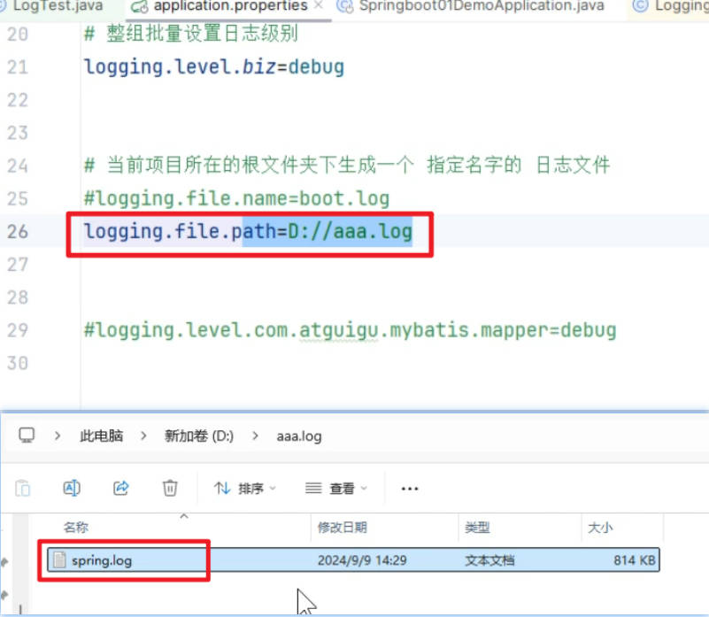

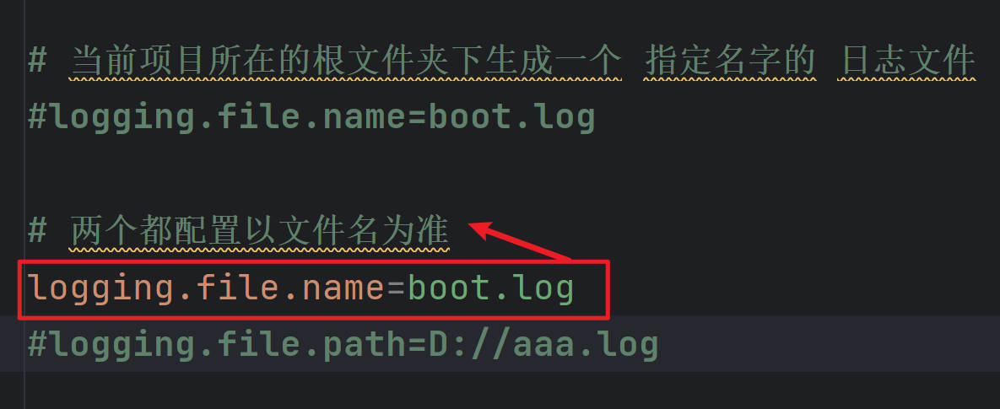


### 文件归档与滚动切割

::: tip 

+ **归档：每天的日志单独存到一个文档中。**

+ **切割：每个文件10MB，超过大小切割成另外一个文件。**

+ 默认**滚动切割**与归档规则如下：

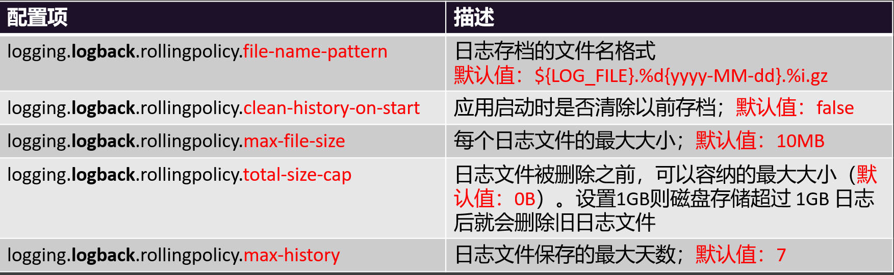

:::

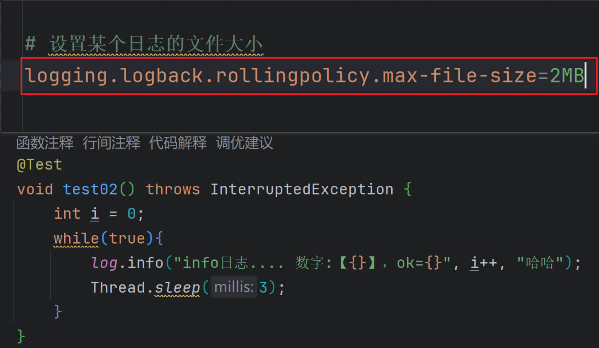

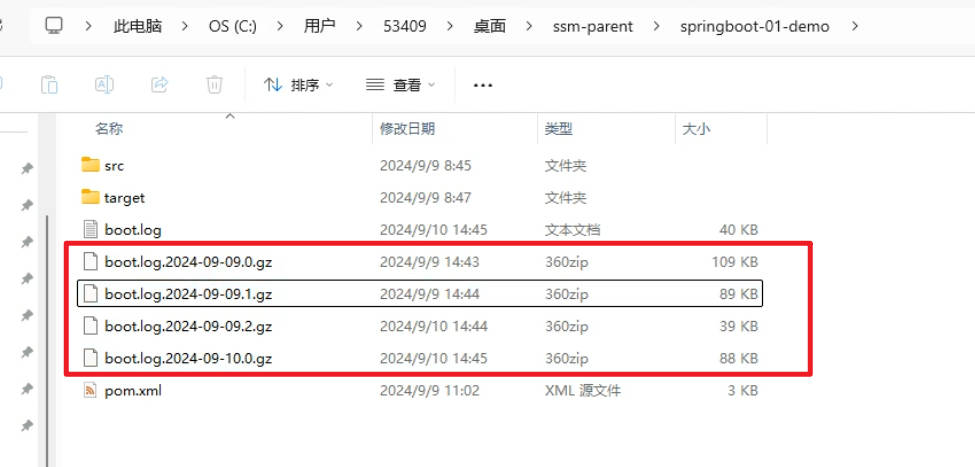


### 自定义配置(引入框架自己的日志配置文件)

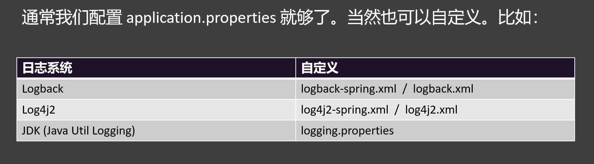

+ **logback.xml**

```xml
<configuration>

    <!-- 控制台应用器 -->
    <appender name="STDOUT" class="ch.qos.logback.core.ConsoleAppender">
        <encoder>
            <pattern>%d{yyyy-MM-dd HH:mm:ss} ~~~~~~~~ %msg%n</pattern>
        </encoder>
    </appender>

    <!-- 文件应用器 -->
    <appender name="FILE" class="ch.qos.logback.core.rolling.RollingFileAppender">
        <file>logs/myapp.log</file>
        <encoder>
            <pattern>%d{yyyy-MM-dd HH:mm:ss} ~~|||~~~ [%thread] %-5level %logger{36} ~~~~~ %msg%n</pattern>
        </encoder>
        <rollingPolicy class="ch.qos.logback.core.rolling.TimeBasedRollingPolicy">
            <fileNamePattern>logs/myapp.%d{yyyy-MM-dd}.%i.log</fileNamePattern>
            <timeBasedFileNamingAndTriggeringPolicy class="ch.qos.logback.core.rolling.SizeAndTimeBasedFNATP">
                <maxFileSize>100MB</maxFileSize>
            </timeBasedFileNamingAndTriggeringPolicy>
        </rollingPolicy>
    </appender>

    <!-- 日志级别 -->
    <root level="info">
        <appender-ref ref="STDOUT" />
        <appender-ref ref="FILE" />
    </root>

</configuration>
```

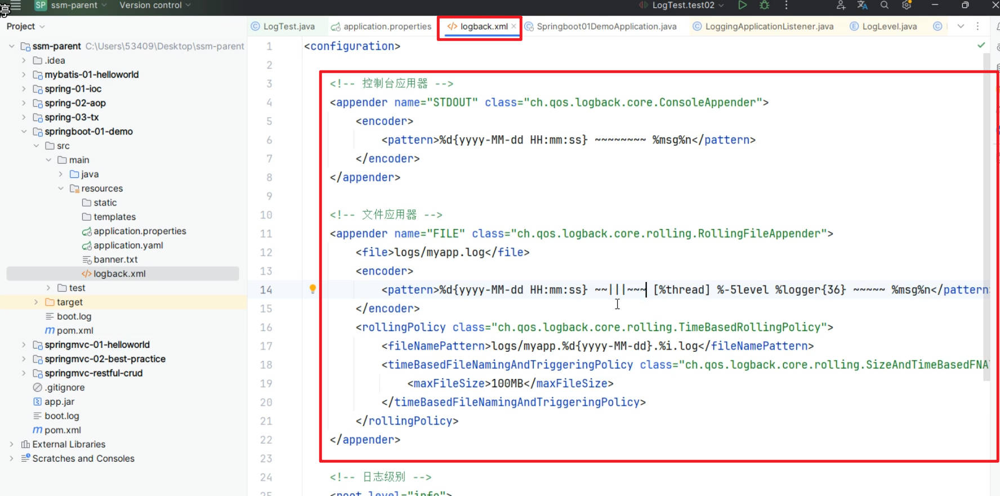

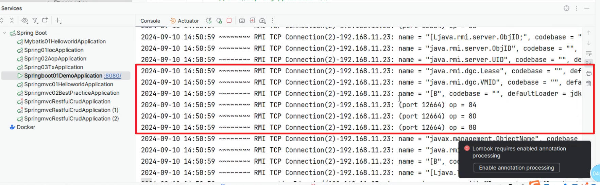

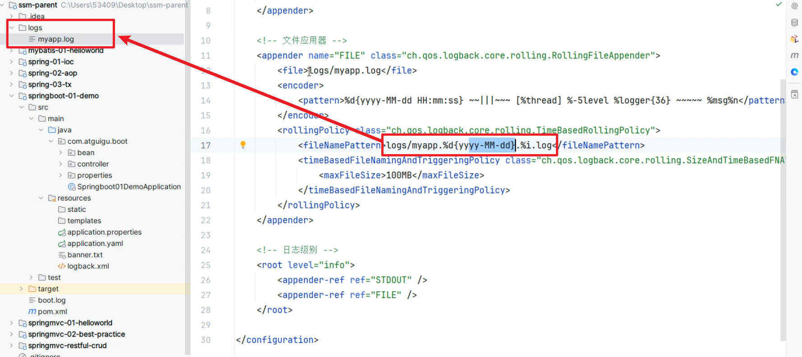


### 切换日志实现

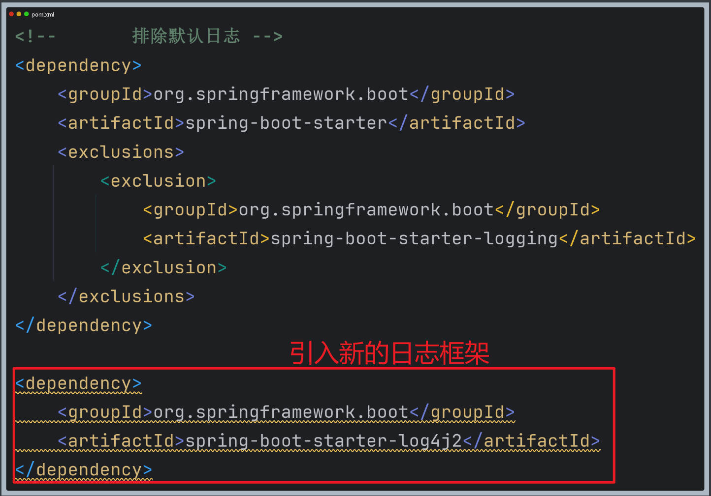

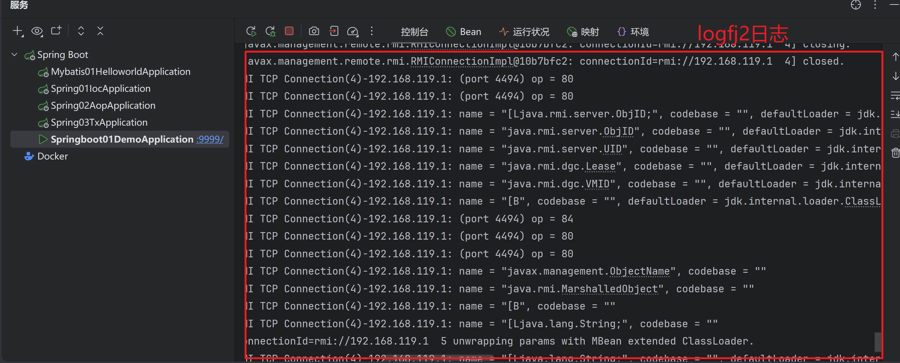


### 最佳实践

::: tip 

1、**导入任何第三方框架，先排除它的日志包，因为Boot底层控制好了日志**

2、**修改 application.properties 配置文件，就可以调整日志的所有行为。如果不够，可以编写日志框架自己的配置文件放在类路径下就行，比如logback-spring.xml，log4j2-spring.xml**

3、**如需对接专业日志系统，也只需要把 logback 记录的日志灌倒 kafka之类的中间件，这和SpringBoot没关系，都是日志框架自己的配置，修改配置文件即可**

4、**业务中使用slf4j-api记录日志。不要再 sout 了**

:::
