## 生命周期监听（了解）


### SpringApplicationRunListener监听器

::: tip 

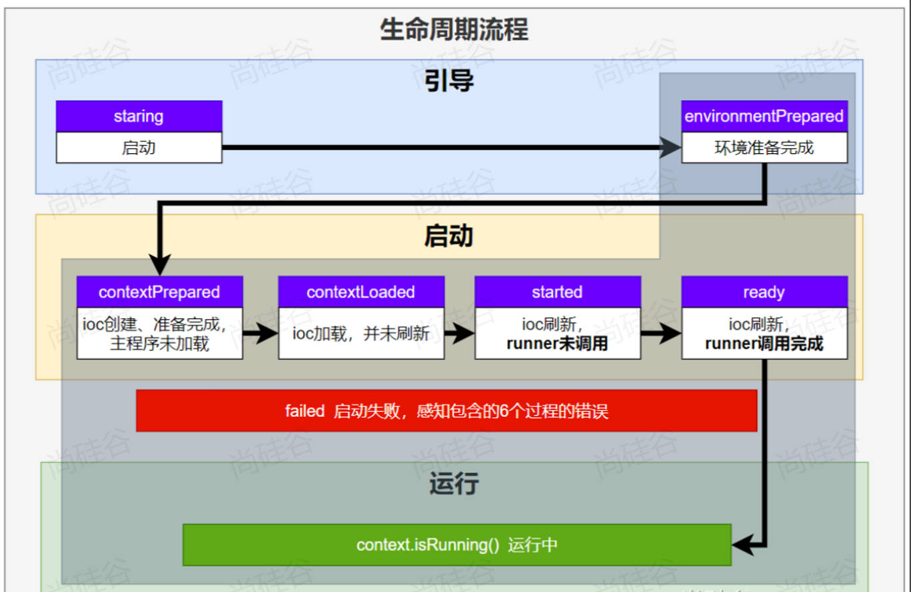

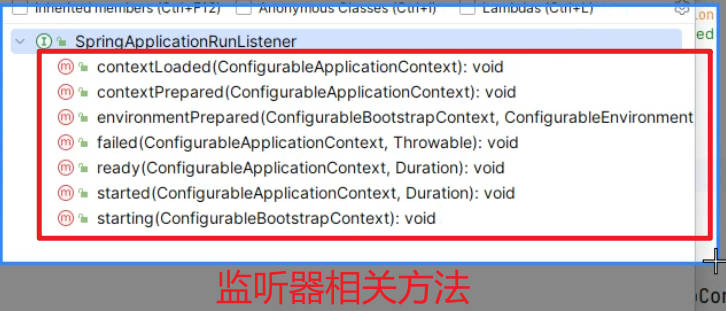

```properties
// 实现监听器接口方法
SpringApplicationRunListener

// 配置相关环境变量
META-INF/spring.factories
```

:::

+ **SpringApplicationRunListener(实现监听器接口方法)**

```java
package fun.xingji.springboot.listener;

import lombok.extern.slf4j.Slf4j;
import org.springframework.boot.ConfigurableBootstrapContext;
import org.springframework.boot.SpringApplicationRunListener;
import org.springframework.context.ConfigurableApplicationContext;
import org.springframework.core.env.ConfigurableEnvironment;

import java.time.Duration;

/**
 * 监听到SpringBoot启动的全生命周期
 */
@Slf4j
public class MyListener implements SpringApplicationRunListener {


    /**
     * Spring 应用刚启动，还未创建 ApplicationContext
     */
    @Override
    public void starting(ConfigurableBootstrapContext bootstrapContext) {
        System.out.println("MyListener...starting...");
    }

    /**
     * ApplicationContext 已创建完成，但还未完全刷新
     */
    @Override
    public void started(ConfigurableApplicationContext context, Duration timeTaken) {
        log.info("MyListener...started...");
    }

    /**
     * ApplicationContext 已完全刷新，应用已准备就绪，可以接收请求
     */
    @Override
    public void ready(ConfigurableApplicationContext context, Duration timeTaken) {
        log.info("MyListener...ready...");
    }

    /**
     * 启动失败时调用
     */
    @Override
    public void failed(ConfigurableApplicationContext context, Throwable exception) {
        log.info("MyListener...failed...");
    }

    /**
     * Environment 已准备好，但 ApplicationContext 还未创建
     */
    @Override
    public void environmentPrepared(ConfigurableBootstrapContext bootstrapContext, ConfigurableEnvironment environment) {
        log.info("MyListener...environmentPrepared...");
    }

    /**
     * ApplicationContext 已加载完成，但还未刷新
     */
    @Override
    public void contextLoaded(ConfigurableApplicationContext context) {
        log.info("MyListener...contextLoaded...");
    }

    /**
     * ApplicationContext 已准备好，但还未刷新
     */
    @Override
    public void contextPrepared(ConfigurableApplicationContext context) {
        log.info("MyListener...contextPrepared...");
    }
}
```


+ **META-INF/spring.factories(配置相关环境变量)**

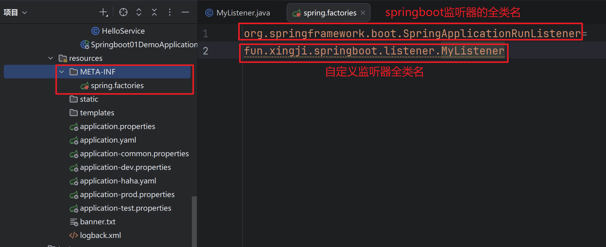

+ **测试:**

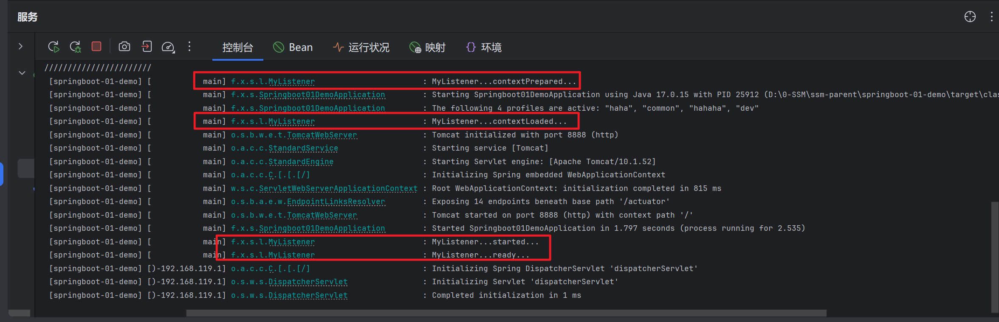


### 其他监听器

::: tip

**最佳实践：**

1、**应用启动后做事：`ApplicationRunner`、`CommandLineRunner`**

2、**事件驱动开发：`ApplicationListener`**

:::

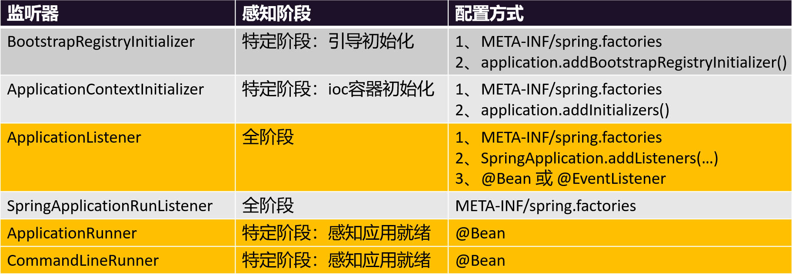

+ **Springboot01DemoApplication.java**

```java
@Bean
CommandLineRunner commandLineRunner() {
        return new CommandLineRunner() {
            @Override
            public void run(String... args) throws Exception {
                log.info("CommandLineRunner...run...");
                //在 Spring Boot 应用启动完成后，自动执行一次性的任务
                /*
                数据初始化
                预热缓存
                加载配置
                打印启动信息
                 */
           }
       };
}
```

+ **测试:**

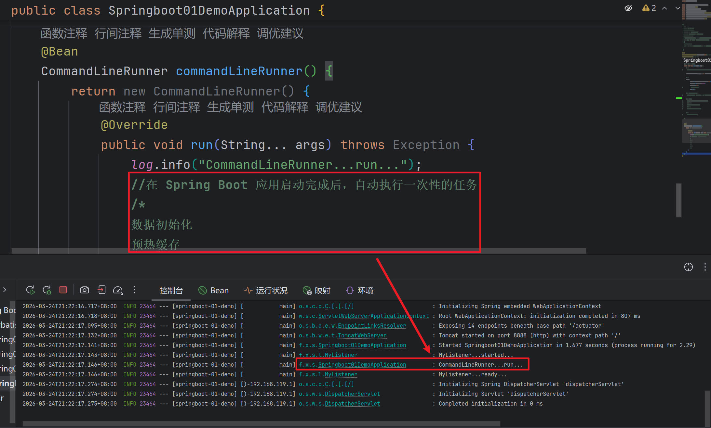


## 生命周期事件（了解）

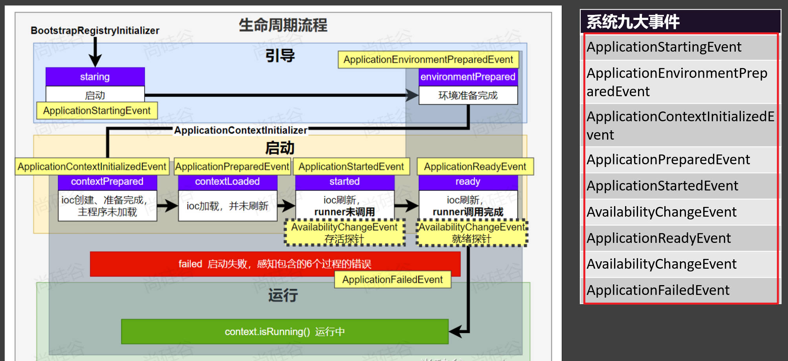

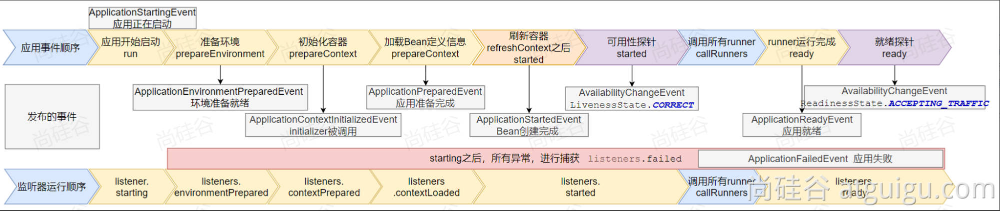


## 事件驱动开发（了解）

::: tip 

1.**应用启动过程生命周期事件感知（9大事件）**

2.**应用运行中事件感知（无数种）**

3.**事件驱动开发**

+ **定义事件：**
  + **任意事件：任意类可以作为事件类，建议命名 xxxEvent**
  + **系统事件：继承 ApplicationEvent**

+ **事件发布：**
  + **组件实现 ApplicationEventPublisherAware**
  + **自动注入 ApplicationEventPublisher**

+ **事件监听：**
  + **组件 + 方法标注@EventListener**

:::

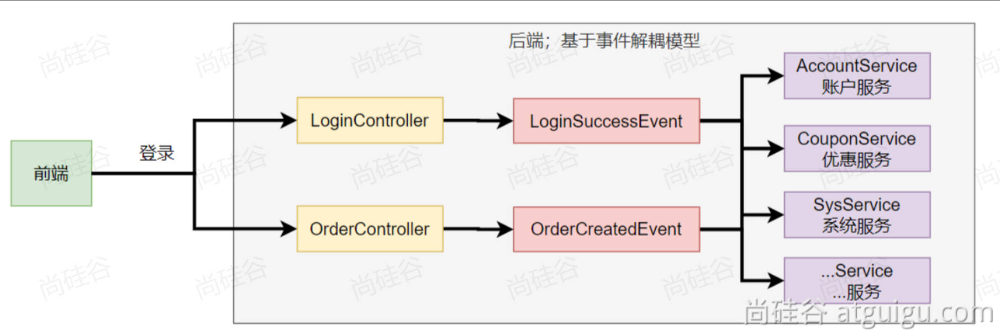

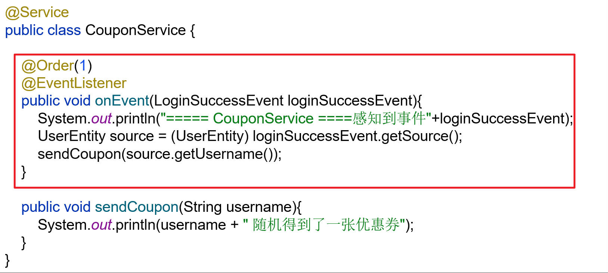

+ **UserPointsService.java(用户积分服务)**

```java
package fun.xingji.springboot.service;

import fun.xingji.springboot.event.UserLoginSuccessEvent;
import lombok.extern.slf4j.Slf4j;
import org.springframework.boot.context.event.ApplicationReadyEvent;
import org.springframework.context.event.EventListener;
import org.springframework.scheduling.annotation.Async;
import org.springframework.stereotype.Service;

@Slf4j
@Service // 用户积分服务
public class UserPointsService {

    @Async // 异步执行
    @EventListener(ApplicationReadyEvent.class)
    public void listen(UserLoginSuccessEvent event) {
        log.info("用户积分服务 == 监听到 UserLoginSuccessEvent 事件");
        givePoints(event.getUsername());
    }

    public void givePoints(String name) {
        log.info("用户[{}]获得积分", name);
    }
}
```


+ **CouponService.java(优惠券服务)**

```java
package fun.xingji.springboot.service;

import fun.xingji.springboot.event.UserLoginSuccessEvent;
import lombok.extern.slf4j.Slf4j;
import org.springframework.context.event.EventListener;
import org.springframework.scheduling.annotation.Async;
import org.springframework.stereotype.Service;

@Slf4j
@Service // 优惠券服务
public class CouponService {

    @Async // 异步执行
    @EventListener(UserLoginSuccessEvent.class)
    public void listen(UserLoginSuccessEvent event) {
        log.info("优惠券服务 = 监听到：UserLoginSuccessEvent 事件");
        String username = event.getUsername();
        // 调用业务
        giveCoupon(username);
    }

    public void giveCoupon(String name) {
        log.info("发放给用户[{}]一张优惠券", name);
    }
}
```


+ **UserLoginSuccessEvent.java**

```java
package fun.xingji.springboot.event;

import lombok.Data;

@Data //定义一个事件
public class UserLoginSuccessEvent {

    private String username;

    public UserLoginSuccessEvent(String username) {
        this.username = username;
    }
}
```


+ **UserController.java**

```java
package fun.xingji.springboot.controller;

import fun.xingji.springboot.event.UserLoginSuccessEvent;
import fun.xingji.springboot.service.CouponService;
import fun.xingji.springboot.service.UserPointsService;
import lombok.extern.slf4j.Slf4j;
import org.springframework.beans.factory.annotation.Autowired;
import org.springframework.context.ApplicationEventPublisher;
import org.springframework.stereotype.Controller;
import org.springframework.web.bind.annotation.GetMapping;

@Slf4j
@Controller
public class UserController {

    @Autowired
    CouponService couponService;

    @Autowired
    UserPointsService userPointsService;

    @Autowired
    ApplicationEventPublisher publisher; // 事件发布者

    //同步阻塞式；

    //事件/消息驱动；

    @GetMapping("/login")
    public String login(String username, String password) {
        // 执行登录
        log.info("用户[{}]登录系统", username);

        // 做事：同步调用
        UserLoginSuccessEvent event = new UserLoginSuccessEvent(username);
        // 发送事件
        publisher.publishEvent(event);

        // 执行任务
        // 1.加积分
//        userPointsService.givePoints(username);
        // 2.发放优惠券
//        couponService.giveCoupon(username);

        return "登录成功";
    }
}
```

+ **测试:**

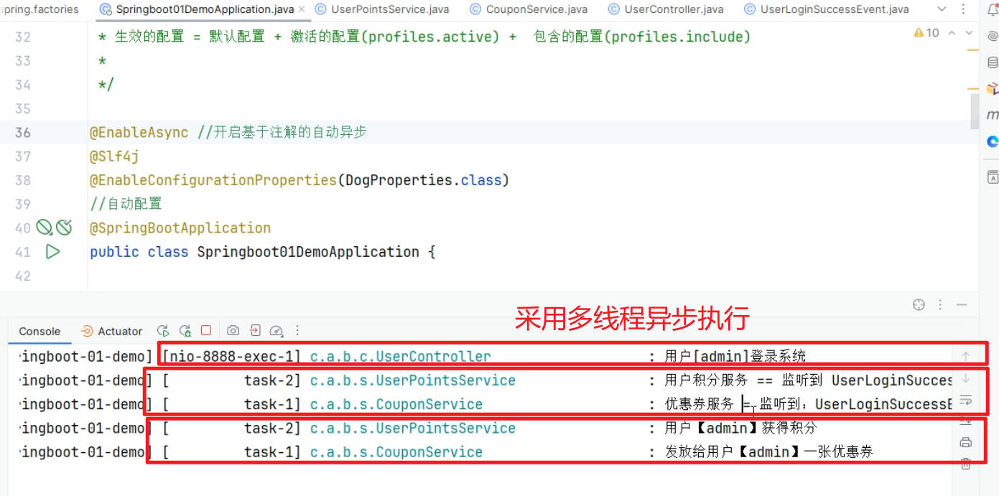


## 自动配置原理（熟悉）

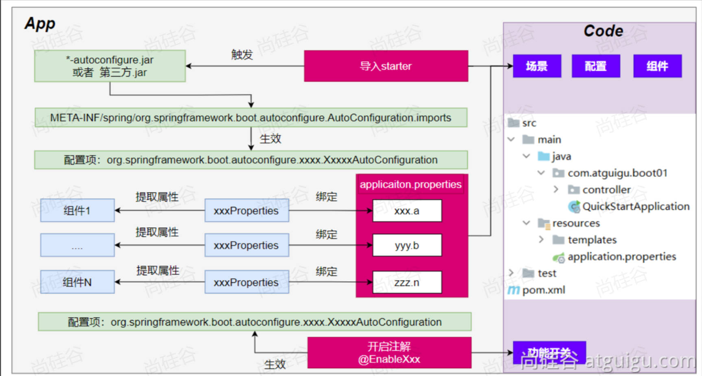

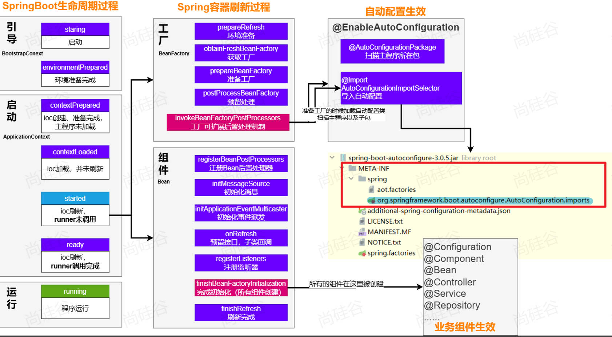
