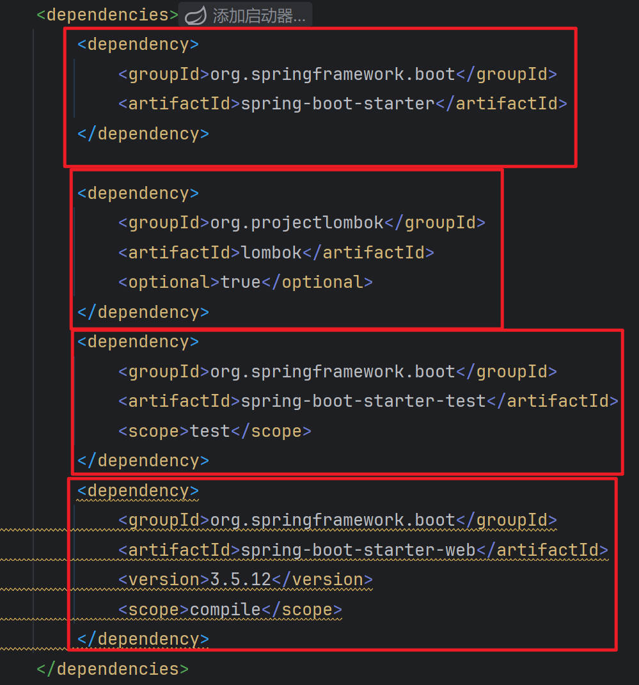
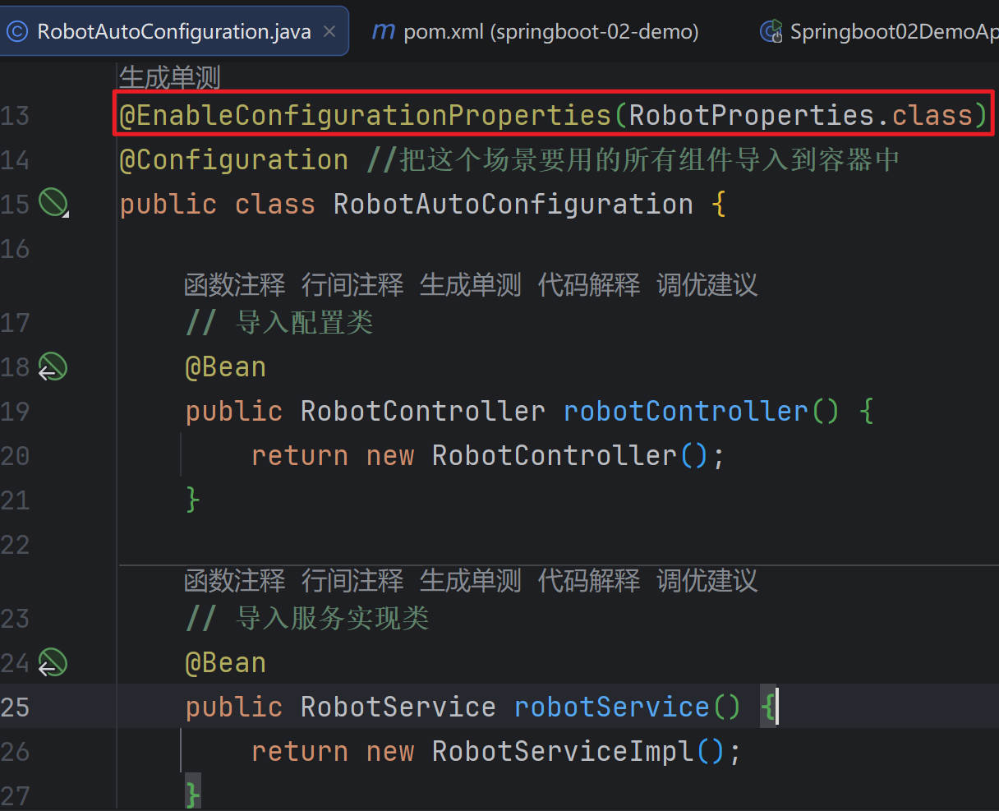
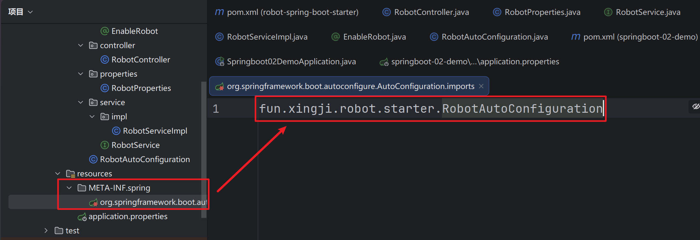
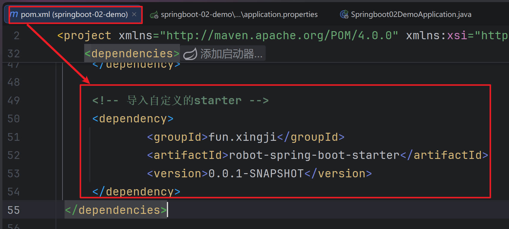
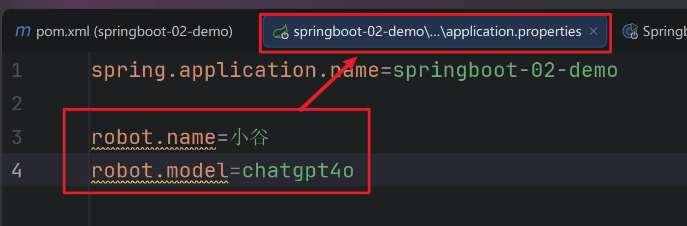
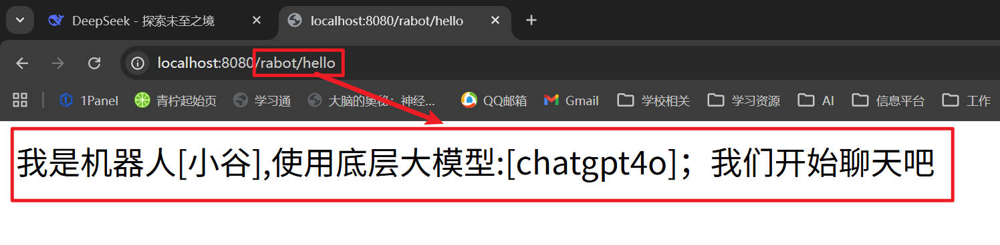
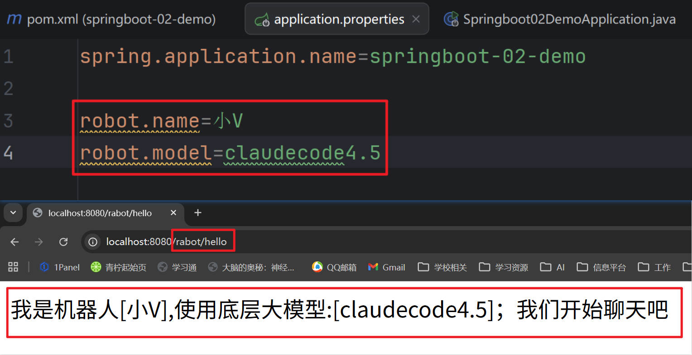

## 场景设计

::: tip 

**场景：抽取聊天机器人场景，它可以打招呼。**

**效果：任何项目导入`此starter都具有打招呼功能`，并且`问候语中的人名`需要可以在`配置文件中修改`**

:::


## 基础抽取

::: tip 

1. **创建自定义starter项目，引入spring-boot-starter基础依赖**

2. **编写模块功能，引入模块所有需要的依赖。**

3. **编写xxxAutoConfiguration自动配置类，帮其他项目导入这个模块需要的所有组件**

:::

+ **创建自定义starter项目:**



+ **编写模块功能:**

+ **RobotController.java**

```java
package fun.xingji.robot.starter.controller;


import fun.xingji.robot.starter.service.RobotService;
import org.springframework.beans.factory.annotation.Autowired;
import org.springframework.web.bind.annotation.GetMapping;
import org.springframework.web.bind.annotation.RestController;

@RestController
public class RobotController {

    @Autowired
    RobotService robotService;

    @GetMapping("/rabot/hello")
    public String sayHello(){
        // 调用服务层的方法
        String msg = robotService.sayHello();
        return msg;
    }
}
```


+ **RobotProperties.java**

```java
package fun.xingji.robot.starter.properties;


import lombok.Data;
import org.springframework.boot.context.properties.ConfigurationProperties;
import org.springframework.stereotype.Component;

@Component
@ConfigurationProperties(prefix = "robot")
@Data
public class RobotProperties {

    // 机器人名称和型号
    private String name;
    private String model;
}
```


+ **RobotService.java**

```java
package fun.xingji.robot.starter.service;

public interface RobotService {

    // 打招呼方法
    public  String sayHello();
}
```


+ **RobotServiceImpl.java**

```java
package fun.xingji.robot.starter.service.impl;

import fun.xingji.robot.starter.properties.RobotProperties;
import fun.xingji.robot.starter.service.RobotService;
import org.springframework.beans.factory.annotation.Autowired;

public class RobotServiceImpl implements RobotService {

    @Autowired
    RobotProperties robotProperties;

    // 打招呼方法
    @Override
    public String sayHello() {
        return "我是机器人["+robotProperties.getName()+"],使用底层大模型:["+robotProperties.getModel()+"]；我们开始聊天吧";
    }
}
```


+ **编写RobotAutoConfiguration自动配置类:**

```java
package fun.xingji.robot.starter;


import fun.xingji.robot.starter.controller.RobotController;
import fun.xingji.robot.starter.properties.RobotProperties;
import fun.xingji.robot.starter.service.RobotService;
import fun.xingji.robot.starter.service.impl.RobotServiceImpl;
import org.springframework.boot.context.properties.EnableConfigurationProperties;
import org.springframework.context.annotation.Bean;
import org.springframework.context.annotation.Configuration;


@EnableConfigurationProperties(RobotProperties.class)
@Configuration //把这个场景要用的所有组件导入到容器中
public class RobotAutoConfiguration {

    // 导入配置类
    @Bean
    public RobotController robotController() {
        return new RobotController();
    }

    // 导入服务实现类
    @Bean
    public RobotService robotService() {
        return new RobotServiceImpl();
    }
}
```


## @EnableXx机制

::: tip 

1. **编写自定义 @EnableXxx 注解**

2. **@EnableXxx 导入 自动配置类**

3. **测试功能组件生效**

:::

+ **EnableRobot.java**

```java
package fun.xingji.robot.starter.annotation;

import fun.xingji.robot.starter.RobotAutoConfiguration;
import org.springframework.context.annotation.Import;

import java.lang.annotation.*;

@Target(ElementType.TYPE) // 用在类上
@Retention(RetentionPolicy.RUNTIME) // 运行时有效
@Documented // 生成文档
@Import(RobotAutoConfiguration.class) // 导入配置
public @interface EnableRobot {

}
```




## 完全自动配置

::: tip 

1、**依赖 SpringBoot 的 SPI 机制**

2、**META-INF/spring/org.springframework.boot.autoconfigure.AutoConfiguration.imports 文件中编写好我们自动配置类的全类名即可**

3、**项目启动，自动加载我们的自动配置类**

:::




+ **项目启动，自动加载我们的自动配置类**





+ **Springboot02DemoApplication.java**

```java
package fun.xingji.springboot;

import org.springframework.boot.SpringApplication;
import org.springframework.boot.autoconfigure.SpringBootApplication;

/**
 * spring-boot-start-web
 *
 * 为什么导入  robot-spring-boot-starter ，访问 controller 是 404？
 * 原因：主程序只会扫描到自己所在的包及其子包下的所有组件
 *
 * 自定义starter：
 * 1、第一层抽取：编写一个自动配置类，别人导入我的starter，
 *              无需关心需要给容器中导入哪些组件，只需要导入自动配置类，
 *              自动配置类帮你给容器中导入所有这个场景要用的组件
 *               @import(RobotAutoConfiguration.class)
 * 2、第二层抽取：只需要标注功能开关注解。@EnableRobot
 * 3、第三层抽取：只需要导入starter，所有功能就绪
 */
@SpringBootApplication
public class Springboot02DemoApplication {

    public static void main(String[] args) {
        SpringApplication.run(Springboot02DemoApplication.class, args);
    }
}
```




