## Profiles环境隔离（掌握）


### 基础用法

::: tip 

1.**环境隔离能力；快速切换开发、测试、生产环境**

2.**步骤：**

1. **标识环境：指定哪些组件、配置在哪个环境生效**
   + **@Profile 标记组件生效环境**

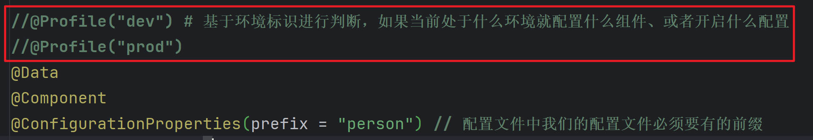

2. **切换环境：这个环境对应的所有组件和配置就应该生效**
   + **激活环境：**
     + **配置文件：spring.profiles.active=production,hsqldb**
     + **命令行：java -jar demo.jar --spring.profiles.active=dev,hsqldb**

+ **环境包含：**

```properties
spring.profiles.include[0]=common

spring.profiles.include[1]=local
```

+ **生效的配置 = 默认配置 + 激活的配置(profiles.active) +  包含的配置(profiles.include)**

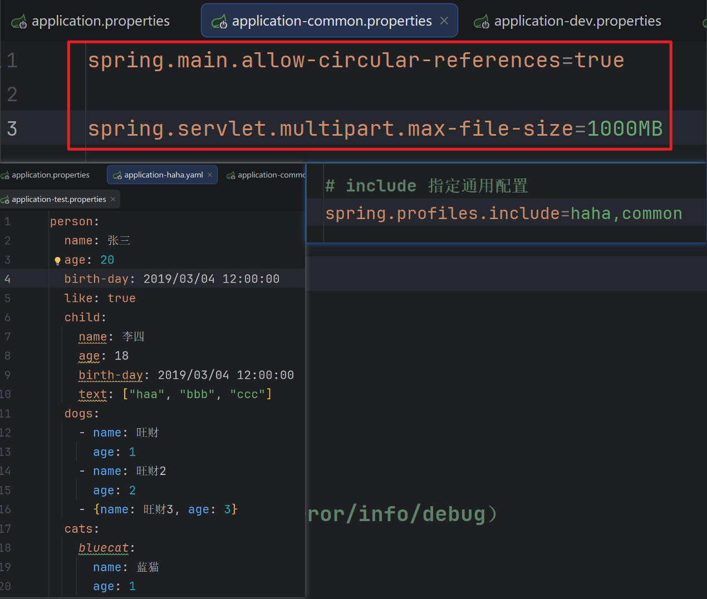

3.**项目里面这么用**

+ **基础的配置mybatis、log、xxx：写到包含环境中**

+ **需要动态切换变化的 db、redis：写到激活的环境中**

:::

```java
环境隔离：
1、定义环境： dev、test、prod；
    
2、定义这个环境下生效哪些组件或者哪些配置？
     1）、生效哪些组件： 给组件 @Profile("dev")
     2）、生效哪些配置： application-{环境标识}.properties
    
3、激活这个环境：这些组件和配置就会生效
     1）、application.properties:  配置项：spring.profiles.active=dev
     2）、命令行：java -jar xxx.jar --spring.profiles.active=dev

 注意：激活的配置优先级高于默认配置
 生效的配置 = 默认配置 + 激活的配置(profiles.active) +  包含的配置(profiles.include)
```


### 分组

::: tip 

1.**创建 prod 组，指定包含 db 和 mq 配置**

+ **spring.profiles.group.prod[0]=db**

+ **spring.profiles.group.prod[1]=mq**

2.**使用 --spring.profiles.active=prod ，激活prod，db，mq配置文件**

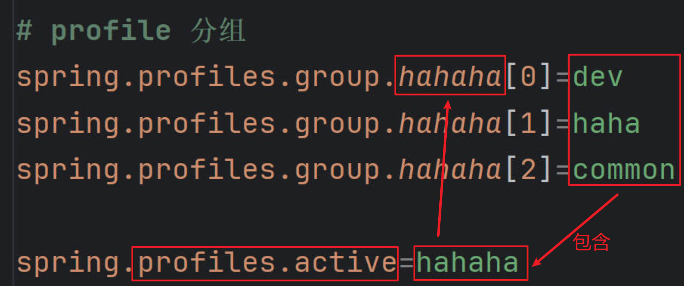

:::


### 配置文件

::: tip 

1.**application-{profile}.properties 可以作为指定环境的配置文件**

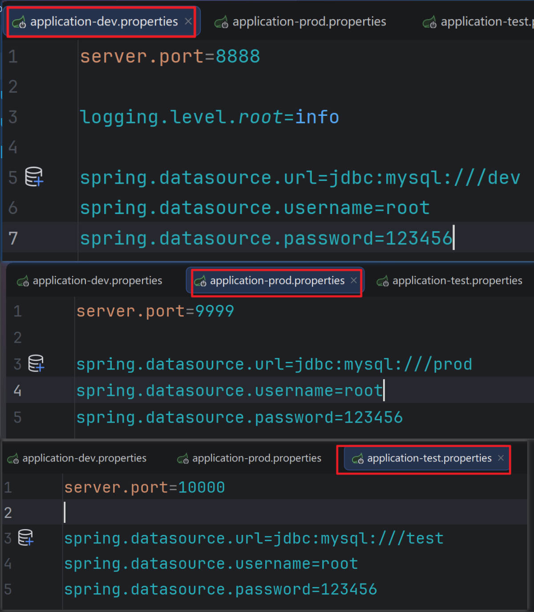

2.**激活这个环境，配置就会生效。最终生效的所有配置是**

+ **application.properties：主配置文件，任意时候都生效**

+ **application-{profile}.properties：指定环境配置文件，激活指定环境生效**

3.**`profile优先级` > `application`**

:::


## 外部化配置（掌握）

::: tip

```properties
属性占位符：
app.name=MyApp
app.description=${app.name} Hello
```

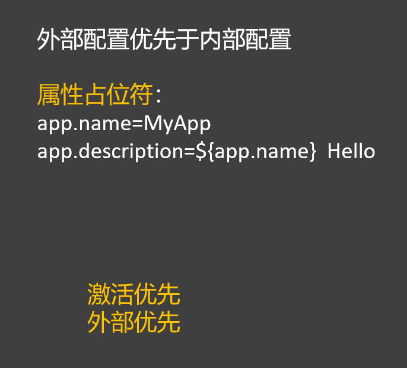

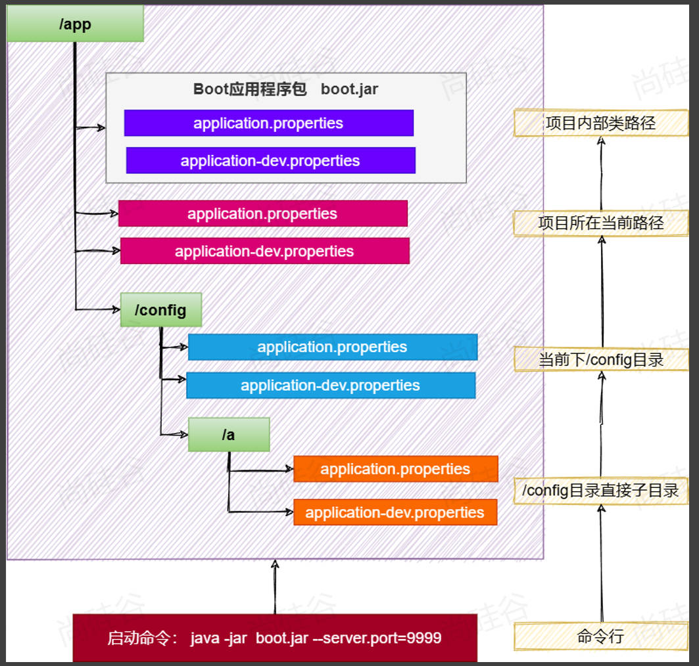

:::

+ **项目所在当前路径**

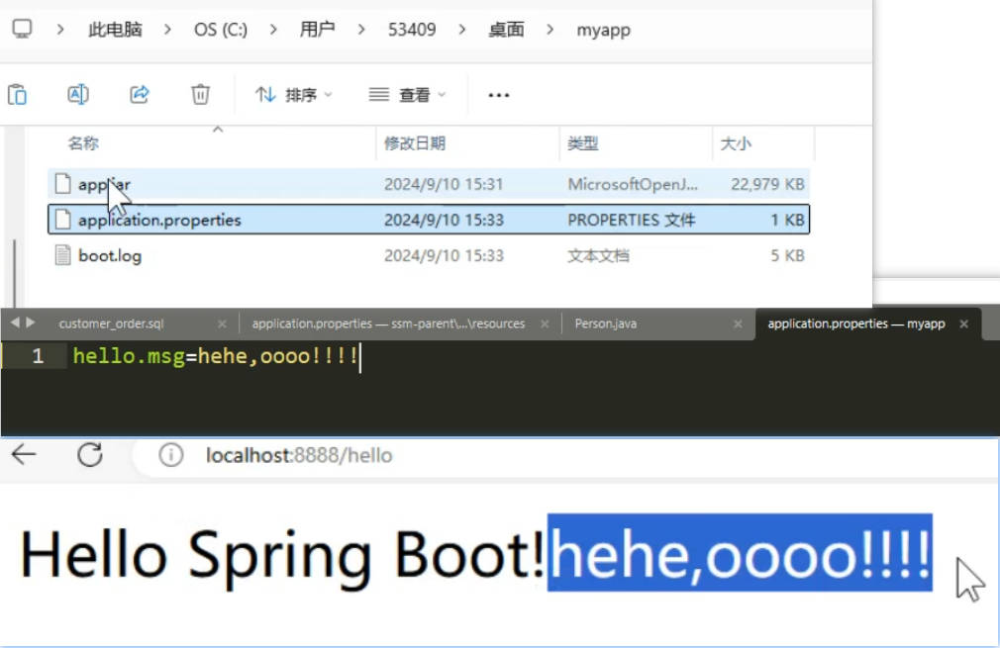


+ **当前项目所在路径下的config目录**

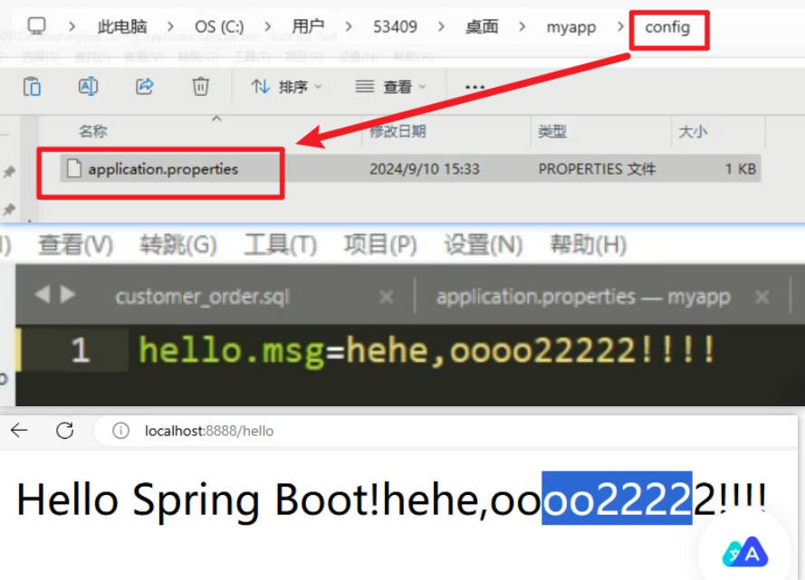

+ **当前项目所在路径下的config目录的子目录**

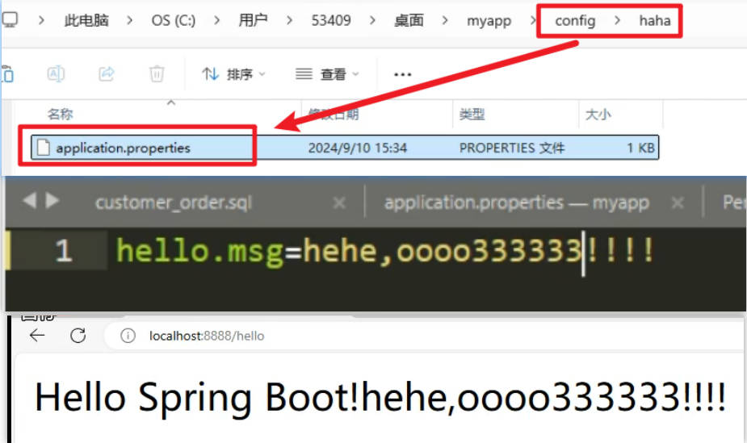

+ **命令行**

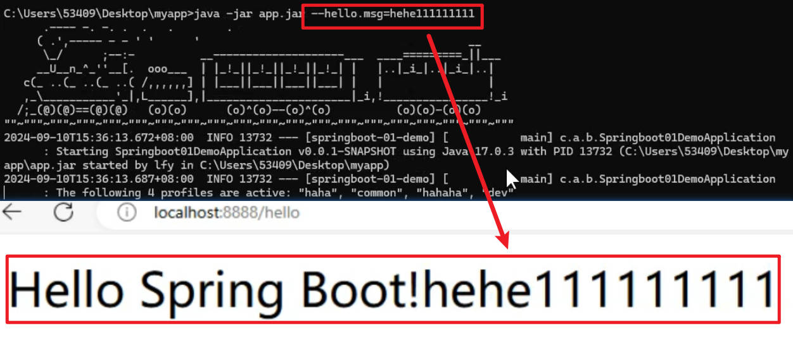


## 单元测试进阶（熟悉）

### 测试注解

::: tip

**@Test :表示`方法是测试方法`。**

@ParameterizedTest :表示方法是参数化测试，下方会有详细介绍

@RepeatedTest :表示方法可重复执行，下方会有详细介绍

**@DisplayName :为测试类或者测试方法`设置展示名称`**

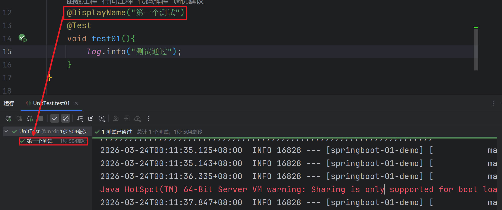

**@BeforeEach :表示在每个单元测试`之前执行`**

**@AfterEach :表示在每个单元测试`之后执行`**

**@BeforeAll :表示在`所有单元测试之前执行`**

**@AfterAll :表示在`所有单元测试之后执行`**

@Tag :表示单元测试类别，类似于JUnit4中的@Categories

@Disabled :表示测试类或测试方法不执行，类似于JUnit4中的@Ignore

@Timeout :表示测试方法运行如果超过了指定时间将会返回错误

@ExtendWith :为测试类或测试方法提供扩展类引用

:::


### 断言机制

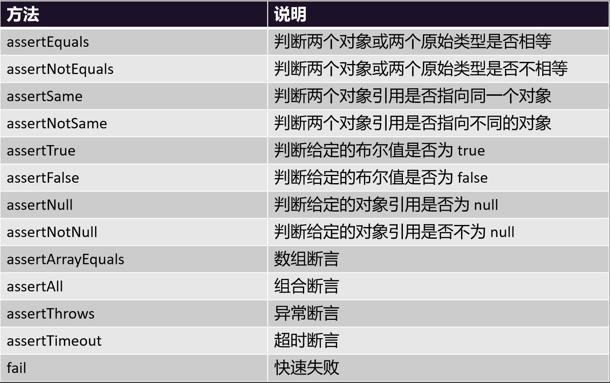

+ **HelloService.java**

```java
package fun.xingji.springboot.service;

import org.springframework.stereotype.Service;

@Service
public class HelloService {

    public String sayHello() {
        return "Hello";
    }
}
```

+ **UnitTest.java**

```java
package fun.xingji.springboot;

import fun.xingji.springboot.service.HelloService;
import lombok.extern.slf4j.Slf4j;
import org.junit.jupiter.api.Assertions;
import org.junit.jupiter.api.DisplayName;
import org.junit.jupiter.api.Test;
import org.springframework.beans.factory.annotation.Autowired;
import org.springframework.boot.test.context.SpringBootTest;

@Slf4j
@SpringBootTest
public class UnitTest {

    @Autowired
    HelloService helloService;

    @Test
    void test02(){
        //1、业务规定，返回hello字符串才算成功，否则就是失败
        String result = helloService.sayHello();
        //2、断言：判断字符串是否等于hello
        Assertions.assertEquals("hello",result,"helloservice并没有返回hello");
    }

}
```

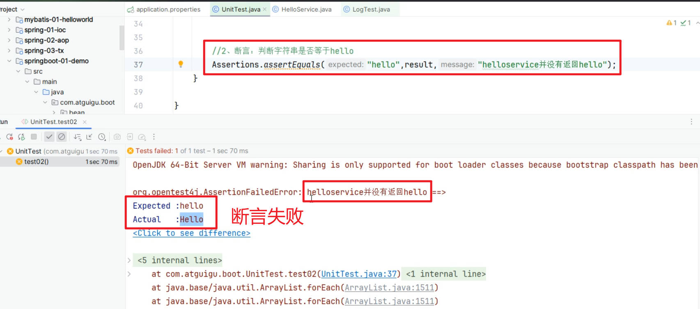


## 可观测性（了解）

> **`可观测性（Observability）`指`应用的运行数据`，可以被线上进行`观测、监控、预警`等**

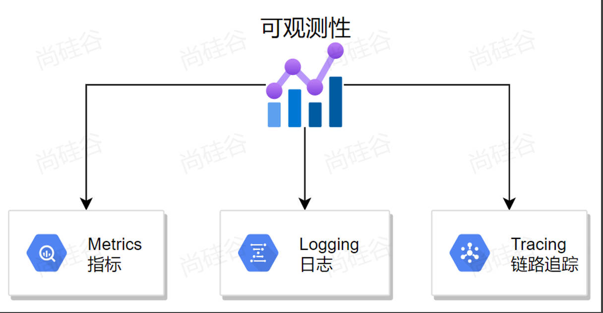

::: tip

1.**SpringBoot 提供了 actuator 模块，可以快速暴露应用的所有指标**

+ **导入： spring-boot-starter-actuator**

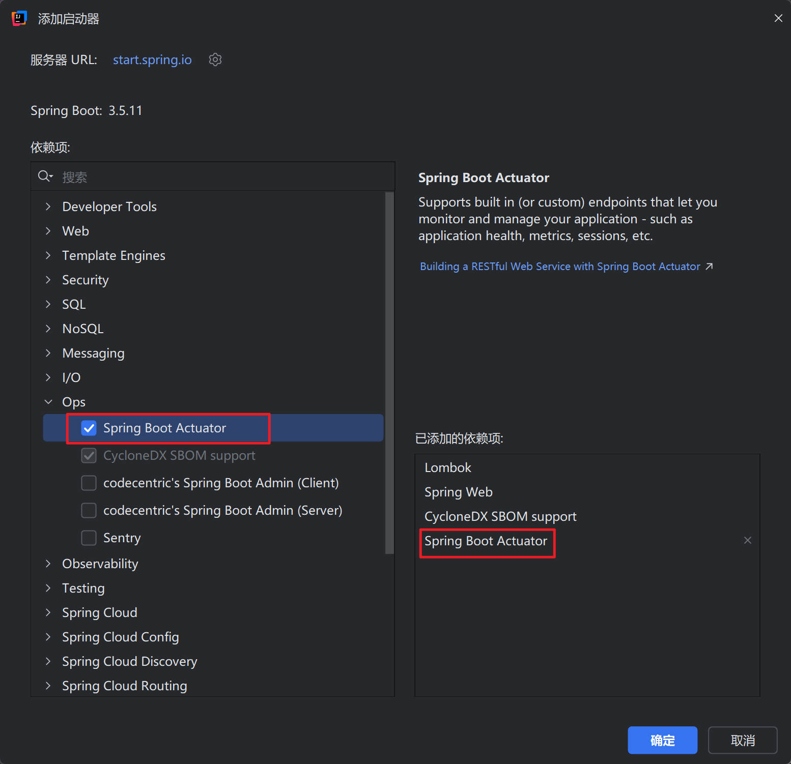

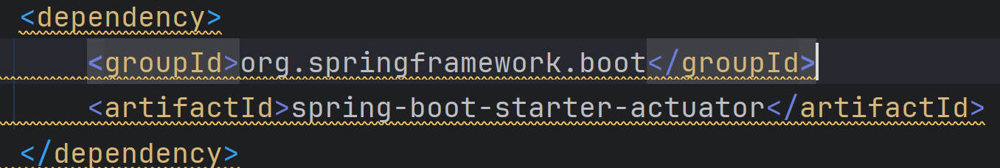


2.**访问 http://localhost:8080/actuator；**

3.**展示出所有可以用的监控端点**

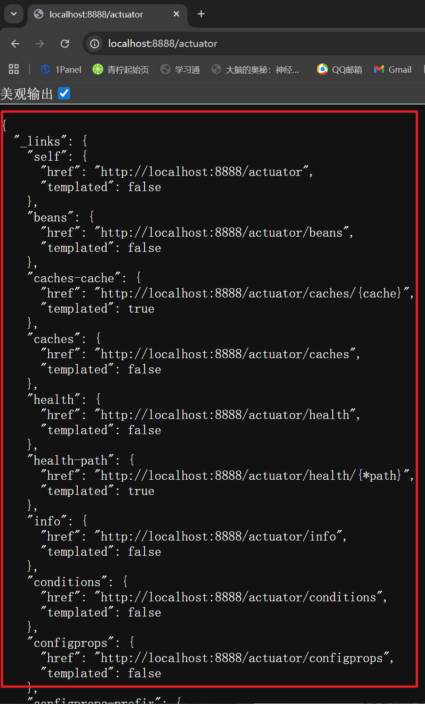

:::


### 可观测性 - Endpoints(端点)

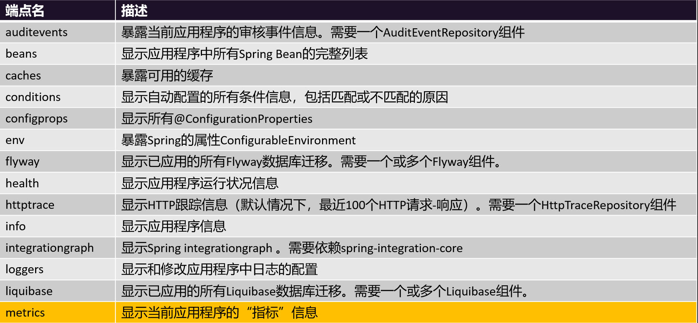

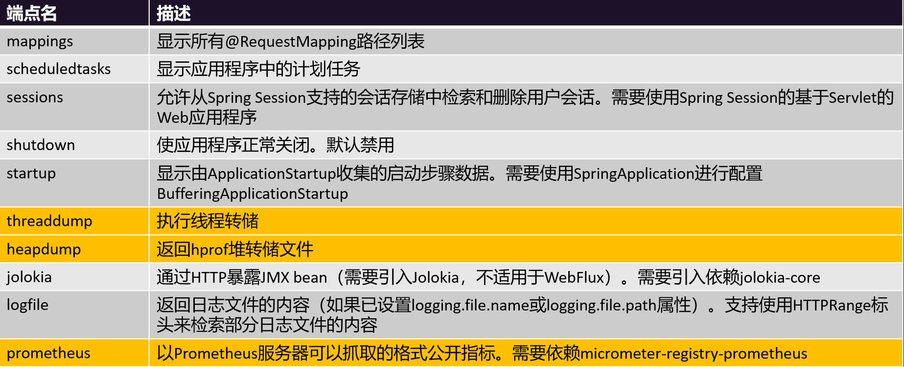
