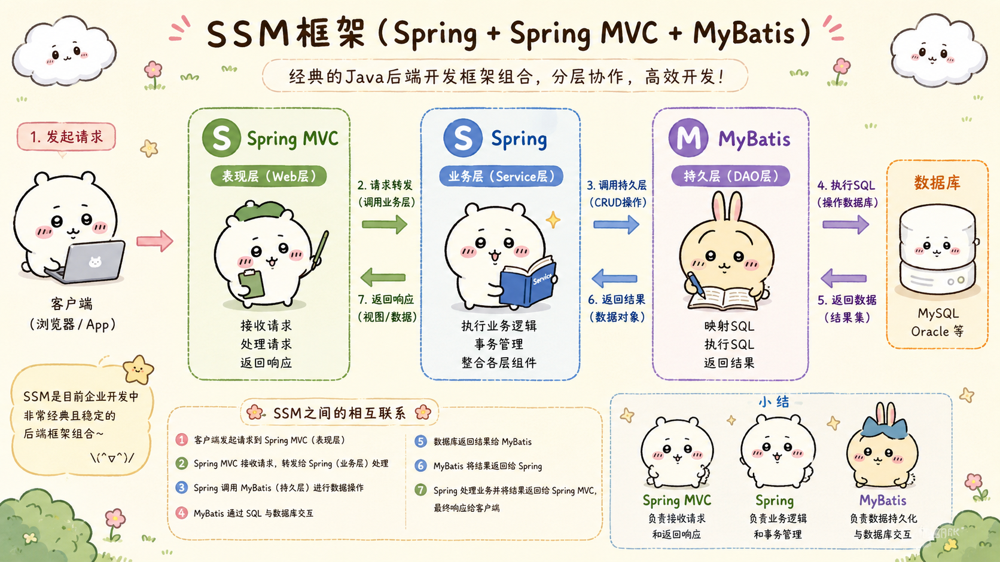

## RESTful 介绍

::: tip 

1.**REST（Representational State Transfer 表现层状态转移）是一种软件架构风格；**

+ **官网：https://restfulapi.net/**

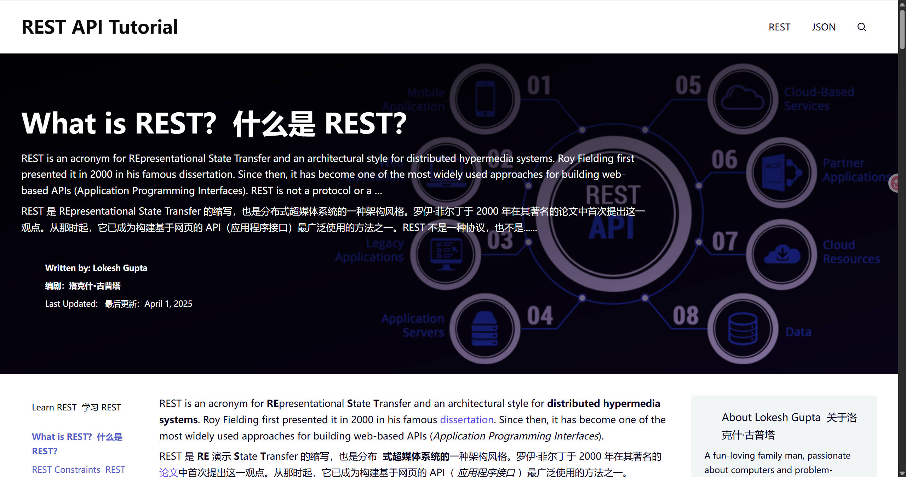

+ **完整理解：Resource Representational State Transfer**
  + **Resource：资源**
  + **Representational：表现形式：比如用JSON，XML，JPEG等**
  + **State Transfer：状态变化：通过HTTP的动词（GET、POST、PUT、DELETE）实现**

+ **一句话：使用资源名作为URI，使用HTTP的请求方式表示对资源的操作**

2.**满足REST 风格的系统，我们称为是 RESTful 系统**

:::


## RESTful API 规划

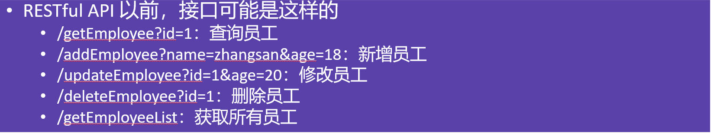

> **以 员工的 `增删改查` 为例，设计的`RESTful API`如下**

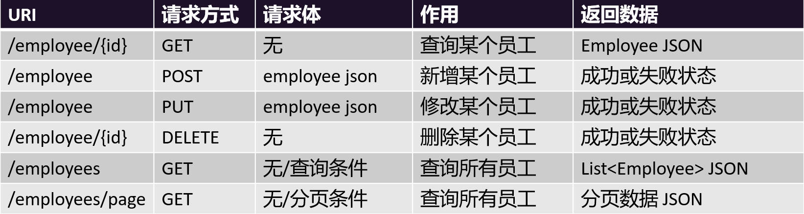

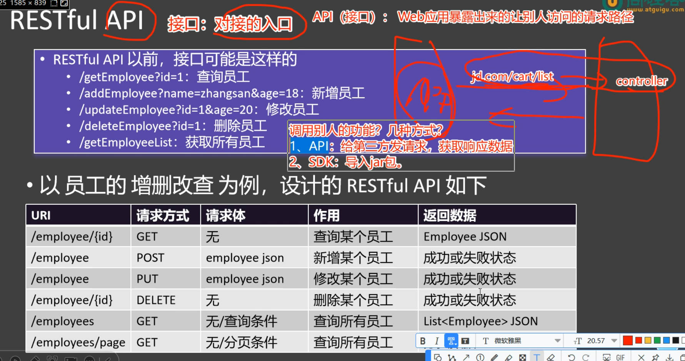


## CRUD 案例实现

::: tip

> **需求：设计一个RESTful的`员工管理系统`**

+ **规划 RESTful 接口**


+ 创建统一返回 **R** 对象


+ **实现简单的 CRUD，暂不考虑复杂查询与分页查询**


+ **测试 CRUD 的功能**


+ **前端联动测试 ***

  + **找到 资料 中 nginx.zip，解压到 非中文无空格 目录下**

    

  + **运行 nginx.exe，访问 localhost 即可访问前端项目**

    

  + **前端项目源码为 rest-crud-vue.zip，学完前端工程化，就可以二次开发**

    

  + **注意：还要解决 跨域问题**

:::

### Dao层

+ **Employee.java**

```java
package fun.xingji.practice.bean;

import lombok.Data;

import java.math.BigDecimal;

@Data
public class Employee {

    private Long id;
    private String name;
    private Integer age;
    private String email;
    private String gender;
    private String address;
    private BigDecimal salary;
}
```


+ **EmployeeDao.java**

```java
package fun.xingji.practice.dao;

import fun.xingji.practice.bean.Employee;

import java.util.List;

public interface EmployeeDao {

    /**
     * 根据id查询用户信息
     * @param id
     * @return
     */
    Employee getEmpById(Long id);

    /**
     * 新增员工
     * @param employee
     */
    void addEmp(Employee employee);

    /**
     * 修改员工
     * 注意：传入Employee全部的值，不改的传入原来值，如果不传代表改为null
     * @param employee
     */
    void updateEmp(Employee employee);

    /**
     * 按照id删除员工
     * @param id
     */
    void deleteById(Long id);

    /**
     * 查询所有
     * @return
     */
    List<Employee> getList();
}
```


+ **EmployeeDaoImpl.java**

```java
package fun.xingji.practice.dao.impl;

import fun.xingji.practice.bean.Employee;
import fun.xingji.practice.dao.EmployeeDao;
import org.springframework.beans.factory.annotation.Autowired;
import org.springframework.jdbc.core.BeanPropertyRowMapper;
import org.springframework.jdbc.core.JdbcTemplate;
import org.springframework.stereotype.Component;

import java.util.List;

@Component // 注解，表明这是一个组件
public class EmployeeDaoImpl implements EmployeeDao {

    @Autowired
    private JdbcTemplate jdbcTemplate;


    // 根据id查询用户信息
    @Override
    public Employee getEmpById(Long id) {
        // 查询语句
        String sql = "select * from employee where id = ?";
        // 执行查询
        Employee employee = jdbcTemplate.queryForObject(sql, new BeanPropertyRowMapper<>(Employee.class), id);
        // 返回结果
        return employee;
    }

    @Override
    public void addEmp(Employee employee) {
        // 新增语句
        String sql = "insert into employee(name,age,email,gender,address,salary) values (?,?,?,?,?,?)";
        // 执行新增
        int update = jdbcTemplate.update(sql,
                employee.getName(),
                employee.getAge(),
                employee.getEmail(),
                employee.getGender(),
                employee.getAddress(),
                employee.getSalary());
        // 打印结果
        System.out.println("新增成功，影响行数：" + update);
    }

    @Override
    public void updateEmp(Employee employee) {
        // 更新语句
        String sql = "update employee set name=?,age=?,email=?,gender=?,address=?,salary=? where id=?";
        // 执行更新
        int update = jdbcTemplate.update(sql,
                employee.getName(),
                employee.getAge(),
                employee.getEmail(),
                employee.getGender(),
                employee.getAddress(),
                employee.getSalary(),
                employee.getId());
        // 打印结果
        System.out.println("更新成功，影响行数：" + update);
    }

    @Override
    public void deleteById(Long id) {
        // 删除语句
        String sql = "delete from employee where id=?";
        // 执行删除
        int update = jdbcTemplate.update(sql, id);
    }

    @Override
    public List<Employee> getList() {
        // 查询语句
        String sql = "select * from employee";
        // 执行查询
        List<Employee> list = jdbcTemplate.query(sql, new BeanPropertyRowMapper<>(Employee.class));
        // 返回结果
        return list;
    }
}
```


+ **EmployeeDaoTest.java**

```java
package fun.xingji.practice;

import fun.xingji.practice.dao.EmployeeDao;
import org.junit.jupiter.api.Test;
import org.springframework.beans.factory.annotation.Autowired;
import org.springframework.boot.test.context.SpringBootTest;

@SpringBootTest
public class EmployeeDaoTest {

    @Autowired
    EmployeeDao employeeDao;

    @Test
    void testEmployeeDao() {
        // 测试查询
        /*Employee empById = employeeDao.getEmpById(1L);
        System.out.println("empById = " + empById);*/

        // 测试新增
/*      Employee employee = new Employee();
        employee.setId(5L); //查询条件
        employee.setName("李四22");
        employee.setAge(10);
//        employee.setEmail("aaa");
        employee.setGender("男");
        employee.setAddress("下次对对对");
        employee.setSalary(new BigDecimal("0.1"));*/

       /* employeeDao.addEmp(employee);
        System.out.println("新增成功!");*/
        // 测试更新
        employeeDao.deleteById(5L);
    }
}
```


+ **测试:**

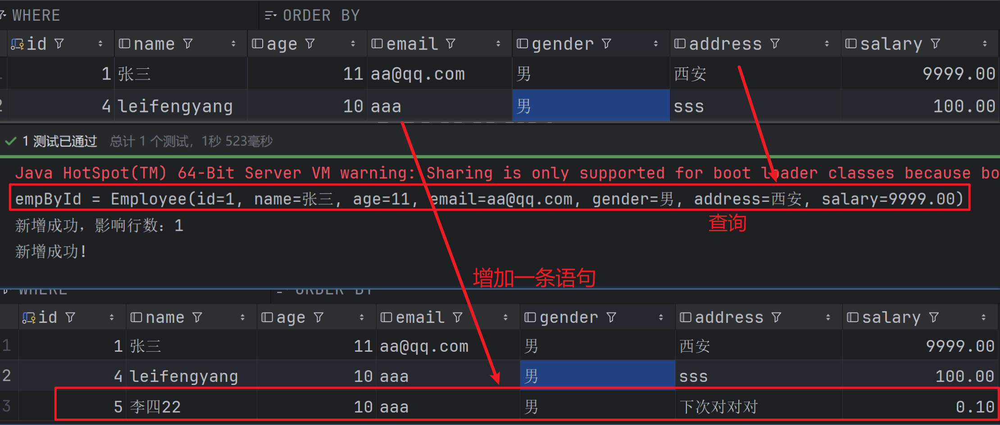

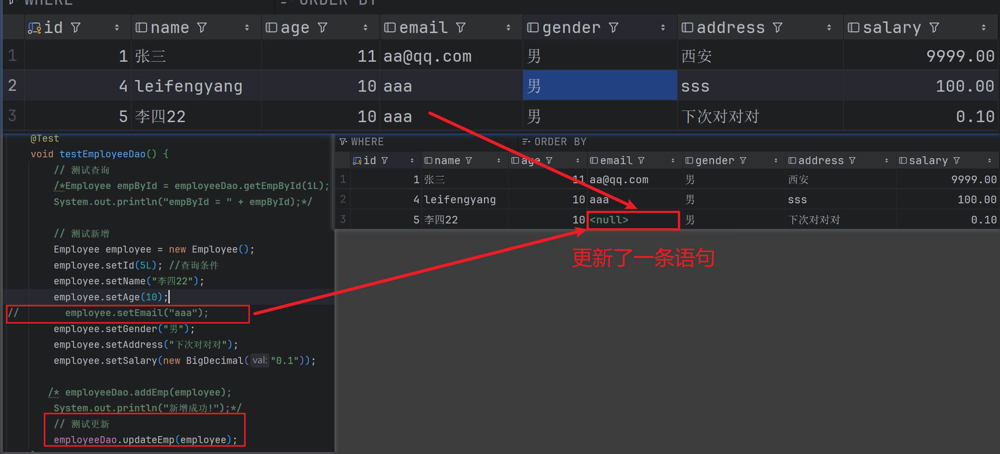

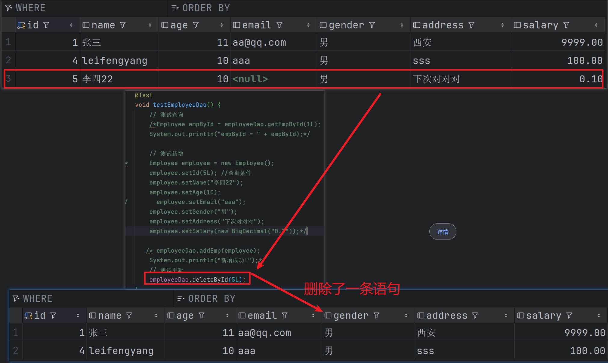


### Service层

+ **Employee.java**

```java
package fun.xingji.practice.bean;

import lombok.Data;

import java.math.BigDecimal;

@Data
public class Employee {

    private Long id;
    private String name;
    private Integer age;
    private String email;
    private String gender;
    private String address;
    private BigDecimal salary;
}
```


+ **EmployeeService.java**

```java
package fun.xingji.practice.service;

import fun.xingji.practice.bean.Employee;

import java.util.List;

public interface EmployeeService {

    /**
     * 根据id查询用户
     * @param id
     * @return
     */
    Employee getEmp(Long id);

    /**
     * 更新用户
     * @param employee
     */
    void updateEmp(Employee employee);

    /**
     * 新增用户
     * @param employee
     */
    void saveEmp(Employee employee);


    /**
     * 根据id删除用户
     * @param id
     */
    void deleteEmp(Long id);

    /**
     * 查询所有用户
     * @return
     */
    List<Employee> getList();
}
```


+ **EmployeeServiceImpl.java**

```java
package fun.xingji.practice.service.impl;

import fun.xingji.practice.bean.Employee;
import fun.xingji.practice.dao.EmployeeDao;
import fun.xingji.practice.service.EmployeeService;
import org.springframework.beans.factory.annotation.Autowired;
import org.springframework.stereotype.Service;
import org.springframework.util.StringUtils;

import java.util.List;

@Service // 要求：controller只能调service
public class EmployeeServiceImpl implements EmployeeService {

    @Autowired
    EmployeeDao employeeDao; //包装一下

    // 根据id查询用户
    @Override
    public Employee getEmp(Long id) {
        Employee empById = employeeDao.getEmpById(id);
        return empById;
    }

    // 更新用户
    @Override
    public void updateEmp(Employee employee) {
        //防null处理。考虑到service是被controller调用的；
        //controller层传过来的employee 的某些属性可能为null，所以先处理一下
        //怎么处理？
        Long id = employee.getId();
        if(id == null){ //页面没有带id
            return;
        }
        //1、去数据库查询employee原来的值
        Employee empById = employeeDao.getEmpById(id);

        //=======以下用页面值覆盖默认值=============
        //2、把页面带来的覆盖原来的值，页面没带的自然保持原状
        if(StringUtils.hasText(employee.getName())){ //判断name有值（不是null、不是空串、不是空白字符// ）
            //把数据库的值改为页面传来的值
            empById.setName(employee.getName());
        }

        // 判断email不为空
        if(StringUtils.hasText(employee.getEmail())){
            empById.setEmail(employee.getEmail());
        }

        // 判断address不为空
        if (StringUtils.hasText(employee.getAddress())){
            empById.setAddress(employee.getAddress());
        }

        // 判断gender不为空
        if (StringUtils.hasText(employee.getGender())){
            empById.setGender(employee.getGender());
        }

        // 判断age不为空
        if(employee.getAge() != null){
            empById.setAge(employee.getAge());
        }

        // 判断salary不为空
        if(employee.getSalary() != null){
            empById.setSalary(employee.getSalary());
        }

        //以上判断，把页面提交的值，赋值给数据库的记录
        employeeDao.updateEmp(empById);
    }

    // 新增用户
    @Override
    public void saveEmp(Employee employee) {
        employeeDao.addEmp(employee);
    }

    // 根据id删除用户
    @Override
    public void deleteEmp(Long id) {
        employeeDao.deleteById(id);
    }

    // 查询所有用户
    @Override
    public List<Employee> getList() {
        return employeeDao.getList();
    }
}
```


+ **EmployeeDaoTest.java**

```java
package fun.xingji.practice;

import fun.xingji.practice.bean.Employee;
import fun.xingji.practice.service.EmployeeService;
import org.junit.jupiter.api.Test;
import org.springframework.beans.factory.annotation.Autowired;
import org.springframework.boot.test.context.SpringBootTest;

@SpringBootTest
public class EmployeeDaoTest {

    @Autowired
    EmployeeService employeeService;

    @Test
    void testEmployeeService() {
        Employee employee = new Employee();
        employee.setId(4L); //查询条件
        employee.setName("李四22");
//        employee.setAge(10);
//        employee.setEmail("aaa");
        employee.setGender("男");
//        employee.setAddress("下次对对对");
//        employee.setSalary(new BigDecimal("0.1"));

        employeeService.updateEmp(employee);
    }
}
```


+ **测试:**

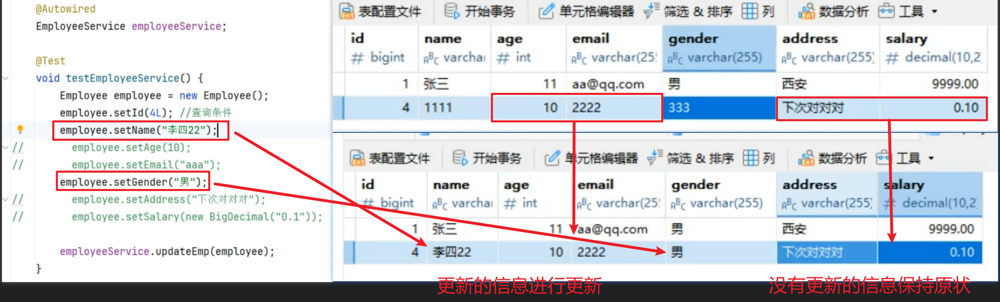


### Controller层

+ **EmployeeRestController.java**

```java
package fun.xingji.practice.controller;


import fun.xingji.practice.bean.Employee;
import fun.xingji.practice.service.EmployeeService;
import org.springframework.beans.factory.annotation.Autowired;
import org.springframework.web.bind.annotation.*;


@RestController
public class EmployeeRestController {

    @Autowired
    EmployeeService employeeService;

    /**
     * 按照id查询员工
     * @param id
     * @return
     *
     * /employee/1/2/3
     */
    // @RequestMapping(value = "/employee/{id}", method = RequestMethod.GET)
    @GetMapping("/employee/{id}")
    // @PathVariable("id") 注解用来获取路径中的参数
    public Employee get(@PathVariable("id") Long id){
        Employee emp = employeeService.getEmp(id);
        return emp;
    }


    /**
     * 新增员工；
     * 要求：前端发送请求把员工的json放在请求体中
     * @param employee
     * @return
     */
    @PostMapping("/employee")
    public String add(@RequestBody Employee employee){
        employeeService.saveEmp(employee);
        return "ok";
    }

    /**
     * 修改员工
     * 要求：前端发送请求把员工的json放在请求体中； 必须携带id
     * @param employee
     * @return
     */
    @PutMapping("/employee")
    public String update(@RequestBody Employee employee){
        employeeService.updateEmp(employee);
        return "ok";
    }


    /**
     *   @XxxMapping("/employee")：Rest 映射注解
     * @param id
     * @return
     */
    @DeleteMapping("/employee/{id}")
    public String delete(@PathVariable("id") Long id){
        employeeService.deleteEmp(id);
        return "ok";
    }
}
```

+ **测试:**

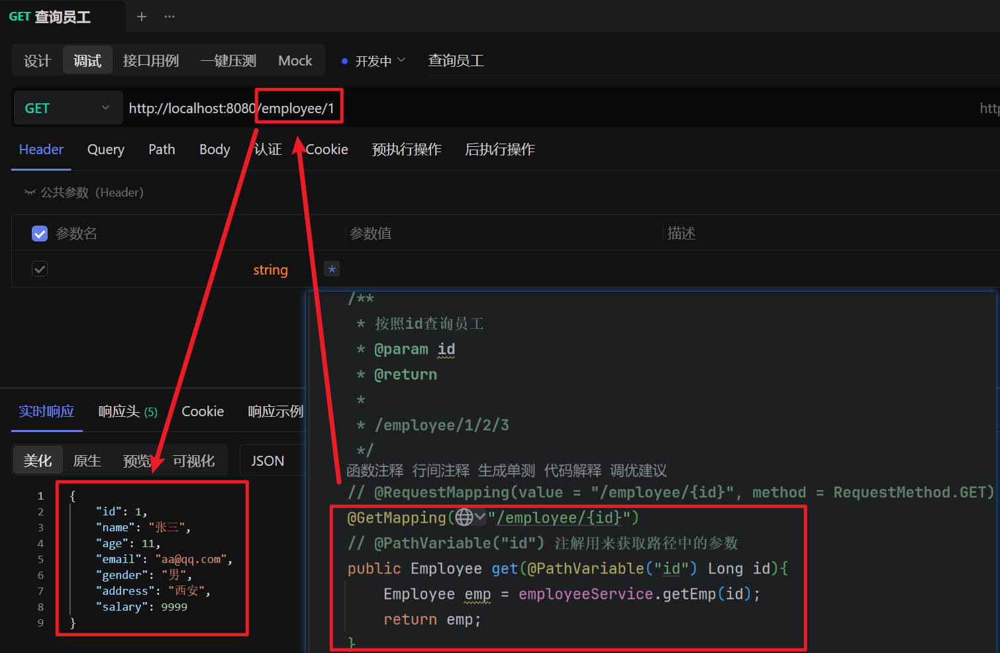

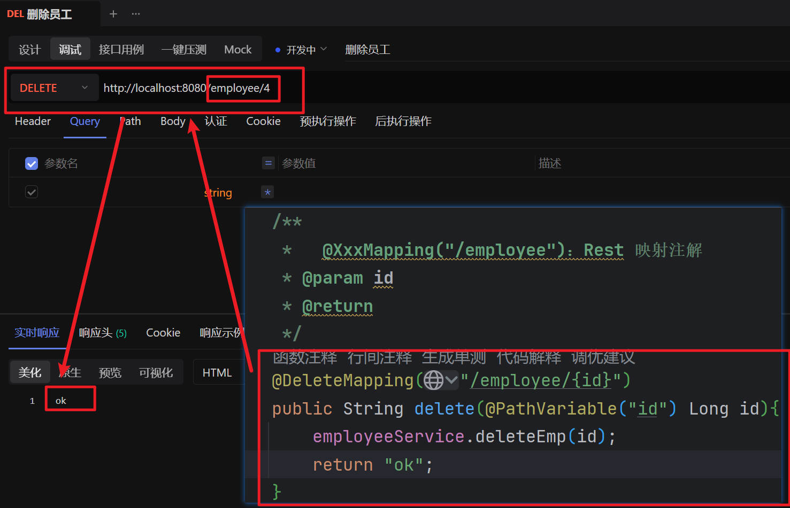

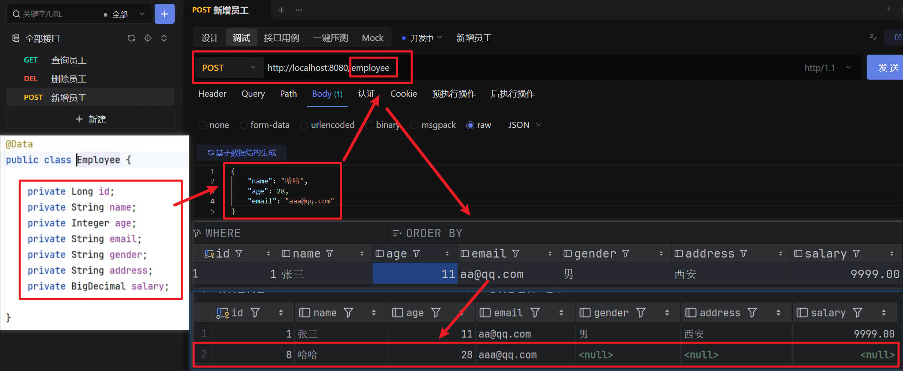

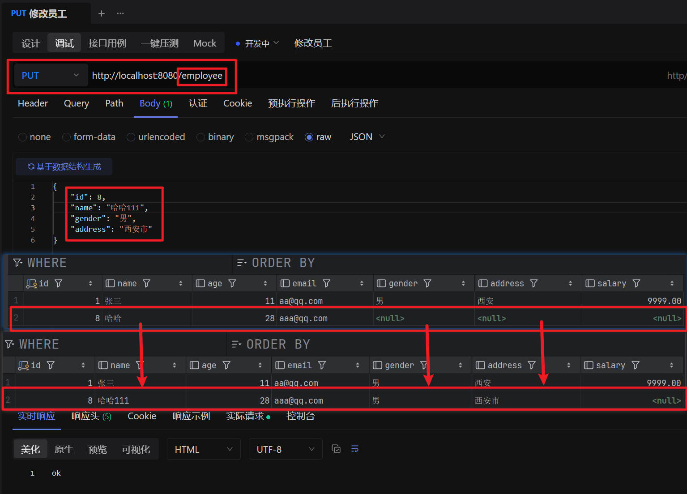


#### Controller层 - 优化(统一返回R对象)

::: tip 

1.**code：业务的状态码，200是成功，剩下都是失败; 前后端将来会一起商定不同的业务状态码前端要显示不同效果。**

```json
msg：服务端返回给前端的提示消息
data：服务器返回给前端的数据
   	{
       	"code": 300,
       	"msg": "余额不足",
       	"data": null
   	}
```

2.**前端统一处理:**
      1、**前端发送请求，接受服务器数据**

​      2、**判断状态码，成功就显示数据，失败就显示提示消息（或者执行其他操作）**

:::

+ **R.java**

```java
package fun.xingji.practice.common;

import lombok.Data;

@Data
//泛型类，T代表任意类型
public class R<T> {

    private Integer code;
    private String msg;
    private T data;

    // 返回成功结果
    public static<T> R<T> ok(T data){
        R<T> tr = new R<>();
        tr.setCode(200);
        tr.setMsg("ok");
        tr.setData(data);
        return tr;
    }

    // 返回成功结果，不带数据
    public static R ok(){
        R tr = new R<>();
        tr.setCode(200);
        tr.setMsg("ok");
        return tr;
    }

    // 返回失败结果
    public static R error(){
        R tr = new R<>();
        tr.setCode(500); //默认失败码
        tr.setMsg("error");
        return tr;
    }

    // 返回失败结果，自定义错误码和消息
    public static R error(Integer code,String msg){
        R tr = new R<>();
        tr.setCode(code); //默认失败码
        tr.setMsg(msg);
        return tr;
    }

    // 返回失败结果，自定义错误码和消息
    public static R error(Integer code,String msg,Object data){
        R tr = new R<>();
        tr.setCode(code); //默认失败码
        tr.setMsg(msg);
        tr.setData(data);
        return tr;
    }
}
```

+ **EmployeeRestController.java**

```java
package fun.xingji.practice.controller;


import fun.xingji.practice.bean.Employee;
import fun.xingji.practice.common.R;
import fun.xingji.practice.service.EmployeeService;
import org.springframework.beans.factory.annotation.Autowired;
import org.springframework.web.bind.annotation.*;

import java.util.List;


@RestController
public class EmployeeRestController {

    @Autowired
    EmployeeService employeeService;


    /**
     * code：业务的状态码，200是成功，剩下都是失败; 前后端将来会一起商定不同的业务状态码前端要显示不同效果。
     * msg：服务端返回给前端的提示消息
     * data： 服务器返回给前端的数据
     *   {
     *       "code": 300,
     *       "msg": "余额不足",
     *       "data": null
     *   }
     *
     *   前端统一处理:
     *      1、前端发送请求，接受服务器数据
     *      2、判断状态码，成功就显示数据，失败就显示提示消息（或者执行其他操作）。
     */


    /**
     * 按照id查询员工
     * @param id
     * @return
     *
     * /employee/1/2/3
     */
    // @RequestMapping(value = "/employee/{id}", method = RequestMethod.GET)
    @GetMapping("/employee/{id}")
    // @PathVariable("id") 注解用来获取路径中的参数
    public R get(@PathVariable("id") Long id){
        Employee emp = employeeService.getEmp(id);
        return R.ok(emp);
    }


    /**
     * 新增员工；
     * 要求：前端发送请求把员工的json放在请求体中
     * @param employee
     * @return
     */
    @PostMapping("/employee")
    public R add(@RequestBody Employee employee){
        employeeService.saveEmp(employee);
        return R.ok();
    }

    /**
     * 修改员工
     * 要求：前端发送请求把员工的json放在请求体中； 必须携带id
     * @param employee
     * @return
     */
    @PutMapping("/employee")
    public R update(@RequestBody Employee employee){
        employeeService.updateEmp(employee);
        return R.ok();
    }


    /**
     *   @XxxMapping("/employee")：Rest 映射注解
     * @param id
     * @return
     */
    @DeleteMapping("/employee/{id}")
    public R delete(@PathVariable("id") Long id){
        employeeService.deleteEmp(id);
        return R.ok();
    }


    /**
     * 查询所有员工
     * @return
     */
    @GetMapping("/employees")
    public R all(){
        List<Employee> employees = employeeService.getList();
        return R.ok(employees);
    }
}
```

+ **测试:查询所有员工**

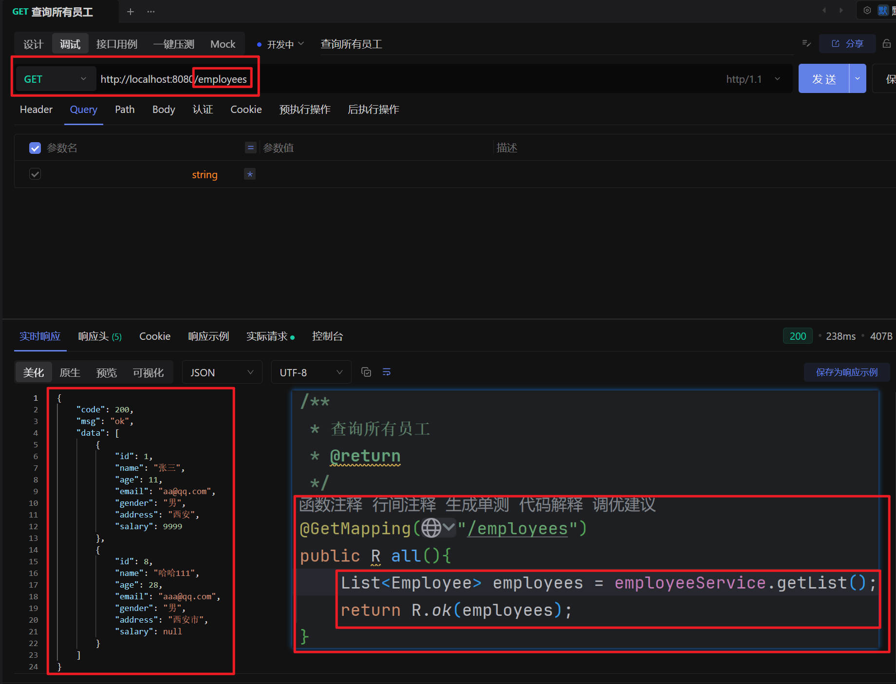


#### Controller层 - 优化(解决跨域问题)

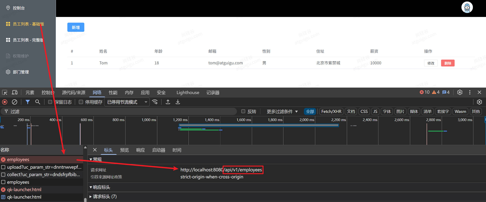

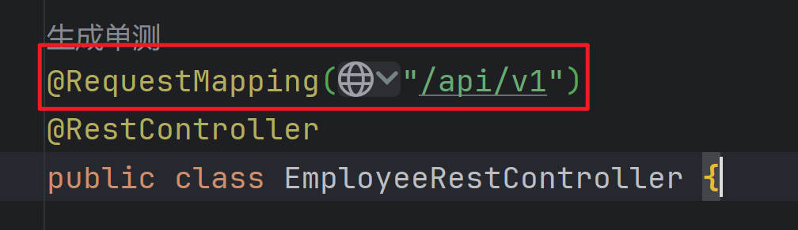

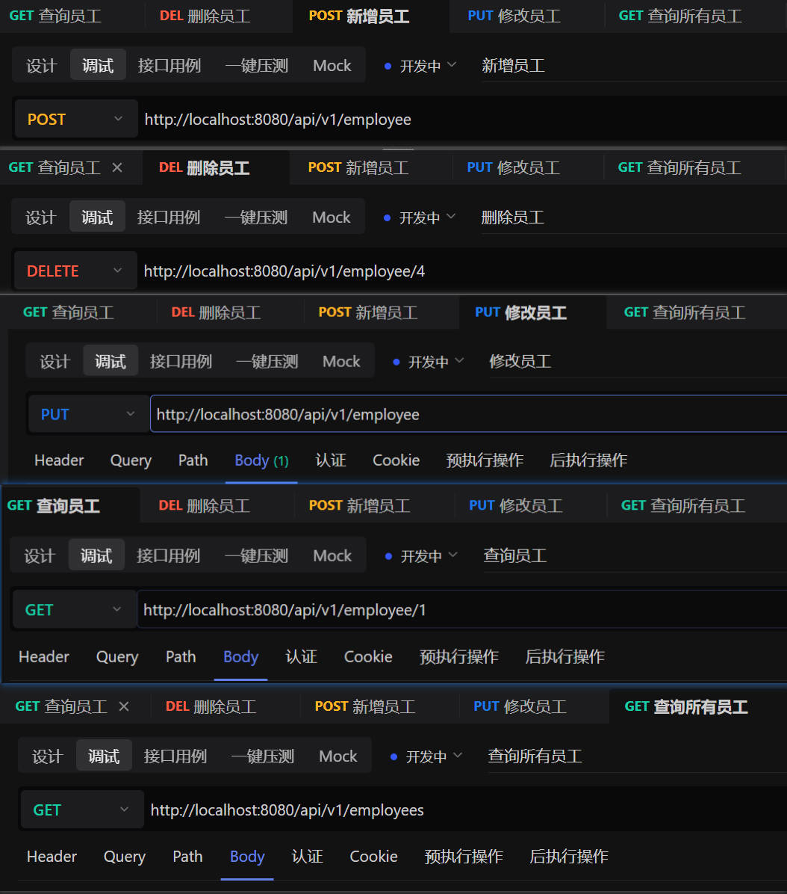

::: tip 

1.**CORS policy：同源策略（限制ajax请求，图片，css，js）； `跨域问题`**

 * **跨源资源共享（CORS）（Cross-Origin Resource Sharing）**
 * **浏览器为了安全，默认会遵循同源策略（请求要去的服务器和当前项目所在的服务器必须是同一个源[同一个服务器]），如果不是，请求就会被拦截**

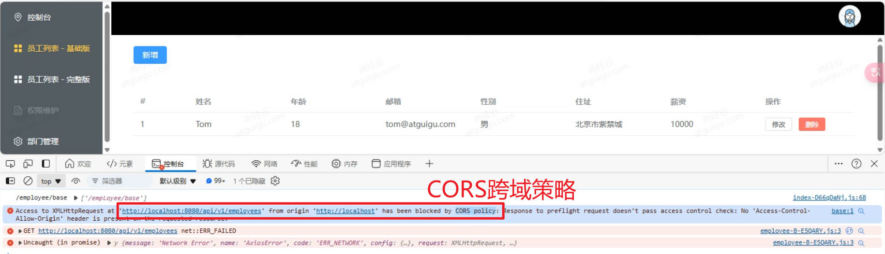

 * **复杂的跨域请求会发送2次：**

     + 1、**options 请求：预检请求。浏览器会先发送options请求，询问服务器是否允许当前域名进行跨域访问**

     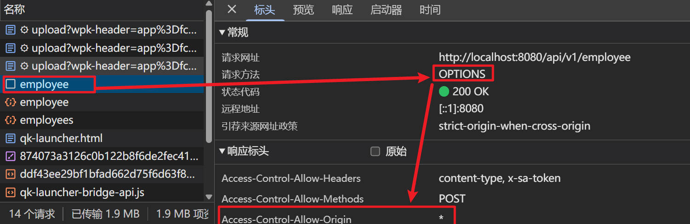

     + 2、**真正的请求：POST、DELETE、PUT等**

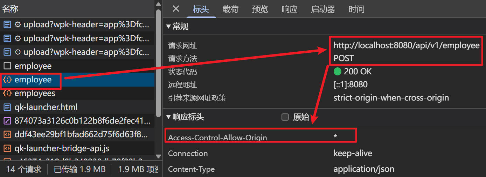

::: warning 

1.**浏览器页面所在的：http://localhost   /employee/base**

2.**页面上要发去的请求：http://localhost:8080   /api/v1/employees**

3.**/以前的东西，必须完全一样，一个字母不一样都不行。浏览器才能把请求（ajax）发出去。**

:::


2.**跨域问题：**

 * 1、**前端自己解决：**
 * 2、**后端解决：允许前端跨域即可**
     + **原理：服务器给浏览器的响应头中添加字段：Access-Control-Allow-Origin = ***

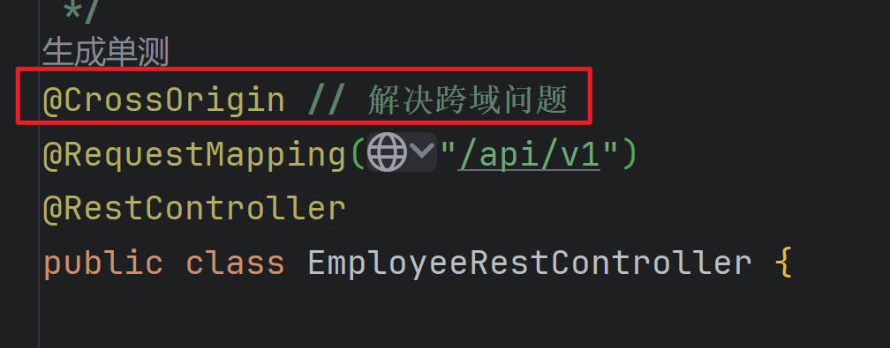

:::

```java
package fun.xingji.practice.controller;


import fun.xingji.practice.bean.Employee;
import fun.xingji.practice.common.R;
import fun.xingji.practice.service.EmployeeService;
import org.springframework.beans.factory.annotation.Autowired;
import org.springframework.web.bind.annotation.*;

import java.util.List;

/**
 * CORS policy：同源策略（限制ajax请求，图片，css，js）； 跨域问题
 * 跨源资源共享（CORS）（Cross-Origin Resource Sharing）
 *    浏览器为了安全，默认会遵循同源策略（请求要去的服务器和当前项目所在的服务器必须是同一个源[同一个服务器]），如果不是，请求就会被拦截
 *    复杂的跨域请求会发送2次：
 *    1、options 请求：预检请求。浏览器会先发送options请求，询问服务器是否允许当前域名进行跨域访问
 *    2、真正的请求：POST、DELETE、PUT等
 *
 *
 * 浏览器页面所在的：http://localhost   /employee/base
 * 页面上要发去的请求：http://localhost:8080   /api/v1/employees
 *  /以前的东西，必须完全一样，一个字母不一样都不行。浏览器才能把请求（ajax）发出去。
 *
 *  跨域问题：
 *    1、前端自己解决：
 *    2、后端解决：允许前端跨域即可
 *          原理：服务器给浏览器的响应头中添加字段：Access-Control-Allow-Origin = *
 *
 *
 */
@CrossOrigin // 解决跨域问题
@RequestMapping("/api/v1")
@RestController
public class EmployeeRestController {

    @Autowired
    EmployeeService employeeService;


    /**
     * code：业务的状态码，200是成功，剩下都是失败; 前后端将来会一起商定不同的业务状态码前端要显示不同效果。
     * msg：服务端返回给前端的提示消息
     * data： 服务器返回给前端的数据
     *   {
     *       "code": 300,
     *       "msg": "余额不足",
     *       "data": null
     *   }
     *
     *   前端统一处理:
     *      1、前端发送请求，接受服务器数据
     *      2、判断状态码，成功就显示数据，失败就显示提示消息（或者执行其他操作）。
     */


    /**
     * 按照id查询员工
     * @param id
     * @return
     *
     * /employee/1/2/3
     */
    // @RequestMapping(value = "/employee/{id}", method = RequestMethod.GET)
    @GetMapping("/employee/{id}")
    // @PathVariable("id") 注解用来获取路径中的参数
    public R get(@PathVariable("id") Long id){
        Employee emp = employeeService.getEmp(id);
        return R.ok(emp);
    }


    /**
     * 新增员工；
     * 要求：前端发送请求把员工的json放在请求体中
     * @param employee
     * @return
     */
    @PostMapping("/employee")
    public R add(@RequestBody Employee employee){
        employeeService.saveEmp(employee);
        return R.ok();
    }

    /**
     * 修改员工
     * 要求：前端发送请求把员工的json放在请求体中； 必须携带id
     * @param employee
     * @return
     */
    @PutMapping("/employee")
    public R update(@RequestBody Employee employee){
        employeeService.updateEmp(employee);
        return R.ok();
    }


    /**
     *   @XxxMapping("/employee")：Rest 映射注解
     * @param id
     * @return
     */
    @DeleteMapping("/employee/{id}")
    public R delete(@PathVariable("id") Long id){
        employeeService.deleteEmp(id);
        return R.ok();
    }


    /**
     * 查询所有员工
     * @return
     */
    @GetMapping("/employees")
    public R all(){
        List<Employee> employees = employeeService.getList();
        return R.ok(employees);
    }
}
```

+ **测试:新增员工**

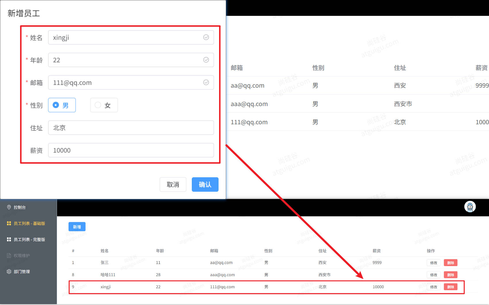


### @PathVariable - 路径变量

```java
/resources/{name}：最多使用
{} 中的值封装到 name 变量中
    
/resources/{*path}：
{} 中的值封装到 path 变量中
/resources/image.png： path = /image.png
/resources/css/spring.css：path = /css/spring.css
    
/resources/{filename:\\w+}.dat：
{} 中的值封装到 filename 变量中; filename 满足 \\w+ 正则要求

/resources/{filename:\\w+}.dat
/resources/xxx.dat：xxx是一个或多个字母
```
