## 响应处理

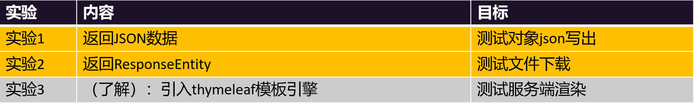

> **注意：SpringMVC底层`使用HttpMessageConverter`处理`json数据`的`序列化与反序列化`**


## JSON 返回

```java
/**
     * 会自动的把返回的对象转为json格式
     *
     * @return
*/
// @ResponseBody //把返回的内容。写到响应体中
@RequestMapping("/resp01")
public Person resp01(){
       Person person = new Person();
       person.setUsername("张三");
       person.setPassword("1111");
       person.setCellphone("18313061246");
       person.setAgreement(false);
       person.setSex("男");
       person.setHobby(new String[]{"篮球","足球"});
       person.setGrade("二年级");

       return person;
}
```

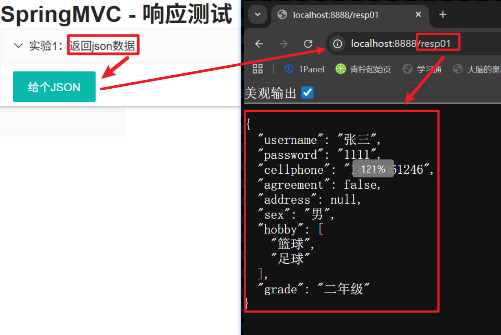


## ResponseEntity

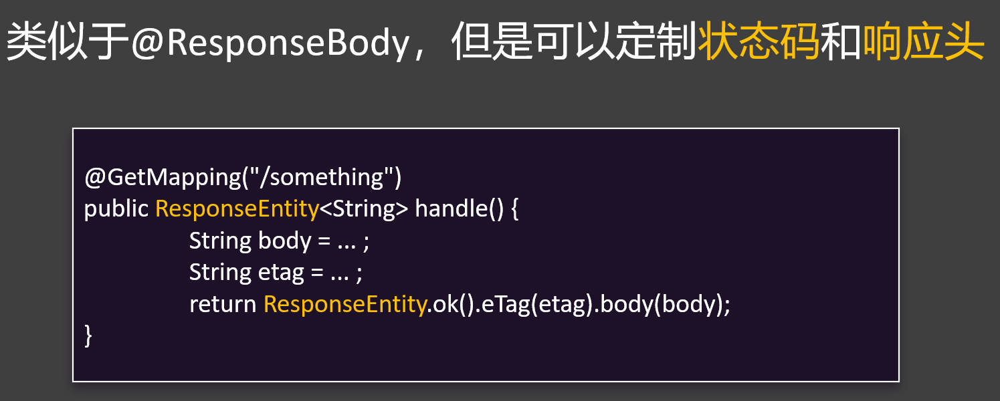


## 文件下载

::: tip 

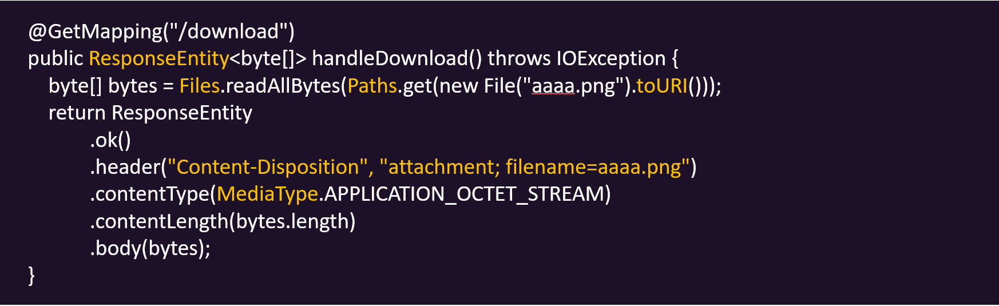

1.**Content-Disposition** 响应头`指定文件名信息`，文件名如果有中文还需要`URLEncoder 进行编码`

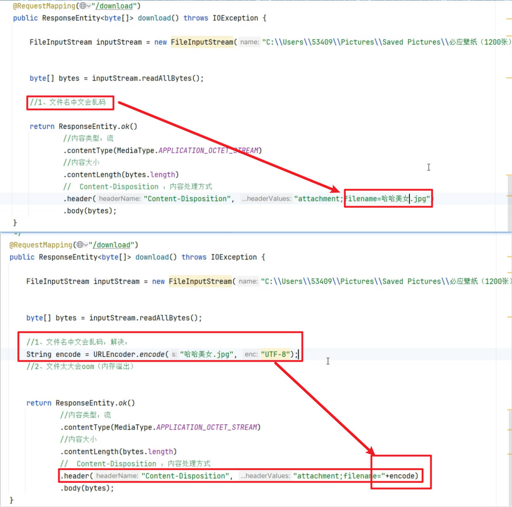

2.**ContentType** 响应头`指定响应内容类型`，是一个`OCTET_STREAM（8位字节流）`

3.**ContentLength** 响应头`指定内容大小`

4.**body 指定`具体响应内容（文件字节流）`；也可以用`InputStreamResource`替换 `byte[]`，`防止oom`**

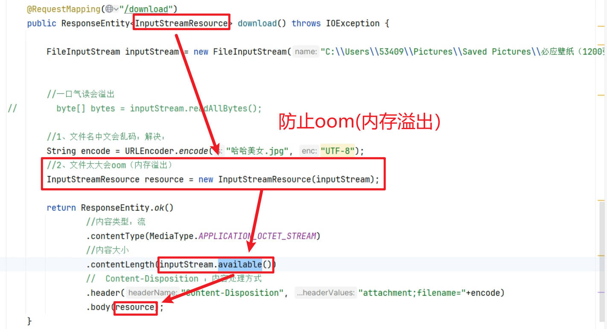

:::

```java
/**
     * 文件下载
     * HttpEntity：拿到整个请求数据
     * ResponseEntity：拿到整个响应数据（响应头、响应体、状态码）
     *
     * @return
*/
@RequestMapping("/download")
// @ResponseBody //把返回的内容。写到响应体中
public ResponseEntity<InputStreamResource> download() throws IOException {

        //以上代码永远别改
        // 文件路径
        FileInputStream inputStream = new FileInputStream("D:\\LenovoHZB\\Pictures\\2026-02-15-d04a3ad05a815966831fdbaee96ba802.jpg");

        // 封装文件流
        //一口气读会溢出
        // byte[] bytes = inputStream.readAllBytes();

        // 1.文件名中文会乱码
        String encode = URLEncoder.encode("哈哈美女.jpg","UTF-8");

        //以下代码永远别改
        //2、文件太大会oom（内存溢出）
        // 封装文件流到响应体中
        InputStreamResource resource = new InputStreamResource(inputStream);

        // 封装文件流到响应体中
        return ResponseEntity.ok()
                // 内容类型: 流
                .contentType(MediaType.APPLICATION_OCTET_STREAM)
                // 内容大小
                .contentLength(inputStream.available())
                // Content-Disposition: 内容处理方式
                .header("Content-Disposition","attachment;filename=" + encode)
                .body(resource);
}
```

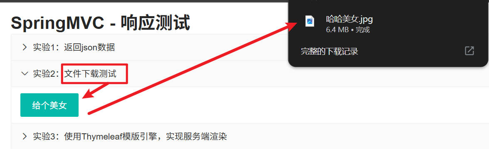


## 模板引擎（了解）

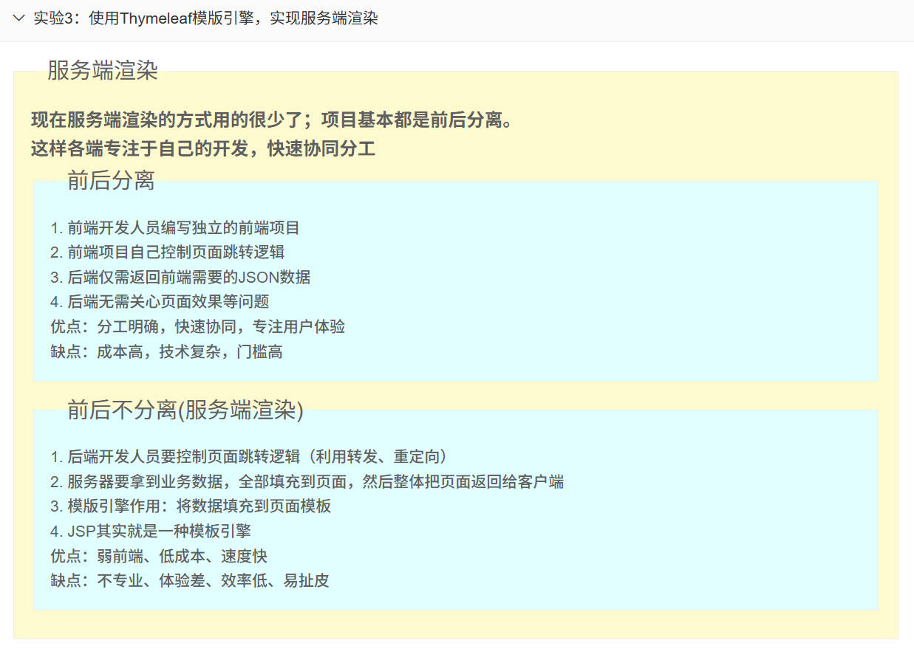

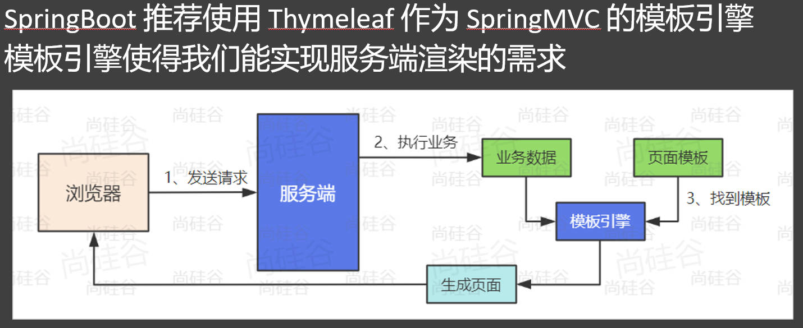

::: tip 

**使用步骤:**

+ **引入 spring-boot-starter-thymeleaf**

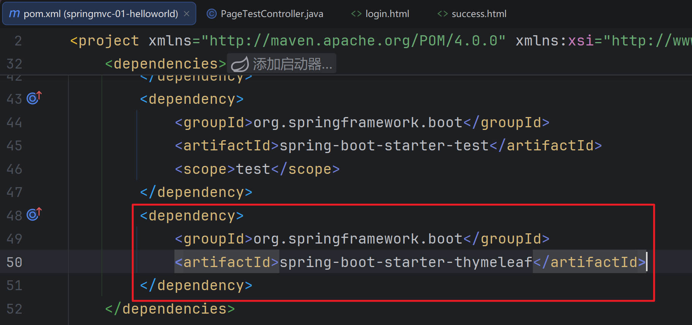

+ **static：静态资源文件夹、resources：页面模板文件夹**

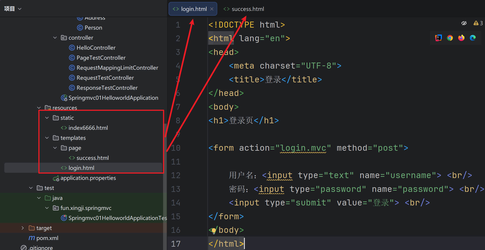

+ **Model：给页面共享数据**

```java
package fun.xingji.springmvc.controller;

import fun.xingji.springmvc.bean.User;
import org.springframework.stereotype.Controller;
import org.springframework.ui.Model;
import org.springframework.web.bind.annotation.RequestMapping;

import java.util.Arrays;
import java.util.List;

/**
 * SpringBoot整合的SpringMVC默认不支持JSP
 * 1、引入 thymeleaf 作为模型引擎，渲染页面
 * <dependency>
 * <groupId>org.springframework.boot</groupId>
 * <artifactId>spring-boot-starter-thymeleaf</artifactId>
 * </dependency>
 * 2、默认规则
 * 页面：src/main/resources/templates
 * 静态资源：src/main/resources/static
 */
@Controller // 开发服务端渲染逻辑
public class PageTestController {

    //处理 / 请求，跳转到登录页
    @RequestMapping("/")
    public String index() {

        // thymeleaf 默认：去 classpath:/templates/ 找页面, 后缀为 .html
        // 页面地址 = classpath:/templates/ + 返回名字 + .html
        return "login";  //返回值就是  页面名称（视图名）
    }


    // 处理 /login 请求，跳转到登录页
    @RequestMapping("/login.mvc")
    public String login(String username,
                        String password,
                        //模型就是页面要展示的所有数据
                        Model model) {

        System.out.println("用户登录" + username + "," + password);

        // 去数据库查到访客列表

        List<User> list = Arrays.asList(
                new User(1L, "张三1", 18),
                new User(2L, "张三2", 19),
                new User(3L, "张三3", 16),
                new User(4L, "张三4", 12),
                new User(5L, "张三5", 17),
                new User(6L, "张三6", 28),
                new User(7L, "张三7", 11),
                new User(8L, "张三8", 38)
        );


        model.addAttribute("users",list);
        model.addAttribute("name",username);
        model.addAttribute("age",18);

        return "page/success";
    }
}
```

+ **Thymeleaf语法，去页面取值**

```html
<!DOCTYPE html>
<html lang="en" xmlns:th="http://www.thymeleaf.org">
<head>
    <meta charset="UTF-8">
    <title>成功</title>
</head>
<body>
<h1>恭喜，登录成功：</h1>
<!-- th:xx； 修改标签的任意属性 -->
<h2>用户名：<span th:text="${name}" th:id="${name}">张三</span></h2>
<h2>年龄：[[${age}]] </h2>

<!-- 列表：今天的访客 -->
<table border="1px">
    <tr>
        <th>序号</th>
        <th>用户名</th>
        <th>年龄</th>
        <th>成年人吗</th>
    </tr>


    <tr th:each="user : ${users}">
        <td>[[${user.id}]]</td>
        <td th:text="${user.getName()}">张三</td>
        <td th:text="${user.age}">18</td>
        <!--        <td th:if="${user.age >= 18}">是</td>-->
        <!--        <td th:if="${user.age < 18}">否</td>-->

        <td th:text="${user.age >= 18? '是':'否'}">否</td>
    </tr>


</table>
</body>
</html>
```

:::

+ **User.java**

```java
package fun.xingji.springmvc.bean;


import lombok.AllArgsConstructor;
import lombok.Data;
import lombok.NoArgsConstructor;


@NoArgsConstructor
@AllArgsConstructor
@Data
public class User {
    private Long id;
    private String name;
    private Integer age;
}
```


+ **PageTestController.java**

```java
package fun.xingji.springmvc.controller;

import fun.xingji.springmvc.bean.User;
import org.springframework.stereotype.Controller;
import org.springframework.ui.Model;
import org.springframework.web.bind.annotation.RequestMapping;

import java.util.Arrays;
import java.util.List;

/**
 * SpringBoot整合的SpringMVC默认不支持JSP
 * 1、引入 thymeleaf 作为模型引擎，渲染页面
 * <dependency>
 * <groupId>org.springframework.boot</groupId>
 * <artifactId>spring-boot-starter-thymeleaf</artifactId>
 * </dependency>
 * 2、默认规则
 * 页面：src/main/resources/templates
 * 静态资源：src/main/resources/static
 */
@Controller // 开发服务端渲染逻辑
public class PageTestController {

    //处理 / 请求，跳转到登录页
    @RequestMapping("/")
    public String index() {

        // thymeleaf 默认：去 classpath:/templates/ 找页面, 后缀为 .html
        // 页面地址 = classpath:/templates/ + 返回名字 + .html
        return "login";  //返回值就是  页面名称（视图名）
    }


    // 处理 /login 请求，跳转到登录页
    @RequestMapping("/login.mvc")
    public String login(String username,
                        String password,
                        //模型就是页面要展示的所有数据
                        Model model) {

        System.out.println("用户登录" + username + "," + password);

        // 去数据库查到访客列表

        List<User> list = Arrays.asList(
                new User(1L, "张三1", 18),
                new User(2L, "张三2", 19),
                new User(3L, "张三3", 16),
                new User(4L, "张三4", 12),
                new User(5L, "张三5", 17),
                new User(6L, "张三6", 28),
                new User(7L, "张三7", 11),
                new User(8L, "张三8", 38)
        );


        model.addAttribute("users",list);
        model.addAttribute("name",username);
        model.addAttribute("age",18);

        return "page/success";
    }
}
```


+ **login.html**

```html
<!DOCTYPE html>
<html lang="en">
<head>
    <meta charset="UTF-8">
    <title>登录</title>
</head>
<body>
<h1>登录页</h1>

<form action="login.mvc" method="post">

    用户名：<input type="text" name="username"> <br/>
    密码：<input type="password" name="password"> <br/>
    <input type="submit" value="登录"> <br/>
</form>
</body>
</html>
```


+ **success.html**

```html
<!DOCTYPE html>
<html lang="en" xmlns:th="http://www.thymeleaf.org">
<head>
    <meta charset="UTF-8">
    <title>成功</title>
</head>
<body>
<h1>恭喜，登录成功：</h1>
<!-- th:xx； 修改标签的任意属性 -->
<h2>用户名：<span th:text="${name}" th:id="${name}">张三</span></h2>
<h2>年龄：[[${age}]] </h2>

<!-- 列表：今天的访客 -->
<table border="1px">
    <tr>
        <th>序号</th>
        <th>用户名</th>
        <th>年龄</th>
        <th>成年人吗</th>
    </tr>


    <tr th:each="user : ${users}">
        <td>[[${user.id}]]</td>
        <td th:text="${user.getName()}">张三</td>
        <td th:text="${user.age}">18</td>
        <!--        <td th:if="${user.age >= 18}">是</td>-->
        <!--        <td th:if="${user.age < 18}">否</td>-->

        <td th:text="${user.age >= 18? '是':'否'}">否</td>
    </tr>


</table>
</body>
</html>
```

+ **测试:**

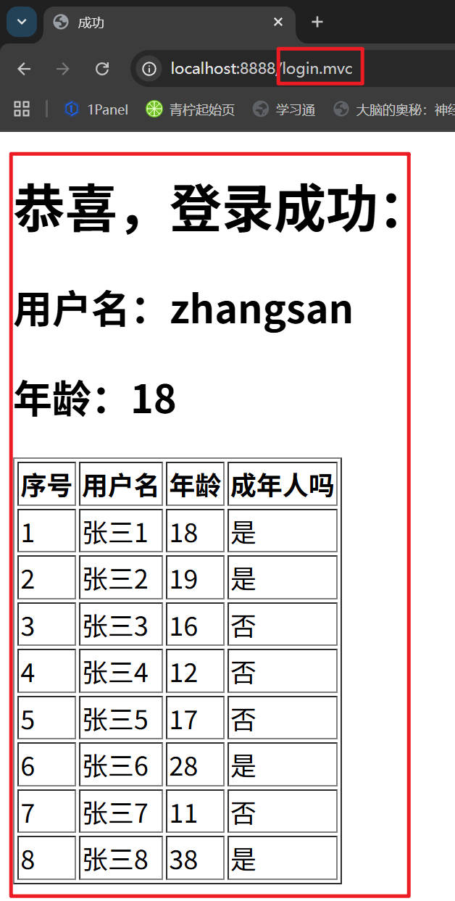


### Thymeleaf - 核心语法


::: tip

**th:xxx：**

+ **动态渲染指定的 html 标签属性值、或者th指令（遍历、判断等）**

+ **th:text：标签体内文本值渲染**

+ **th:属性：标签指定属性渲染**

+ **th:attr：标签任意属性渲染**

+ **th:if、th:each...：其他th指令**

**取值:**

+ **${}：变量取值**

+ **@{}：url路径**

+ **其他：#{}：国际化消息、~{}：片段引用、*{}：变量选择**

**遍历:**

+ **th:each="元素名,迭代状态 : ${集合}"**

**判断:**

+ **th:if**

**行内写法: [[ ]]**

:::


### 响应数据类型

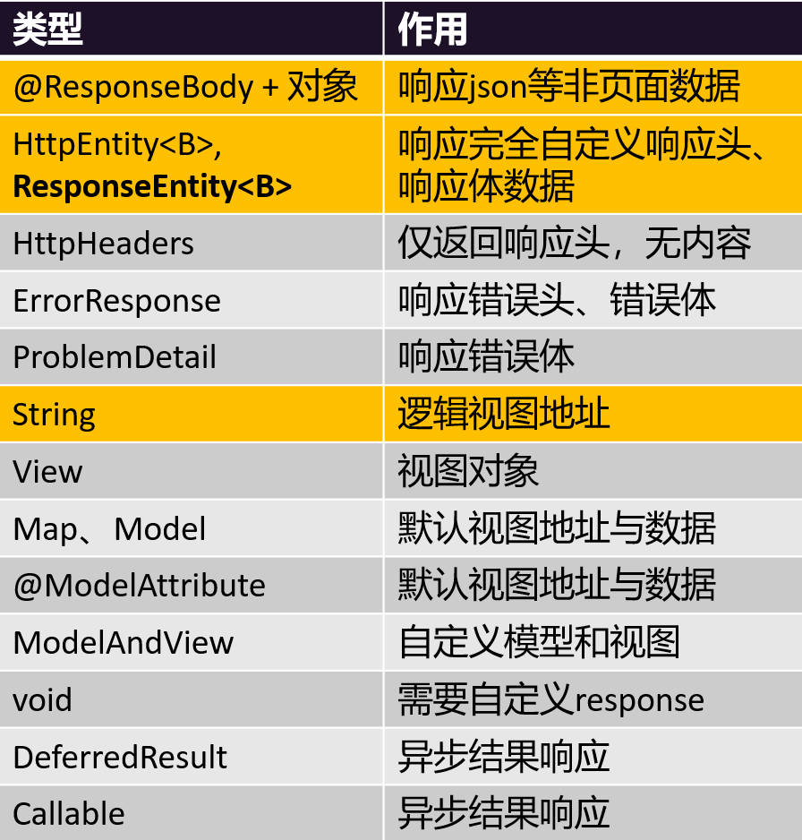

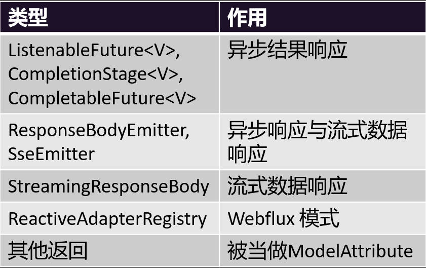
