## 拦截器

1.**SpringMVC内置`拦截器机制`，允许在`请求被目标方法处理的前后`进行拦截，执行一些`额外操作`；比如：`权限验证、日志记录、数据共享`等...**

2.**使用步骤**

+ **实现`HandlerInterceptor接口`的组件即可成为`拦截器`**

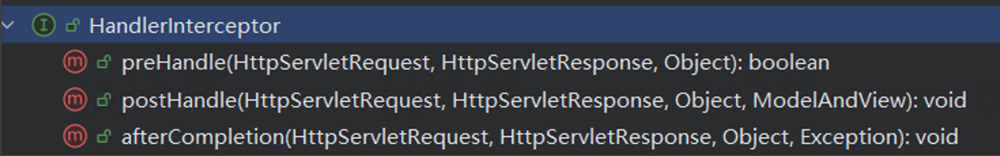

```java
package fun.xingji.practice.interceptor;

import jakarta.servlet.http.HttpServletRequest;
import jakarta.servlet.http.HttpServletResponse;
import org.springframework.stereotype.Component;
import org.springframework.web.servlet.HandlerInterceptor;
import org.springframework.web.servlet.ModelAndView;

@Component
public class MyHandlerInterceptor implements HandlerInterceptor {

    // 目标方法执行之前
    @Override
    public boolean preHandle(HttpServletRequest request,
                             HttpServletResponse response,
                             Object handler) throws Exception {
        System.out.println("MyHandlerInterceptor...preHandle...");
        // 放行； chain.doFilter(request,response);
        // 进行权限校验
        // String username = request.getParameter("username");
        // response.getWriter().write("No Permission!");
        return true;
    }


    // 目标方法执行之后
    @Override
    public void postHandle(HttpServletRequest request,
                           HttpServletResponse response,
                           Object handler,
                           ModelAndView modelAndView) throws Exception {
        System.out.println("MyHandlerInterceptor...postHandle...");
    }


    // 页面渲染之后
    @Override
    public void afterCompletion(HttpServletRequest request,
                                HttpServletResponse response,
                                Object handler,
                                Exception ex) throws Exception {
        System.out.println("MyHandlerInterceptor...afterCompletion...");
    }
}
```

+ **创建`WebMvcConfigurer`组件，并配置拦截器的`拦截路径`**

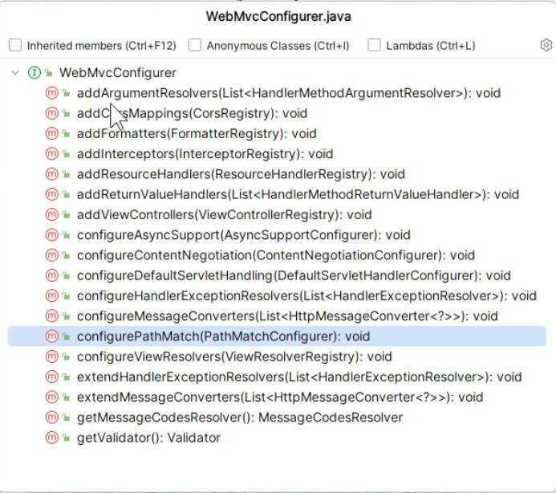

```java
package fun.xingji.practice.config;

import fun.xingji.practice.interceptor.MyHandlerInterceptor;
import org.springframework.beans.factory.annotation.Autowired;
import org.springframework.context.annotation.Configuration;
import org.springframework.web.servlet.config.annotation.InterceptorRegistry;
import org.springframework.web.servlet.config.annotation.WebMvcConfigurer;


/**
 * 1、容器中需要有这样一个组件：【WebMvcConfigurer】
 * 1)、@Bean 放一个 WebMvcConfigurer
 * 2)、配置类实现 WebMvcConfigurer
 */
@Configuration //专门对SpringMVC 底层做一些配置
public class MySpringMVCConfig implements WebMvcConfigurer {

    @Autowired
    MyHandlerInterceptor myHandlerInterceptor;


    // 添加拦截器
    @Override
    public void addInterceptors(InterceptorRegistry registry) {
        registry.addInterceptor(myHandlerInterceptor)
                .addPathPatterns("/**"); // 拦截所有请求
    }


    //    @Bean
//    WebMvcConfigurer webMvcConfigurer(){
//        return new WebMvcConfigurer() {
//            @Override
//            public void addInterceptors(InterceptorRegistry registry) {
//
//            }
//        };
//    }
}
```

+ **查看执行顺序效果：preHandle => 目标方法 => postHandle => afterCompletion**

```java
/**
     * 按照id查询员工
     * @param id
     * @return
     *
     * /employee/1/2/3
*/
// @RequestMapping(value = "/employee/{id}", method = RequestMethod.GET)
@GetMapping("/employee/{id}")
// @PathVariable("id") 注解用来获取路径中的参数
public R get(@PathVariable("id") Long id){
       System.out.println("查询用户,目标方法执行了......");
       Employee emp = employeeService.getEmp(id);
       return R.ok(emp);
}
```

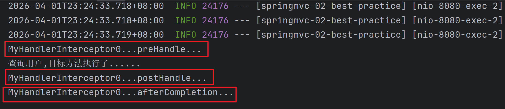


### 多拦截器执行顺序

::: tip 

**拦截器执行顺序：`顺序preHandle` => `目标方法` => `倒序postHandle` => `渲染` => `倒序afterCompletion`**

+ **只有执行成功的preHandle会倒序执行afterCompletion**

+ **postHandle 、afterCompletion 从哪里炸，倒序链路从哪里结束**

+ **postHandle 失败不会影响 afterCompletion 执行**

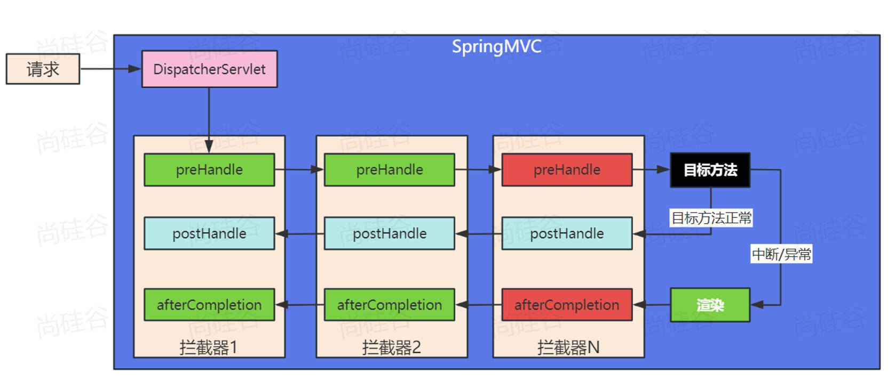

:::

+ **MyHandlerInterceptor0.java**

```java
package fun.xingji.practice.interceptor;

import jakarta.servlet.http.HttpServletRequest;
import jakarta.servlet.http.HttpServletResponse;
import org.springframework.stereotype.Component;
import org.springframework.web.servlet.HandlerInterceptor;
import org.springframework.web.servlet.ModelAndView;


@Component //拦截器还需要配置（告诉SpringMVC，这个拦截器主要拦截什么请求）
public class MyHandlerInterceptor0 implements HandlerInterceptor {

    @Override
    public boolean preHandle(HttpServletRequest request,
                             HttpServletResponse response, Object handler) throws Exception {
        System.out.println("MyHandlerInterceptor0...preHandle...");
        //放行； chain.doFilter(request,response);
        //String username = request.getParameter("username");
//        response.getWriter().write("No Permission!");
        return true;
    }

    @Override
    public void postHandle(HttpServletRequest request, HttpServletResponse response, Object handler, ModelAndView modelAndView) throws Exception {
        System.out.println("MyHandlerInterceptor0...postHandle...");
    }

    @Override
    public void afterCompletion(HttpServletRequest request, HttpServletResponse response, Object handler, Exception ex) throws Exception {
        System.out.println("MyHandlerInterceptor0...afterCompletion...");
    }
}
```


+ **MyHandlerInterceptor1.java**

```java
package fun.xingji.practice.interceptor;

import jakarta.servlet.http.HttpServletRequest;
import jakarta.servlet.http.HttpServletResponse;
import org.springframework.stereotype.Component;
import org.springframework.web.servlet.HandlerInterceptor;
import org.springframework.web.servlet.ModelAndView;


@Component //拦截器还需要配置（告诉SpringMVC，这个拦截器主要拦截什么请求）
public class MyHandlerInterceptor1 implements HandlerInterceptor {

    @Override
    public boolean preHandle(HttpServletRequest request,
                             HttpServletResponse response, Object handler) throws Exception {
        System.out.println("MyHandlerInterceptor1...preHandle...");
        //放行； chain.doFilter(request,response);
        //String username = request.getParameter("username");
//        response.getWriter().write("No Permission!");
        return true;
    }


    /**
     * postHandle是controller方法执行之后
     * @throws Exception
     */
    @Override
    public void postHandle(HttpServletRequest request, HttpServletResponse response, Object handler, ModelAndView modelAndView) throws Exception {
        System.out.println("MyHandlerInterceptor1...postHandle...");

    }


    /**
     * preHandle返回true，afterCompletion 方法才会执行
     */
    @Override
    public void afterCompletion(HttpServletRequest request, HttpServletResponse response, Object handler, Exception ex) throws Exception {
        System.out.println("MyHandlerInterceptor1...afterCompletion...");
    }
}
```


+ **MyHandlerInterceptor2.java**

```java
package fun.xingji.practice.interceptor;

import jakarta.servlet.http.HttpServletRequest;
import jakarta.servlet.http.HttpServletResponse;
import org.springframework.stereotype.Component;
import org.springframework.web.servlet.HandlerInterceptor;
import org.springframework.web.servlet.ModelAndView;


@Component //拦截器还需要配置（告诉SpringMVC，这个拦截器主要拦截什么请求）
public class MyHandlerInterceptor2 implements HandlerInterceptor {

    @Override
    public boolean preHandle(HttpServletRequest request,
                             HttpServletResponse response, Object handler) throws Exception {
        System.out.println("MyHandlerInterceptor2...preHandle...");

        return true;
    }

    @Override
    public void postHandle(HttpServletRequest request, HttpServletResponse response, Object handler, ModelAndView modelAndView) throws Exception {
        System.out.println("MyHandlerInterceptor2...postHandle...");
//        int  i = 10 / 0;
    }

    @Override
    public void afterCompletion(HttpServletRequest request, HttpServletResponse response, Object handler, Exception ex) throws Exception {
        System.out.println("MyHandlerInterceptor2...afterCompletion...");
    }
}
```


+ **MySpringMVCConfig.java**

```java
package fun.xingji.practice.config;

import fun.xingji.practice.interceptor.MyHandlerInterceptor0;
import fun.xingji.practice.interceptor.MyHandlerInterceptor1;
import fun.xingji.practice.interceptor.MyHandlerInterceptor2;
import org.springframework.beans.factory.annotation.Autowired;
import org.springframework.context.annotation.Configuration;
import org.springframework.web.servlet.config.annotation.InterceptorRegistry;
import org.springframework.web.servlet.config.annotation.WebMvcConfigurer;


/**
 * 1、容器中需要有这样一个组件：【WebMvcConfigurer】
 * 1)、@Bean 放一个 WebMvcConfigurer
 * 2)、配置类实现 WebMvcConfigurer
 */
@Configuration //专门对SpringMVC 底层做一些配置
public class MySpringMVCConfig implements WebMvcConfigurer {

    @Autowired
    MyHandlerInterceptor0 myHandlerInterceptor0;

    @Autowired
    MyHandlerInterceptor1 myHandlerInterceptor1;

    @Autowired
    MyHandlerInterceptor2 myHandlerInterceptor2;


    // 添加拦截器
    @Override
    public void addInterceptors(InterceptorRegistry registry) {
        // 注册拦截器
        registry.addInterceptor(myHandlerInterceptor0)
                .addPathPatterns("/**"); // 拦截所有请求

        // 注册拦截器
        registry.addInterceptor(myHandlerInterceptor1)
                .addPathPatterns("/**"); // 拦截所有请求

        // 注册拦截器
        registry.addInterceptor(myHandlerInterceptor2)
                .addPathPatterns("/**"); // 拦截所有请求
    }


    //    @Bean
//    WebMvcConfigurer webMvcConfigurer(){
//        return new WebMvcConfigurer() {
//            @Override
//            public void addInterceptors(InterceptorRegistry registry) {
//
//            }
//        };
//    }
}
```


### 拦截器 vs 过滤器

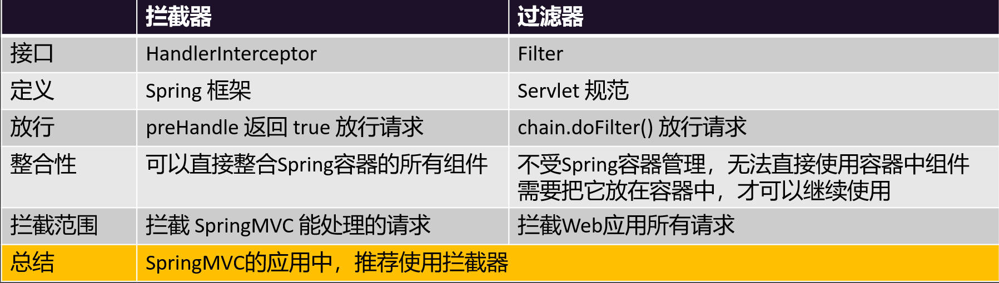

```java
package fun.xingji.practice.filter;

import jakarta.servlet.*;
import org.springframework.stereotype.Component;

import java.io.IOException;

//@WebFilter("/hello")  //原生的web注解就没用了
@Component // 默认拦截所有请求
public class HelloFilter implements Filter {
    @Override
    public void init(FilterConfig filterConfig) throws ServletException {
        Filter.super.init(filterConfig);
    }

    @Override
    public void doFilter(ServletRequest servletRequest, ServletResponse servletResponse, FilterChain filterChain) throws IOException, ServletException {
        System.out.println("filter 前置.....");
        filterChain.doFilter(servletRequest, servletResponse);
        System.out.println("filter 后置.....");
    }

    @Override
    public void destroy() {
        Filter.super.destroy();
    }
}
```


## 异常处理

### 编程式异常处理

+ **try - catch、throw、exception**

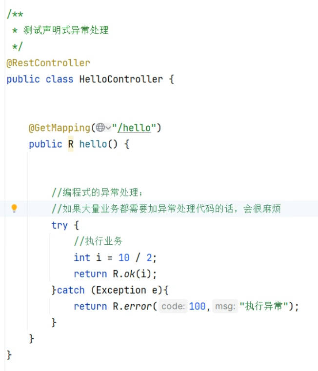

```java
//编程式的异常处理；
//如果大量业务都需要加异常处理代码的话，会很麻烦
try {
        //执行业务
        // int i = 10 / 0;
        int i = 10 / 2;
        return R.ok(i);
}catch (Exception e){
       return R.error(100,"执行异常");
}
```

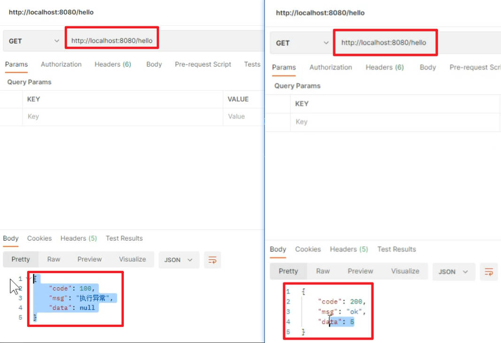


### 声明式异常处理

+ **SpringMVC 提供了 `@ExceptionHandler`、`@ControllerAdvice` 等便捷的`声明式注解`来进行`快速的异常处理`**

+ **`@ExceptionHandler`：可以处理`指定类型异常`**

> * **如果`Controller本类出现异常`，会自动在本类中找`有没有@ExceptionHandler标注`的`方法`，如果有，执行这个方法，它的`返回值`，就是`客户端收到的结果`**
> *  **如果`发生异常`，`多个`都能处理，就`精确优先`**

```java
package fun.xingji.practice.controller;

import fun.xingji.practice.common.R;
import org.springframework.web.bind.annotation.*;

import java.io.FileNotFoundException;

/**
 * 测试声明式异常处理
 */
@RestController
public class HelloController {

    @GetMapping("/hello")
    public R hello(@RequestParam(value = "i",defaultValue = "0") Integer i) throws FileNotFoundException {
        // 数学异常
        int j = 10 / i;

        // 文件异常
//        FileInputStream inputStream = new FileInputStream("D:\\123.txt");

        // 空指针异常
        String s = null;
        s.length();

        // 正常业务逻辑
        return R.ok(j);
    }


    /**
     * 1、如果Controller本类出现异常，会自动在本类中找有没有@ExceptionHandler标注的方法，
     *    如果有，执行这个方法，它的返回值，就是客户端收到的结果
     *  如果发生异常，多个都能处理，就精确优先
     * @return
     */
    // 数学异常处理
    @ResponseBody
    @ExceptionHandler(ArithmeticException.class)
    public R handleArithmeticException(ArithmeticException ex){
        System.out.println("【本类】 - ArithmeticException 异常处理");
        return R.error(100,"执行异常：" + ex.getMessage());
    }


    // 文件异常处理
    @ExceptionHandler(FileNotFoundException.class)
    public R handleException(FileNotFoundException ex){
        System.out.println("【本类】 - FileNotFoundException 异常处理");
        return R.error(300,"文件未找到异常：" + ex.getMessage());
    }

    // 其他异常处理
    @ExceptionHandler(Throwable.class)
    public R handleException02(Throwable ex){
        System.out.println("【本类】 - Throwable 异常处理");
        return R.error(500,"其他异常：" + ex.getMessage());
    }
}
```

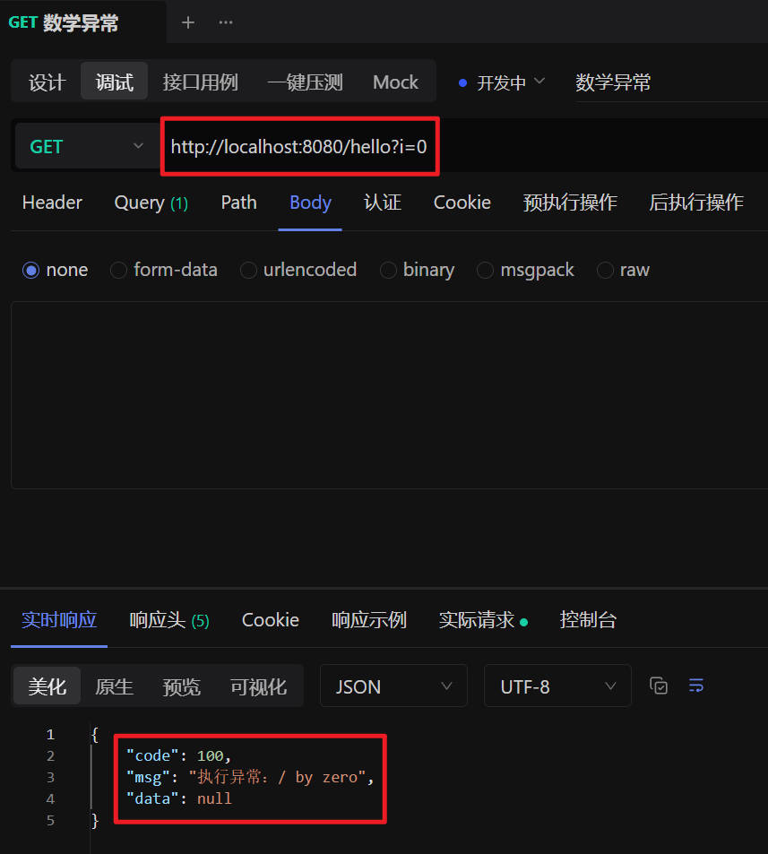

+ **`@ControllerAdvice`：可以集中处理`所有Controller的异常`**

> **异常处理优先级：**
>
> * **本类 > 全局**
> * **精确 > 模糊**

+ **HahaController.java**

```java
package fun.xingji.practice.controller;


import fun.xingji.practice.common.R;
import org.springframework.web.bind.annotation.ExceptionHandler;
import org.springframework.web.bind.annotation.GetMapping;
import org.springframework.web.bind.annotation.RestController;

import java.io.FileInputStream;
import java.io.FileNotFoundException;

@RestController
public class HahaController {


    @GetMapping("/haha")
    public R haha() throws FileNotFoundException {
//        int i = 10/0;
        new FileInputStream("1.txt");
        return R.ok();
    }


    /**
     * 异常处理优先级：
     *      本类 》 全局
     *      精确 》 模糊
     * @param e
     * @return
     */
    @ExceptionHandler(ArithmeticException.class)
    public R error(ArithmeticException e){
        System.out.println("【本类】 - ArithmeticException 处理");
        return R.error(500,e.getMessage());
    }
}
```

+ **GlobalExceptionHandler.java**

```java
package fun.xingji.practice.advice;

import fun.xingji.practice.common.R;
import fun.xingji.practice.exception.BizException;
import org.springframework.validation.BindingResult;
import org.springframework.validation.FieldError;
import org.springframework.web.bind.MethodArgumentNotValidException;
import org.springframework.web.bind.annotation.ExceptionHandler;
import org.springframework.web.bind.annotation.RestControllerAdvice;

import java.util.HashMap;
import java.util.List;
import java.util.Map;

// 全局异常处理器
//@ResponseBody
//@ControllerAdvice //告诉SpringMVC，这个组件是专门负责进行全局异常处理的
@RestControllerAdvice
public class GlobalExceptionHandler {


    /**
     * 如果出现了异常：本类和全局都不能处理，
     * SpringBoot底层对SpringMVC有兜底处理机制；自适应处理（浏览器响应页面、移动端会响应json）
     * 最佳实践：我们编写全局异常处理器，处理所有异常
     * @param e
     * @return
     */
    // 数学异常处理
    @ExceptionHandler(ArithmeticException.class)
    public R error(ArithmeticException e) {
        System.out.println("【全局】 - ArithmeticException 处理");
        return R.error(500, e.getMessage());
    }

    // 最终的兜底
    @ExceptionHandler(Throwable.class)
    public R error(Throwable e) {
        System.out.println("【全局】 - Exception处理" + e.getClass());
        return R.error(500, e.getMessage());
    }

}
```

+ **@ExceptionHandler + @ControllerAdvice： 可以完成全局统一异常处理**


### SpringBoot底层异常处理默认行为

+ **SpringBoot 依然 使用 SpringMVC 的异常处理机制**

+ **不过 SpringBoot 编写了一些默认的处理配置**

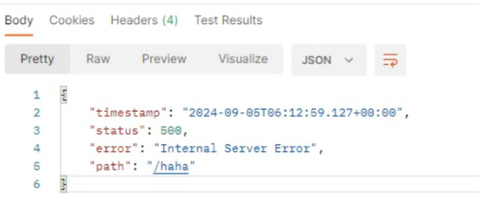

+ **默认行为**
  + **自适应的异常处理：**
    + **浏览器发的请求，出现异常返回默认错误页面**
    + **移动端发的请求，出现异常返回默认json错误数据；项目开发的时候错误模型需要按照项目的标准走**
    + **最佳实践：项目架构是一开始就决定好的（前后分离）**

::: tip 

**异常处理的最终方式：**

 * 1、**必须有业务异常类：BizException**
 * 2、**必须有异常枚举类：BizExceptionEnume  列举项目中每个模块将会出现的所有异常情况**
 * 3、**编写业务代码的时候，只需要编写正确逻辑，如果出现预期的问题，需要以抛异常的方式中断逻辑并通知上层。**
 * 4、**全局异常处理器：GlobalExceptionHandler；  处理所有异常，返回给前端约定的json数据与错误码**

:::

+ **BizException.java(异常错误类)**

```java
package fun.xingji.practice.exception;


import lombok.Data;

/**
 * 业务异常
 * 大型系统出现以下异常：异常处理文档，固化
 * 1、订单  1xxxx
 * 10001 订单已关闭
 * 10002 订单不存在
 * 10003 订单超时
 * .....
 * 2、商品  2xxxx
 * 20001 商品已下架
 * 20002 商品已售完
 * 20003 商品库存不足
 * ......
 * 3、用户
 * 30001 用户已注册
 * 30002 用户已登录
 * 30003 用户已注销
 * 30004 用户已过期
 *
 * 4、支付
 * 40001 支付失败
 * 40002 余额不足
 * 40003 支付渠道异常
 * 40004 支付超时
 *
 * 5、物流
 * 50001 物流状态错误
 * 50002 新疆得加钱
 * 50003 物流异常
 * 50004 物流超时
 */

@Data
public class BizException extends RuntimeException {

    private Integer code; //业务异常码
    private String msg; //业务异常信息

    // 业务异常类
    public BizException(Integer code, String message) {
        super(message);
        this.code = code;
        this.msg = message;
    }

    // 业务异常枚举类
    public BizException(BizExceptionEnume exceptionEnume) {
        super(exceptionEnume.getMsg());
        this.code = exceptionEnume.getCode();
        this.msg = exceptionEnume.getMsg();
    }
}
```


+ **BizExceptionEnume.java(异常处理枚举类)**

```java
package fun.xingji.practice.exception;

import lombok.Getter;

public enum BizExceptionEnume {


    // ORDER_xxx：订单模块相关异常
    // PRODUCT_xxx：商品模块相关异常

    // 动态扩充.....

    ORDER_CLOSED(10001, "订单已关闭"),
    ORDER_NOT_EXIST(10002, "订单不存在"),
    ORDER_TIMEOUT(10003, "订单超时"),
    PRODUCT_STOCK_NOT_ENOUGH(20003, "库存不足"),
    PRODUCT_HAS_SOLD(20002, "商品已售完"),
    PRODUCT_HAS_CLOSED(20001, "商品已下架");


    // 枚举属性
    @Getter
    private Integer code;
    @Getter
    private String msg;


    // 枚举构造器
    private BizExceptionEnume(Integer code, String msg) {
        this.code = code;
        this.msg = msg;
    }
}
```

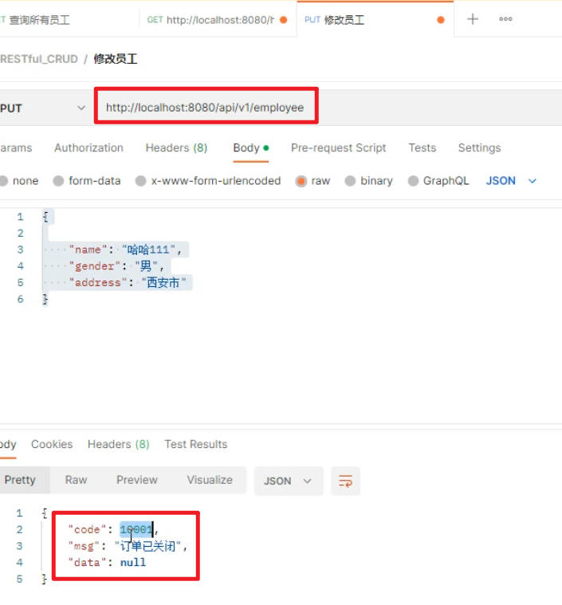


## 数据校验

::: tip 

1.**JSR 303 是 Java 为`Bean`数据合法性校验提供的标准框架，它已经包含在`JavaEE 6.0 标准`中。JSR 303 通过在`Bean属性上`标注类似于`@NotNull`、`@Max`等标准的`注解指定校验规则`，并通过`标准的验证接口对Bean`进行验证。**

2.**数据校验使用流程**

​	1、**引入校验依赖：spring-boot-starter-validation**

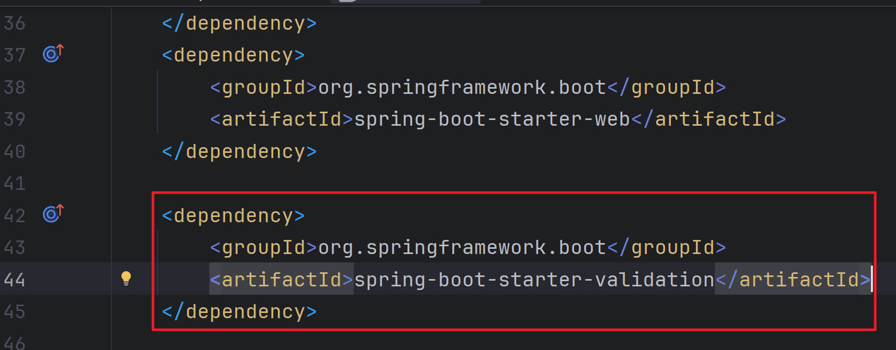

​	2、**定义封装数据的Bean**

​	3、**给Bean的字段标注校验注解，并指定校验错误消息提示**

```java
package fun.xingji.practice.bean;

import jakarta.validation.constraints.Max;
import jakarta.validation.constraints.Min;
import jakarta.validation.constraints.NotNull;
import lombok.Data;

import java.math.BigDecimal;

@Data
public class Employee {

    private Long id;

    @NotNull(message = "姓名不能为空")
    private String name;

    @NotNull(message = "年龄不能为空")
    @Max(value = 150, message = "年龄最大不能超过150")
    @Min(value = 0, message = "年龄最小不能小于0")
    private Integer age;

    @NotNull(message = "邮箱不能为空")
    private String email;

    private String gender;
    private String address;
    private BigDecimal salary;
}
```

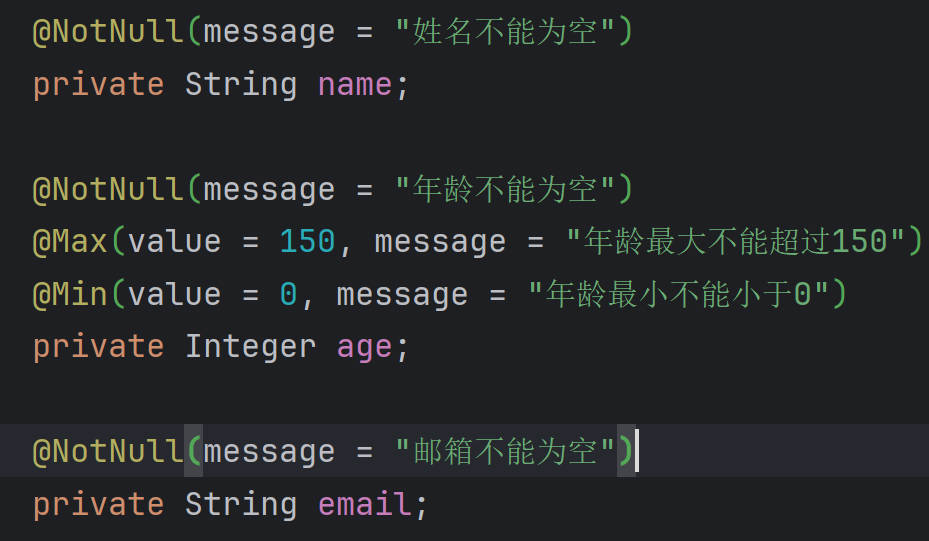

​	4、**使用@Valid、@Validated开启校验**

```java
/**
     * 新增员工；
     * 要求：前端发送请求把员工的json放在请求体中
     * @param employee
     * @return
*/
@PostMapping("/employee")
// @Valid 校验请求体中的数据是否合法
public R add(@RequestBody @Valid Employee employee){
       employeeService.saveEmp(employee);
       return R.ok();
}
```

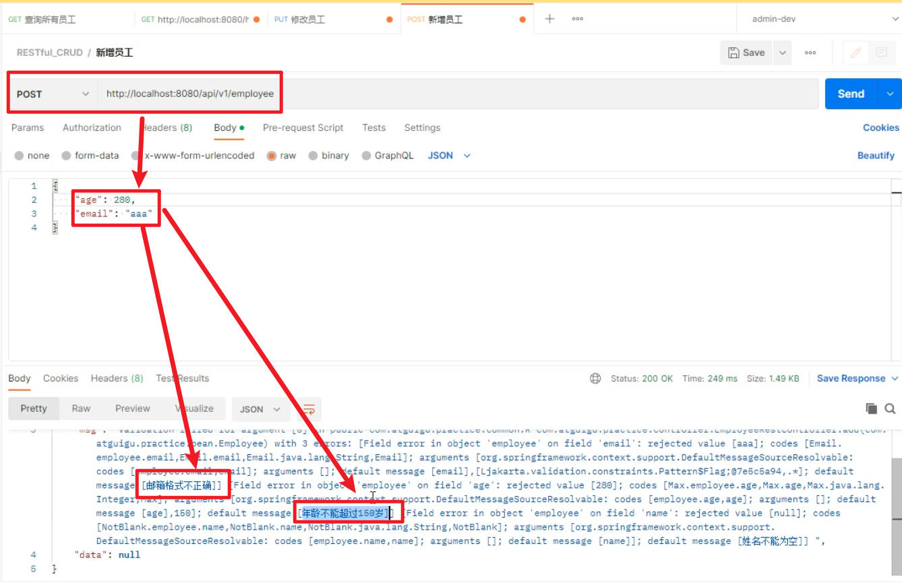

​	5、**使用 BindingResult 封装校验结果**

+ **EmployeeRestController.java**

```java
/**
     * 新增员工；
     * 要求：前端发送请求把员工的json放在请求体中
     * @param employee
     * @return
*/
@PostMapping("/employee")
// @Valid 校验请求体中的数据是否合法
public R add(@RequestBody @Valid Employee employee , BindingResult result){

        if(result.hasErrors()){ // 校验通过
            System.out.println("查询用户。目标方法执行.....");
            employeeService.saveEmp(employee);
            return R.ok();
        }

        // 参数校验异常处理
        // 说明校验错误； 拿到所有属性错误的信息
        Map<String, String> errorsMap = new HashMap<>();
        for (FieldError fieldError : result.getFieldErrors()) {
            //1、获取到属性名
            String field = fieldError.getField();
            //2、获取到错误信息
            String message = fieldError.getDefaultMessage();
            errorsMap.put(field, message);
        }
        return R.error(500, "校验失败", errorsMap);
}
```

**改进:**

+ **GlobalExceptionHandler.java**

```java
// 参数校验异常处理
@ExceptionHandler(value = MethodArgumentNotValidException.class)
public R methodArgumentNotValidException(MethodArgumentNotValidException ex) {
        //1、result 中封装了所有错误信息
        BindingResult result = ex.getBindingResult();

        // 2、获取所有错误信息
        List<FieldError> errors = result.getFieldErrors();
        // 3、封装错误信息
        Map<String, String> map = new HashMap<>();
        // 4、遍历错误信息，封装到map中
        for (FieldError error : errors) {
            // 字段名，错误信息
            String field = error.getField();
            // 默认信息
            String message = error.getDefaultMessage();
            // 封装到map中
            map.put(field, message);
        }

        // 5、返回错误信息
        return R.error(500, "参数错误", map);
}
```

​	6、**使用自定义校验注解 + 校验器(implements ConstraintValidator) 完成gender字段自定义校验规则**

+ **Employee.java**

```java
// 性别：男或女；可以使用正则完成比较复杂的校验逻辑
// @Pattern(regexp = "^男|女$", message = "性别只能为: 男, 女")
@Gender(message = "性别只能为: 男, 女")
private String gender;
```

+ **Gender.java(接口)**

```java
package fun.xingji.practice.annotation;

import fun.xingji.practice.validator.GenderValidator;
import jakarta.validation.Constraint;
import jakarta.validation.Payload;

import java.lang.annotation.Documented;
import java.lang.annotation.Retention;
import java.lang.annotation.Target;

import static java.lang.annotation.ElementType.FIELD;
import static java.lang.annotation.RetentionPolicy.RUNTIME;


// 校验注解 绑定 校验器
@Documented
@Constraint(validatedBy = {GenderValidator.class})  //校验器去真正完成校验功能。
@Target({ FIELD })
@Retention(RUNTIME)
public @interface Gender {

    String message() default "{jakarta.validation.constraints.NotNull.message}";
    Class<?>[] groups() default { };
    Class<? extends Payload>[] payload() default { };

}
```

+ **GenderValidator.java**

```java
package fun.xingji.practice.validator;

import fun.xingji.practice.annotation.Gender;
import jakarta.validation.ConstraintValidator;
import jakarta.validation.ConstraintValidatorContext;

public class GenderValidator implements ConstraintValidator<Gender, String> {
    /**
     *
     * @param value 前端提交来的准备让我们进行校验的属性值
     * @param context 校验上下文
     *
     * @return
     */
    @Override
    public boolean isValid(String value, ConstraintValidatorContext context) {

        return "男".equals(value) || "女".equals(value);
    }
}
```

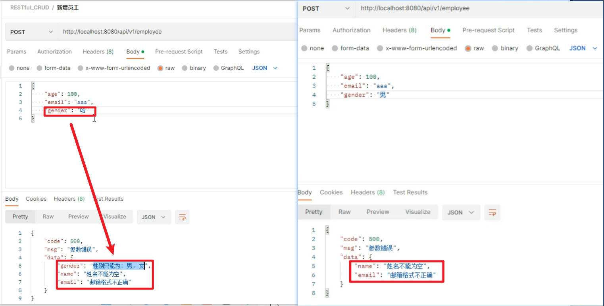

​	7、**结合校验注解 message属性 与 i18n 文件，实现错误消息国际化**

```java
// 国际化(internationalization) i18n
// 中文网站：性别只能为: 男, 女
// 英文网站：gender must be one of: Male, Female
@Gender(message = "{message.gender}") // message = "{}" 占位符
private String gender;
```

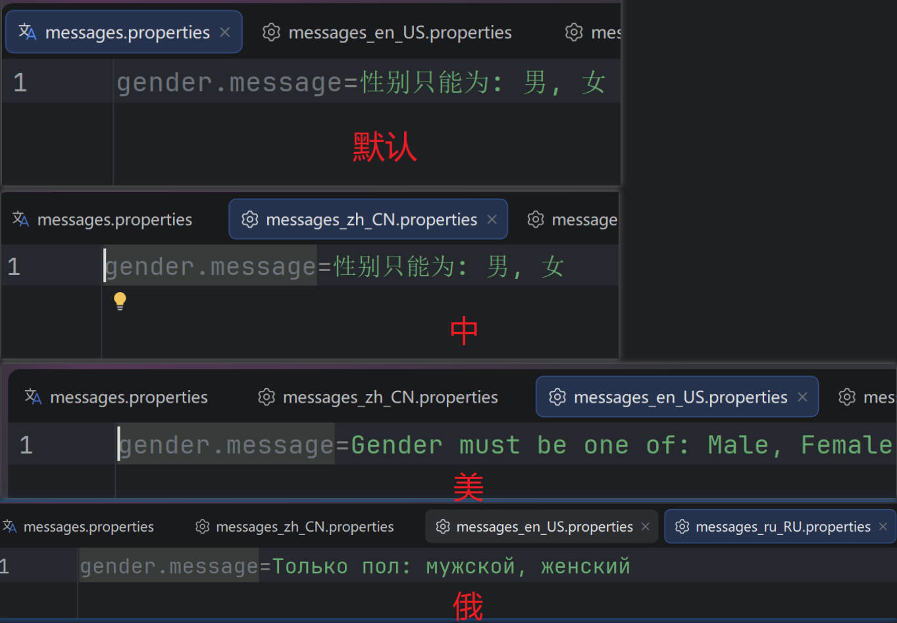

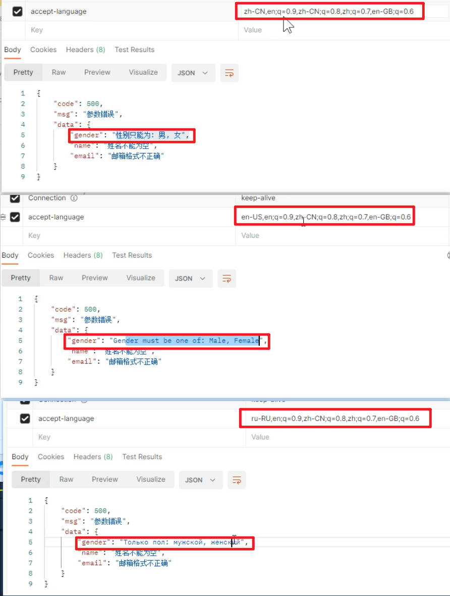

​	8、**结合全局异常处理，统一处理数据校验错误**

:::


### 项目中的vo用法

```java
设计模式：单一职责；
JavaBean也要分层，各种xxO：
	Pojo：普通java类
	Dao：Database Access Object ： 专门用来访问数据库的对象
	DTO：Data Transfer Object： 专门用来传输数据的对象；
	TO：transfer Object： 专门用来传输数据的对象；
	BO：Business Object： 业务对象（Service），专门用来封装业务逻辑的对象；
	VO：View/Value Object： 值对象，视图对象（专门用来封装前端数据的对象）
```

+ **EmployeeAddVo.java(封装添加员工对象)**

```java
package fun.xingji.practice.vo.req;

import fun.xingji.practice.annotation.Gender;
import jakarta.validation.constraints.*;
import lombok.Data;

import java.math.BigDecimal;

@Data
public class EmployeeAddVo {

    @NotBlank(message = "姓名不能为空")
    private String name;


    @NotNull(message = "年龄不能为空")
    @Max(value = 150, message = "年龄不能超过150岁")
    @Min(value = 0, message = "年龄不能小于0岁")
    private Integer age;


    @Email(message = "邮箱格式不正确")
    private String email;


    @Gender(message = "{gender.message}") //message = "{}" 占位符
    private String gender;

    private String address;

    private BigDecimal salary;
}
```

+ **EmployeeUpdateVo.java(封装修改员工对象)**

```java
package fun.xingji.practice.vo.req;

import jakarta.validation.constraints.NotNull;
import lombok.Data;

import java.math.BigDecimal;

@Data
public class EmployeeUpdateVo {
    @NotNull(message = "id不能为空")
    private Long id;
    private String name;
    private Integer age;
    private String email;
    private String gender;
    private String address;
    private BigDecimal salary;
}
```

+ **EmployRespVo.java(封装响应对象)**

```java
package fun.xingji.practice.vo.resp;

import lombok.Data;

import java.math.BigDecimal;

@Data
public class EmployRespVo {

    private Long id;
    private String name;
    private String email;
    private String gender;
    private String address;
    private BigDecimal salary;
}
```

+ **EmployeeRestController.java**

```java
/**
     * 新增员工；
     * 要求：前端发送请求把员工的json放在请求体中
     * @param vo
     * @return
*/
@PostMapping("/employee")
// @Valid 校验请求体中的数据是否合法
public R add(@RequestBody @Valid EmployeeAddVo vo){
        // vo 转成 employee
        Employee employee = new Employee();
        // 拷贝属性
        BeanUtils.copyProperties(vo,employee);
        // 增加员工
        employeeService.saveEmp(employee);
        // 返回结果
        return R.ok();
}

    /**
     * 修改员工
     * 要求：前端发送请求把员工的json放在请求体中； 必须携带id
     * @param vo
     * @return
     */
@PutMapping("/employee")
public R update(@RequestBody EmployeeUpdateVo vo){
        // vo 转成 employee
        Employee employee = new Employee();
        // 拷贝属性
        BeanUtils.copyProperties(vo,employee);
        // 修改员工
        employeeService.updateEmp(employee);
        // 返回结果
        return R.ok();
}


/**
   * 查询所有员工
   * @return
*/
@GetMapping("/employees")
public R all(){
        // 查询所有员工
        List<Employee> employees = employeeService.getList();

        // VO: 脱敏，分层
        // 员工列表 转 VO列表
        List<EmployRespVo> collect = employees.stream()
                .map(employee -> {
                    // 员工 转 VO
                    EmployRespVo vo = new EmployRespVo();
                    // 拷贝属性
                    BeanUtils.copyProperties(employee, vo);
                    // 脱敏处理
                    return vo;
                }).collect(Collectors.toList());

        // 返回结果
        return R.ok(collect);
}
```

+ **测试:**

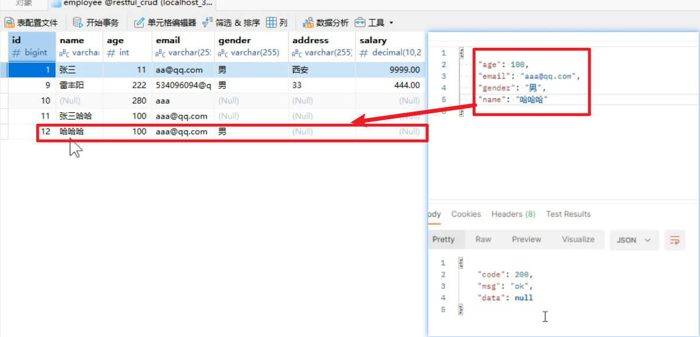

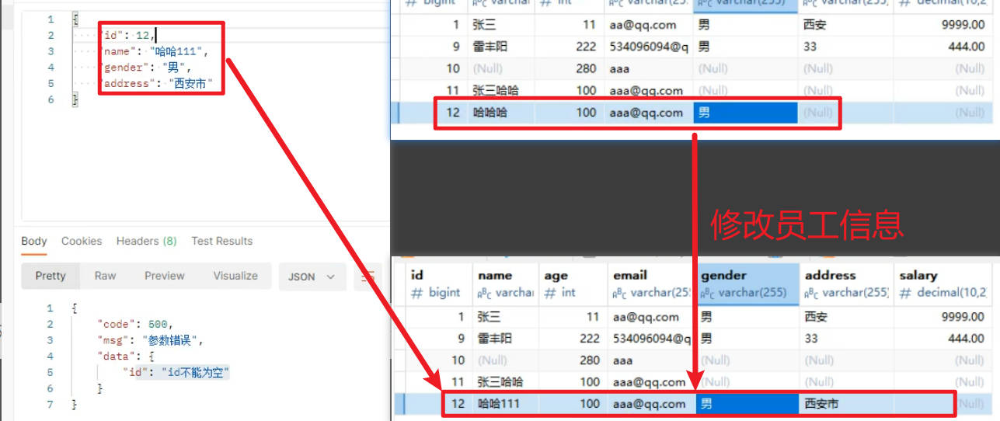

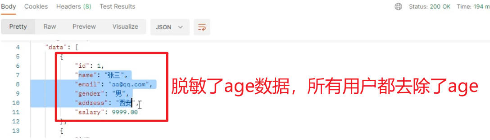


### JSR 303 校验注解

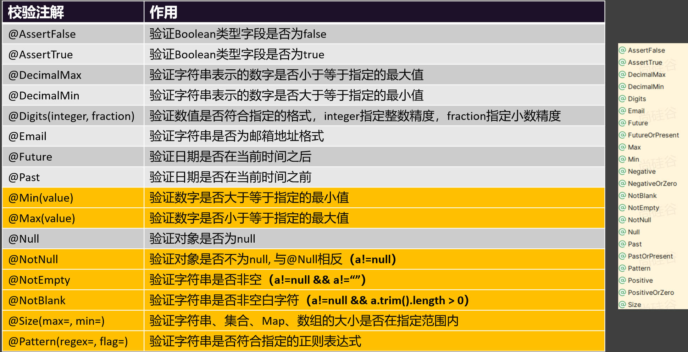


## 接口文档

::: tip 

+ **Swagger 可以快速生成实时接口文档，方便前后开发人员进行协调沟通。遵循OpenAPI规范。**

+ **Knife4j 是基于Swagger之上的增强套件**

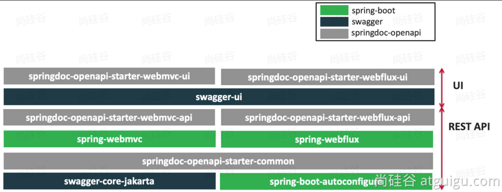

+ **Knife4j 使用，参考：https://doc.xiaominfo.com/docs/quick-start**

+ **swagger标准常用注解；**

+ **访问 http://ip:port/doc.html 即可查看接口文档**

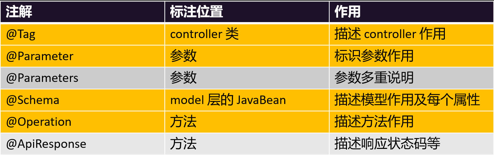

:::

+ **首先，引用Knife4j的starter：**

```xml
<dependency>
    <groupId>com.github.xiaoymin</groupId>
    <artifactId>knife4j-openapi3-jakarta-spring-boot-starter</artifactId>
    <version>4.4.0</version>
</dependency>
```

> **降低spring-boot-starter-parent版本为3.3.3**

```xml
<parent>
      <groupId>org.springframework.boot</groupId>
      <artifactId>spring-boot-starter-parent</artifactId>
      <version>3.3.3</version>
      <relativePath/> <!-- lookup parent from repository -->
</parent>
```

+ **引入之后，其余的配置，开发者即可完全参考[springdoc-openapi](https://springdoc.org/)的项目说明，Knife4j只提供了增强部分，如果要启用Knife4j的增强功能，可以在配置文件中进行开启**

```yaml
# springdoc-openapi项目配置
springdoc:
  swagger-ui:
    path: /swagger-ui.html
    tags-sorter: alpha
    operations-sorter: alpha
  api-docs:
    path: /v3/api-docs
  group-configs:
    - group: 'default'
      paths-to-match: '/**'
      packages-to-scan: fun.xingji.practice.controller
# knife4j的增强配置，不需要增强可以不配
knife4j:
  enable: true
  setting:
    language: zh_cn
```

+ **最后，使用OpenAPI3的规范注解，注释各个Spring的REST接口，示例代码如下：**

  ```java
  @RestController
  @RequestMapping("body")
  @Tag(name = "body参数")
  public class BodyController {
  
     @Operation(summary = "普通body请求")
     @PostMapping("/body")
     public ResponseEntity<FileResp> body(@RequestBody FileResp fileResp){
         return ResponseEntity.ok(fileResp);
     }
  
     @Operation(summary = "普通body请求+Param+Header+Path")
     @Parameters({
             @Parameter(name = "id",description = "文件id",in = ParameterIn.PATH),
             @Parameter(name = "token",description = "请求token",required = true,in = ParameterIn.HEADER),
             @Parameter(name = "name",description = "文件名称",required = true,in=ParameterIn.QUERY)
     })
     @PostMapping("/bodyParamHeaderPath/{id}")
     public ResponseEntity<FileResp> bodyParamHeaderPath(@PathVariable("id") String id,@RequestHeader("token") String token, @RequestParam("name")String name,@RequestBody FileResp fileResp){
         fileResp.setName(fileResp.getName()+",receiveName:"+name+",token:"+token+",pathID:"+id);
         return ResponseEntity.ok(fileResp);
     }
  }
  ```

  > **最后，访问Knife4j的文档地址：`http://ip:port/doc.html`即可查看文档**


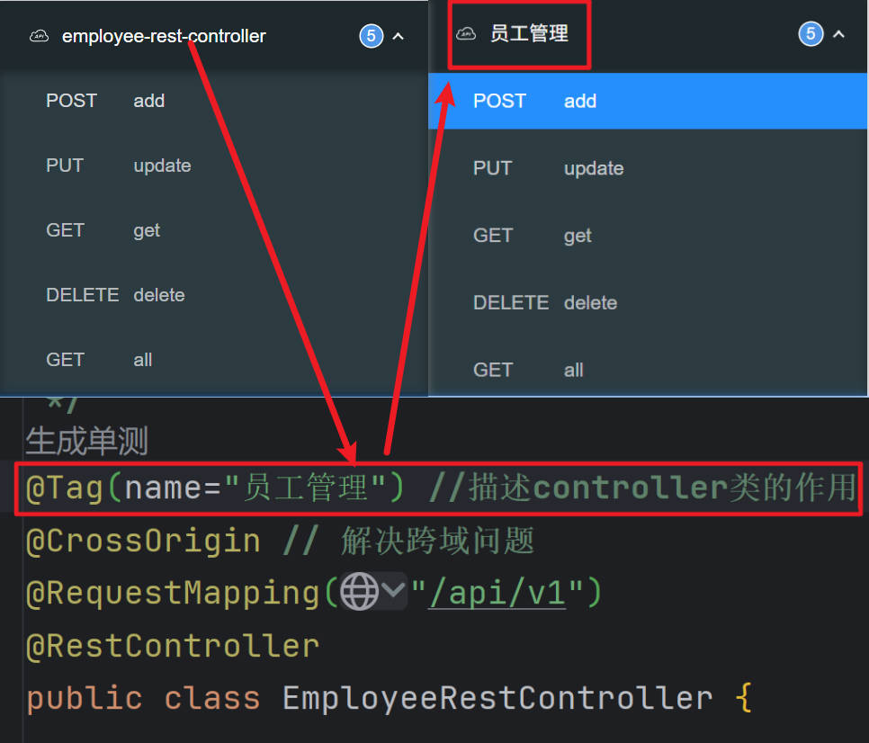

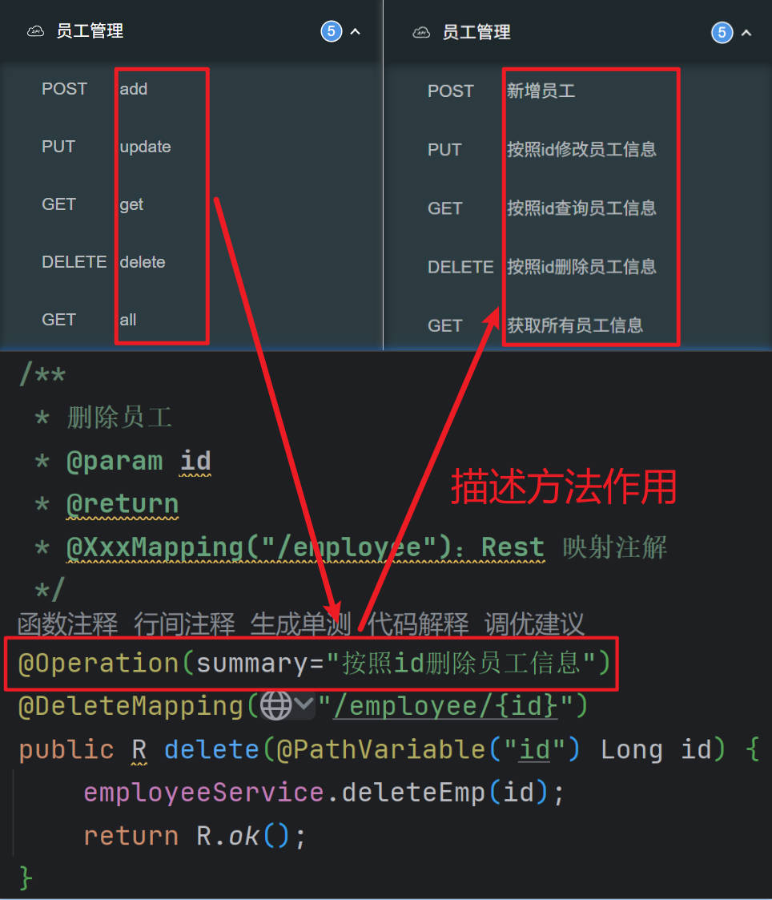

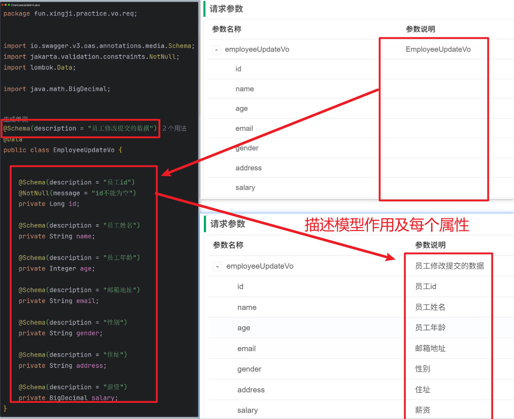

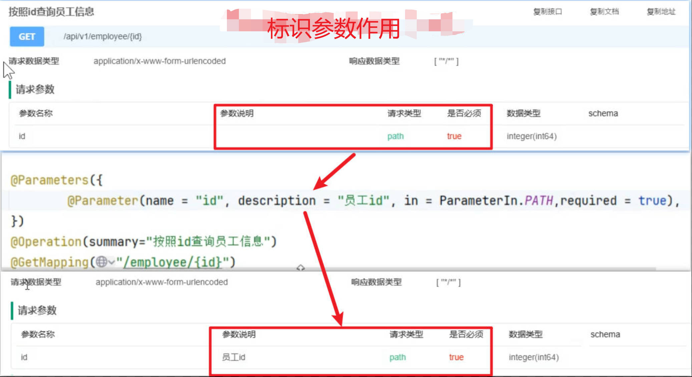

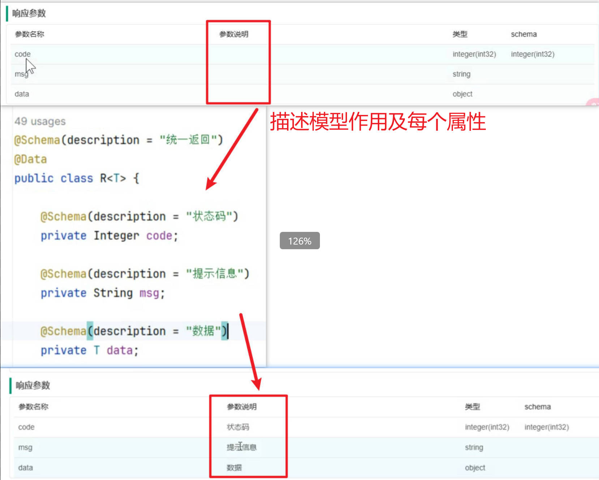


## 数据转换

> **@JsonFormat：日期处理**
>
> 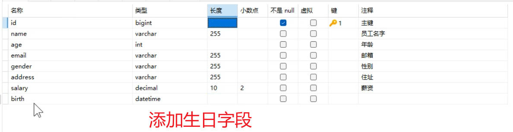
>
> 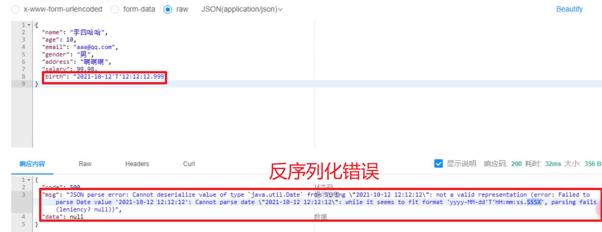

+ **Employee.java**

```java
package fun.xingji.practice.bean;

import lombok.Data;

import java.math.BigDecimal;
import java.util.Date;

@Data
public class Employee {

    private Long id;
    private String name;
    private Integer age;
    private String email;
    private String gender;
    private String address;
    private BigDecimal salary;

    // 添加生日字段
    private Date birth;
}
```

+ **EmployeeDaoImpl.java**

```java
// 新增员工
@Override
public void addEmp(Employee employee) {
// 新增语句
        String sql = "insert into employee(name,age,email,gender,address,salary,birth) values (?,?,?,?,?,?,?)";
        // 执行新增
        int update = jdbcTemplate.update(sql,
                employee.getName(),
                employee.getAge(),
                employee.getEmail(),
                employee.getGender(),
                employee.getAddress(),
                employee.getSalary(),
                employee.getBirth());
        // 打印结果
        System.out.println("新增成功，影响行数：" + update);
}
```

**EmployeeAddVo.java(封装添加员工对象)**

```java
package com.atguigu.practice.vo.req;


import com.atguigu.practice.annotation.Gender;
import com.fasterxml.jackson.annotation.JsonFormat;
import jakarta.validation.constraints.*;
import lombok.Data;

import java.math.BigDecimal;
import java.util.Date;

@Data
public class EmployeeAddVo {

    @NotBlank(message = "姓名不能为空")
    private String name;


    @NotNull(message = "年龄不能为空")
    @Max(value = 150, message = "年龄不能超过150岁")
    @Min(value = 0, message = "年龄不能小于0岁")
    private Integer age;


    @Email(message = "邮箱格式不正确")
    private String email;


    @Gender(message = "{gender.message}") //message = "{}" 占位符
    private String gender;

    private String address;

    private BigDecimal salary;


    //只要是日期：标注统一注解：@JsonFormat(pattern = "yyyy-MM-dd HH:mm:ss", timezone = "GMT+8")
    //默认的日期格式： 2024-09-05T08:47:58.000+00:00
    //反序列化：前端提交日期字符串 ===> 日期对象
    //序列化：  日期对象 ===> 日期字符串
    @JsonFormat(pattern = "yyyy-MM-dd HH:mm:ss", timezone = "GMT+8")
    private Date birth;
}
```

+ **EmployRespVo.java(封装响应对象)**

```java
package fun.xingji.practice.vo.resp;

import com.fasterxml.jackson.annotation.JsonFormat;
import lombok.Data;

import java.math.BigDecimal;
import java.util.Date;

@Data
public class EmployRespVo {

    private Long id;
    private String name;
    private String email;
    private String gender;
    private String address;
    private BigDecimal salary;

    // 只要是日期：标注统一注解：@JsonFormat(pattern = "yyyy-MM-dd HH:mm:ss")
    @JsonFormat(pattern = "yyyy-MM-dd HH:mm:ss")
    private Date birth;
}
```

+ **EmployeeRestController.java**

```java
/**
     * 新增员工；
     * 要求：前端发送请求把员工的json放在请求体中
     *
     * @param vo
     * @return
*/
@Operation(summary="新增员工")
@PostMapping("/employee")
// @Valid 校验请求体中的数据是否合法
public R add(@RequestBody @Valid EmployeeAddVo vo) {
        // vo 转成 employee
        Employee employee = new Employee();
        // 拷贝属性
        BeanUtils.copyProperties(vo, employee);
        // 增加员工
        employeeService.saveEmp(employee);
        // 返回结果
        return R.ok();
}
```

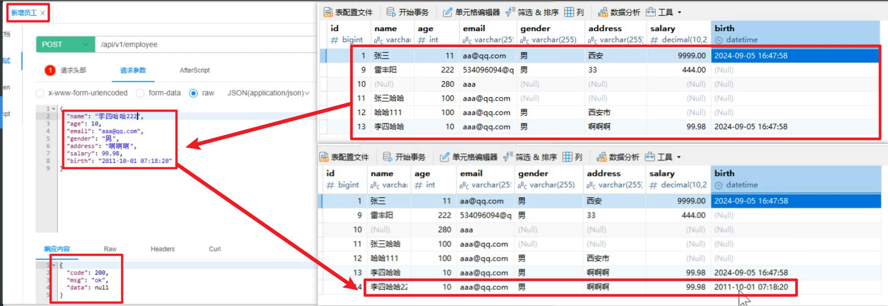
