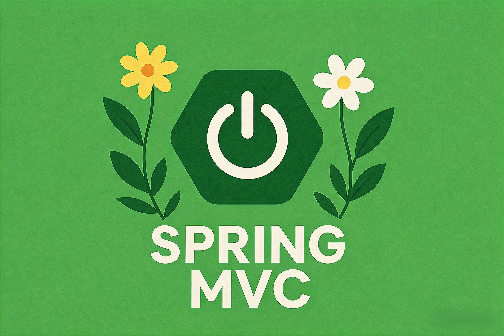

## SpringMVC 简介

::: tip 

**官网：https://docs.spring.io/spring-framework/reference/web/webmvc.html**

**SpringMVC 是`Spring 的 web 模块`，用来`开发Web应用`**

**SprinMVC 应用最终作为`B/S(浏览器)、C/S(客户端)模式下的 Server 端`**

**Web应用的核心就是`处理HTTP请求响应`**

:::

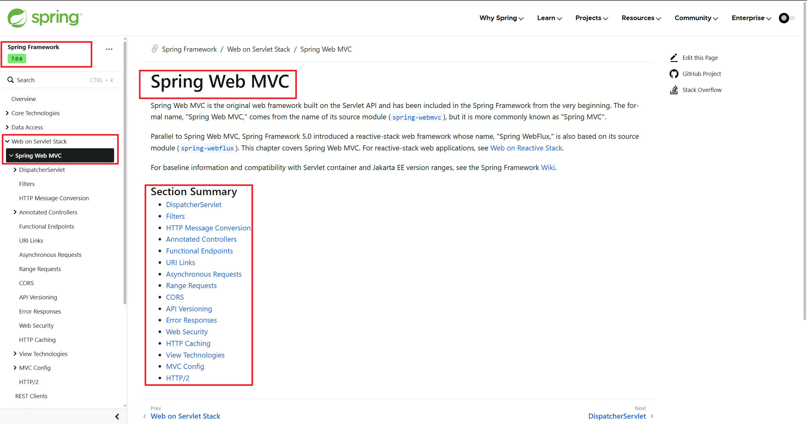


### 两种开发模式

::: tip 

+ **开发模式**
  + **前后分离开发**
  + **前后不分离开发**

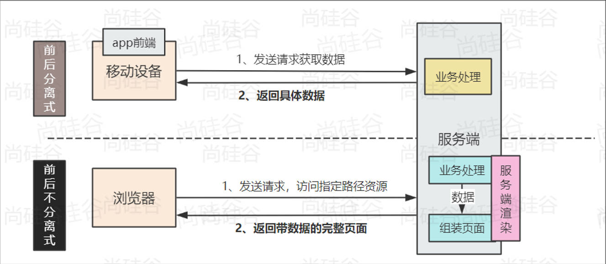

+ **前后分离开发**
  + **@ResponseBody**
  + **@RestController**

+ **服务端渲染**
  + **转发**
  + **重定向**

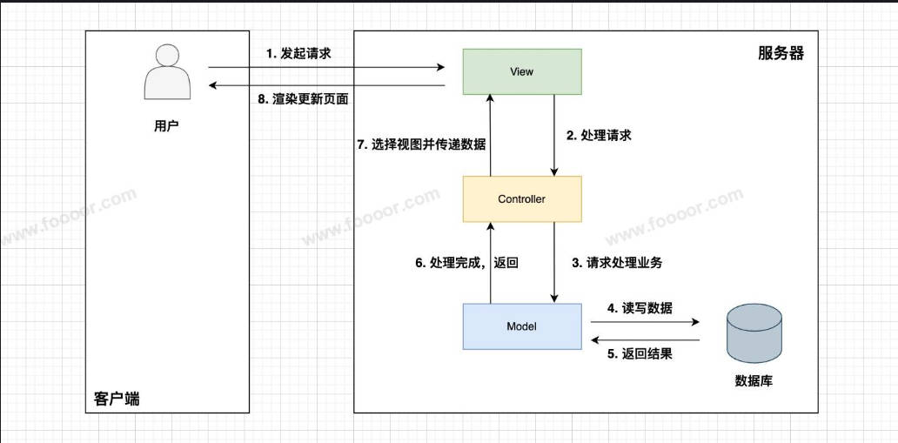

**MVC 设计模式是一种经典的软件架构模式，包含三个部分：**

- **Model（模型）**：处理具体的业务逻辑与数据；
- **View（视图）**：负责展示数据；
- **Controller（控制器）**：接收用户请求、协调 Model 和 View。

:::


### Hello World

> **场景：浏览器发送 /hello 请求，服务端响应 “Hello,Spring MVC! 你好!~~~”**

+ **HelloController.java**

```java
package fun.xingji.springmvc.controller;

import org.springframework.stereotype.Controller;
import org.springframework.web.bind.annotation.RequestMapping;
import org.springframework.web.bind.annotation.ResponseBody;

@Controller // 告诉Spring这是一个控制器（处理请求的组件）
public class HelloController {

    @ResponseBody // 把返回值放到响应体中； 每次请求进来执行目标方法
    @RequestMapping("/hello")
    public String hello() {
        return "Hello,Spring MVC! 你好!~~~";
    }
}
```

+ **Springmvc01HelloworldApplication.java**

```java
package fun.xingji.springmvc;

import org.springframework.boot.SpringApplication;
import org.springframework.boot.autoconfigure.SpringBootApplication;

/**
 * 效果：其实是 SpringBoot 做的。
 * 1、tomcat不用整合
 * 2、servlet开发变得简单，不用实现任何接口
 * 3、自动解决了乱码等问题
 */
@SpringBootApplication
public class Springmvc01HelloworldApplication {

    public static void main(String[] args) {
        SpringApplication.run(Springmvc01HelloworldApplication.class, args);
    }

}
```


## 路径映射 - @RequestMapping


### 路径映射

::: tip

**路径规则：https://docs.spring.io/spring-framework/docs/6.1.11/javadoc-api/org/springframework/web/util/pattern/PathPattern.html**

::: note 

**精确路径必须`全局唯一`**
**路径位置通配符： 多个都能匹配上，那就`精确优先`**

```java
*: 匹配任意多个字符（0~N）； 不能匹配多个路径
    
**： 匹配任意多层路径
    
?: 匹配任意单个字符（1）
```

> **精确程度：`完全匹配 > ? > * > **`**

:::

**路径变量：@PathVariable**

:::

+ **HelloController.java**

```java
package fun.xingji.springmvc.controller;

import org.springframework.stereotype.Controller;
import org.springframework.web.bind.annotation.RequestMapping;
import org.springframework.web.bind.annotation.ResponseBody;

@Controller // 告诉Spring这是一个控制器（处理请求的组件）
public class HelloController {

    /**
     *
     * 精确路径必须全局唯一
     * 路径位置通配符： 多个都能匹配上，那就精确优先
     *      *: 匹配任意多个字符（0~N）； 不能匹配多个路径
     *      **： 匹配任意多层路径
     *      ?: 匹配任意单个字符（1）
     *   精确程度： 完全匹配 > ? > * > **
     *
     * @return
     */
    @ResponseBody // 把返回值放到响应体中； 每次请求进来执行目标方法
    @RequestMapping("/hello")
    public String hello() {
        System.out.println("hello方法执行了!");
        return "Hello,Spring MVC! 你好!~~~";
    }

    // ? 表示任意单个字符
    @ResponseBody // 把返回值放到响应体中； 每次请求进来执行目标方法
    @RequestMapping("/hell?")
    public String hello01() {
        System.out.println("hello01方法执行了!");
        return "hello01";
    }

    // * 表示任意多个字符，但不能匹配多个路径
    @ResponseBody
    @RequestMapping("/hell*")
    public String hello02() {
        System.out.println("hello02方法执行了!");
        return "hello02";
    }

    // ** 表示任意多层路径
    @ResponseBody
    @RequestMapping("/he/**")
    public String hello03() {
        System.out.println("hello03方法执行了!");
        return "hello03";
    }
}
```

+ **测试:**

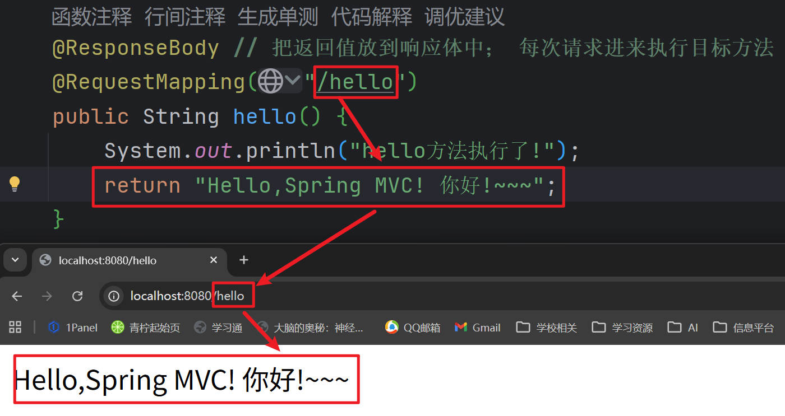

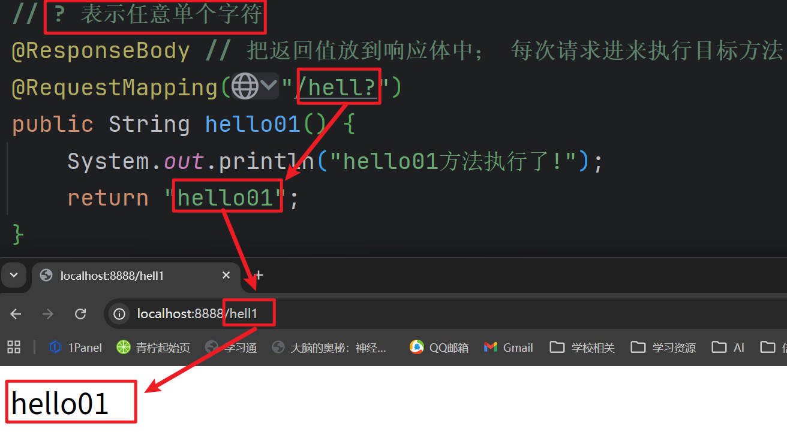

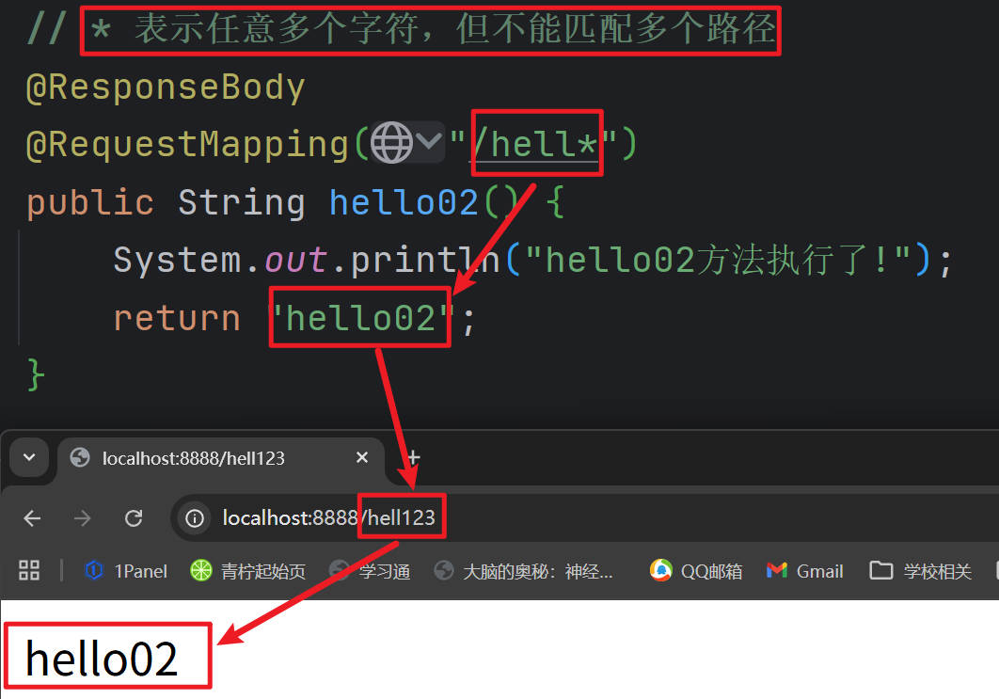

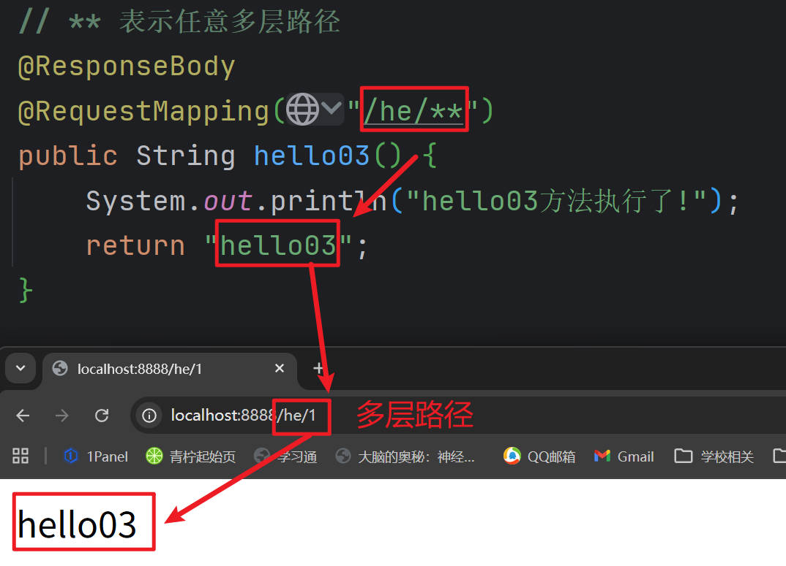


### 请求限定

::: tip

```java
package org.springframework.web.bind.annotation;

import java.lang.annotation.Documented;
import java.lang.annotation.ElementType;
import java.lang.annotation.Retention;
import java.lang.annotation.RetentionPolicy;
import java.lang.annotation.Target;
import org.springframework.aot.hint.annotation.Reflective;
import org.springframework.core.annotation.AliasFor;

@Target({ElementType.TYPE, ElementType.METHOD})
@Retention(RetentionPolicy.RUNTIME)
@Documented
@Mapping
@Reflective({ControllerMappingReflectiveProcessor.class})
public @interface RequestMapping {
    String name() default "";

    @AliasFor("path")
    String[] value() default {};

    @AliasFor("value")
    String[] path() default {};

    // 请求方式：method
    RequestMethod[] method() default {};

    // 请求参数：params
    String[] params() default {};

    // 请求头：headers
    String[] headers() default {};

    // 请求内容类型：consumes
    String[] consumes() default {};

    // 响应内容类型：produces
    String[] produces() default {};
}
```

:::

+ **请求方式：method**

```java
/**
     * 请求方式：
     *      GET, HEAD, POST, PUT, PATCH, DELETE, OPTIONS, TRACE
     * @return
     */
@RequestMapping(value = "/test01",method = {RequestMethod.DELETE,RequestMethod.GET}) // 限定请求方式为DELETE和GET
public String test01(){
       return "hello world";
}
```

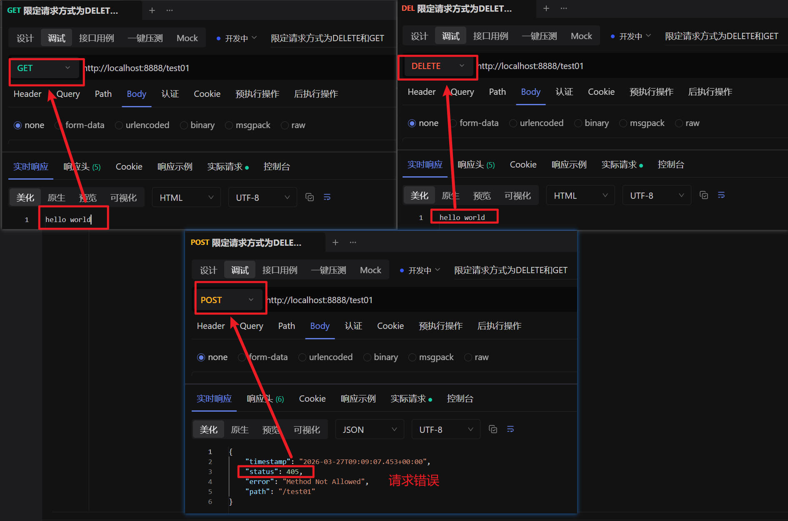


+ **请求参数：params**

```java
/**
     * 请求参数：params = {"username","age"}
     * 1）、username：  表示请求必须包含username参数
     * 2）、age=18：   表示请求参数中必须包含age=18的参数
     * 3）、gender!=1：  表示请求参数中不能包含gender=1的参数
     * @return
     */
@RequestMapping(value = "/test02",params = {"age=18","username","gender!=1"})
public String test02(){
       return "hello world";
}
```

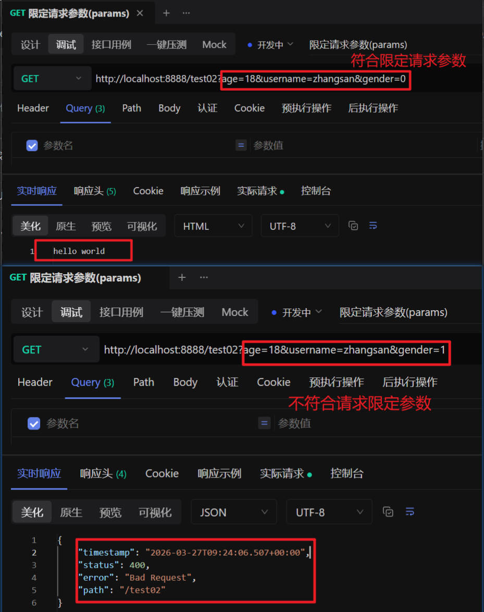


+ **请求头：headers**

```java
/**
     * 请求头：headers = {"haha"}
     * 1）、haha：  表示请求中必须包含名为haha的请求头
     * 2）、hehe!=1：  表示请求头中 的 hehe 不能是1；（hehe=0，不带hehe）
     * @return
*/
@RequestMapping(value = "/test03",headers = {"haha"})
public String test03(){
       return "test03";
}
```

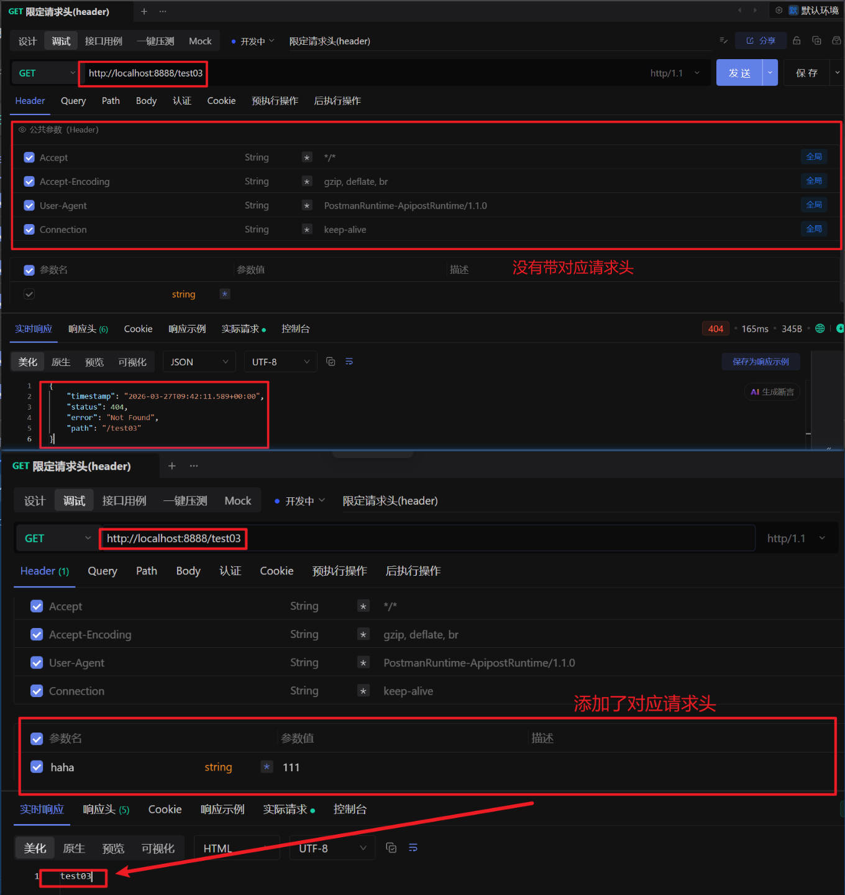


+ **请求内容类型：consumes**

```java
/**
     * 请求内容类型：consumes = {"application/json"}; 消费什么数据；
     * Media Type：媒体类型
     * 1）、application/json：  表示浏览器必须携带 json 格式的数据。
     * @return
*/
@RequestMapping(value = "/test04",consumes = {"application/json"})
public String test04(){
       return "test04";
}
```

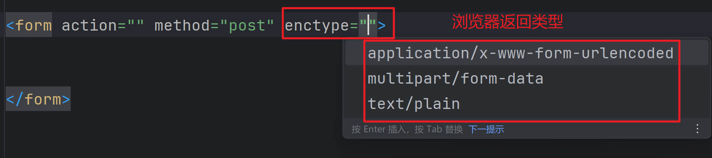

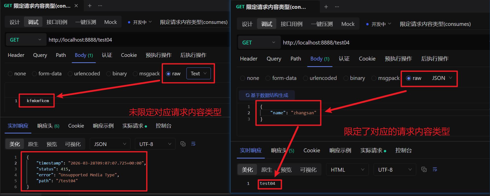


+ **响应内容类型：produces**

```java
/**
     * 响应内容类型：produces = {"text/plain;charset=utf-8"}; 生产什么数据；
     * @return
*/
@RequestMapping(value = "/test05",produces = {"text/html;charset=utf-8"})
public String test05(){
       return "<h1>你好，张三</h1>";
}
```

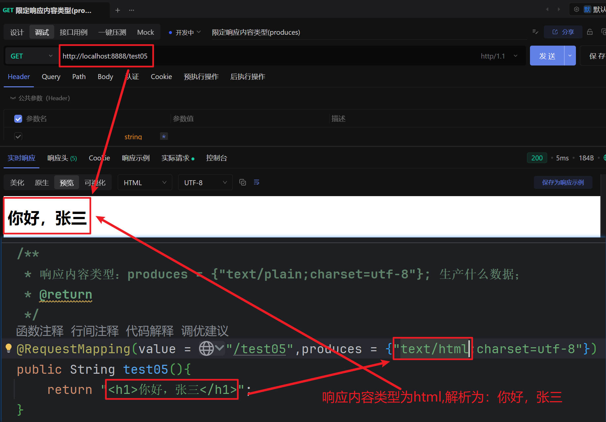


## HTTP&JSON


### HTTP请求与响应

::: tip 

> **HTTP请求会带来各种数据**

+ **请求首行：(请求方式、请求路径、请求协议)**

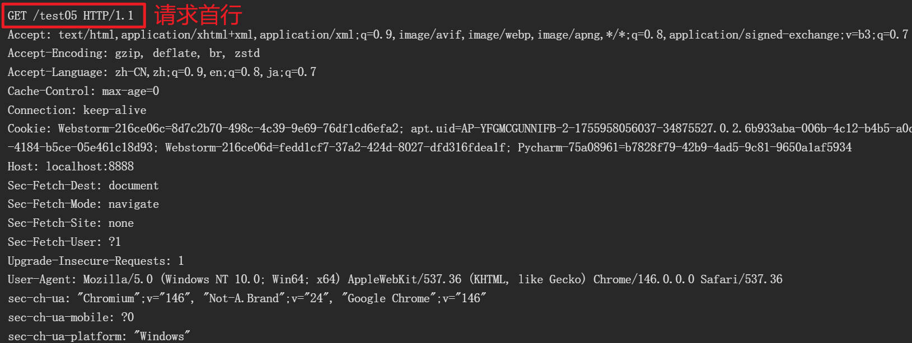

+ **请求头：(k: v  \n k: v)**

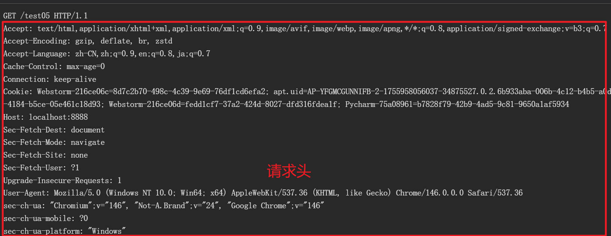

+ **请求体：(此次请求携带的其他数据)**

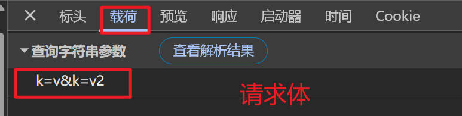

> **URL 携带大量数据，特别是GET请求，会把参数放在URL上**

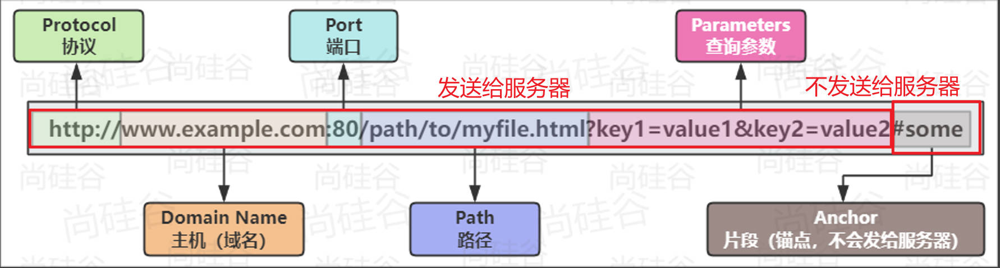

:::

::: tip

**`请求头`有很多`重要信息`，SpringMVC 可以快速获取到**

**`请求体`携带`大量数据`，特别是`POST请求`，会把`参数放在请求体中`**

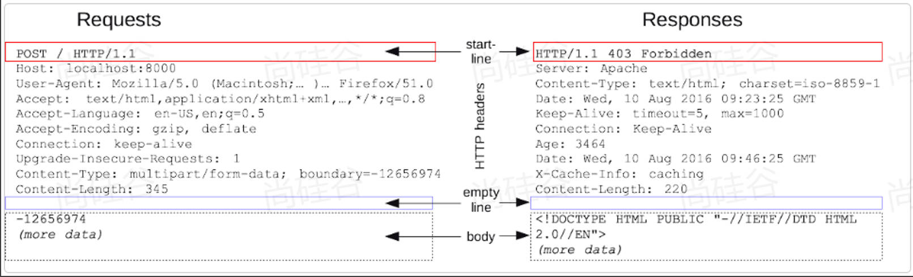

> 图片来源：https://developer.mozilla.org/zh-CN/docs/Web/HTTP/Messages

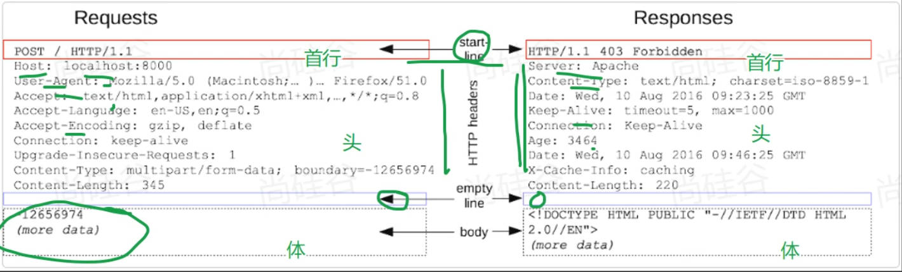


:::


### JSON 数据格式

::: tip

1.**JavaScript Object Notation(JavaScript 对象表示法)**

2.**JSON用于`将结构化数据`表示为`JavaScript 对象的标准格式`，通常用于`在网站上表示和传输数据`**

3.**JSON 可以作为一个`对象或者字符串存在`**

+ **前者用于`解读JSON 中的数据`，后者用于`通过网络传输 JSON 数据`。**

+ **JavaScript 提供一个`全局的可访问的JSON 对象`来对这两种数据`进行转换`。**

4.**JSON 是一种`纯数据格式`，它只包含`属性，没有方法`。**


:::

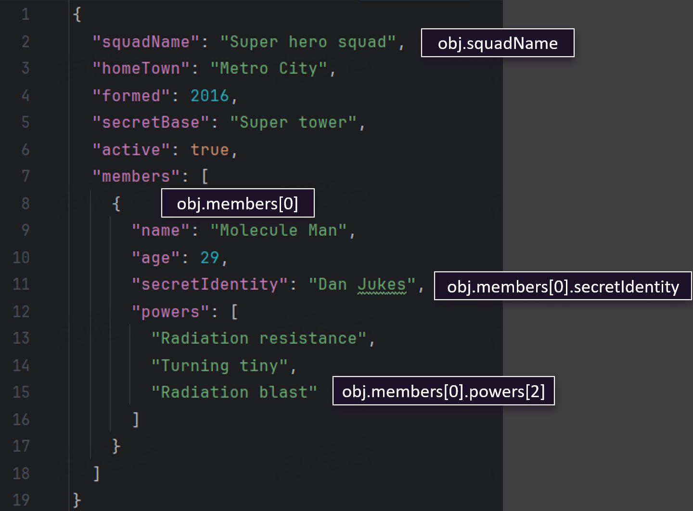


## 参数处理

### 请求处理

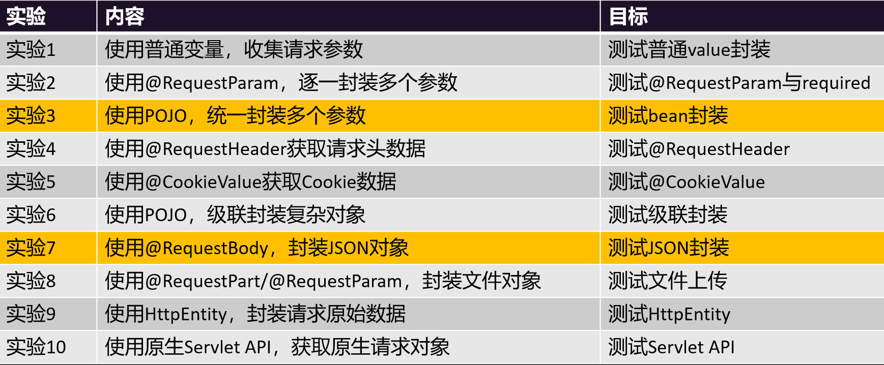

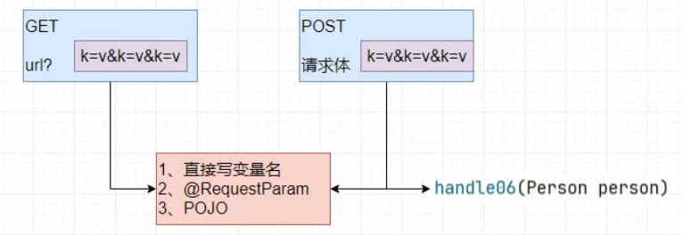

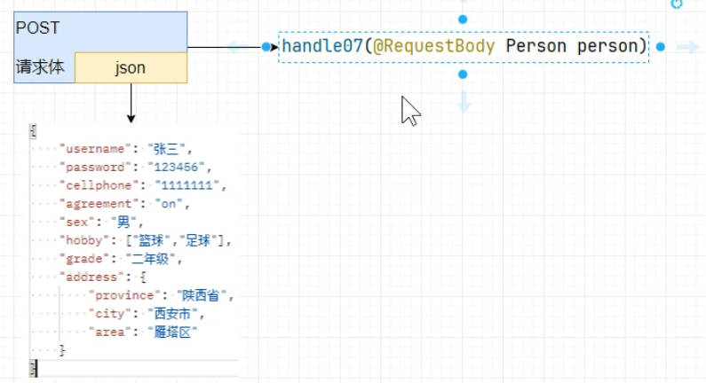

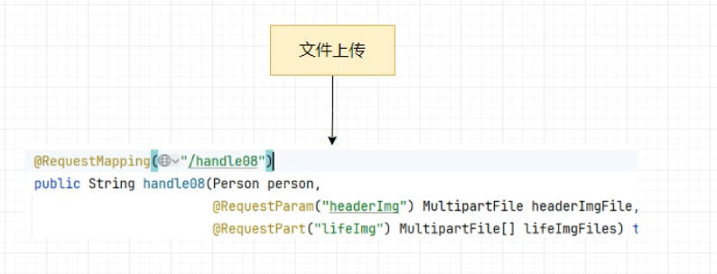


#### 实验1: 使用普通变量，收集请求参数

```java
/**
     * 请求参数：username=xingji&password=1225&cellphone=18313061241&agreement=on
     * 要求：变量名和参数名保持一致
     * 1、没有携带：包装类型自动封装为null，基本类型封装为默认值
     * 2、携带：自动封装
     * @return
*/
@RequestMapping("/handle01")
public String handle01(String username,
                       String password,
                       String cellphone,
                       boolean agreement) {
        System.out.println("username = " + username);
        System.out.println("password = " + password);
        System.out.println("cellphone = " + cellphone);
        System.out.println("agreement = " + agreement);
        return "ok";
}
```

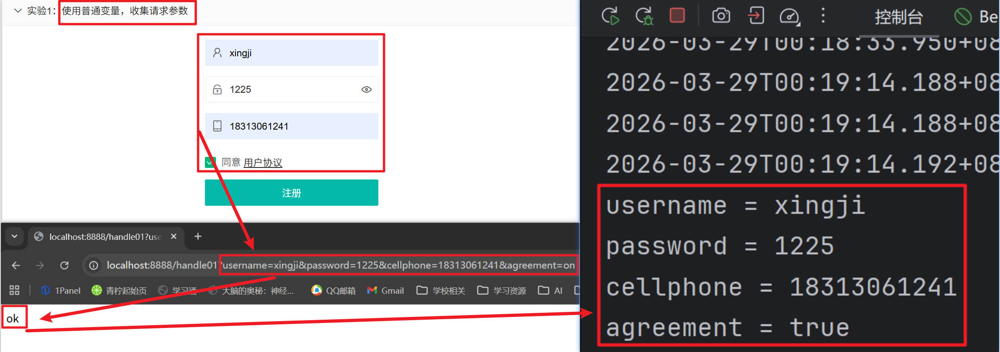


#### 实验2: @RequestParam - 明确指定获取哪个参数值

```java
/**
     * username=xingji&password=&cellphone=18313061242&agreement=on
     * @RequestParam: 取出某个参数的值，默认一定要携带。
     *      required = false：非必须携带；
     *      defaultValue = "123456"：默认值，参数可以不带。
     *
     * 无论请求参数带到了 请求体中还是 url? 后面，他们都是请求参数。都可以直接用@RequestParam或者同一个变量名获取到
     * @param name
     * @param pwd
     * @param phone
     * @param ok
     * @return
*/
@RequestMapping("/handle02")
public String handle02(@RequestParam("username") String name,
                       @RequestParam(value = "password", defaultValue = "1225") String pwd,
                       @RequestParam(value = "cellphone") String phone,
                       @RequestParam(value = "agreement", required = false) boolean ok) {
        	System.out.println("name = " + name);
        	System.out.println("pwd = " + pwd);
        	System.out.println("phone = " + phone);
        	System.out.println("ok = " + ok);
        	return "ok";
    }
```

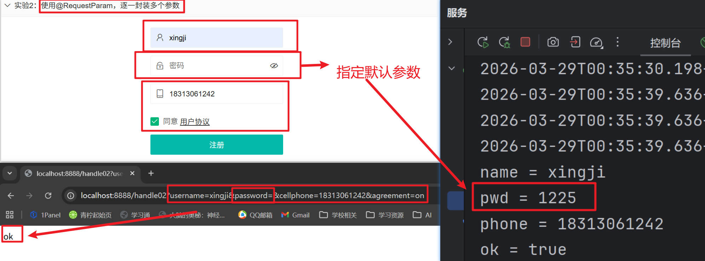


#### 实验3: 使用POJO，统一封装多个参数

```java
package fun.xingji.springmvc.bean;


import lombok.Data;

@Data
public class Person {
    // username=xingji&password=&cellphone=18313061243&agreement=on
    // username默认值是zhangsan
    private String username = "zhangsan"; // request.getParameter("username")
    private String password; // request.getParameter("password")
    private String cellphone;
    private boolean agreement;
}
```

```java
/**
     * 如果目标方法参数是一个 pojo；SpringMVC 会自动把请求参数 和 pojo 属性进行匹配；
     * 效果：
     *      1、pojo的所有属性值都是来自于请求参数
     *      2、如果请求参数没带，封装为null；
     * @param person
     * @return
     */
    // 请求体: username=xingji&password=&cellphone=18313061242&agreement=on
@RequestMapping("/handle03")
public String handle03(Person person) {
       System.out.println("person = " + person);
       return "ok";
}
```

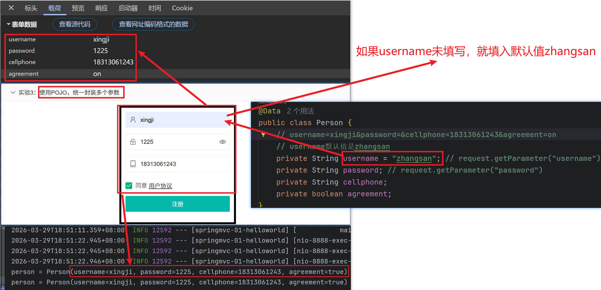


#### 实验4: @RequestHeader - 获取请求头信息

```java
/**
     * @param host
     * @param ua
     * @return
     * @RequestHeader：获取请求头信息
*/
@RequestMapping("/handle04")
public String handle04(@RequestHeader(value = "Host", defaultValue = "127.0.0.1") String host,
                       @RequestHeader("user-agent") String ua) {
        	System.out.println("host = " + host);
        	System.out.println("ua = " + ua);
        	return "ok~" + host;
}
```

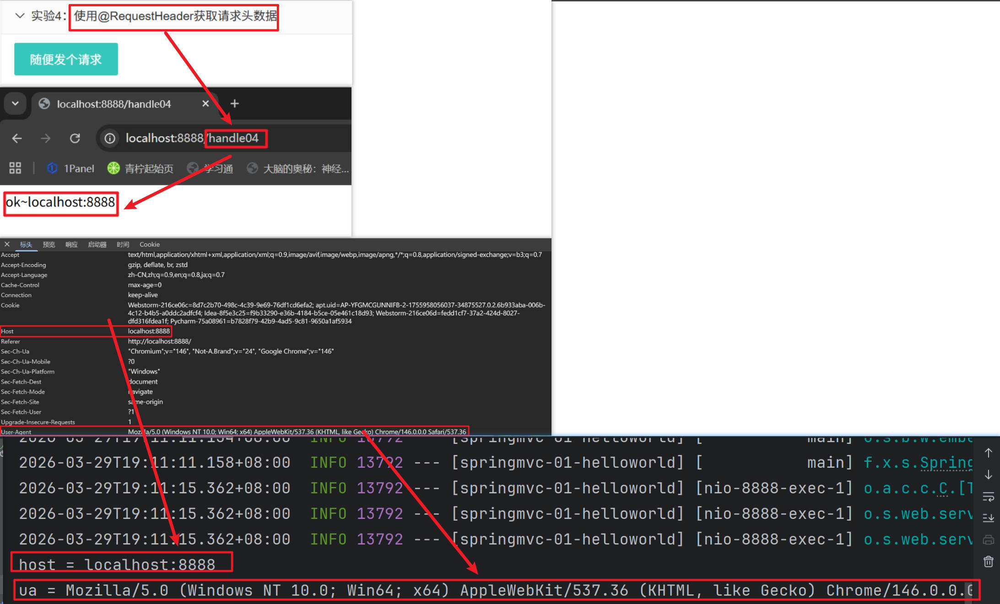


#### 实验5: @CookieValue - 获取cookie值

```java
/**
     * @param haha
     * @return
     * @CookieValue：获取cookie值
*/
@RequestMapping("/handle05")
public String handle05(@CookieValue("haha") String haha) {
       return "ok：cookie是：" + haha;
}
```

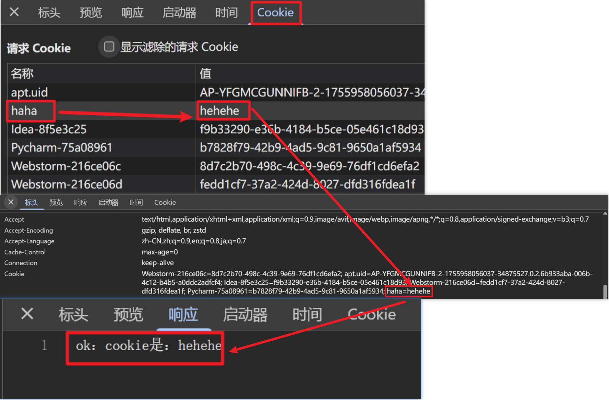


#### 实验6: 使用POJO，级联封装复杂对象


```java
package fun.xingji.springmvc.bean;


import lombok.Data;

/*
username=xingji&password=1225&cellphone=18313061244&agreement=on
&address.province=云南&address.city=昆明&address.area=官渡&
sex=男&hobby=足球&hobby=篮球&grade=二年级
 */
@Data
public class Person {
    // username=xingji&password=&cellphone=18313061243&agreement=on
    // username默认值是zhangsan
    private String username = "zhangsan"; // request.getParameter("username")
    private String password; // request.getParameter("password")
    private String cellphone;
    private boolean agreement;

    // 地址
    private Address address;
    // 性别
    private String sex;
    // 爱好
    private String[] hobby;
    // 年级
    private String grade;
}


@Data
class Address{
    private String prevince;
    private String city;
    private String area;
}
```

```java
/**
     * 使用pojo级联封装复杂属性
     * @param person
     * @return
*/
@RequestMapping("/handle06")
public String handle06(Person person) {
       System.out.println("person = " + person);
       return "ok";
}
```

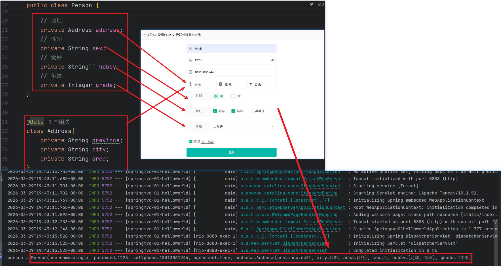


#### 实验7: 使用@RequestBody，封装JSON对象


```java
/**
     * @RequestBody: 获取请求体json数据，自动转为person对象
     * 测试接受json数据
     * 1、发出：请求体中是json字符串，不是k=v
     * 2、接受：@RequestBody Person person
     *
     * @RequestBody Person person
     *      1、拿到请求体中的json字符串
     *      2、把json字符串转为person对象
     * @param person
     * @return
*/
@RequestMapping("/handle07")
public String handle07(@RequestBody Person person) {
       System.out.println("person = " + person);
       //自己把字符串转为对象
       return "ok";
}
```

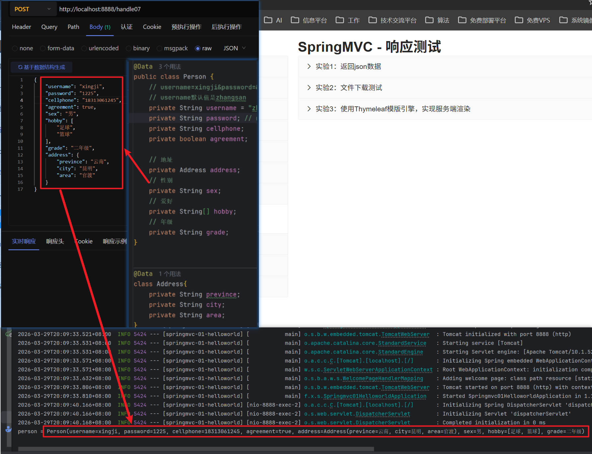

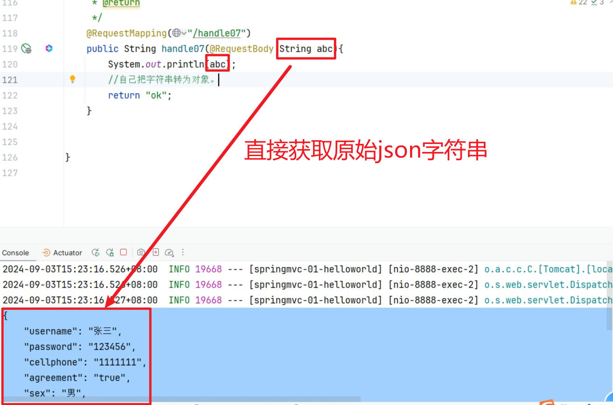


#### 实验8: 使用@RequestPart/@RequestParam，封装文件，测试文件上传


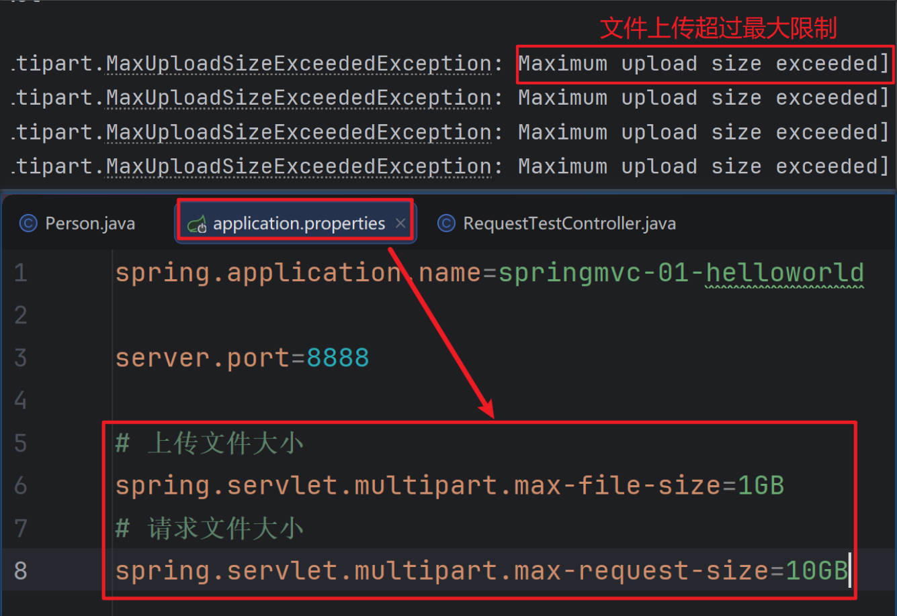

```java
/**
     * 文件上传；
     * 1、@RequestParam 取出文件项，封装为MultipartFile，就可以拿到文件内容
     * @param person
     * @return
*/
@RequestMapping("/handle08")
public String handle08(Person person,
                       @RequestParam("headerImg") MultipartFile headerImgFile,
                       @RequestPart("lifeImg") MultipartFile[] lifeImgFiles) throws IOException {
        // 1.获取原始文件名
        String originalFilename = headerImgFile.getOriginalFilename();

        // 2.文件大小
        long size = headerImgFile.getSize();

        // 3.获取文件流
        InputStream inputStream = headerImgFile.getInputStream();
        System.out.println(originalFilename + "======>" + size);

        // 4.保存文件
        headerImgFile.transferTo(new File("D:\\img\\" + originalFilename));

        System.out.println("===============以上处理头像=================");


        System.out.println("===============以下处理生活照=================");

        // 处理生活照上传（多文件）
        // 判断上传的文件数组是否不为空
        if (lifeImgFiles != null && lifeImgFiles.length > 0) {
            // 遍历每一个上传的文件
            for (MultipartFile lifeImgFile : lifeImgFiles) {
                // 获取文件的原始文件名
                originalFilename = lifeImgFile.getOriginalFilename();
                // 将文件保存到本地 D:\img\ 目录下
                lifeImgFile.transferTo(new File("D:\\img\\" + originalFilename));
            }
            System.out.println("=======生活照保存结束==========");
        }

        System.out.println("person = " + person);
        return "ok";
}
```

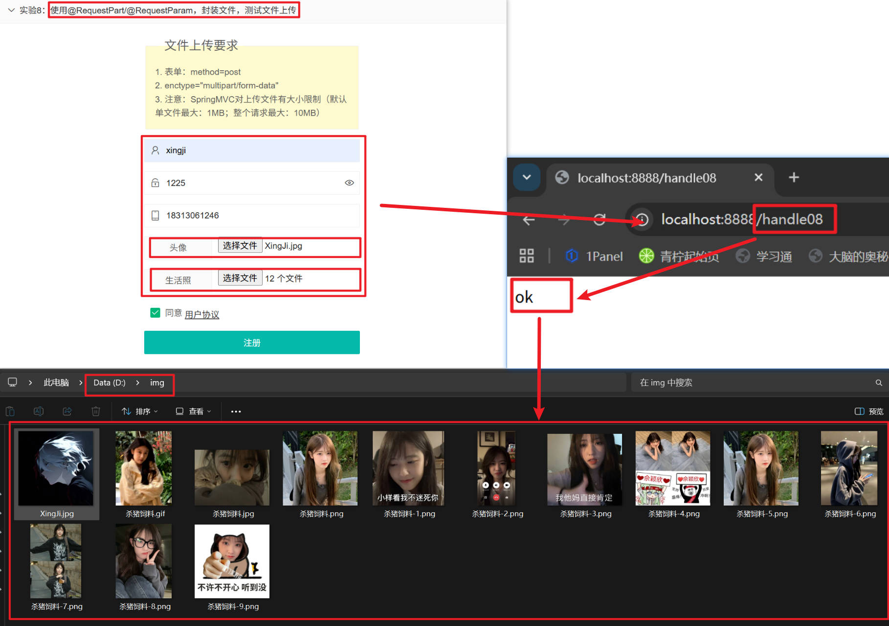


#### 实验9: 使用HttpEntity，封装请求原始数据

```java
/**
     * HttpEntity：封装请求头、请求体； 把整个请求拿过来
     *    泛型：<String>：请求体类型； 可以自动转化
     * @return
*/
@RequestMapping("/handle09")
public String handle09(HttpEntity<Person> entity){
       //1、拿到所有请求头
       HttpHeaders headers = entity.getHeaders();
       System.out.println("请求头："+headers);

       // 2、拿到请求体
       Person body = entity.getBody();
       System.out.println("请求体："+body);

       return "ok~~~";
}
```

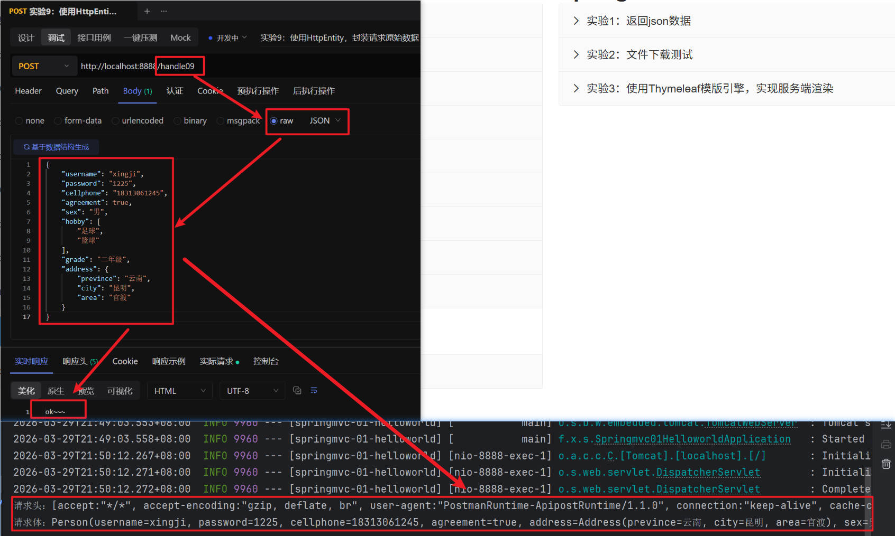


#### 实验10: 使用原生Servlet API，获取原生请求对象

```java
/**
     * 接受原生 API
     * @param request
     * @param response
*/
@RequestMapping("/handle10")
public void handle10(HttpServletRequest  request,
                     HttpServletResponse response,
                     HttpMethod method) throws IOException {
        // 获取请求方式
        System.out.println("请求方式："+method);
        // 获取请求参数
        String username = request.getParameter("username");
        System.out.println("请求参数："+username);
        // 设置响应体
        response.getWriter().write("ok!!!"+username);
}
```

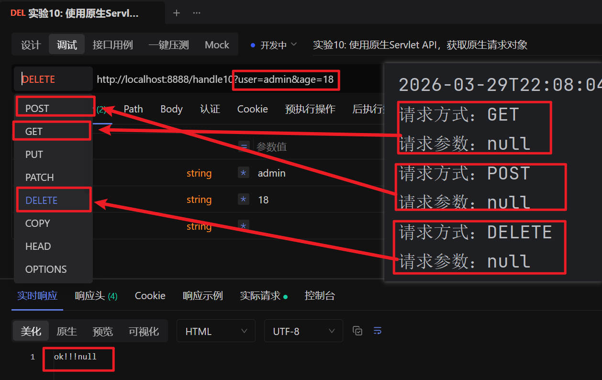


### 请求参数类型

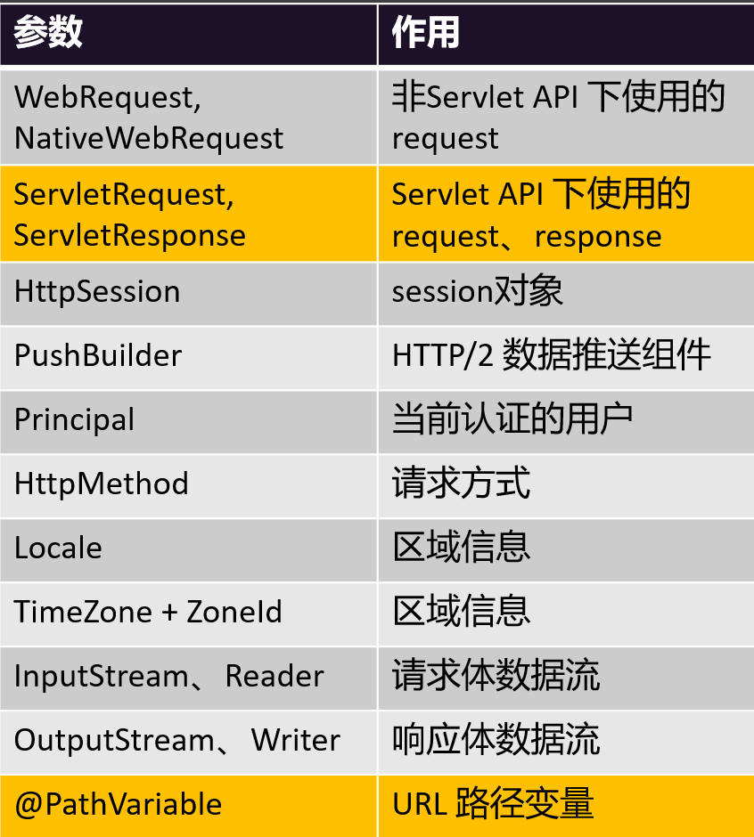

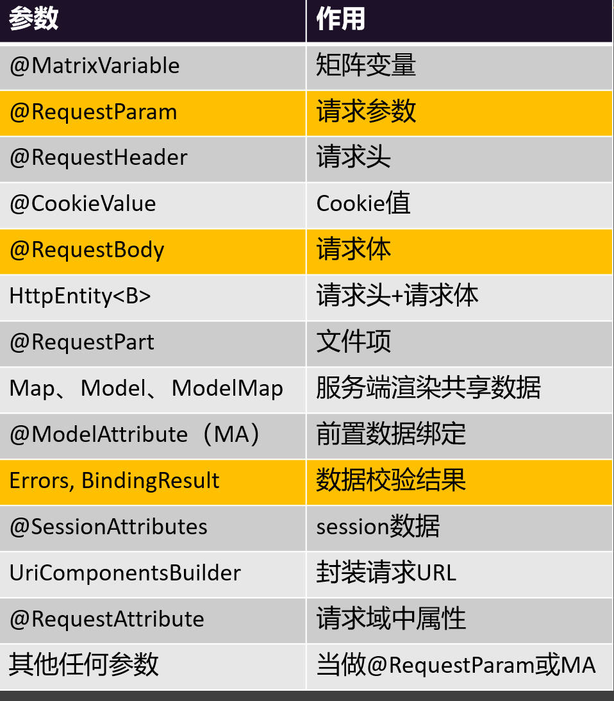
