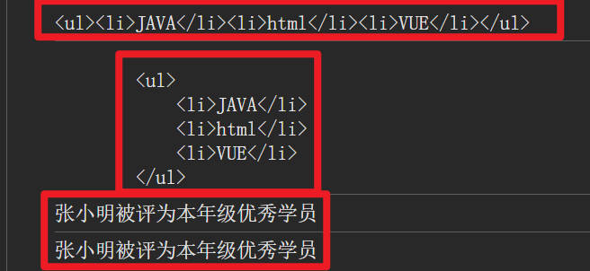
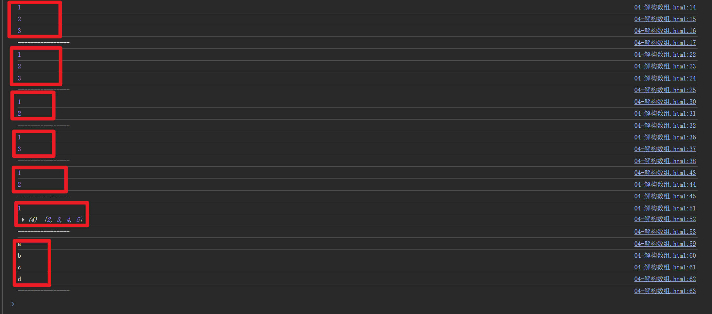
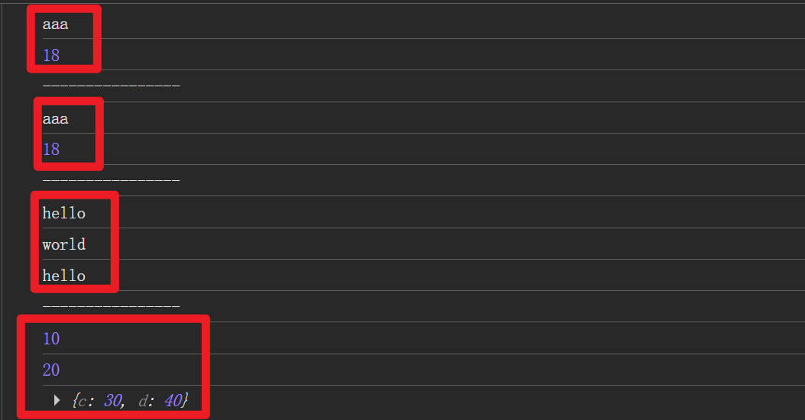
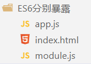
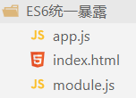
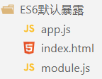

## 1.1 ES6的介绍

> **ECMAScript 6，简称ES6，是`JavaScript`语言的一次重大更新。它于`2015`年发布，是原来的ECMAScript标准的第六个版本。ES6带来了大量的新特性，包括箭头函数、模板字符串、let和const关键字、解构、默认参数值、模块系统等等，大大提升了JavaScript的开发体验。`由于VUE3中大量使用了ES6的语法,所以ES6成为了学习VUE3的门槛之一`。ES6对JavaScript的改进在以下几个方面：**

1.  更加简洁：ES6引入了一些新的语法，如箭头函数、模板字符串等，使代码更加简洁易懂；
2.  更强大的功能：ES6引入了一些新的API、解构语法和迭代器等功能，从而使得JavaScript更加强大；
3.  更好的适用性：ES6引入的模块化功能为JavaScript代码的组织和管理提供了更好的方式，不仅提高了程序的可维护性，还让JavaScript更方便地应用于大型的应用程序；

> 总的来说，ES6在提高JavaScript的核心语言特性和功能方面取得了很大的进展。由于ES6已经成为了JavaScript的标准，它的大多数新特性都已被现在浏览器所支持，因此现在可以放心地使用ES6来开发前端应用程序。

**历史版本：**

| 标准版本 | 发布时间 | 新特性                                                       |
| -------- | -------- | ------------------------------------------------------------ |
| ES1      | 1997年   | 第一版 ECMAScript                                            |
| ES2      | 1998年   | 引入setter和getter函数，增加了try/catch，switch语句允许字符串 |
| ES3      | 1999年   | 引入了正则表达式和更好的字符串处理                           |
| ES4      | 取消     | 取消，部分特性被ES3.1和ES5继承                               |
| ES5      | 2009年   | Object.defineProperty，JSON，严格模式，数组新增方法等        |
| ES5.1    | 2011年   | 对ES5做了一些勘误和例行修订                                  |
| `ES6`    | `2015年` | `箭头函数、模板字符串、解构、let和const关键字、类、模块系统等` |
| ES2016   | 2016年   | 数组.includes，指数操作符（\*\*），Array.prototype.fill等    |
| ES2017   | 2017年   | 异步函数async/await，Object.values/Object.entries，字符串填充 |
| ES2018   | 2018年   | 正则表达式命名捕获组，几个有用的对象方法，异步迭代器等       |
| ES2019   | 2019年   | Array.prototype.{flat，flatMap}，Object.fromEntries等        |
| ES2020   | 2020年   | BigInt、动态导入、可选链操作符、空位合并操作符               |
| ES2021   | 2021年   | String.prototype.replaceAll，逻辑赋值运算符，Promise.any等   |
| ... ...  |          |                                                              |


## 1.2 es6的变量和模板字符串

> **ES6 新增了`let`和`const`，用来声明变量，使用的细节上也存在诸多差异。**

::: tip

+ **`let`和`var`的差别：**

  ==1、let`不能重复声明`；==

  ==2、let有`块级作用域`，非函数的花括号遇见let会有`块级作用域`，也就是`只能在花括号里面访问`；==

  ==3、let不会`预解析进行变量提升`；==

  ==4、let 定义的`全局变量不会作为window的属性`；==

  ==5、let在es6中推荐`优先使用`；==

:::

```html
<!DOCTYPE html>
<html lang="en">

<head>
    <meta charset="UTF-8">
    <meta name="viewport" content="width=device-width, initial-scale=1.0">
    <title>Document</title>
</head>

<body>
    <script>

        // 1.let声明有作用范围
        {
            //let a = 1;
            //console.log("a=" + a); // a=1
        }
        //console.log("aa=" + a); // Uncaught ReferenceError: a is not defined(a不是全局变量)


        // 2.let不允许重复声明变量,var允许
        //var a = 1;
        //var b = 2;
        //let c = 3;
        // let c = 4; Cannot redeclare block-scoped variable 'c'(不能重复声明块级作用域的变量)


        //3. 循环+定时任务使用let
        //js单线程模型,如果循环包裹了定时任务,定时任务会在遍历结束后执行!
        /*for (var i = 0; i < 10; i++) {
            setTimeout(function () {
                console.log(i);
            })
        }*/
        // 输出十个 10
        /*for (let j = 0; j < 10; j++) {
            setTimeout(function () {
                console.log(j);
            })
        }*/


        // 4.let声明的变量存在暂时性死区,在声明之前访问会报错,而var声明的变量会被提升到作用域顶部,在声明之前访问会得到undefined
        //console.log(a);  //Cannot access 'a' before initialization(在初始化之前无法访问'a')
        //let a = "apple";

        console.log(b);  //undefined(未初始化)
        var b = "banana";

    </script>
</body>

</html>
```

::: tip

+ **`const`和`var`的差异：**

  1、==新增const和let类似，只是const定义的变量不能修改，声明一个只读变量==

  2、==并不是变量的值不能改动，而是变量指向的那个内存地址所保存的数据不能改动；==

  > 其实 const 保证的不是变量的值不变，而是保证变量指向的内存地址所保存的数据不允许改动。此时，你可能已经想到，简单类型和复合类型保存值的方式是不同的。是的，对于简单类型（数值 number、字符串 string 、布尔值 boolean）,值就保存在变量指向的那个内存地址，因此 const 声明的简单类型变量等同于常量。而复杂类型（对象 object，数组 array，函数 function），变量指向的内存地址其实是保存了一个指向实际数据的指针，所以 const 只能保证指针是固定的，至于指针指向的数据结构变不变就无法控制了

:::

```html
<script>
        // 1.const声明常量,必须初始化,且值不能改变
        const PI = 3.1415926;
        //PI = 3.14; // Uncaught TypeError: Assignment to constant variable.(无法分配给常量变量)
        console.log(PI); // 3.1415926


        //2.常量地址不能变,引用数组，对象的属性可以修改
        //const student = ["张学友", "刘德华", "郭富城"];
        //student.push("黎明"); // 可以修改数组元素

        const student = ["张学友", "刘德华", "郭富城"];
        student = ["黎明"]; // Uncaught TypeError: Assignment to constant variable.(无法分配给常量变量)

        console.log(student); // ["张学友", "刘德华", "郭富城", "黎明"]
</script>
```


::: tip

> **模板字符串（template string）是`增强版的字符串`，用`飘号`，也叫反引号（`）标识**

**==1、字符串中可以出现`换行符`；==**

**==2、可以`使用${xxx} 形式输出变量`和`拼接变量`；==**

``` html
<script>
        // 1 多行普通字符串
        let ulStr =
            '<ul>' +
            '<li>JAVA</li>' +
            '<li>html</li>' +
            '<li>VUE</li>' +
            '</ul>'
        console.log(ulStr)


        // 2 多行模板字符串
        let ulStr2 = `
        <ul>
        	<li>JAVA</li>
        	<li>html</li>
        	<li>VUE</li>
        </ul>`
        console.log(ulStr2)


        // 3  普通字符串拼接
        let name = '张小明'
        let infoStr = name + '被评为本年级优秀学员'
        console.log(infoStr)

        
        // 4  模板字符串拼接
        let infoStr2 = `${name}被评为本年级优秀学员`
        console.log(infoStr2)
</script>
```



:::


## 1.3 es6的解构表达式

> **ES6 的解构赋值是一种方便的语法，可以快速将`数组或对象中的值`拆分并赋值给`变量`。解构赋值的语法使用花括号 `{}` 表示`对象`，方括号 `[]` 表示`数组`。通过解构赋值，函数更方便进行参数接受等！**

> **数组解构赋值**：

```javascript
       	//1.数组模型的解构(快速获取数组数据)
        let [a, b, c] = [1, 2, 3];
        console.log(a); // 1
        console.log(b); // 2
        console.log(c); // 3
        console.log("----------------")


        //2.可嵌套数组处理
        let [d, [f], g] = [1, [2], 3];
        console.log(d); // 1
        console.log(f); // 2
        console.log(g); // 3
        console.log("----------------")


        //3.可忽略数组处理
        let [h, i] = [1, 2, 3];
        console.log(h); // 1
        console.log(i); // 2
        console.log("----------------")


        let [j, , k] = [1, 2, 3];
        console.log(j); // 1
        console.log(k); // 3
        console.log("----------------")


        //4.解构默认值
        let [l, m = 2] = [1];
        console.log(l); // 1
        console.log(m); // 2
        console.log("----------------")


        //5.剩余运算符
        //...只能在最后
        let [n, ...o] = [1, 2, 3, 4, 5];
        console.log(n); // 1
        console.log(o); // [2, 3, 4, 5]
        console.log("----------------")


        //6.字符串解构
        //在数组的解构中，解构的目标若为可遍历对象，皆可进行解构赋值
        let [aa, bb, cc, dd] = 'abcdf';
        console.log(aa); // a
        console.log(bb); // b
        console.log(cc); // c
        console.log(dd); // d
        console.log("----------------")
```




> **对象解构赋值**：

```javascript
		// 老方法获取对象数据
        /*let student = {
            name: "张学友",
            age: 30,
        }
        // 对象模型的解构(快速获取对象数据)
        console.log(student.name); // 张学友
        console.log(student.age); // 30
        */


        //1.对象模型解构
        //解构的属性名必须等于对象属性名,否则无法对应
        let { name, age } = { name: "aaa", age: 18 }
        console.log(name); // aaa
        console.log(age); // 18
        console.log("----------------")


        //可以利用:起别名
        let { name: ne, age: ae } = { name: "aaa", age: 18 };
        console.log(ne); // aaa
        console.log(ae); // 18
        console.log("----------------")


        //2.对象解构嵌套和忽略
        let obj = { p: ['hello', { y: 'world' }] };
        let { p: [ff, { y: yy }] } = obj;
        console.log(ff); // hello
        console.log(yy); // world

        let obj1 = { p: ['hello', { y: 'world' }] };
        let { p: [x, { }] } = obj1;
        console.log(x); // hello
        console.log("----------------")

        
        //3.对象还剩余运算符
        let { a: aaa, b: bbb, ...rest } = { a: 10, b: 20, c: 30, d: 40 };
        console.log(aaa); // 10
        console.log(bbb); // 20
        console.log(rest); // {c: 30, d: 40}
```




> **函数参数解构赋值**：

+ 解构赋值也可以用于函数参数，例如：

```javascript
function add([x, y]) {
  return x + y;
}
add([1, 2]);
```

+ 该函数接受一个数组作为参数，将其中的第一个值赋给 x，第二个值赋给 y，然后返回它们的和；

+ ES6 解构赋值让变量的初始化更加简单和便捷。通过解构赋值，我们可以访问到对象中的属性，并将其赋值给对应的变量，从而提高代码的可读性和可维护性；


## 1.4 es6的箭头函数

> ES6 允许使用“箭头” 函数。语法类似Java中的Lambda表达式。

### 1.4.1 声明

```html
<script>
    //ES6 允许使用“箭头”（=>）定义函数。
    //1. 函数声明
    //方式一
    function fun(){}
    //方式二：
    let fun1 = function(){}
    //针对方式二可以使用箭头函数
    let fun2 = ()=>{} //箭头函数,此处不需要书写function关键字
    let fun3 = x =>{} //单参数可以省略(),多参数无参数不可以!
    let fun4 = x => console.log(x) //只有一行方法体可以省略{};
    let fun5 = x => x + 1 //当函数体只有一句返回值时，可以省略花括号和 return 语句
</script>
```


### 1.4.2 参数默认值

```html
<script>
    //声明一个求和的函数
    let sum = (a,b)=>{
        return a + b
    }
    //调用函数
    let result = sum(1,1)
    console.log(result); //2
    //少传一个参数
    let result1 = sum(1) 
    console.log(result1); //NaN

    //声明函数时设置默认值
    let sum1 = (a,b=1)=>{
        return a + b
    }``
    //调用函数
    let result2 = sum1(1,2)
    console.log(result2); //3
    let result3 = sum1(1)
    console.log(result3); //2
    
</script>
```


### 1.4.3 三个点扩展运算符

> 用法一：作为可变参数

``` html
<script>
    // ... 作为参数列表,称之为rest参数 普通函数和箭头函数中都支持
    let fun = function (a,...args){
        console.log(a);
        console.log(args)
    }
    let fun1 = (a,...args) =>{
        console.log(args)
    }
    fun(1,2,3) //1赋值给a，2和3作为一个数组赋值给args
    fun1(1,2,3,4) //1赋值给a，2、3、4作为一个数组赋值给args
    // rest参数在一个参数列表中的最后一个值,这也就无形之中要求一个参数列表中只能有一个rest参数
    // let fun2 =  (...args,...args2) =>{} // 这里报错
</script>
```

> 用法二：复制数组和对象的属性

```html
<script>
    //使用... 复制数组和对象的属性称为spread语法
    //应用场景1 合并数组
    let arr =[1,2,3]
    let arr2=[4,5,6]
    let arr3=[...arr,...arr2]
    console.log(arr3)
    //应用场景2 合并对象属性
    let p1={name:"张三"}
    let p2={age:10}
    let p3={gender:"boy"}
    let person ={...p1,...p2,...p3}
    console.log(person)
</script>
```


## 1.5 链判断

> 如果读取对象内部的某个属性，往往需要判断一下，属性的上层对象是否存在。
>
> 比如，读取emp.dept.name这个属性，安全的写法是写成下面这样:

```javascript
let  emp = null
// 错误的写法
//const  empName = emp.dept.name|| 'default'

// 正确的写法
const empName = (emp
                   && emp.dept
                   && emp.dept.name || 'default')
console.log(empName)
```

> 这样的层层判断非常麻烦，因此 [ES2020](https://github.com/tc39/proposal-optional-chaining) 引入了“链判断运算符”（optional chaining operator）**?.**，简化上面的写法:

```javascript
//let emp = null

let emp = {
    name:"张三",
    dept:{
        name:"教学部"
    }
}

const empName = emp?.dept?.name || 'default'
```


## 1.6 es6的模块化处理

### 1.6.1模块化介绍

> 模块化是一种组织和管理前端代码的方式，将代码拆分成小的模块单元，使得代码更易于维护、扩展和复用。它包括了定义、导出、导入以及管理模块的方法和规范。前端模块化的主要优势如下：

1.  提高代码可维护性：通过将代码拆分为小的模块单元，使得代码结构更为清晰，可读性更高，便于开发者阅读和维护；
2.  提高代码可复用性：通过将重复使用的代码变成可复用的模块，减少代码重复率，降低开发成本；
3.  提高代码可扩展性：通过模块化来实现代码的松耦合，便于更改和替换模块，从而方便地扩展功能；

> 目前，前端模块化有多种规范和实现，包括 CommonJS、AMD 和 ES6 模块化。ES6 模块化是 JavaScript 语言的模块标准，使用 import 和 export 关键字来实现模块的导入和导出。现在，大部分浏览器都已经原生支持 ES6 模块化，因此它成为了最为广泛使用的前端模块化标准.。

+ ES6模块化的几种暴露和导入方式：
  1. 分别导出；
  2. 统一导出；
  3. 默认导出；
+ `ES6中无论以何种方式导出,导出的都是一个对象,导出的内容都可以理解为是向这个对象中添加属性或者方法`！！！


### 1.6.2 分别导出



+ module.js 向外分别暴露成员：

``` javascript
//1.分别暴露
// 模块想对外导出,添加export关键字即可!
// 导出一个变量
export const PI = 3.14
// 导出一个函数
export function sum(a, b) {
  return a + b;
}
```

+ app.js 导入module.js中的成员：

``` javascript
/* 
    *代表module.js中的所有成员
    m1代表所有成员所属的对象
*/
import * as m1 from './module.js'
// 使用暴露的属性
console.log(m1.PI)
// 调用暴露的方法
let result =m1.sum(10,20)
console.log(result)
```

+ index.html作为程序启动的入口 ，导入 app.js  ：

``` html
<!-- 导入JS文件 添加type='module' 属性,否则不支持ES6的模块化 -->
<script src="./app.js" type="module" /> 
```


### 1.6.3 统一导出



+ module.js向外统一导出成员：

``` javascript
//2.统一暴露
// 模块想对外导出,export统一暴露想暴露的内容!
// 定义一个常量
const PI = 3.14
// 定义一个函数
function sum(a, b) {
  return a + b;
}
// 统一对外导出(暴露)
export {
	PI,
    sum
}
```

+ app.js导入module.js中的成员：

``` javascript
/* 
    {}中导入要使用的来自于module.js中的成员
    {}中导入的名称要和module.js中导出的一致,也可以在此处起别名
    {}中如果定义了别名,那么在当前模块中就只能使用别名
    {}中导入成员的顺序可以不是暴露的顺序
    一个模块中可以同时有多个import
    多个import可以导入多个不同的模块,也可以是同一个模块
*/
import {PI ,sum }  from './module.js'
import {PI as pi,sum as add}  from './module.js'
// 使用暴露的属性
console.log(PI)
console.log(pi)
// 调用暴露的方法
let result1 =sum(10,20)
console.log(result1)
let result2 =add(10,20)
console.log(result2)
```


### 1.6.4 默认导出




+ module.js中混合向外导出：

``` javascript
// 3.默认和混合暴露
/* 
    默认暴露语法  export default sum
    默认导出在一个模块中只能使用一次
    默认暴露相当于是在暴露的对象中增加了一个名字为default的属性
    三种暴露方式可以在一个module中混合使用
*/
export const PI = 3.14
// 导出一个函数
function sum(a, b) {
  return a + b;
}
// 导出默认
export default sum
```

+ app.js 的default和其他导入写法混用：

``` javascript
/* 
    *代表module.js中的所有成员
    m1代表所有成员所属的对象
*/
import * as m1 from './module.js'
import {default as add} from './module.js' // 用的少
import add2 from './module.js' // 等效于 import {default as add2} from './module.js'
// 调用暴露的方法
let result =m1.default(10,20)
console.log(result)
let result2 =add(10,20)
console.log(result2)
let result3 =add2(10,20)
console.log(result3)

// 引入其他方式暴露的内容
import {PI} from './module.js'
// 使用暴露的属性
console.log(PI)
```
