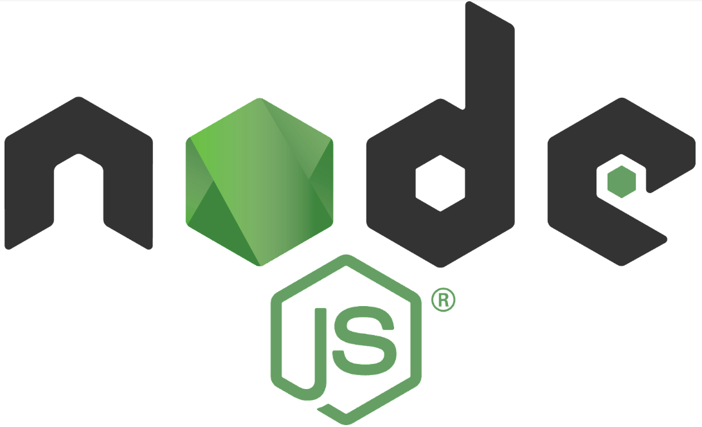
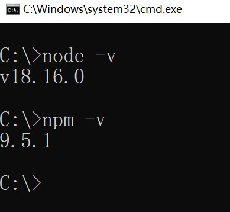
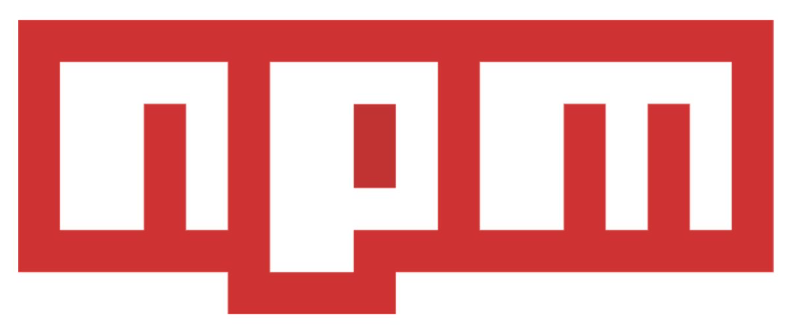

## 1. Nodejs的介绍与安装

### 1.1 什么是Nodejs



> Node.js 是一个基于 Chrome V8 引擎的 JavaScript 运行时环境，可以使 JavaScript 运行在服务器端。使用 Node.js，可以方便地开发服务器端应用程序，如 Web 应用、API、后端服务，还可以通过 Node.js 构建命令行工具等。相比于传统的服务器端语言（如 PHP、Java、Python 等），Node.js 具有以下特点：

-   单线程，但是采用了事件驱动、异步 I/O 模型，可以处理高并发请求；
-   轻量级，使用 C++ 编写的 V8 引擎让 Node.js 的运行速度很快；
-   模块化，Node.js 内置了大量模块，同时也可以通过第三方模块扩展功能；
-   跨平台，可以在 Windows、Linux、Mac 等多种平台下运行；

> Node.js 的核心是其管理事件和异步 I/O 的能力。Node.js 的异步 I/O 使其能够处理大量并发请求，并且能够避免在等待 I/O 资源时造成的阻塞。此外，Node.js 还拥有高性能网络库和文件系统库，可用于搭建 WebSocket 服务器、上传文件等。`在 Node.js 中，我们可以使用 JavaScript 来编写服务器端程序，这也使得前端开发人员可以利用自己已经熟悉的技能来开发服务器端程序，同时也让 JavaScript 成为一种全栈语言。`Node.js 受到了广泛的应用，包括了大型企业级应用、云计算、物联网、游戏开发等领域。常用的 Node.js 框架包括 Express、Koa、Egg.js 等，它们能够显著提高开发效率和代码质量。


### 1.2 如何安装Nodejs

1.  打开官网https://nodejs.org/en下载对应操作系统的 LTS 版本。
2.  双击安装包进行安装，安装过程中遵循默认选项即可(或者参照https://www.runoob.com/nodejs/nodejs-install-setup.html )。安装完成后，可以在命令行终端输入 `node -v` 和 `npm -v` 查看 Node.js 和 npm 的版本号。



3. 定义一个app.js文件，文件内定义如下代码。cmd到该文件所在目录，然后在dos上通过`node app.js`命令即可运行。

``` javascript
console.log("测试Nodejs")
```


## 2. npm 配置和使用

### 2.1 npm介绍



> NPM全称Node Package Manager，是Node.js包管理工具，是全球最大的模块生态系统，里面所有的模块都是开源免费的；也是Node.js的包管理工具，相当于后端的Maven的部分功能 。


### 2.2 npm 安装和配置

> 1、安装 ：安装Nodejs，自动安装npm包管理工具！


> 2、配置依赖下载使用阿里镜像：

+ npm 安装依赖包时默认使用的是官方源，由于国内网络环境的原因，有时会出现下载速度过慢的情况。为了解决这个问题，可以配置使用阿里镜像来加速 npm 的下载速度，打开命令行终端，执行以下命令，配置使用阿里镜像：

``` shell
npm config set registry https://registry.npmmirror.com
```

+ 验证配置，查看当前 registry 的配置：如果输出结果为 `https://registry.npmmirror.com`，说明配置已成功生效。

```shell
npm config get registry
npm config list
```

+ 如果需要恢复默认的官方源，可以执行以下命令：

```javascript
npm config set registry https://registry.npmjs.org/
```

> 3、配置全局依赖下载后存储位置：

+ 在 Windows 系统上，npm 的全局依赖默认安装在 `<用户目录>\AppData\Roaming\npm` 目录下。

+ 如果需要修改全局依赖的安装路径，可以按照以下步骤操作：

  1. 创建一个新的全局依赖存储目录，例如 `D:\GlobalNodeModules`。

  2. 打开命令行终端，执行以下命令来配置新的全局依赖存储路径：

     ``` shell
     npm config set prefix "D:\GlobalNodeModules"
     ```

  3. 确认配置已生效，可以使用以下命令查看当前的全局依赖存储路径：

     ``` shell
     npm config get prefix
     ```

> 4、升级npm版本：

+ cmd 输入npm -v 查看版本，如果node中自带的npm版本过低！则需要升级至9.6.6！


```shell
npm install -g npm@9.6.6
```


### 2.3 npm 常用命令

> 1、项目初始化：

+ npm init
  + 进入一个vscode创建好的项目中，执行 npm init 命令后，npm 会引导您在命令行界面上回答一些问题，例如项目名称、版本号、作者、许可证等信息，并最终生成一个package.json 文件。package.json信息会包含项目基本信息！类似maven的pom.xml。
+ npm init -y
  + 执行，-y yes的意思，所有信息使用当前文件夹的默认值！不用挨个填写！

> 2、安装依赖  (查看所有依赖地址  https://www.npmjs.com )：

+ npm install 包名 或者 npm install 包名@版本号
  + 安装包或者指定版本的依赖包(安装到当前项目中)。
+ npm install -g 包名
  + 安装全局依赖包(安装到d:/GlobalNodeModules)则可以在任何项目中使用它，而无需在每个项目中独立安装该包。
+ npm install
  + 安装package.json中的所有记录的依赖。

> 3、升级依赖：

+ npm update 包名
  + 将依赖升级到最新版本。

> 4、卸载依赖：

+ npm uninstall 包名

> 5、查看依赖：

+ npm ls
  + 查看项目依赖。

+ npm list -g
  + 查看全局依赖。

> 6、运行命令：

+ npm run 命令是在执行 npm 脚本时使用的命令。npm 脚本是一组在 package.json 文件中定义的可执行命令。npm 脚本可用于启动应用程序，运行测试，生成文档等，还可以自定义命令以及配置需要运行的脚本。

+ 在 package.json 文件中，scripts 字段是一个对象，其中包含一组键值对，键是要运行的脚本的名称，值是要执行的命令。例如，以下是一个简单的 package.json 文件：

```json
package.json 是每个 npm 项目的基础配置文件，它定义了项目的依赖关系、版本号、入口脚本、包的元数据等信息。
一个基本的 package.json 文件包含以下字段：
	name: 包名
	version: 版本号，遵循语义化版本控制（Semantic Versioning）
	description: 包的描述
	main: 入口点脚本文件，通常是启动时加载的文件
	scripts: 定义运行脚本的脚本命令
	dependencies: 生产环境依赖
	devDependencies: 开发环境依赖
	repository: 代码仓库地址
	keywords: 关键词数组，有助于 npm 搜索
	author: 作者信息
	license: 许可证

    {
    "name": "example-package",  //软件名
    "version": "1.0.0",         //定义版本
    "description": "A sample npm package", //软件描述
    "main": "index.js",  //启动执行的js文件
    "scripts": {  //指定运行脚本
        "test": "echo \"Error: no test specified\" && exit 1" // npm run test 执行内部的测试输出命令
    },
        maven / 依赖 / scope / compile 全程需要 | runtime 写代码时候无法使用,运行才会有 mysql | provided main test 打包以后不使用 [[servlet]] | test  junit
    "dependencies": (compile) {  //生产环境依赖
        "express": "4.17.1", #准确版本
        "express": "^4.17.1" #大版本必须4 锁住大版本
    },
    "devDependencies":(provided) { //开发环境依赖 
        "nodemon": "^2.0.7"
    },
    "repository": { //git仓库
        "type": "git",
        "url": "git+https://github.com/username/example-package.git"
    },
    "keywords": ["example", "npm"], //npm搜索关键字
    "author": "Your Name", //作者名字
    "license": "ISC" //许可证
    }

### 环境依赖配置
    dependencies 生产环境依赖 (compile)
    devDependencies 开发环境依赖  (provided)
	当你执行 npm install（没有额外参数时）时，dependencies 会被自动安装。
    当你执行 npm install --production 或者设置环境变量为 NODE_ENV=production 时，devDependencies 会被忽略，只会安装 dependencies 中的依赖。
### name

    name 是指软件包名。
    命名规则：
    名称必须小于或等于 214 个字符。这包括范围软件包的范围。
    作用域软件包的名称可以以点或下划线开头。如果没有作用域，则不允许这样做。
    新软件包名称中不能有大写字母。
    名称最终会成为 URL、命令行参数和文件夹名称的一部分。因此，名称中不能包含任何非 URL 安全字符。
    名称可选择以作用域作为前缀，例如 @myorg/mypackage。
    提示：
    不要使用与 Node 核心模块相同的名称。
    不要在名称中使用 "js "或 “node”。因为你编写的是 package.json 文件，所以我们假定它是 js，你可以使用 "引擎 "字段指定引擎。(见下文）。
    该名称可能会作为参数传递给 require()，因此应该简短，但也要有合理的描述性。
    你可能需要检查一下 npm 注册表，看看是否已经有使用该名称的软件，以免过于依赖它。https://www.npmjs.com/
    这是发布包的注意事项，如果你的项目不准备分享发布，则无所谓，建议和你项目相同。

### version

    指发布包版本号,x.x.x的形式。
    版本必须能被 node-semver 解析，node-semver 作为依赖项与 npm 捆绑。(npm install semver 可自行使用）。
    命名版本号建议遵循版本语义规范,：

### description

    项目描述。
    这是一个字符串。这有助于人们发现你的软件包，因为它会在 npm 搜索中列出。

### keywords

    项目关键字。
    这是一个字符串数组。这有助于人们在 npm 搜索中发现你的软件包。

### scripts

    运行命令集合（字典）
    脚本 "属性是一个字典，包含在软件包生命周期的不同时间运行的脚本命令。键是生命周期事件，值是在该时刻运行的命令。

    package.json 文件的 "scripts "属性支持大量内置脚本、预设生命周期事件以及任意脚本。这些脚本都可以通过运行 npm run-script 或 npm run 来执行。名称匹配的前置和后置命令也会被执行（例如 premyscript、myscript、postmyscript）。使用 npm explore – npm run 可以运行来自依赖项的脚本。
    例如：
    {
        "scripts": {
            "precompress": "{{ executes BEFORE the `compress` script }}",
            "compress": "{{ run command to compress files }}",
            "postcompress": "{{ executes AFTER `compress` script }}"
        }
    }

    npm run compress 就会执行compress后面对应的命令!

```

+ scripts 对象包含 start、test 和 build 三个脚本。当您运行 npm run start 时，将运行 node index.js，并启动应用程序。同样，运行 npm run test 时，将运行 Jest 测试套件，而 npm run build 将运行 webpack 命令以生成最终的构建输出。
+ 总之，npm run 命令为您提供了一种在 package.json 文件中定义和管理一组指令的方法，可以在项目中快速且灵活地运行各种操作。
