## 1. Vue3简介

### 1.1 Vue3介绍

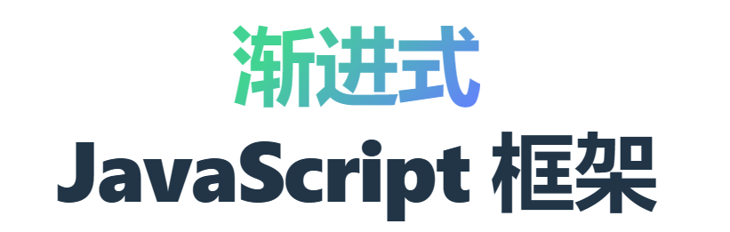

> Vue (发音为 /vjuː/，类似 **view**) 是一款用于构建用户界面的 JavaScript 框架。它基于标准 HTML、CSS 和 JavaScript 构建，并提供了一套声明式的、组件化的编程模型，帮助你高效地开发用户界面。无论是简单还是复杂的界面，Vue 都可以胜任。官网为:<https://cn.vuejs.org/>

 **Vue的两个核心功能：**

-   **声明式渲染**：Vue 基于标准 HTML 拓展了一套模板语法，使得我们可以声明式地描述最终输出的 HTML 和 JavaScript 状态之间的关系；
-   **响应性**：Vue 会自动跟踪 JavaScript 状态并在其发生变化时响应式地更新 DOM  ；

> VUE作者:尤雨溪


+ 尤雨溪（Evan You），毕业于科尔盖特大学，前端框架Vue.js的作者、HTML5版Clear的打造人、独立开源开发者。曾就职于Google Creative Labs和Meteor Development Group。由于工作中大量接触开源的JavaScript项目，最后自己也走上了开源之路，现全职开发和维护Vue.js；
+ 尤雨溪毕业于上海复旦附中，在美国完成大学学业，本科毕业于Colgate University，后在Parsons设计学院获得Design & Technology艺术硕士学位，任职于纽约Google Creative Lab；

+ 尤雨溪大学专业并非是计算机专业，在大学期间他学习专业是室内艺术和艺术史，后来读了美术设计和技术的硕士，正是在读硕士期间，他偶然接触到了JavaScript，从此被这门编程语言深深吸引，开启了自己的前端生涯；


### 1.2 Vue3快速体验(非工程化方式)

```html
<!DOCTYPE html>
<html lang="en">

<head>
    <meta charset="UTF-8">
    <meta name="viewport" content="width=device-width, initial-scale=1.0">
    <title>Vue3初体验（非工程化方式）</title>
</head>

<body>
    <script src="https://unpkg.com/vue@3/dist/vue.global.js"></script>

    <div id="app">
        <h1>{{ message }}</h1>
        <p v-text="message"></p>
    </div>

    <script>
        //1.初始化
        const app = Vue.createApp({
            setup() {
                let message = "Hello Vue3"
                return {
                    message
                }
            }
        })
        //2.挂载
        app.mount("#app")  // document.getElementById('app')
    </script>

</html>
```


## 2. Vue3通过Vite实现工程化

### 2.1 Vite的介绍

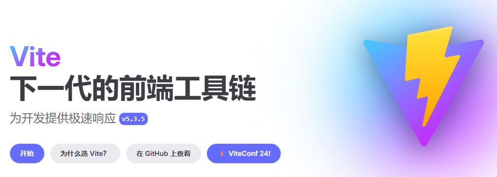


> 在浏览器支持 ES 模块之前，JavaScript 并没有提供原生机制让开发者以模块化的方式进行开发。这也正是我们对 “打包” 这个概念熟悉的原因：使用工具抓取、处理并将我们的源码模块串联成可以在浏览器中运行的文件。时过境迁，我们见证了诸如 [webpack](https://webpack.js.org/ "webpack")、[Rollup](https://rollupjs.org/ "Rollup") 和 [Parcel](https://parceljs.org/ "Parcel") 等工具的变迁，它们极大地改善了前端开发者的开发体验。

+ 当我们开始构建越来越大型的应用时，需要处理的 JavaScript 代码量也呈指数级增长；
+ 包含数千个模块的大型项目相当普遍。基于 JavaScript 开发的工具就会开始遇到性能瓶颈：通常需要很长时间（甚至是几分钟！）才能启动开发服务器，即使使用模块热替换（HMR），文件修改后的效果也需要几秒钟才能在浏览器中反映出来。如此循环往复，迟钝的反馈会极大地影响开发者的开发效率和幸福感；

> Vite 旨在利用生态系统中的新进展解决上述问题：浏览器开始原生支持 ES 模块，且越来越多 JavaScript 工具使用编译型语言编写。https://cn.vitejs.dev/guide/why.html。前端工程化的作用包括但不限于以下几个方面：

1.  快速创建项目：使用脚手架可以快速搭建项目基本框架，避免从零开始搭建项目的重复劳动和繁琐操作，从而节省时间和精力；
2.  统一的工程化规范：前端脚手架可以预设项目目录结构、代码规范、git提交规范等统一的工程化规范，让不同开发者在同一个项目上编写出风格一致的代码，提高协作效率和质量；
3.  代码模板和组件库：前端脚手架可以包含一些常用的代码模板和组件库，使开发者在实现常见功能时不再重复造轮子，避免因为轮子质量不高带来的麻烦，能够更加专注于项目的业务逻辑；
4.  自动化构建和部署：前端脚手架可以自动进行代码打包、压缩、合并、编译等常见的构建工作，可以通过集成自动化部署脚本，自动将代码部署到测试、生产环境等；


### 2.2 Vite创建Vue3工程化项目

#### 1、Vite+Vue3项目的创建、启动、停止

> 1 使用命令行创建工程。

+ 在磁盘的合适位置上，创建一个空目录用于存储多个前端项目；
+ 用vscode打开该目录；
+ 在vocode中打开命令行运行如下命令；

```shell
npm create vite
```

+ 第一次使用Vite时会提示下载vite，输入y回车即可，下次使用Vite就不会出现了；

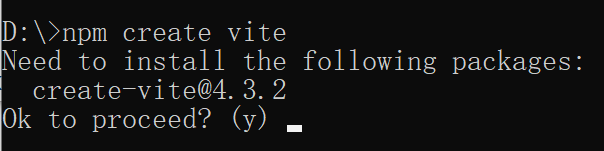

+ 注意： 输入项目名称vue3-demo，选择Vue+JavaScript选项即可；

> 2 安装项目所需依赖：

+ cd进入刚刚创建的项目目录；
+ npm install命令安装基础依赖；

``` shell
cd ./1-vite-project
npm install
```

> 3 启动项目：

+ 查看项目下的package.json

```json
{
  "name": "1-vite-project",
  "private": true,
  "version": "0.0.0",
  "type": "module",
  "scripts": {
    "dev": "vite",
    "build": "vite build",
    "preview": "vite preview"
  },
  "dependencies": {
    "vue": "^3.5.34"
  },
  "devDependencies": {
    "@vitejs/plugin-vue": "^6.0.6",
    "vite": "^8.0.12"
  }
}
```

``` shell
npm run dev
```

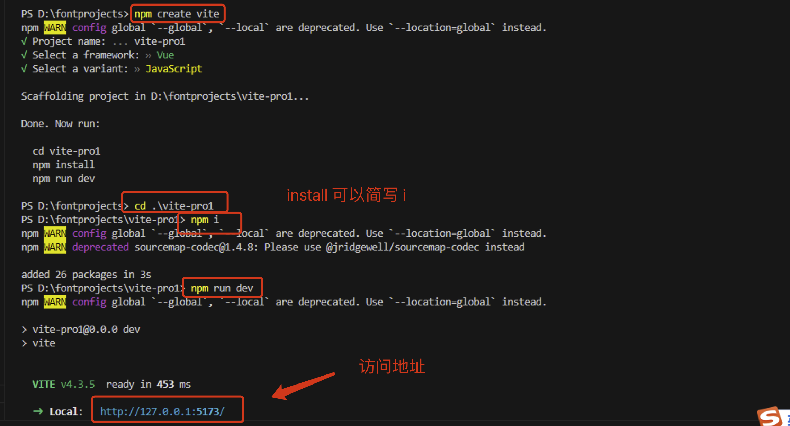

> 5 停止项目：

+ 命令行上 ctrl+c


#### 2、Vite+Vue3项目的目录结构

> 1.下面是 Vite 项目结构和入口的详细说明：

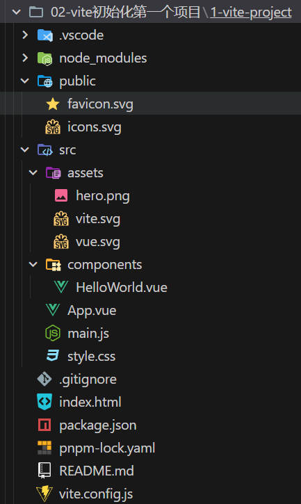

::: tip 

-   public/ 目录：用于存放一些公共资源，如 HTML 文件、图像、字体等，这些资源会被直接复制到构建出的目标目录中。
-   src/ 目录：存放项目的源代码，包括 JavaScript、CSS、Vue 组件、图像和字体等资源。在开发过程中，这些文件会被 Vite 实时编译和处理，并在浏览器中进行实时预览和调试。以下是src内部划分建议：
    1.  `assets/` 目录：用于存放一些项目中用到的静态资源，如图片、字体、样式文件等。
    2.  `components/` 目录：用于存放组件相关的文件。组件是代码复用的一种方式，用于抽象出一个可复用的 UI 部件，方便在不同的场景中进行重复使用。
    3.  `layouts/` 目录：用于存放布局组件的文件。布局组件通常负责整个应用程序的整体布局，如头部、底部、导航菜单等。
    4.  `pages/` 目录：用于存放页面级别的组件文件，通常是路由对应的组件文件。在这个目录下，可以创建对应的文件夹，用于存储不同的页面组件。
    5.  `plugins/` 目录：用于存放 Vite 插件相关的文件，可以按需加载不同的插件来实现不同的功能，如自动化测试、代码压缩等。
    6.  `router/` 目录：用于存放 Vue.js 的路由配置文件，负责管理视图和 URL 之间的映射关系，方便实现页面之间的跳转和数据传递。
    7.  `store/` 目录：用于存放 Vuex 状态管理相关的文件，负责管理应用程序中的数据和状态，方便统一管理和共享数据，提高开发效率。
    8.  `utils/` 目录：用于存放一些通用的工具函数，如日期处理函数、字符串操作函数等。
-   vite.config.js 文件：Vite 的配置文件，可以通过该文件配置项目的参数、插件、打包优化等。该文件可以使用 CommonJS 或 ES6 模块的语法进行配置。
-   package.json 文件：标准的 Node.js 项目配置文件，包含了项目的基本信息和依赖关系。其中可以通过 scripts 字段定义几个命令，如 dev、build、serve 等，用于启动开发、构建和启动本地服务器等操作。
-   Vite 项目的入口为 src/main.js 文件，这是 Vue.js 应用程序的启动文件，也是整个前端应用程序的入口文件。在该文件中，通常会引入 Vue.js 及其相关插件和组件，同时会创建 Vue 实例，挂载到 HTML 页面上指定的 DOM 元素中。

:::


>  2.vite的运行界面：

+ 在安装了 Vite 的项目中，可以在 npm scripts 中使用 `vite` 可执行文件，或者直接使用 `npx vite` 运行它。下面是通过脚手架创建的 Vite 项目中默认的 npm scripts：(package.json)。

```json
{
  "scripts": {
    "dev": "vite", // 启动开发服务器，别名：`vite dev`，`vite serve`
    "build": "vite build", // 为生产环境构建产物
    "preview": "vite preview" // 本地预览生产构建产物
  }
}
```

+ 运行设置端口号：(vite.config.js)。

```javascript
//修改vite项目配置文件 vite.config.js
export default defineConfig({
  plugins: [vue()],
  server:{
    port:3000
  }
})
```


#### 3、Vite+Vue3项目组件(SFC入门)

> 什么是VUE的组件?

+ 一个页面作为整体，是由多个部分组成的，每个部分在这里就可以理解为一个组件；
+ 每个.vue文件就可以理解为一个组件，多个.vue文件可以构成一个整体页面；
+ 组件化给我们带来的另一个好处就是组件的复用和维护非常的方便；

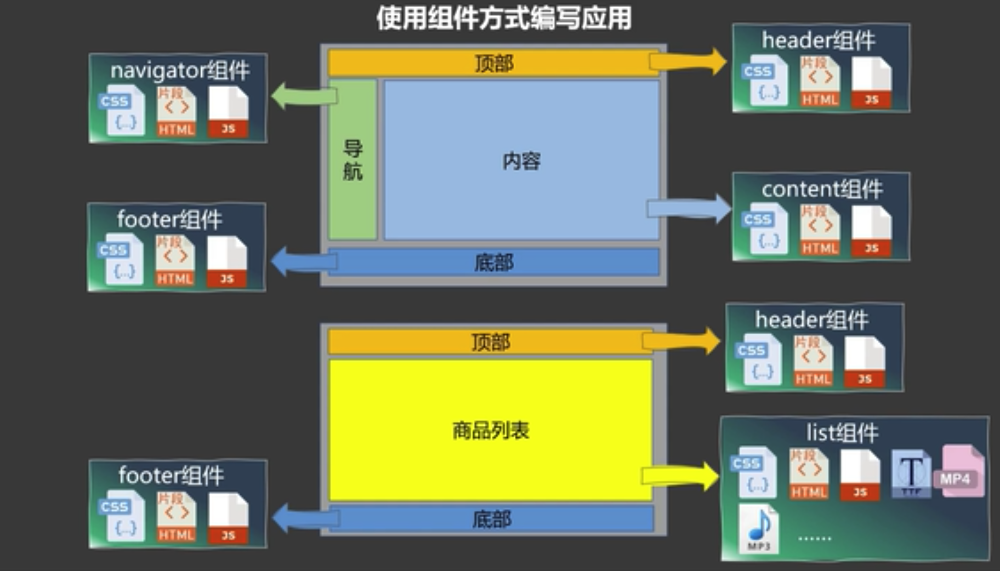

> 什么是.vue文件?

+ 传统的页面有html文件css文件和js文件三个文件组成(多文件组件) ；
+ vue将这文件合并成一个vue文件(Single-File Component，简称 SFC，单文件组件)；

+ vue文件对js/css/html统一封装，这是VUE中的概念，该文件由三个部分组成    `<script> <template> <style>`；
  + template标签     代表组件的html部分代码，代替传统的html文件；
  + script标签           代表组件的js代码，代替传统的js文件；
  + style标签            代表组件的css样式代码，代替传统的css文件	；

> 工程化vue项目如何组织这些组件?

+ index.html是项目的入口，其中 `<div id ='app'></div>`是用于挂载所有组建的元素；
+ index.html中的script标签引入了一个main.js文件，具体的挂载过程在main.js中执行；
+ main.js是vue工程中非常重要的文件，他决定这项目使用哪些依赖，导入的第一个组件；
+ App.vue是vue中的核心组件，所有的其他组件都要通过该组件进行导入，该组件通过路由可以控制页面的切换；

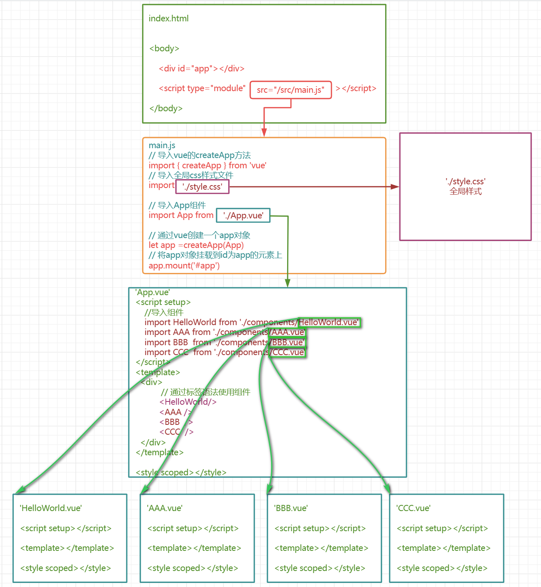


#### 4、Vite+Vue3响应式入门和setup函数

> 1 删除App.vue中自带的内容

```html
<script>
    //存储vue页面逻辑js代码
</script>
<template>
    <!-- 页面的样式的是html代码-->
</template>
<style scoped>
    /** 存储的是css代码! <style scoped> 是 Vue.js 单文件组件中用于设置组件样式的一种方式。
    它的含义是将样式局限在当前组件中，不对全局样式造成影响。 */
</style>
```

> 2 Vue3响应式数据入门：

```html
<script type="module">
    //存储vue页面逻辑js代码
    import {ref} from 'vue'
    export default{
        setup(){
            //非响应式数据: 修改后VUE不会更新DOM
            //响应式数据:   修改后VUE会更新DOM
            //VUE2中数据默认是响应式的
            //VUE3中数据要经过ref或者reactive处理后才是响应式的
            //ref是VUE3框架提供的一个函数,需要导入
            //let counter = 1
            //ref处理的响应式数据在js编码修改的时候需要通过.value操作
            //ref响应式数据在绑定到html上时不需要.value
            let counter = ref(1)
            function increase(){
                // 通过.value修改响应式数据
                counter.value++
            }
            function decrease(){
                counter.value--
            }
            return {
                counter,
                increase,
                decrease
            }
        }
    }
</script>
<template>
    <div>
      <button @click="decrease()">-</button>
      {{ counter }}
      <button @click="increase()">+</button>
    </div>
</template>
<style scoped>
    button{
        border: 1px solid red;
    }
</style>
```

> 3 Vue3 setup函数和语法糖：

+ 位置：src/App.vue。

```vue
<script type="module" setup>   
/* 通过setup关键字，可以省略 export default {setup(){   return{}}}这些冗余的语法结构 */
    import {ref} from 'vue'
    // 定义响应式数据
    let counter = ref(1)
    // 定义函数
    function increase(){
        counter.value++
    }
    function decrease(){
        counter.value--
    }  
</script>
<template>
    <div>
      <button @click="decrease()">-</button>
      {{ counter }}
      <button @click="increase()">+</button>
    </div>
</template>
<style scoped>
    button{
        border: 1px solid red;
    }
</style>
```

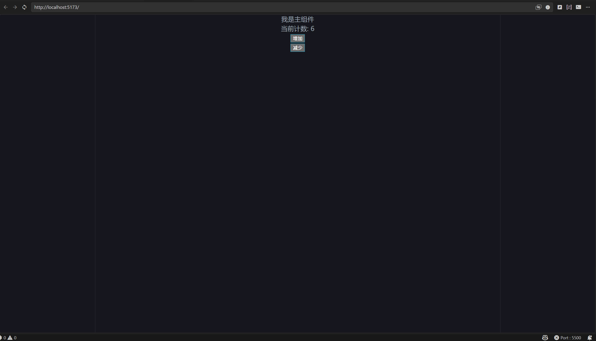


#### 5、Vite+Vue3关于样式的导入方式

1. 全局引入main.js；

   ```javascript
   import './style/reset.css' //书写引入的资源的相对路径即可！
   ```

2. vue文件script代码引入；

   ```javascript
   import './style/reset.css'
   ```

3. Vue文件style代码引入；[不推荐]

   ```javascript
   @import './style/reset.css';
   ```


#### 6、vscode中创建vue3SFC模版

1. vscode点击设置

   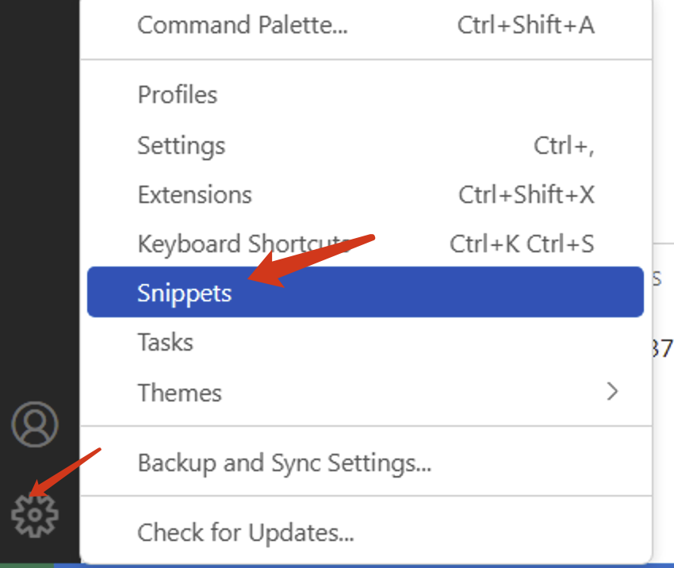

2. 搜索vue.json配置参数

   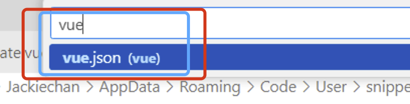

3. 添加vue3 SFC模板代码

   ```json
   {
   	"Print to console": {
   		"prefix": "sfc",  //键入该值，按tab快捷产生
   		"body": [
   			"<script setup>",
   			"",
   			"</script>",
   			"",
   			"<template>",
   			"  <div>",
   			"",
   			"  </div>",
   			"</template>",
   			"",
   			"<style scoped>",
   			"",
   			"</style>",
   		],
   		"description": "vue3的sfc模板"
   	}
   }
   ```

   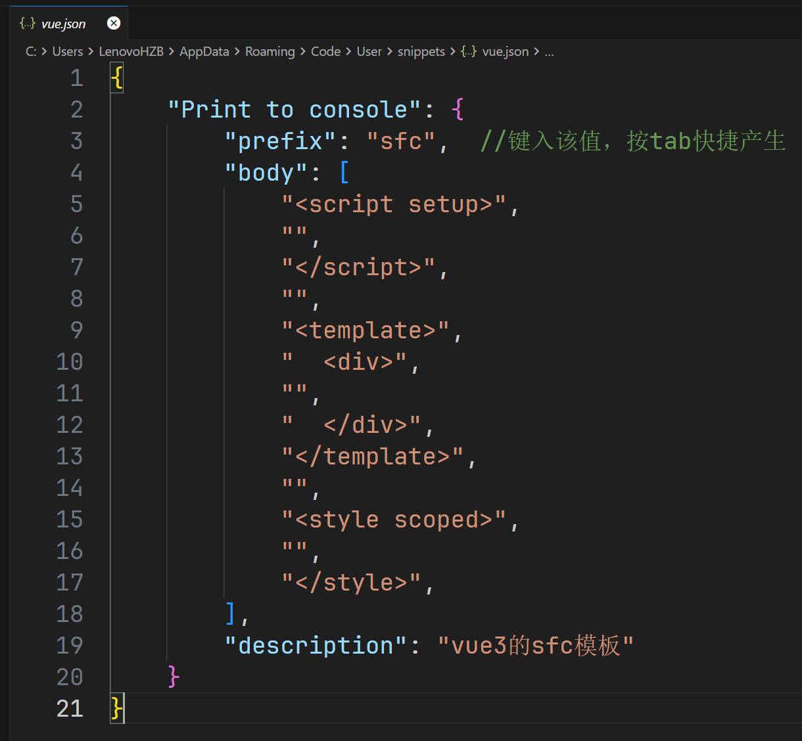

4. 使用vue3模板

   ```  
   vue -> sfc + tab即可
   ```


## 3. Vue3视图渲染技术

### 3.1 模版语法

> Vue 使用一种基于 HTML 的模板语法，使我们能够声明式地将其组件实例的数据绑定到呈现的 DOM 上。所有的 Vue 模板都是语法层面合法的 HTML，可以被符合规范的浏览器和 HTML 解析器解析。在底层机制中，Vue 会将模板编译成高度优化的 JavaScript 代码。结合响应式系统，当应用状态变更时，Vue 能够智能地推导出需要重新渲染的组件的最少数量，并应用最少的 DOM 操作。

#### 1、插值表达式和文本渲染

> 插值表达式：最基本的数据绑定形式是文本插值，它使用的是“Mustache”语法 ，即双大括号`{{}}`：

+ 插值表达式是将数据渲染到元素的指定位置的手段之一；
+ 插值表达式不绝对依赖标签，其位置相对自由；
+ 插值表达式中支持javascript的运算表达式；
+ 插值表达式中也支持函数的调用；

``` html
<script setup>
   let age = 18
   let message = "测试插值表达式"
   //声明一个函数
   let getAddress = ()=>{
    return "宏福苑小区"
   }
</script>

<template>
    {{ message }}
   <h1>{{ message }}</h1>
   <p>{{ message }}</p>
   <span style="color: red;">{{ message }}</span>
   <h1>你成年了吗：{{ age>=18?"已成年":"未成年"}}</h1>
   <h1>你的居住地：{{ getAddress() }}</h1>
</template>
```

> **示例:**

```html
<script setup>
//模型属性
let message = 'hello'
let age = 18
let add = (a, b) => a + b
</script>

<template>
  <div>
    {{ message }}
    {{ age + 1 }}
    {{ add(1, 2) }}
    <h1>你成年了吗：{{ age >= 18 ? "已成年" : "未成年" }}</h1>
  </div>
</template>

<style scoped></style>
```


> 为了渲染双标中的文本，我们也可以选择使用`v-text`和`v-html`命令：

+ v-***这种写法的方式使用的是vue的命令；
+ v-***的命令必须依赖元素，并且要写在元素的开始标签中；
+ v-***指令支持ES6中的模板字符串；
+ 插值表达式中支持javascript的运算表达式；
+ 插值表达式中也支持函数的调用；
+ v-text可以将数据渲染成双标签中间的文本，但是不识别html元素结构的文本；
+ v-html可以将数据渲染成双标签中间的文本，识别html元素结构的文本；

``` html
<script setup>
    let message = "测试文本渲染"
    let msg = "<font color='red'>我要红</font>"
</script>

<template>
    <h1 v-text="message"></h1>
    <h1 v-html="message"></h1>
    <p v-text="message"></p>
    <span style="color: red;" v-text="message"></span>
    <!-- 测试v-text和v-html的区别 -->
    <div v-text="msg"></div>
    <div v-html="msg"></div>
</template>
```

> **示例:**

```html
<script setup>
//模型属性
let message = '<h2>hello</h2>'
let age = 18
let add = (a, b) => a + b 
</script>

<template>
    <div>
        <!-- <span>{{ message }}</span> -->
        <span v-text="message"></span> <br> <!--字符串中有html标签原样输出-->
        <span v-html="message"></span> <br> <!--字符串中有html标签会被浏览器解析-->
    </div>
</template>

<style scoped></style>
```


#### 2、Attribute属性渲染

> 想要渲染一个元素的 attribute，应该使用 `v-bind`指令。

+ 由于插值表达式不能直接放在标签的属性中，要渲染元素的属性就应该使用v-bind；
+ v-bind可以用于渲染任何元素的属性，语法为 `v-bind:属性名='数据名'`， 可以简写为 `:属性名='数据名'`；

``` html
<script setup>
  //声明数据
  let data = "测试属性渲染"
  let link = "http://www.yutao.com"
</script>

<template>
  <!-- 完整写法 -->
  <input v-bind:value="data"></input><br>
  <!-- 简写 -->
  <input :value="data"></input><br>
  <div :id="data">我是div标签，我的id属性是通过Vue渲染的</div>
  <a :href="link">点我有惊喜</a>

	<!-- 3.4+新特性 如果 attribute 的名称与绑定的 JavaScript 值的名称相同，那么可以进一步简化语法，省略 attribute 值：-->
  <!-- 与 :id="id" 相同 -->
	<div :id></div>
	<!-- 这也同样有效 -->
	<div v-bind:id></div>
</template>
```

> **示例:**

```html
<script setup>
//模型属性
let message = '<h2>hello</h2>'
let age = 18
let id = 1
let link = "http://v.xingji.fun"
</script>

<template>
    <div>
        <!--只有表单元素标签有value属性。-->
        年龄：<input v-bind:id="id" name="age" v-bind:value="age + 1" />
        年龄：<input :id="id" name="age" v-bind:value="age + 1" />
        年龄：<input :id name="age" v-bind:value="age + 1" />
        年龄2：<input name="age" :value="age + 2" />

        <!-- 与 :id="id" 相同 -->
        <div id="1"></div>
        <div :id></div>
        <div v-bind:id></div>
        <div v-bind:id="id"></div>


        <a v-bind:href="link">链接</a>
    </div>
</template>

<style scoped></style>
```

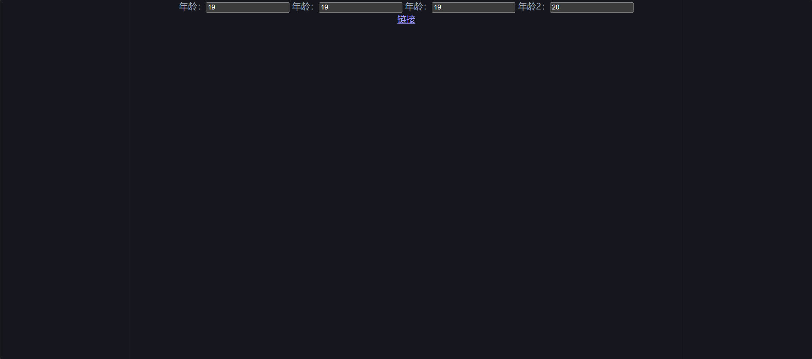


#### 3、事件的绑定

> **我们可以使用 `v-on` 来监听 DOM 事件，并在事件触发时执行对应的 Vue的JavaScript代码。**

+ 用法：`v-on:click="handler"` 或简写为 `@click="handler"`；
+ vue中的事件名=原生事件名去掉`on` 前缀   如:`onClick --> click`；
+ handler的值可以是方法事件处理器，也可以是内联事件处理器；
+ 绑定事件时，可以通过一些绑定的修饰符，常见的事件修饰符如下：
  + `.once：只触发一次事件。[重点]`；
  + `.prevent：阻止默认事件。[重点]，例如：a标签添加阻止默认事件，就不触发href属性对应的地址了`；

``` html
<script setup>
  import { ref } from 'vue'
  //声明数据
  let count = ref(0)
  //add函数
  let add = () => {
    //对count加1
    count.value++
  }
  //sub函数
  let sub = () => {
    //对count加1
    count.value--
  }
  //changeData函数
  let changeData = () => {
    console.log("文本框中的内容发生了变化")
  }
  //blurF函数
  let blurF = () => {
    console.log("文本框中失去了焦点")
  }

  //创建一个取消默认行为的函数
  let stopDef = (event) => {
    //阻止事件（取消默认行为）
    event.preventDefault()
  }
</script>

<template>
  <button v-on:click="add">➕</button>
  {{ count }}
  <button @click="sub">➖</button><br>
  给文本框绑定内容改变的事件：<input @change="changeData"></input><br>
  给文本框绑定失去焦点的事件：<input @blur="blurF"></input><br>
  <!-- 让单击事件只执行一次 -->
  <button @click.once="count++">count只会被加一次</button><br>
  <!-- 阻止事件（取消默认行为） -->
  <a href="http://www.atguigu.com" target="_blank" @click.prevent="">去尚硅谷官网</a><br>
  <!-- 使用原生JS代码阻止事件（取消默认行为） -->
  <a href="http://www.atguigu.com" target="_blank" @click="stopDef($event)">去尚硅谷官网</a>
</template>
```

> **示例:**

```html
<script setup>

import { ref } from 'vue'

//模型属性
let count = ref(0)      //响应式变量
let increment = () => {
    count.value++
}

let data = '请输入您的姓名'
// 输入框内容改变
let mychange = () => {
    console.log('change事件触发了...')
}

// 鼠标点击
let myfocus = () => {
    console.log('focus事件触发了...')
}

// 鼠标离开
let myBlur = () => {
    console.log('Blur事件触发了...')
}

// 阻止事件（取消默认行为）
let stopDef = (event) => {
    event.preventDefault(); //阻止事件产生

}

// 阻止事件（取消默认行为）
let clickblog = () => {
    console.log("点击我的博客")

}

</script>

<template>
    <div>

        {{ count }}
        <!--  v-on: 可以用 @ 代替-->
        <button v-on:click="increment">变变变</button>
        <button v-on:click.once="increment">只能变一次</button>

        <button @click="increment">变变变2</button>
        姓名：<input v-on:change="mychange" v-on:focus="myfocus" v-on:blur="myBlur" :value="data"></input>
        姓名2：<input @change="mychange" @focus="myfocus" @blur="myBlur" :value="data"></input>

        <br>
        <!-- 事件修饰符 -->

        <!-- 阻止事件（取消默认行为） -->
        <a href="http://v.xingji.fun" target="_blank" @click="clickblog">去我的博客页面</a><br>

        <a href="http://v.xingji.fun" target="_blank" @click.prevent="clickblog">去我的博客页面</a><br>
        <!-- 使用原生JS代码阻止事件（取消默认行为） -->
        <a href="http://v.xingji.fun" target="_blank" @click="stopDef($event)">去我的博客页面2</a>
    </div>
</template>

<style scoped></style>
```

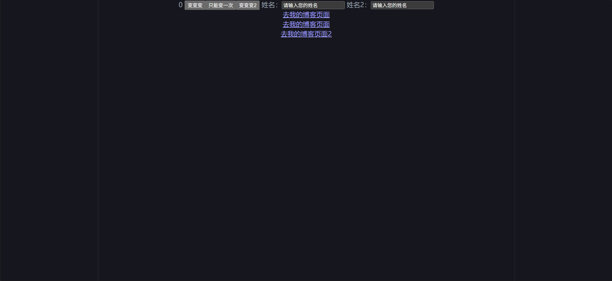


### 3.2 响应式基础

>  **此处的响应式是指  ： 数据模型（自定义的变量、对象）发生变化时，自动更新DOM树内容，页面上显示的内容会进行同步变化。vue3的数据模型不是自动响应式的，需要我们做一些特殊的处理。**

#### 1、如何实现响应式

> 使用`ref`或`reactive`函数就可以将基本类型的数据（如字符串，数字等）和引用类型的数据（如对象）转换为一个响应式对象。

```html
<script setup>
import { ref,reactive } from 'vue'
/*
  响应式概念：在 Vue.js 中，响应式是一个核心概念，旨在实现数据和视图的自动同步。当你更改数据时，视图会自动更新，而不需要手动操作 DOM。这种机制使得开发者能够更加专注于业务逻辑，而不必关注视图的更新。
  vue版本区别：Vue2中所有的数据默认是响应式、在Vue3中JS中声明的数据默认不是响应式的，需要使用ref或reactive函数包装一下就变成了响应式的，包装之后就变成了ref对象或reactive对象.
  ref函数和reactive函数的区别：
      1.ref函数可以包装基本类型（字符串、数字,对象）和引入类型（数组、对象）；reactive只能包装引用类型
      2.使用ref包装的数据在JS中修改或获取的时候需要加.value，在DOM中不用添加.value（template可以直接操作）；
        用reactive包装的数据在JS和DOM中都不需要添加.value
      3.使用ref包装的对象，对象和对象的属性都是响应式的；使用reactive包装的对象，对象不是响应式的，对象的属性是响应式的（不能做对象替换）
*/
//包装基本类型
let count = ref(56)
let totalCount = reactive(566) //不推荐 

//包装引用类型
let obj = ref({
  name:"蔡徐坤",
  age:33
})
let obj2 = reactive({
  name:"吴亦凡",
  age:38
})


//声明函数
let changeCount = ()=>{
  count.value = 58
}
let changeTotalCount = ()=>{
  totalCount = 588
}
let changeObj = ()=>{
  obj.value = {
    name:"李易峰",
    age:35
  }
}
let changeObj2 = ()=>{
  obj2 = {
    name:"PGOne",
    age:32
  }
}
let changeObjAttr = ()=>{
  obj.value.name = "蔡大使"
}
let changeObj2Attr = ()=>{
  obj2.name = "吴签"
}
</script>

<template>
  <h2>班级总人数：{{ count }}</h2>
  <h2>全校总人数：{{ totalCount }}</h2>
  <h2>使用ref函数包装的对象：{{ obj }}</h2>
  <h2>使用reactive函数包装的对象：{{ obj2 }}</h2>
  <button @click="changeCount">改变ref包装的基本类型</button><br>
  <button @click="changeTotalCount">改变reactive包装的基本类型</button><br>
  <button @click="changeObj">改变ref包装的对象</button><br>
  <button @click="changeObj2">改变reactive包装的对象</button><br>
  <button @click="changeObjAttr">改变ref包装的对象的属性值</button><br>
  <button @click="changeObj2Attr">改变reactive包装的对象的属性值</button><br>
</template>
```

> **示例:**

```html
<script setup>
import { ref, reactive } from 'vue'

//let count = 0 //变量不是响应式的，数据变了，页面不跟着变。

//响应式：数据模型变更，页面自动更新
//可以使用ref或reactive来声明响应式变量。

//ref声明响应式变量，在脚本中需要使用.value引用。在模板中不需要使用.value引用。
//reactive声明响应式变量，在脚本中和模板中都不需要使用.value引用。

//ref一般用于声明简单类型的响应式变量。也可以声明对象类型响应式变量。对象是响应式的，对象属性也是响应式的。
//reactive主要声明对象类型响应式变量。对象地址不能更改,对象不是响应式，对象属性是响应式的。

let count = ref(0)
let counter = reactive(0) //不推荐。

let change = () => {
    // count++;
    // console.log(count)
    count.value++
    console.log(count.value)

    counter++
    console.log(counter)
}


let person = reactive({name:'zhangsan',age:22})

// 对象不是响应式的，对象属性是响应式的
let change2 = () => {
    //person = {name:'lisi',age:23}
    person.name = 'lisi'
}

let person3 = ref({name:'zhangsan',age:22})

// 对象是响应式的，对象属性也是响应式的
let change3 = () => {
    //person3.value = {name:'lisi',age:23}
    person3.value.name = 'lisi'
}


</script>

<template>
    <div>
        <p v-text="count"></p> ||
        <p v-text="counter"></p>
        <button @click="change">修改模型数据</button>
        <hr />
        {{ person.name }} | {{ person.age }}
        <button @click="change2">修改模型数据2</button>

        <hr />
        {{ person3.name }} | {{ person3.age }}
        <button @click="change3">修改模型数据3</button>
     </div>
</template>

<style scoped></style>
```

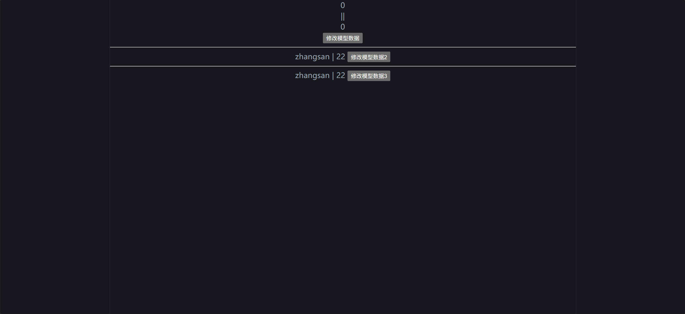


#### 2、ref与reactive的区别

:::: steps  

1. ref函数可以包装基本类型（字符串、数字）和引入类型（数组、对象）；reactive只能包装引用类型
2. 使用ref包装的数据在JS中修改或获取的时候需要加.value，在DOM中不用添加.value；用reactive包装的数据在JS和DOM中都不需要添加.value
3. 使用ref包装的对象，对象和对象的属性都是响应式的；使用reactive包装的对象，对象不是响应式的，对象的属性是响应式的

::::


### 3.3条件和列表渲染

#### 1、条件渲染

> **`v-if` 条件渲染：**

+ `v-if='表达式' `只会在指令的表达式返回真值时才被渲染

+ 也可以使用 `v-else` 为 `v-if` 添加一个“else 区块”。

+ 一个 `v-else` 元素必须跟在一个 `v-if` 元素后面，否则它将不会被识别。

```html
<script setup>
//声明数据
let age = 16
</script>

<template>
  <div v-if="age >= 18">已成年</div>
  <div v-else>小屁孩儿</div>
</template>
```

> **`v-show`条件渲染扩展：**

+ 另一个可以用来按条件显示一个元素的指令是 `v-show`。其用法基本一样；

+ 不同之处在于 `v-show` 会在 DOM 渲染中保留该元素；`v-show` 仅切换了该元素上名为 `display` 的 CSS 属性；

+ `v-show` 不支持在 `<template>` 元素上使用，也不能和 `v-else` 搭配使用；

``` html
<script setup>
//声明数据
let age = 16
</script>

<template>
  <div v-if="age >= 18">已成年</div>
  <div v-else>小屁孩儿</div>
  <div v-show="age >= 18">成年人</div>
  <div v-show="age < 18">儿童</div>
</template>
```

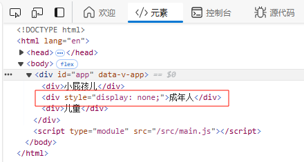

> **`v-if`**    **vs** **`v-show`**：

+ `v-if` 是“真实的”按条件渲染，因为它确保了在切换时，条件区块内的事件监听器和子组件都会被销毁与重建；

+ `v-if` 也是**惰性**的：如果在初次渲染时条件值为 false，则不会做任何事。条件区块只有当条件首次变为 true 时才被渲染；

+ 相比之下，`v-show` 简单许多，元素无论初始条件如何，始终会被渲染，只有 CSS `display` 属性会被切换；

+ 总的来说，`v-if` 有更高的切换开销，而 `v-show` 有更高的初始渲染开销。因此，如果需要频繁切换，则使用 `v-show` 较好；如果在运行时绑定条件很少改变，则 `v-if` 会更合适；

> **示例:**

```html
<script setup>
let age = 16
</script>

<template>
    <div>
        <div v-if="age >= 18">年龄大于等于18岁 - 成年人</div>
        <div v-else>年龄小于18岁 - 未成年人</div>

        <!-- 通过display: none; 隐藏标签。-->
        <div v-show="age >= 18">成年人</div>
        <div v-show="age < 18">儿童</div>
    </div>
</template>

<style scoped></style>
```

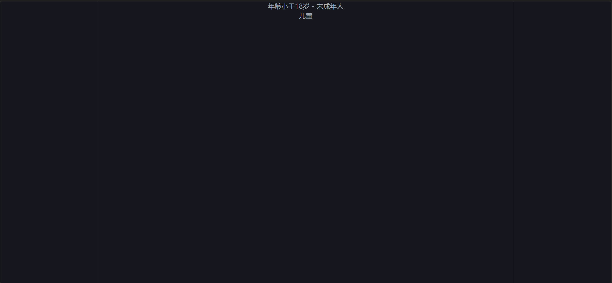


#### 2、列表渲染

> 我们可以使用 `v-for` 指令基于一个数组来渲染一个列表：

+ `v-for` 指令的值需要使用 `item in items` 形式的特殊语法，其中 `items` 是源数据的数组，而 `item` 是迭代项的别名；

+ 在 `v-for` 块中可以完整地访问父作用域内的属性和变量。`v-for` 也支持使用可选的第二个参数表示当前项的位置索引；

```html
<script setup>
//声明数据
let userArray = []

let userArray2 = [
    { id: 1, name: "迪丽热巴", age: 30 },
    { id: 2, name: "古力娜扎", age: 28 },
    { id: 4, name: "马蓉", age: 40 },
    { id: 5, name: "李小璐", age: 33 },
    { id: 6, name: "杨颖", age: 34 }
]
</script>

<template>
    <div v-if="userArray2.length == 0">
        <h1>没有任何用户</h1>
    </div>
    <div v-else>
        <h1>用户列表</h1>
        <table border="1" cellpadding="20" cellspacing="0">
            <!-- 表头放在 thead 中 -->
            <thead>
                <tr>
                    <th>序号</th>
                    <th>编号</th>
                    <th>姓名</th>
                    <th>年龄</th>
                    <th colspan="2">操作</th>
                </tr>
            </thead>
            <!-- 数据行放在 tbody 中 -->
            <tbody>
                <tr v-for="(item, index) in userArray2" :key="item.id">
                    <td>{{ index + 1 }}</td>
                    <td v-text="item.id"></td>
                    <td>{{ item.name }}</td>
                    <td>{{ item.age }}</td>
                    <td><a href="#">编辑</a></td>
                    <td><a href="#">删除</a></td>
                </tr>
            </tbody>
        </table>
    </div>
</template>

<style scoped></style>
```

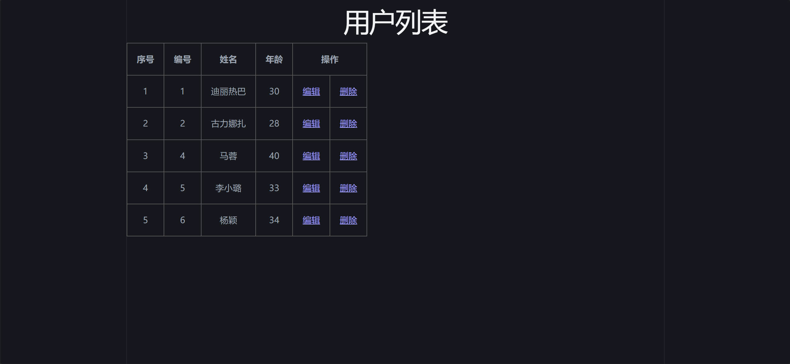


### 3.4 双向绑定

> **单项绑定和双向绑定：**

+ **单向绑定：响应式数据的变化会更新dom树，但是dom树上用户的操作造成的数据改变`不会同步更新到响应式数据`；**
+ **双向绑定：响应式数据的变化会更新dom树，但是dom树上用户的操作造成的数据改变`会同步更新到响应式数据`；**
  + 用户通过表单标签才能够输入数据，所以双向绑定都是应用到表单标签上的，其他标签不行；
  + v-model专门用于双向绑定表单标签的value属性，语法为 `v-model:value=''`，可以简写为 `v-model=''`；
  + v-model还可以用于各种不同类型的输入，`<textarea>`、`<select>` 元素；

```html
<script setup>
import { ref } from 'vue'
//声明数据
let data = ref("测试双向的数据绑定")
//修改JS中的data的函数
let changeData = ()=>{
  data.value = "新值"
}
</script>

<template>
  <h1>{{ data }}</h1>
  <!-- 单向数据绑定 -->
  测试单向数据绑定：<input v-bind:value="data"></input><br>
  <!-- 双向的数据绑定 -->
  测试双向数据绑定：<input v-model="data"></input><br>
  <button @click="changeData">点击修改JS中的数据</button>
</template>
```

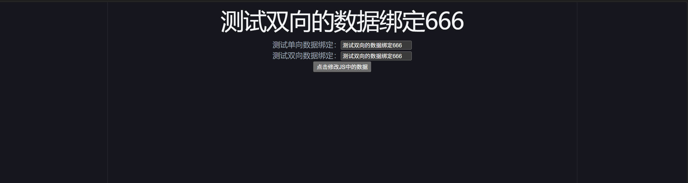


### 3.5 Vue生命周期

#### 1、生命周期简介

> 每个 Vue 组件实例在创建时都需要经历一系列的初始化步骤，比如设置好数据侦听，编译模板，挂载实例到 DOM，以及在数据改变时更新 DOM。在此过程中，它也会运行被称为`生命周期钩子的函数`，让开发者有机会在特定阶段运行自己的代码!

+ 周期图解：


+ 常见钩子函数：
  + onMounted()              注册一个回调函数，在组件挂载完成后执行； 
  + onUpdated()               注册一个回调函数，在组件因为响应式状态变更而更新其 DOM 树之后调用；
  + onUnmounted()         注册一个回调函数，在组件实例被卸载之后调用；
  + onBeforeMount()       注册一个钩子，在组件被挂载之前被调用； 
  + onBeforeUpdate()      注册一个钩子，在组件即将因为响应式状态变更而更新其 DOM 树之前调用； 
  + onBeforeUnmount()  注册一个钩子，在组件实例被卸载之前调用； 


#### 2、生命周期案例

```html
<script setup>
import { ref, onUpdated, onMounted, onBeforeUpdate } from 'vue'
let message = ref('hello')

// 挂载完毕生命周期
onMounted(() => {
    console.log('-----------onMounted---------')
    let span1 = document.getElementById("span1")
    console.log(span1.innerText)
})

// 更新前生命周期
onBeforeUpdate(() => {
    console.log('-----------onBeforeUpdate---------')
    console.log(message.value)
    let span1 = document.getElementById("span1")
    console.log(span1.innerText)
})

// 更新完成生命周期
onUpdated(() => {
    console.log('-----------onUpdated---------')
    let span1 = document.getElementById("span1")
    console.log(span1.innerText)
})
</script>

<template>
    <div>
        <span id="span1" v-text="message"></span> <br>
        <input type="text" v-model="message">
    </div>
</template>

<style scoped></style>
```

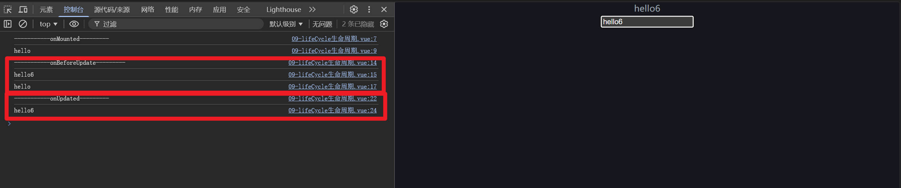


### 3.6 Vue组件基础

> **组件允许我们将 UI 划分为独立的、可重用的部分，并且可以对每个部分进行单独的思考。组件就是实现应用中局部功能代码和资源的集合！在实际应用中，组件常常被组织成层层嵌套的树状结构：**

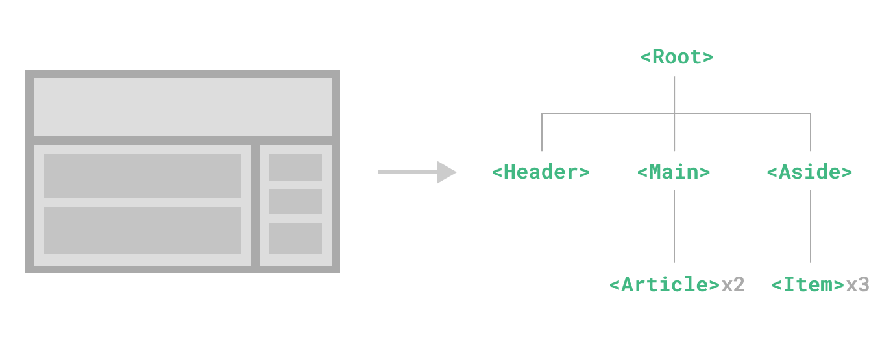

+ **这和我们嵌套 HTML 元素的方式类似，Vue 实现了自己的组件模型，使我们可以在每个组件内封装自定义内容与逻辑。**

> 传统方式编写应用：

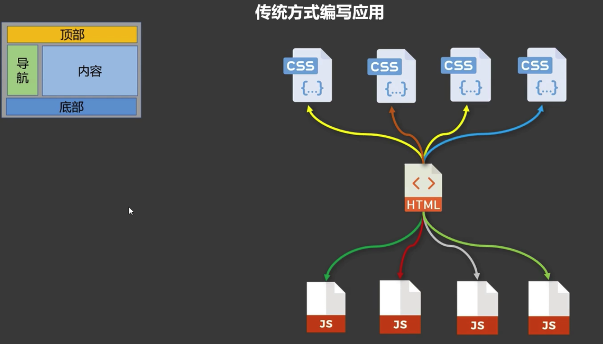

> 组件方式编写应用：


+ 组件化：对js/css/html统一封装，这是Vue中的概念；

+ 模块化：对js的统一封装,这是ES6中的概念；
+ 组件化中，对js部分代码的处理使用ES6中的模块化；


### 3.7 Vue组件之间传递数据（了解）

#### 1、父传子

> **Vue3 中父组件向子组件传值可以通过 props 进行，具体操作如下：**

:::: steps

1. 需要在子组件定义要接收的数据和参数

   ```  vue
   # 语法1: 数组方案声明
   defineProps(['foo'])
   
   # 语法2: 对象形式声明
   // 使用 <script setup>
   defineProps({
     title: String,
     likes: Number
   })
   # 对于以对象形式声明的每个属性，key 是 prop 的名称，而值则是该 prop 预期类型的构造函数。比如，如果要求一个 prop 的值是 number 类型，则可使用 Number 构造函数作为其声明的值。
   # 对象形式声明可以添加参数校验 https://cn.vuejs.org/guide/components/props.html#prop-validation
   # 校验选项中的 type 可以是下列这些原生构造函数：
   	String
   	Number
   	Boolean
   	Array
   	Object
   	Date
   	Function
   	Symbol
   	Error
   
   获取数据：
     方案1：defineProps(['foo']) ｜ defineProps({title: String})  直接使用声明属性名即可 {{foo | title}}
     方案2：let pops = defineProps(['foo'])｜let pops =  defineProps({title: String}) 直接使用声明属性名即可 {{pops.foo | pops.title}}
     方案3：let {foo} = defineProps(['foo'])｜let {title} =  defineProps({title: String}) 直接使用声明属性名即可 {{foo | title}}
   ```

   

2. 父组件使用子组件时进行赋值即可

   ``` vue
   静态传参：
   	声明接收
   	defineProps({
     	greetingMessage: String
   	})
   	参数传递
   	<MyComponent greeting-message="hello" />
   	理论上你也可以在向子组件传递 props 时使用 camelCase 形式，但实际上为了和 HTML attribute 对齐，通常会将其写为 kebab-case 形式！
   动态参数：
     相应地，还有使用 v-bind 或缩写 : 来进行动态绑定的 props
     <!-- 根据一个变量的值动态传入 -->
     <BlogPost :title="post.title" />
     <!-- 根据一个更复杂表达式的值动态传入 -->
     <BlogPost :title="post.title + ' by ' + post.author.name" />
   ```

::::

+ 父组件代码：App.vue

```vue
<script setup>
import { ref } from 'vue'
import Son from '../父传子/son.vue'
let message = ref('hello')

// 在父组件中更新模型属性
let change = () => {
    message.value = 'world'
}
</script>

<template>
    <div>
        <hr>
        在父组件上的内容如下：{{ message }} 
        <br>
        <button @click="change">在父组件中更新模型属性</button>
        <hr>

        <Son :msg="message" number="123"></Son>
    </div>
</template>

<style scoped></style>
```


+ 子组件代码：Son.vue

```vue
<script setup>
import { ref, defineProps } from 'vue'

//子组件定义模型属性用于接收父组件传输过来的数据。
defineProps({
    msg: String,
    number: Number
})
</script>

<template>
    <div>
        <hr />
        子组件回显内容：{{ msg }} - {{ number }}
        <hr />
    </div>
</template>

<style scoped></style>
```

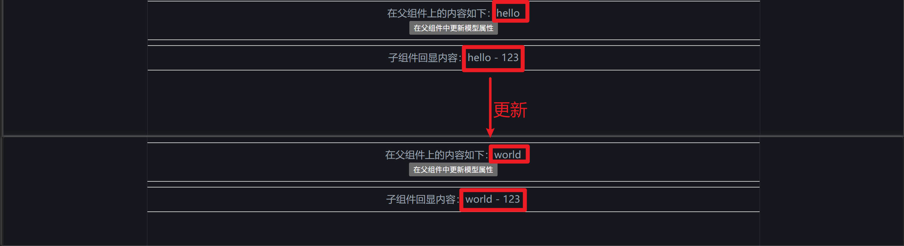


#### 2、子传父

>  **Vue3 中子组件向父组件传值可以通过 defineEmits 进行，具体操作如下：**

:::: steps

1. **在子组件中定义事件**：使用 `defineEmits` 定义事件。

   ``` vue
   import {ref,defineEmits} from 'vue'
   //1.定义要发送给父组件的方法，可以1或者多个
   let emites = defineEmits(['add','sub']);
   ```

2. **触发事件并传递参数**：在子组件适当的事件处理程序中调用 emit 函数以发射事件。

   ```    vue
   //2.触发父组件对应的方法，调用defineEmites对应的属性
   emites('add','add data!'+data.value)
   emites('sub','sub data!'+data.value)
   ```

3. **在父组件中监听事件**：使用 `v-on` 或简写 `@` 语法在父组件中监听子组件的事件。

   ``` vue
   <!-- 声明@事件名应该等于子模块对应事件名！调用方法可以是当前自定义！-->
   <Son @add="padd" @sub="psub"></Son>
   ```

::::

+ 父组件： App.vue

```vue
<script setup>
import { ref } from 'vue'
import Son from '../子传父/son.vue'
let message1 = ref('aaa')
let message2 = ref('bbb')

// 1.定义一个方法，接收子组件传递过来的数据
let padd = (data) => {
    message1.value = data
}

// 2.定义一个方法，接收子组件传递过来的数据
let psub = (data) => {
    message2.value = data
}
</script>

<template>
    <div>
        <hr>
        在父组件上的内容如下：{{ message1 }} | {{ message2 }}
        <hr>

        <Son @add="padd" @sub="psub"></Son>
    </div>
</template>

<style scoped></style>
```


+ 子组件：Son.vue

```vue
<script setup>
import { ref, defineEmits } from 'vue'

//1.定义要发送给父组件的方法，可以1或者多个
let emaits = defineEmits(['add','sub'])

let data = ref(0)

// 2.定义一个方法，给父组件发送数据
let sendMsgToParent = ()=>{

    //在子中触发事件，调用定义函数给父传递数据。
    emaits('add','addSontodata:'+data.value)
    emaits('sub','subSontodata:'+data.value)

    // 3.给data自增
    data.value ++
}

</script>

<template>
    <div>
        <hr />
        <button @click="sendMsgToParent">发送消息给父组件</button>
        <hr />
    </div>
</template>

<style scoped></style>
```

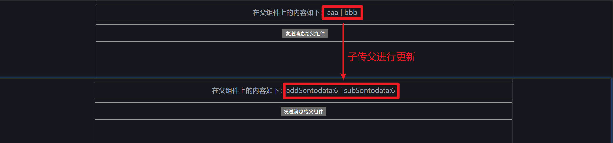


#### 3、兄弟传参

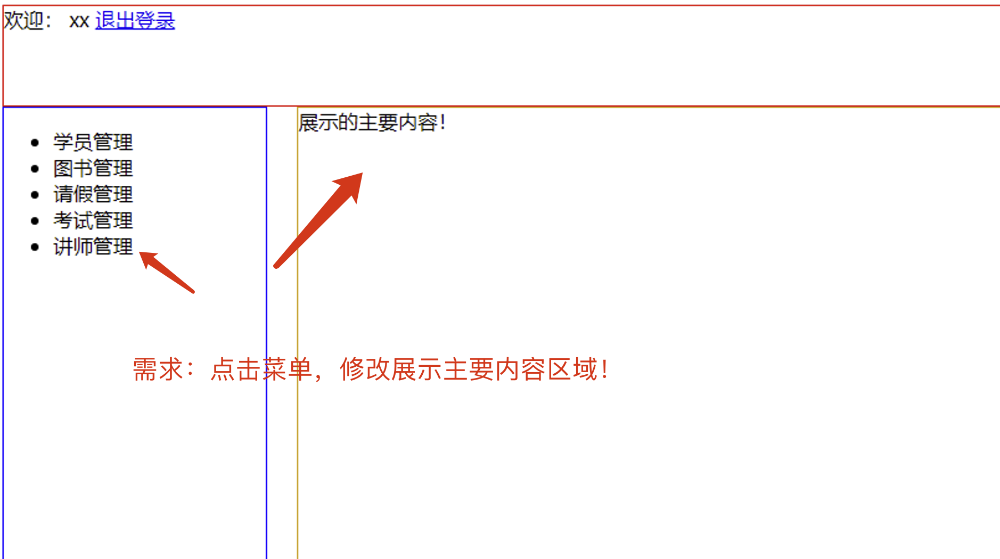

+ Navigator.vue: 发送数据到App.vue

```vue
<script setup type="module">
    import {defineEmits} from 'vue'
    const emits = defineEmits(['sendMenu']);
    //触发事件，向父容器发送数据
    function send(data){
        emits('sendMenu',data);
    }
</script>
<template>
    <!-- 推荐写一个根标签-->
    <div>
       <ul>
          <li @click="send('学员管理')">学员管理</li>
          <li @click="send('图书管理')">图书管理</li>
          <li @click="send('请假管理')">请假管理</li>
          <li @click="send('考试管理')">考试管理</li>
          <li @click="send('讲师管理')">讲师管理</li>
       </ul>
    </div>
</template>
<style>
</style>
```


+ App.vue: 发送数据到Content.vue

```vue
<script setup>
  import Header  from './components/Header.vue'
  import Navigator  from './components/Navigator.vue'
  import Content  from './components/Content.vue'
  import {ref} from "vue"
  //定义接受navigator传递参数
  var navigator_menu = ref('ceshi');
  const receiver = (data) =>{
    navigator_menu.value = data;
  }
</script>
<template>
  <div>
      <hr>
      {{ navigator_menu }}
      <hr>
     <Header class="header"></Header>
     <Navigator @sendMenu="receiver" class="navigator"></Navigator>
     <!-- 向子组件传递数据-->
     <Content class="content" :message="navigator_menu"></Content>
    </div>
</template>
<style scoped>
    .header{
       height: 80px;
       border: 1px solid red;
    }
    .navigator{
      width: 15%;
      height: 800px;
      display: inline-block;
      border: 1px blue solid;
      float: left;
    }
    .content{
      width: 83%;
      height: 800px;
      display: inline-block;
      border: 1px goldenrod solid;
      float: right;
    }
</style>
```


+ Content.vue

```vue
<script setup type="module">
    defineProps({
        message:String
    })
</script>
<template>
    <div>
        展示的主要内容！
        <hr>
        {{ message }}
    </div>
</template>
<style>
</style>
```

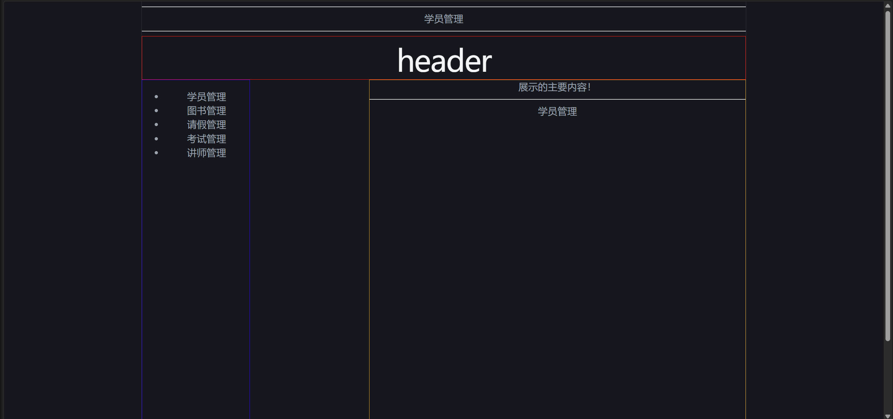
