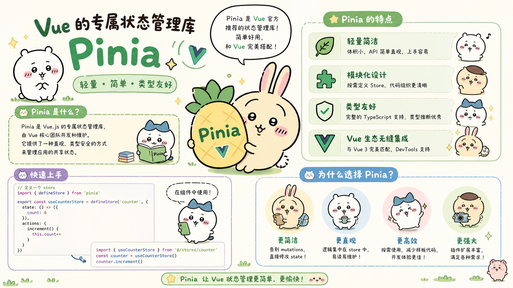

## 1. 状态管理Pinia

### 1.1 Pinia介绍

> 如何实现多个组件之间的数据传递?

+ 方式1 组件传参 ；

+ 方式2 路由传参 ；

+ 方式3 通过pinia状态管理定义共享数据；

> 当我们有`多个组件共享一个共同的状态(数据源)`时，多个视图可能都依赖于同一份状态。来自不同视图的交互也可能需要更改同一份状态。虽然我们的手动状态管理解决方案（props，组件间通信，模块化）在简单的场景中已经足够了，但是在大规模的生产应用中还有很多其他事项需要考虑：

-   更强的团队协作约定；
-   与 Vue DevTools 集成，包括时间轴、组件内部审查和时间旅行调试；
-   模块热更新 (HMR)；
-   服务端渲染支持；

>  [Pinia](https://pinia.vuejs.org/zh/ "Pinia") 就是一个实现了上述需求的状态管理库，由 Vue 核心团队维护，对 Vue 2 和 Vue 3 都可用。
>
>  官网：https://pinia.vuejs.org/zh


### 1.2 Pinia基本用法

:::: steps

1. 准备Vite项目：

```javascript
pnpm create vite
pnpm install 
pnpm install vue-router@4 --save
```


2. 安装Pinia：

```javascript
pnpm install pinia
```


3. 定义pinia store对象 src/store/store.js （推荐这么命名不是强制）：

```javascript
import {defineStore } from 'pinia'
//定义数据并且对外暴露
// store就是定义共享状态的包装对象
// 内部包含四个属性： id 唯一标识 state 完整类型推理，推荐使用箭头函数 存放的数据 getters 类似属性计算，获取存储数据
// 操作的方法  actions 存储数据的复杂业务逻辑方法
// 理解： store类似Java中的实体类， id就是类名， state 就是装数据值的属性  getters就是get方法，actions就是对数据操作的其他方法
export const definedPerson = defineStore('personPinia',//必须唯一
    {
        state:()=>{ // state中用于定义数据
            return {
                username:'张三',
                age:0,
                hobbies:['唱歌','跳舞']
            }
        },
        getters:{// 用于定义一些通过数据计算而得到结果的一些方法 一般在此处不做对数据的修改操作
                 // getters中的方法可以当做属性值方式使用
            getHobbiesCount(){
                return this.hobbies.length
            },
            getAge(){
                return this.age
            }
        },
        actions:{ // 用于定义一些对数据修改的方法
            doubleAge(){
                this.age=this.age*2
            }
        }
    }
)
```


4. 在main.js配置Pinia组件到Vue中 ：

```javascript
import { createApp } from 'vue'
import './style.css'
import App from './App.vue'

// 引入路由对象
import router from './routers/router.js'

// 引入pinia
import { createPinia } from 'pinia'
let pinia = createPinia()

createApp(App).use(pinia).use(router).mount('#app') // 将pinia和路由对象挂载到vue实例上
```


5. Operate.vue 中操作Pinia数据：

```html
<script setup type="module">
    import { definedPerson } from '../store/store';
    //import  definedPerson  from '../store/store';//如果采用默认导出，请使用该行导入
    // 读取存储的数据
    let person= definedPerson()

</script>
<template>
    <div>
        <h1>operate视图,用户操作Pinia中的数据</h1>
        请输入姓名:<input type="text" v-model="person.username"> <br>
        请输入年龄:<input type="text" v-model="person.age"> <br>
        请增加爱好:
        <input type="checkbox" value="吃饭"  v-model="person.hobbies"> 吃饭
        <input type="checkbox" value="睡觉"  v-model="person.hobbies"> 睡觉
        <input type="checkbox" value="打豆豆"  v-model="person.hobbies"> 打豆豆 <br>        
        <!-- 事件中调用person的doubleAge()方法 -->
        <button @click="person.doubleAge()">年龄加倍</button> <br>
        <!-- 事件中调用pinia提供的$reset()方法恢复数据的默认值 -->
        <button @click="person.$reset()">恢复默认值</button> <br>
        <!-- 事件中调用$patch方法一次性修改多个属性值 -->
        <button @click="person.$patch({username:'奥特曼',age:100,hobbies:['晒太阳','打怪兽']})">变身奥特曼</button> <br>
		显示pinia中的person数据:{{person}}
    </div>
</template>
<style scoped>
</style>
```


6. List.vue中展示Pinia数据：

``` html
<script setup type="module">
    import { definedPerson } from '../store/store';
    //import  definedPerson  from '../store/store';//如果采用默认导出，请使用该行导入
    // 读取存储的数据
    let person= definedPerson()
</script>
<template>
    <div>
        <h1>List页面,展示Pinia中的数据</h1>
        读取姓名:{{person.username}} <br>
        读取年龄:{{person.age}} <br>
        通过get年龄:{{person.getAge}} <br>
        爱好数量:{{person.getHobbiesCount}} <br>
        所有的爱好:
        <ul>
            <li v-for='(hobby,index) in person.hobbies' :key="index" v-text="hobby"></li>
        </ul>
    </div>
</template>
<style scoped>
</style>
```


7. 定义组件路由router.js：

``` javascript
// 导入路由创建的相关方法
import {createRouter,createWebHashHistory} from 'vue-router'
// 导入vue组件
import List  from '../components/List.vue'
import Operate  from '../components/Operate.vue'
// 创建路由对象,声明路由规则
const router = createRouter({
    history: createWebHashHistory(),
    routes:[
        {
            path:'/operate',
            component:Operate
        },
        
        {
            path:'/list',
            component:List
        },
    ]
})
// 对外暴露路由对象
export default router;
```


8. App.vue中通过路由切换组件：

``` html
<script setup type="module">
</script>
<template>
    <div>
      <hr>
      <router-link to="/operate">显示操作页</router-link> <br>
      <router-link to="/list">显示展示页</router-link> <br>
      <hr>
      <router-view></router-view>
    </div>
</template>
<style scoped>
</style>
```


9. 启动测试：

```javascript
pnpm dev
```

/img-1.jpg)

> **年龄加倍**

/img-1.jpg)

/img-2.jpg)

/img-3.jpg)

> **变身奥特曼**

/img-4.jpg)

/img-5.jpg)

> **恢复默认值**

/img-6.jpg)

/img-7.jpg)

::::
