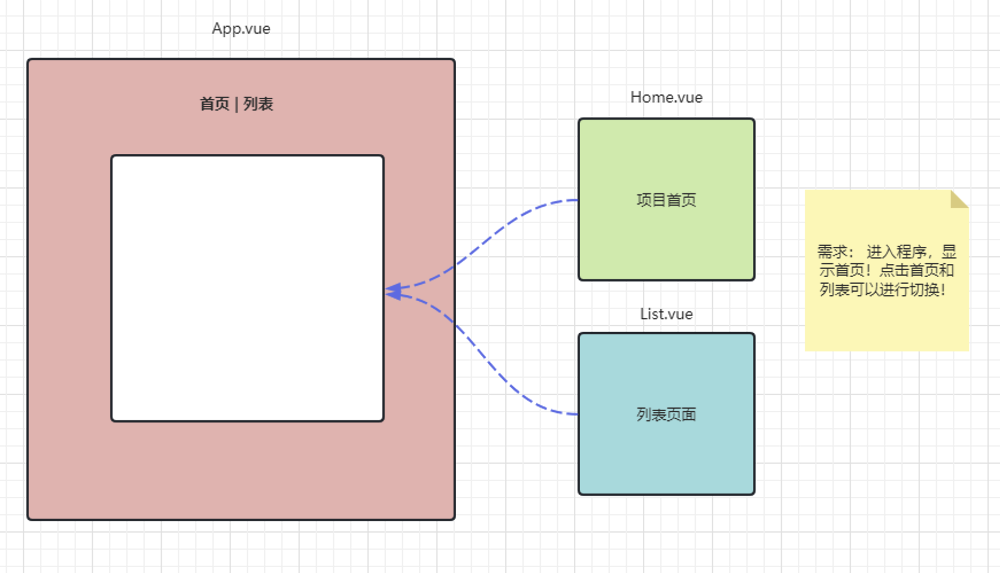

## 1. 路由机制Router

### 1.1 路由简介

> 1 什么是路由？

-   定义：路由就是根据不同的 URL 地址展示不同的内容或页面；
-   通俗理解：路由就像是一个地图，我们要去不同的地方，需要通过不同的路线进行导航；

> 2 路由的作用：

-   单页应用程序（SPA）中，路由可以实现不同视图之间的无刷新切换，提升用户体验；
-   路由还可以实现页面的认证和权限控制，保护用户的隐私和安全；
-   路由还可以利用浏览器的前进与后退，帮助用户更好地回到之前访问过的页面；


### 1.2 路由入门案例

> 1 案例需求分析：



> 2 创建项目和导入路由依赖：


```shell
npm create vite //创建项目cd 项目文件夹 //进入项目文件夹
npm install //安装项目需求依赖
npm install vue-router@4 --save //安装全局的vue-router 4版本， --save表示添加依赖到package.json,默认可省略。--save-dev表示增加开发依赖配置。
```

> 3 准备页面和组件    ：

+ components/Home.vue

``` html
<script setup>
</script>
<template>
    <div>
        <h1>Home页面</h1>
    </div>
</template>
<style scoped>
</style>
```

+ components/List.vue

``` html
<script setup>
</script>
<template>
    <div>
        <h1>List页面</h1>
    </div>
</template>
<style scoped>
</style>
```

+ components/Add.vue

``` html
<script setup>
</script>
<template>
    <div>
        <h1>Add页面</h1>
    </div>
</template>
<style scoped>
</style>
```

+ components/Update.vue

``` html
<script setup>
</script>
<template>
    <div>
        <h1>Update页面</h1>
    </div>
</template>
<style scoped>
</style>
```

+ App.vue

``` html
<script setup>
</script>
<template>
    <div>
      <h1>App页面</h1>
      <hr/>
        <!-- 路由的连接 -->
        <router-link to="/">home页</router-link> <br>
        <router-link to="/list">list页</router-link> <br>
        <router-link to="/add">add页</router-link> <br>
        <router-link to="/update">update页</router-link> <br>
      <hr/>
      <!-- 路由连接对应视图的展示位置 -->
      <hr> 默认展示位置:<router-view></router-view>
      <hr> Home视图展示:<router-view name="homeView"></router-view>
      <hr> List视图展示:<router-view name="listView"></router-view>
      <hr> Add视图展示:<router-view name="addView"></router-view>
      <hr> Update视图展示:<router-view name="updateView"></router-view>
    </div>
</template>
<style scoped>
</style>
```

> 4 准备路由配置：

+ src/routers/router.js

```javascript
// 导入路由创建的相关方法
import {createRouter,createWebHashHistory} from 'vue-router'
// 导入vue组件
import Home from '../components/Home.vue'
import List from '../components/List.vue'
import Add from '../components/Add.vue'
import Update from '../components/Update.vue'
// 创建路由对象,声明路由规则
const router = createRouter({
    //createWebHashHistory() 是 Vue.js 基于 hash 模式创建路由的工厂函数。在使用这种模式下，路由信息保存在 URL 的 hash 中，
    //使用 createWebHistory() 方法，可以创建一个路由历史记录对象，用于管理应用程序的路由。在 Vue.js 应用中，
    //通常使用该方法来创建路由的历史记录对象。
    //就是路由中缓存历史记录的对象，vue-router提供
    history: createWebHashHistory(),
    routes:[
        {
            path:'/',
            /* 
                component指定组件在默认的路由视图位置展示
                components:Home
                components指定组件在name为某个值的路由视图位置展示
                components:{
                    default:Home,// 默认路由视图位置
                    homeView:Home// name为homeView的路由视图位置
                }   
            */
            components:{
                default:Home,
                homeView:Home
            }      
        },
        {
            path:'/list',
            components:{
                listView : List
            } 
        },
        {
            path:'/add',
            components:{
                addView:Add
            } 
        },
        {
            path:'/update',
            components:{
                updateView:Update
            }  
        },
    ]

})
// 对外暴露路由对象
export default router;
```

> 5 main.js引入Router配置：

+ 修改文件：main.js (入口文件)

```javascript
import { createApp } from 'vue'
import './style.css'
import App from './App.vue'
//导入router模块
import router from './routers/router.js'
let app = createApp(App)
//绑定路由对象
app.use(router)
//挂载视图
app.mount("#app")
```

> 6 启动测试：

``` shell
npm run dev
```

> 内容解释： https://router.vuejs.org/zh/guide/

``` 
1. RouterLink 用来渲染一个链接的组件，该链接在被点击时会触发导航。 
    <router-link to="/list">list页</router-link> <br> to属性指的是触发路径跳转到对应组件
2. RouterView RouterView 组件可以使 Vue Router 知道你想要在哪里渲染当前 URL 路径对应的路由组件。它不一定要在 App.vue 中，你可以把它放在任何地方！
   可以在界面中拥有多个单独命名的视图，而不是只有一个单独的出口。如果 router-view 没有设置名字，那么默认为default
   <router-view class="view left-sidebar" name="LeftSidebar" />
3. createRouter()函数
   路由器实例是通过调用 createRouter() 函数创建的
   const router = createRouter({
  	 history: createMemoryHistory(), //记录历史记录模式！ 
  	 routes:[
  	 	path: "/对应地址",component: 默认routerView显示组件,
        path: "/对应路径",components:{命名视图名:显示组件,命名视图名:显示组件}
  	 ]  //路由规则
  })
	 路径：动态路径设置，路径传惨
	 /users/:username	              /users/eduardo	
     /users/:username/posts/:postId	  /users/eduardo/posts/123	
     {{ $route.params.username }} 获取参数
4. 注册路由器插件
   createApp(App)
   .use(router)
   .mount('#app')
   注册路由作用：
	  全局注册 RouterView 和 RouterLink 组件。
	  添加全局 $router 和 $route 属性。
	  启用 useRouter() 和 useRoute() 组合式函数。
	  触发路由器解析初始路由。
```


### 1.3 路由重定向

> 重定向的作用：将一个路由重定向到另一个路由上。

+ 修改案例：访问/list和/showAll都定向到List.vue.
+ router.js

``` javascript
{
   path:'/showAll',
   // 重定向
   redirect :'/list'
}
```

+ App.vue 

```html
<script setup>
</script>
<template>
    <div>
      <h1>App页面</h1>
      <hr/>
        <!-- 路由的连接 -->
        <router-link to="/">home页</router-link> <br>
        <router-link to="/list">list页</router-link> <br>
        <router-link to="/showAll">showAll页</router-link> <br>
        <router-link to="/add">add页</router-link> <br>
        <router-link to="/update">update页</router-link> <br>
      <hr/>
      <!-- 路由连接对应视图的展示位置 -->
      <hr> 默认展示位置:<router-view></router-view>
      <hr> Home视图展示:<router-view name="homeView"></router-view>
      <hr> List视图展示:<router-view name="listView"></router-view>
      <hr> Add视图展示:<router-view name="addView"></router-view>
      <hr> Update视图展示:<router-view name="updateView"></router-view>
    </div>
</template>
<style scoped>
</style>
```


###  1.4 编程式路由(useRouter)

> 声明式路由：

+ `<router-link to="/list">list页</router-link>  `这种路由，点击后只能切换/list对应组件，是固定的。

> 编程式路由：

+ 通过useRouter，动态决定向那个组件切换的路由；

+ 在 Vue 3 和 Vue Router 4 中，你可以使用 `useRouter` 来实现动态路由(编程式路由)；

+ 这里的 `useRouter` 方法返回的是一个 router 对象，你可以用它来做如导航到新页面、返回上一页面等操作；

  | 声明式                    | 编程式             |
  | :------------------------ | :----------------- |
  | `<router-link :to="...">` | `router.push(...)` |

  ``` javascript
  // 字符串路径
  router.push('/users/eduardo')
  // 带有路径的对象
  router.push({ path: '/users/eduardo' })
  // 带查询参数，结果是 /register?plan=private
  router.push({ path: '/register', query: { plan: 'private' } 
  
  router.push(`/user/${username}`) // -> /user/eduardo
  // 同样
  router.push({ path: `/user/${username}` }) // -> /user/eduardo
  // 如果可能的话，使用 `name` 和 `params` 从自动 URL 编码中获益
  router.push({ name: 'user', params: { username } }) // -> /user/eduardo
  // `params` 不能与 `path` 一起使用
  router.push({ path: '/user', params: { username } }) // -> /user
  ```

> 案例需求：通过普通按钮配合事件绑定实现路由页面跳转，不直接使用router-link标签。

+ App.vue

``` html
<script setup type="module">
  import {useRouter} from 'vue-router'
  import {ref} from 'vue'
  //创建动态路由对象
  let router = useRouter()
 
  let  showList= ()=>{
      // 编程式路由
      // 直接push一个路径
      // router.push('/list')
      // push一个带有path属性的对象
      router.push({path:'/list'})
  }
</script>
<template>
    <div>
      <h1>App页面</h1>
      <hr/>
        <!-- 路由的连接 -->
        <router-link to="/">home页</router-link> <br>
        <router-link to="/list">list页</router-link> <br> 
        <!-- 动态输入路径,点击按钮,触发单击事件的函数,在函数中通过编程是路由切换页面 -->
        <button @click="showList()">showList</button> <br>
      <hr/>
      <!-- 路由连接对应视图的展示位置 -->
      <hr> 默认展示位置:<router-view></router-view>
      <hr> Home视图展示:<router-view name="homeView"></router-view>
      <hr> List视图展示:<router-view name="listView"></router-view>     
    </div>
</template>
<style scoped>
</style>
```


### 1.5 路由传参(useRoute)

> 路径参数：

+ 在路径中使用一个动态字段来实现，我们称之为 **路径参数**：
  + 例如： 查看数据详情  `/showDetail/1`  ，`1`就是要查看详情的id，可以动态添值。

> 键值对参数：

+ 类似与get请求通过url传参，数据是键值对形式的：

  + 例如:  查看数据详情`/showDetail?hid=1`，`hid=1`就是要传递的键值对参数。

> 读取参数：

+ 在 Vue 3 和 Vue Router 4 中，你可以使用  `useRoute` 这个函数从 Vue 的组合式 API 中获取路由对象；
+ `useRoute` 方法返回的是当前的 route 对象，你可以用它来获取关于当前路由的信息，如当前的路径、键值对参数等；

> 案例需求 : 切换到ShowDetail.vue组件时，向该组件通过路由传递参数。

+ 修改App.vue文件

``` html
<script setup type="module">
  import {useRouter} from 'vue-router'
  //创建动态路由对象
  let router = useRouter()
  //动态路由路径传参方法
  let showDetail= (id,language)=>{
      // 尝试使用拼接字符串方式传递路径参数
      //router.push(`showDetail/${id}/${languange}`)
      /*路径参数,需要使用params  */
      router.push({name:"showDetail",params:{id:id,language:language}})
  }
  let showDetail2= (id,language)=>{
      /*uri键值对参数,需要使用query */
      //router.push({path:`/showDetail2?id=${id}&language=${language}`)
      router.push({path:"/showDetail2",query:{id:id,language:language}})
  }
</script>
<template>
    <div>
      <h1>App页面</h1>
      <hr/>
      <!-- 路径参数   -->
      <router-link to="/showDetail/1/JAVA">路径传参JAVA</router-link> 
      <button @click="showDetail(1,'JAVA')">编程式路由路径传参显示JAVA</button>
      <hr/>
      <!-- 键值对参数 -->
      <router-link v-bind:to="{path:'/showDetail2',query:{id:1,language:'Java'}}">键值对传参JAVA</router-link> 
      <button @click="showDetail2(1,'JAVA')">编程式路由键值对传参JAVA</button>
      <hr> showDetail视图展示:<router-view name="showDetailView"></router-view>
      <hr> showDetail2视图展示:<router-view name="showDetailView2"></router-view>
    </div>
</template>
<style scoped>
</style>
```

+ 修改router.js增加路径参数占位符

``` javascript
import {createRouter,createWebHashHistory} from 'vue-router'
import ShowDetail from '../components/ShowDetail.vue'
import ShowDetail2 from '../components/ShowDetail2.vue'
// 创建路由对象,声明路由规则
const router = createRouter({
    history: createWebHashHistory(),
    routes:[    
        {
            /* 此处:id  :language作为路径的占位符 */
            path:'/showDetail/:id/:language',
            /* 动态路由传参时,根据该名字找到该路由 */
            name:'showDetail',
            components:{
                showDetailView:ShowDetail
            }  
        },
        {
            path:'/showDetail2',
            components:{
                showDetailView2:ShowDetail2
            }  
        },
    ]
})
// 对外暴露路由对象
export default router;
```

+ ShowDetail.vue 通过useRoute获取路径参数

``` html
<script setup type="module">
    import {useRoute} from 'vue-router'
    import { onMounted,ref } from 'vue';
    // 获取当前的route对象
    let route =useRoute()
    let languageId = ref(0)
    let languageName = ref('')
    //  借助更新时生命周期,将数据更新进入响应式对象
    onMounted (()=>{
        // 获取对象中的参数
        languageId.value=route.params.id
        languageName.value=route.params.language
        console.log(languageId.value)
        console.log(languageName.value)
    })    
</script>
<template>
    <div>
        <h1>ShowDetail页面</h1>
        <h3>编号{{route.params.id}}:{{route.params.language}}是世界上最好的语言</h3>
        <h3>编号{{languageId}}:{{languageName}}是世界上最好的语言</h3>
    </div>
</template>
<style scoped>
</style>
```

-   ShowDetail2.vue通过useRoute获取键值对参数

```html
<script setup type="module">
    import{useRoute} from 'vue-router'
    import { onMounted,ref } from 'vue';
    // 获取当前的route对象
    let route =useRoute()
    let languageId = ref(0)
    let languageName = ref('')
    //  借助更新时生命周期,将数据更新进入响应式对象
    onMounted (()=>{
        // 获取对象中的参数(通过query获取参数,此时参数是key-value形式的)
        console.log(route.query)
        console.log(languageId.value)
        console.log(languageName.value)
        languageId.value=route.query.id
        languageName.value=route.query.language       
    })    
</script>
<template>
    <div>
        <h1>ShowDetail2页面</h1>
        <h3>编号{{route.query.id}}:{{route.query.language}}是世界上最好的语言</h3>
        <h3>编号{{languageId}}:{{languageName}}是世界上最好的语言</h3>
    </div>
</template>
<style scoped>
</style>
```


### 1.6 路由守卫

> 在 Vue 3 中，路由守卫是用于在路由切换期间进行一些特定任务的回调函数。路由守卫可以用于许多任务，例如验证用户是否已登录、在路由切换前提供确认提示、请求数据等。Vue 3 为路由守卫提供了全面的支持，并提供了以下几种类型的路由守卫：

1.  **全局前置守卫**：在路由切换前被调用，可以用于验证用户是否已登录、中断导航、请求数据等；
2.  **全局后置守卫**：在路由切换之后被调用，可以用于处理数据、操作 DOM 、记录日志等；
3.  **守卫代码的位置**: 在router.js中

```javascript
//全局前置路由守卫
router.beforeEach( (to,from,next) => {
    //to 是目标地包装对象  .path属性可以获取地址
    //from 是来源地包装对象 .path属性可以获取地址
    //next是方法,不调用默认拦截！ next() 放行,直接到达目标组件
    //next('/地址')可以转发到其他地址,到达目标组件前会再次经过前置路由守卫
    console.log(to.path,from.path,next)
    //需要判断，注意避免无限重定向
    if(to.path == '/index'){
        next()
    }else{
        next('/index')
    }
} )
//全局后置路由守卫
router.afterEach((to, from) => {
    console.log(`Navigate from ${from.path} to ${to.path}`);
});
```

> 登录案例，登录以后才可以进入home，否则必须进入login。

+ 定义Login.vue

```html
<script setup>
    import {ref} from 'vue'
    import {useRouter} from 'vue-router'
    let username =ref('')
    let password =ref('')
    let router = useRouter();
    let login = () =>{
        console.log(username.value,password.value)
        if(username.value == 'root' & password.value == '123456'){
            router.push({path:'/home',query:{'username':username.value}})
            //登录成功利用前端存储机制，存储账号！
            localStorage.setItem('username',username.value)
            //sessionStorage.setItem('username',username)
        }else{
            alert('登录失败，账号或者密码错误！');
        }
    }

</script>
<template>   
    <div>
        账号： <input type="text" v-model="username" placeholder="请输入账号！"><br>
        密码： <input type="password" v-model="password" placeholder="请输入密码！"><br>
        <button @click="login()">登录</button>
    </div>
</template>
<style scoped>
</style>
```

+ 定义Home.vue

```html
<script setup>
 import {ref} from 'vue'
 import {useRoute,useRouter} from 'vue-router'
 let route =useRoute()
 let router = useRouter()
 //  并不是每次进入home页时,都有用户名参数传入
 //let username = route.query.username
 let username =window.localStorage.getItem('username'); 
 let logout= ()=>{
    // 清除localStorge中的username
    //window.sessionStorage.removeItem('username')
    window.localStorage.removeItem('username')
    // 动态路由到登录页
    router.push("/login")
 }
</script>
<template>
    <div>
        <h1>Home页面</h1>
        <h3>欢迎{{username}}登录</h3>
        <button @click="logout">退出登录</button>
    </div>
</template>
<style scoped>
</style>
```

+ App.vue

```html
<script setup type="module">
</script>
<template>
    <div>     
      <router-view></router-view>     
    </div>
</template>
<style scoped>
</style>
```

+ 定义routers.js

``` javascript
import {createRouter,createWebHashHistory} from 'vue-router'
import Home from '../components/Home.vue'
import Login from '../components/login.vue'
const router = createRouter({
    history: createWebHashHistory(),
    routes:[
        {
            path:'/home',
            component:Home
        },
        {
            path:'/',
            redirect:"/home"
        },
        {
            path:'/login',
            component:Login
        },
    ]
})
// 设置路由的全局前置守卫
router.beforeEach((to,from,next)=>{
    /* 
    to 要去那
    from 从哪里来
    next 放行路由时需要调用的方法,不调用则不放行
    */
    console.log(`从哪里来:${from.path},到哪里去:${to.path}`)
    if(to.path == '/login'){
        //放行路由  注意放行不要形成循环  
        next()
    }else{
        //let username =window.sessionStorage.getItem('username'); 
        let username =window.localStorage.getItem('username'); 
        if(null != username){
            next()
        }else{
            next('/login')
        }
    }
})
// 设置路由的全局后置守卫
router.afterEach((to,from)=>{
    console.log(`从哪里来:${from.path},到哪里去:${to.path}`)
})
// 对外暴露路由对象
export default router;
```

+ 启动测试

```shell
npm run dev
```
