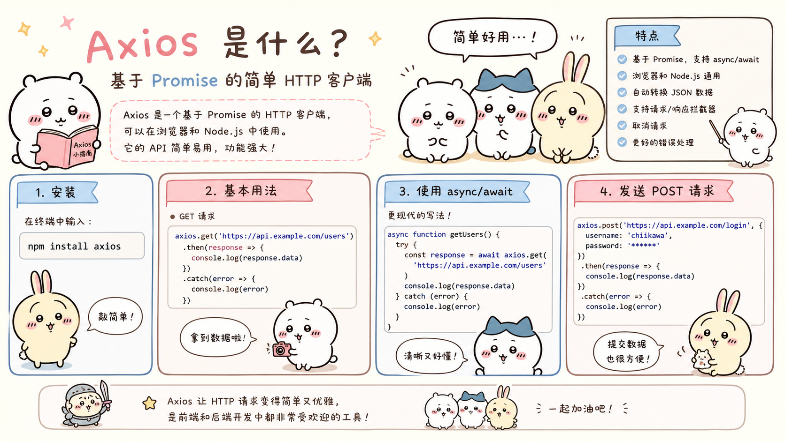
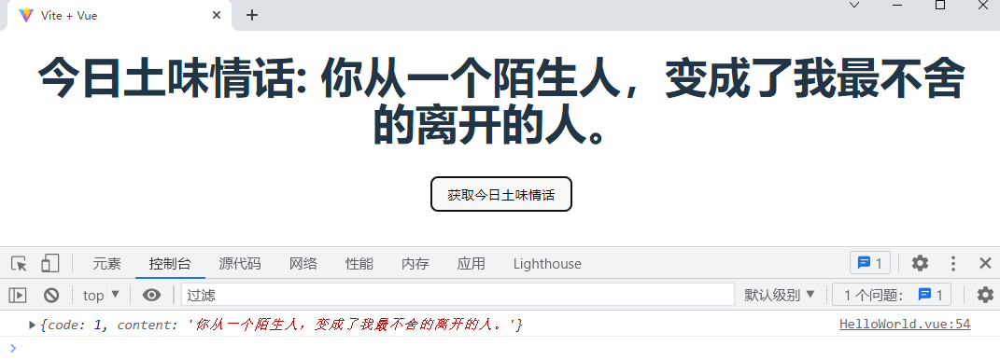
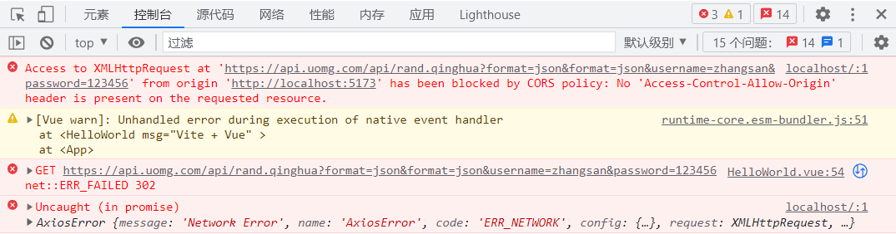

## 1. 预讲知识-Promise

### 1.1 普通函数和回调函数

> 普通函数：正常调用的函数，一般函数执行完毕后才会继续执行下一行代码。

``` html
<script>
    let fun1 = () =>{
        console.log("fun1 invoked")
    }
    // 调用函数
    fun1()
    // 函数执行完毕,继续执行后续代码
    console.log("other code processon")
</script>
```

> 回调函数： 一些特殊的函数，表示未来才会执行的一些功能，后续代码不会等待该函数执行完毕就开始执行了。

```html
<script>
    // 设置一个2000毫秒后会执行一次的定时任务
    setTimeout(function (){
        console.log("setTimeout invoked")
    },2000)
    console.log("other code processon")
</script>
```


### 1.2 Promise 简介

> 前端中的异步编程技术，类似Java中的多线程+线程结果回调！

+ Promise 是异步编程的一种解决方案，比传统的解决方案回调函数和事件更合理和更强大。它由社区最早提出和实现，ES6将其写进了语言标准，统一了用法，原生提供了`Promise`对象；

+ 所谓`Promise`，简单说就是一个容器，里面保存着某个未来才会结束的事件（通常是一个异步操作）的结果。从语法上说，Promise 是一个对象，从它可以获取异步操作的消息。Promise 提供统一的 API，各种异步操作都可以用同样的方法进行处理；

> `Promise`对象有以下两个特点：

1. Promise对象代表一个异步操作，有三种状态：`Pending`（进行中）、`Resolved`（已完成，又称 Fulfilled）和`Rejected`（已失败）。只有异步操作的结果，可以决定当前是哪一种状态，任何其他操作都无法改变这个状态。这也是`Promise`这个名字的由来，它的英语意思就是“承诺”，表示其他手段无法改变；

2. 一旦状态改变，就不会再变，任何时候都可以得到这个结果。Promise对象的状态改变，只有两种可能：从`Pending`变为`Resolved`和从`Pending`变为`Rejected`。只要这两种情况发生，状态就凝固了，不会再变了，会一直保持这个结果；


### 1.3 Promise 基本用法

> ES6规定，Promise对象是一个构造函数，用来生成Promise实例。


```html
    <script>
       /*  
        1.实例化promise对象,并且执行(类似Java创建线程对象,并且start)
        参数: resolve,reject随意命名,但是一般这么叫!
        参数: resolve,reject分别处理成功和失败的两个函数! 成功resolve(结果)  失败reject(结果)
        参数: 在function中调用这里两个方法,那么promise会处于两个不同的状态
        状态: promise有三个状态
                pending   正在运行
                resolved  内部调用了resolve方法
                rejected  内部调用了reject方法
        参数: 在第二步回调函数中就可以获取对应的结果 
        */
        let promise =new Promise(function(resolve,reject){
            console.log("promise do some code ... ...") 100s
            //resolve("promise success")
            reject("promise fail")
        })
        console.log('other code1111 invoked')
        //2.获取回调函数结果  then在这里会等待promise中的运行结果,但是不会阻塞代码继续运行
        promise.then(
            function(value){console.log(`promise中执行了resolve:${value}`)},
            function(error){console.log(`promise中执行了reject:${error}`)}
        )
        // 3 其他代码执行   
        console.log('other code2222 invoked')
    </script>
```


### 1.4 Promise catch()

> `Promise.prototype.catch`方法是`.then(null, rejection)`的别名，用于指定发生错误时的回调函数。

```html
<script>
    let promise =new Promise(function(resolve,reject){
        console.log("promise do some code ... ...")
        // 故意响应一个异常对象
        throw new Error("error message")
    })
    console.log('other code1111 invoked')
    /* 
        then中的reject()的对应方法可以在产生异常时执行,接收到的就是异常中的提示信息
        then中可以只留一个resolve()的对应方法,reject()方法可以用后续的catch替换
        then中的reject对应的回调函数被后续的catch替换后,catch中接收的数据是一个异常对象
        */
    promise.then(
        function(resolveValue){console.log(`promise中执行了resolve:${resolveValue}`)}
        //,
        //function(rejectValue){console.log(`promise中执行了reject:${rejectValue}`)}
    ).catch(
        function(error){console.log(error)} 
    )
    console.log('other code2222 invoked')
</script>
```

综合代码：

``` javascript
<script setup >

    console.log("+++++++++++++++++111")

    let promis = new Promise((resolve,reject)=>{
        // 模拟一个异步 API 请求
        setTimeout(() => {
                const userData = {
                    id: 1,
                    name: 'Alice',
                    age: 30,
                };
                resolve(userData);
            }, 2000); // 模拟延迟2秒
    }).then(data=>{
      console.log("resolve:"+data.name)
    },failData=>{
      console.log("reject:"+failData.name)
    });
    console.log("+++++++++++++++++222")

    let promis1 = new Promise((resolve,reject)=>{
        // 模拟一个异步 API 请求
        setTimeout(() => {
                const userData1 = {
                    id: 1,
                    name: 'heheh',
                    age: 30,
                };
                //throw new Error("异常信息")
                reject(userData1);
            }, 2000); // 模拟延迟2秒
    }).then(data1=>{
      console.log("resolve:"+data1.name)
    }).catch(failData1=>{
      //console.log("reject:"+failData1.name)
      console.log("reject:"+failData1)
    });
    console.log("+++++++++++++++++333")
</script>
```


###  1.5 async和await的使用

> &#x20;async和await是ES6中用于处理异步操作的新特性。通常，异步操作会涉及到Promise对象，而async/await则是在Promise基础上提供了更加直观和易于使用的语法。

>  async 用于标识函数的：

1. async标识函数后，async函数的返回值会变成一个Promise对象；
2. 如果函数内部返回的数据是一个非Promise对象，async函数的结果会返回一个成功状态 Promise对象；
3. 如果函数内部返回的是一个Promise对象，则async函数返回的状态与结果由该对象决定；
4. 如果函数内部抛出的是一个异常，则async函数返回的是一个失败的Promise对象；
5. async其实就是给我们提供了一个快捷声明回调函数的语法，有了它无需编写 new Promise(... ...) 这样的代码了；

``` html
<script>
    	async function fun1(){
            //return 10
            //throw new Error("something wrong")
            let promise = Promise.reject("something wrong")
            return promise
        }
        let promise =fun1()
        promise.then(
            function(value){
                console.log("success:"+value)
            }
        ).catch(
            function(value){
                console.log("fail:"+value)
            }
        )
</script>
```

> await：

1. await右侧的表达式一般为一个Promise对象，但是也可以是一个其他值；
2. 如果表达式是Promise对象，await返回的是Promise成功的值；
3. 如果表达式是其他值，则直接返回该值；
4. await会等右边的Promise对象执行结束，然后再获取结果，所在方法的后续代码也会等待await的执行；
5. await必须在async函数中，但是async函数中可以没有await；
6. 如果await右边的Promise失败了，就会抛出异常，可以通过 try ... catch捕获处理；
7. await其实就是给我们提供了一个快捷获得Promise对象成功状态的语法，无需编写promise.then(... ...)这样的代码了；

``` html
<script>
		async function fun1(){
            return 10        
        }
        async function fun2(){
            let res = 0
            try{                
                res = await fun1()
                //res = await Promise.reject("something wrong")
            }catch(e){
                console.log("catch got:"+e)   
            }          
            console.log("await got:"+res)
        }
        fun2()
</script>
```

综合案例：

``` javascript
// 模拟一个异步函数，获取用户数据
async function fetchUserData(userId) {
    // 模拟网络请求的延迟
    const response = new Promise((resolve) => {
        setTimeout(() => {
            // 模拟返回的用户数据
            resolve({
                id: userId,
                name: "John Doe",
                age: 30
            });
        }, 2000); // 模拟 2 秒的网络延迟
    });
    return response; // 返回响应的数据
}

// 主执行函数
async function displayUser() {
    console.log("Fetching user data...");
    
    // 等待 fetchUserData 的结果
    const user = await fetchUserData(1);
    
    // 打印用户信息
    console.log("User Data:", user);
}

// 调用主执行函数
displayUser();
```

1. **fetchUserData 函数**：
   - 使用 `async` 修饰符定义一个异步函数 `fetchUserData`。
   - 使用 `await` 关键字等待一个 Promise 的结果。在这个例子中，我们模拟了一个异步操作（网络请求），使用 `setTimeout` 来延迟响应。
   - 一旦 Promise 被解决，我们返回用户数据。
2. **displayUser 函数**：
   - 这是主执行函数，同样使用 `async` 关键字。
   - 在函数内部，我们调用 `fetchUserData`，并使用 `await` 等待它的结果。
   - 一旦获取到用户数据，我们将其打印到控制台。
3. **调用 displayUser**：
   - 最后，我们调用 `displayUser` 函数，开始整个过程。


## 2. Axios介绍

>  AJAX ：

+ AJAX = Asynchronous JavaScript and XML（异步的 JavaScript 和 XML）；

+ AJAX 不是新的编程语言，而是一种使用现有标准的新方法；

+ AJAX 最大的优点是在不重新加载整个页面的情况下，可以与服务器交换数据并更新部分网页内容；

+ AJAX 不需要任何浏览器插件，但需要用户允许 JavaScript 在浏览器上执行；

+ XMLHttpRequest 只是实现 Ajax 的一种方式，本次我们使用Vue Axios方式实现；

>  什么是axios  官网介绍:https://axios-http.com/zh/docs/intro

+ Axios 是一个基于 Promise网络请求库，作用于[node.js](https://nodejs.org/ "node.js") 和浏览器中。 它是 [*isomorphic*](https://www.lullabot.com/articles/what-is-an-isomorphic-application "isomorphic") 的(即同一套代码可以运行在浏览器和node.js中)。在服务端它使用原生 node.js `http` 模块，而在客户端 (浏览端) 则使用 XMLHttpRequests。它有如下特性：
  + 从浏览器创建 [XMLHttpRequest](https://developer.mozilla.org/en-US/docs/Web/API/XMLHttpRequest "XMLHttpRequests")
  + 从 node.js 创建 [http](http://nodejs.org/api/http.html "http") 请求
  + 支持 [Promise](https://developer.mozilla.org/en-US/docs/Web/JavaScript/Reference/Global_Objects/Promise "Promise") API
  + 拦截请求和响应
  + 转换请求和响应数据
  + 取消请求
  + 自动转换JSON数据
  + 客户端支持防御[XSRF]


## 3. Axios 入门案例

> 1 案例需求：请求后台获取随机土味情话。

+ 请求的url

``` http
https://api.uomg.com/api/rand.qinghua?format=json
```

+ 请求的方式

``` http
GET/POST
```

+ 数据返回的格式

```json
{"code":1,"content":"我努力不是为了你而是因为你。"}
```

> 2 准备项目：

```javascript
npm create vite
npm install 
```

>  3 安装Axios：

```shell
npm install axios
```

> 4 设计页面（App.Vue）：

```html
<script setup type="module">
  import axios from 'axios'
  import { onMounted,reactive } from 'vue';
  let jsonData =reactive({code:1,content:'我努力不是为了你而是因为你'})
  let getLoveMessage =()=>{
    axios({
      method:"post", // 请求方式
      url:"https://api.uomg.com/api/rand.qinghua?format=json",  // 请求的url
    // params: {//get请求传递参数
    //   username: 'zhangsan'
    // }
      data:{ // 当请求方式为post时,data下的数据以JSON串放入请求体
        username:"123456"
      }
    }).then( function (response){//响应成功时要执行的函数
      console.log(response)
      Object.assign(jsonData,response.data)
    }).catch(function (error){// 响应失败时要执行的函数
      console.log(error)
    })
  }
  /* 通过onMounted生命周期,自动加载一次 */
  onMounted(()=>{
    getLoveMessage()
  })
</script>
<template>
    <div>
      <h1>今日土味情话:{{jsonData.content}}</h1>
      <button  @click="getLoveMessage">获取今日土味情话</button>
    </div>
</template>
<style scoped>
</style>
```

>  5 启动测试：

```shell
npm run dev
```

> 异步响应的数据结构：

+ 响应的数据是经过包装返回的！一个请求的响应包含以下信息。

```json
{
  // `data` 由服务器提供的响应
  data: {},
  // `status` 来自服务器响应的 HTTP 状态码
  status: 200,
  // `statusText` 来自服务器响应的 HTTP 状态信息
  statusText: 'OK',
  // `headers` 是服务器响应头
  // 所有的 header 名称都是小写，而且可以使用方括号语法访问
  // 例如: `response.headers['content-type']`
  headers: {},
  // `config` 是 `axios` 请求的配置信息
  config: {},
  // `request` 是生成此响应的请求
  // 在node.js中它是最后一个ClientRequest实例 (in redirects)，
  // 在浏览器中则是 XMLHttpRequest 实例
  request: {}
}
```

+ then取值

```javascript
then(function (response) {
    console.log(response.data);
    console.log(response.status);
    console.log(response.statusText);
    console.log(response.headers);
    console.log(response.config);
});
```


> 6 通过async和await处理异步请求：

```html
<script setup type="module">
  import axios from 'axios'
  import { onMounted,reactive } from 'vue';
  let jsonData =reactive({code:1,content:'我努力不是为了你而是因为你'})
  let getLoveWords = async ()=>{
    return await axios({
      method:"post",
      url:"https://api.uomg.com/api/rand.qinghua?format=json",
      data:{
        username:"123456"
      }
    })
  }
  let getLoveMessage = async ()=>{
   	 let {data}  = await getLoveWords()
     Object.assign(jsonData,data)
  }
  /* 通过onMounted生命周期,自动加载一次 */
  onMounted(()=>{
    getLoveMessage()
  })
</script>
<template>
    <div>
      <h1>今日土味情话:{{jsonData.content}}</h1>
      <button  @click="getLoveMessage">获取今日土味情话</button>
    </div>
</template>
<style scoped>
</style>
```

>  axios在发送异步请求时的可选配置：

详情见 https://axios-http.com/zh/docs/req_config




## 4. Axios get和post方法

> 配置添加语法：

``` javascript
axios.get(url[, config])
axios.get(url,{
   上面指定配置key:配置值,
   上面指定配置key:配置值
})

axios.post(url[, data[, config]])
axios.post(url,{key:value //此位置数据，没有空对象即可{}},{
   上面指定配置key:配置值,
   上面指定配置key:配置值
})
```

> 测试axios.get(... ... )：

``` html
<script setup>
  import axios from 'axios'
  import { onMounted,ref,reactive,toRaw } from 'vue';
  let jsonData =reactive({code:1,content:'我努力不是为了你而是因为你'})

  let getLoveWords= ()=>{
    try{
      return axios.get(
        'https://api.uomg.com/api/rand.qinghua',
        {
          params:{// 向url后添加的键值对参数
            format:'json',
            username:'zhangsan',
            password:'123456'
          },
          headers:{// 设置请求头
            'Accept' : 'application/json, text/plain, text/html,*/*'
          }
        }
      )
    }catch (e){
      return e
    }
  }
  let getLoveMessage = async ()=>{
     let {data}  = await getLoveWords()
     //jsonData = data; //行 才怪呢
     //BeanUtils.copyProperties(源,目标);
     //jsonData.code = data.code;
     //jsonData.content = data.content;
     Object.assign(jsonData,data)
  }
  /* 通过onMounted生命周期,自动加载一次 */
  onMounted(()=>{
    getLoveMessage()
  })
</script>
<template>
    <div>
      <h1>今日土味情话:{{jsonData.content}}</h1>
      <button  @click="getLoveMessage">获取今日土味情话</button>
    </div>
</template>
<style scoped>
</style>
```

> 测试 axios.post(... ...)：

```html
<script setup type="module">
  import axios from 'axios'
  import { onMounted,ref,reactive,toRaw } from 'vue';
  let jsonData =reactive({code:1,content:'我努力不是为了你而是因为你'})
  let getLoveWords= async ()=>{
    try{
      return axios.post(
        'https://api.uomg.com/api/rand.qinghua',
        {//请求体中的JSON数据
            username:'zhangsan',
            password:'123456'
        },
        {// 其他参数
         	params:{// url上拼接的键值对参数
            	format:'json',
          	},
          	headers:{// 请求头
            	'Accept' : 'application/json, text/plain, text/html,*/*',
            	'X-Requested-With': 'XMLHttpRequest'
          	}
        }
      )
    }catch (e){
      return e
    }
  }
  let getLoveMessage =async ()=>{
     let {data}  = await getLoveWords()
     Object.assign(jsonData,data)
  }
  /* 通过onMounted生命周期,自动加载一次 */
  onMounted(()=>{
    getLoveMessage()
  })
</script>
<template>
    <div>
      <h1>今日土味情话:{{jsonData.content}}</h1>
      <button  @click="getLoveMessage">获取今日土味情话</button>
    </div>
</template>
<style scoped>
</style>
```



前面的测试可能出现跨域问题。不要测试过多次数，可以过会再测试试。或在vite.config.js中配置代理

```js
import { defineConfig } from 'vite'
import vue from '@vitejs/plugin-vue'

// https://vite.dev/config/
export default defineConfig({
  plugins: [vue()],
  server: {
    proxy: {
      '/api': {
        target: 'https://api.uomg.com/',
        changeOrigin: true
      },
    },
  },
})
```


## 5. Axios 拦截器

> 如果想在axios发送请求之前，或者是数据响应回来在执行then方法之前做一些额外的工作，可以通过拦截器完成：

```javascript
// 添加请求拦截器 请求发送之前
axios.interceptors.request.use(
  function (config) {
    // 在发送请求之前做些什么
    return config;
  }, 
  function (error) {
    // 对请求错误做些什么
    return Promise.reject(error);
  }
);
// 添加响应拦截器 数据响应回来
axios.interceptors.response.use(
  function (response) {
    // 2xx 范围内的状态码都会触发该函数。
    // 对响应数据做点什么
    return response;
  }, 
  function (error) {
    // 超出 2xx 范围的状态码都会触发该函数。
    // 对响应错误做点什么
    return Promise.reject(error);
  }
);
```

+ 定义src/axios.js提取拦截器和配置语法

```javascript
import axios from 'axios'
//  创建instance实例
const instance = axios.create({
    baseURL:'https://api.uomg.com',
    timeout:10000
})
//  添加请求拦截
instance.interceptors.request.use(
    // 设置请求头配置信息
    config=>{
        //处理指定的请求头
        console.log("before request")
        config.headers.Accept = 'application/json, text/plain, text/html,*/*'
        return config
    },
    // 设置请求错误处理函数
    error=>{
        console.log("request error")
        return Promise.reject(error)
    }
)
// 添加响应拦截器
instance.interceptors.response.use(
    // 设置响应正确时的处理函数
    response=>{
        console.log("after success response")
        console.log(response)
        return response
    },
    // 设置响应异常时的处理函数
    error=>{
        console.log("after fail response")
        console.log(error)
        return Promise.reject(error)
    }
)
// 默认导出
export default instance
```

+ App.vue

```html
<script setup type="module">
  // 导入自己定义的axios.js文件,而不是导入axios依赖  
  import axios from './axios.js'
  import { onMounted,ref,reactive,toRaw } from 'vue';
  let jsonData =reactive({code:1,content:'我努力不是为了你而是因为你'})
  let getLoveWords= async ()=>{
    try{
      return axios.post(
        'api/rand.qinghua',
        {
            username:'zhangsan',
            password:'123456'
        },//请求体中的JSON数据
        {
          params:{
            format:'json',
          }
        }// 其他键值对参数
      )
      //出现跨域问题临时解决办法。
      //let json = {data: { code: 1, content: '别嫌弃我什么都不会，但是我只会娶你。' }}
      //return Promise.resolve(json)
    }catch (e){
      return e
    }
  }
  let getLoveMessage =async()=>{
    let {data}  = await getLoveWords()
     Object.assign(jsonData,data)
  }
  /* 通过onMounted生命周期,自动加载一次 */
  onMounted(()=>{
    getLoveMessage()
  })
</script>
<template>
    <div>
      <h1>今日土味情话:{{jsonData.content}}</h1>
      <button  @click="getLoveMessage">获取今日土味情话</button>
    </div>
</template>
<style scoped>
</style>
```
