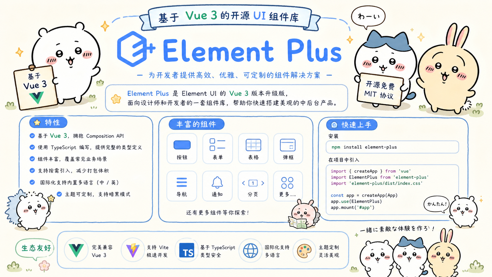
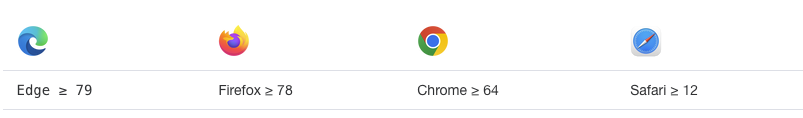
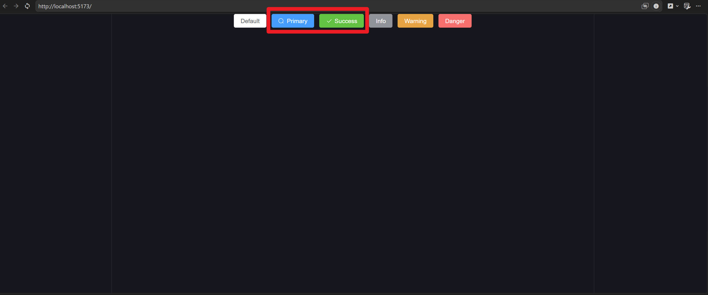
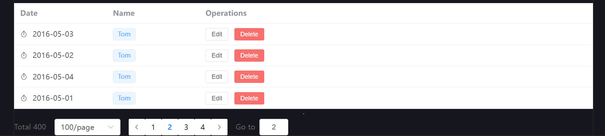
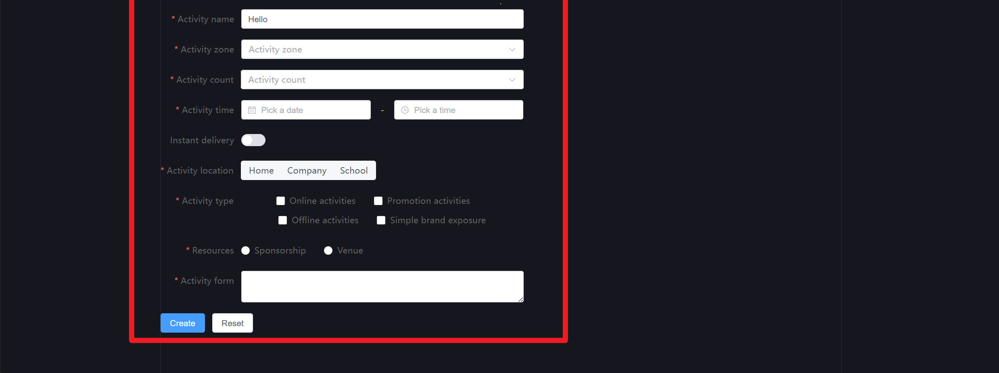

## 1. Element-plus介绍

> Element Plus 是一套基于 Vue 3 的开源 UI 组件库，是由饿了么前端团队开发的升级版本 Element UI。Element Plus 提供了丰富的 UI 组件、易于使用的 API 接口和灵活的主题定制功能，可以帮助开发者快速构建高质量的 Web 应用程序。

+ Element Plus 支持按需加载，且不依赖于任何第三方 CSS 库，它可以轻松地集成到任何 Vue.js 项目中。Element Plus 的文档十分清晰，提供了各种组件的使用方法和示例代码，方便开发者快速上手。

+ Element Plus 目前已经推出了大量的常用 UI 组件，如按钮、表单、表格、对话框、选项卡等，此外还提供了一些高级组件，如日期选择器、时间选择器、级联选择器、滑块、颜色选择器等。这些组件具有一致的设计和可靠的代码质量，可以为开发者提供稳定的使用体验。

+ 与 Element UI 相比，Element Plus 采用了现代化的技术架构和更加先进的设计理念，同时具备更好的性能和更好的兼容性。Element Plus 的更新迭代也更加频繁，可以为开发者提供更好的使用体验和更多的功能特性。

+ Element Plus 可以在支持 [ES2018](https://caniuse.com/?feats=mdn-javascript_builtins_regexp_dotall,mdn-javascript_builtins_regexp_lookbehind_assertion,mdn-javascript_builtins_regexp_named_capture_groups,mdn-javascript_builtins_regexp_property_escapes,mdn-javascript_builtins_symbol_asynciterator,mdn-javascript_functions_method_definitions_async_generator_methods,mdn-javascript_grammar_template_literals_template_literal_revision,mdn-javascript_operators_destructuring_rest_in_objects,mdn-javascript_operators_spread_spread_in_destructuring,promise-finally "ES2018") 和 [ResizeObserver](https://caniuse.com/resizeobserver "ResizeObserver") 的浏览器上运行。 如果您确实需要支持旧版本的浏览器，请自行添加 [Babel](https://babeljs.io/ "Babel") 和相应的 Polyfill 

+ 官网[一个 Vue 3 UI 框架 | Element Plus (element-plus.org)](https://element-plus.org/zh-CN/)

+ 由于 Vue 3 不再支持 IE11，Element Plus 也不再支持 IE 浏览器。




## 2. Element-plus环境搭建

>  1 准备vite项目

```shell
pnpm create vite
进入项目
pnpm install 
```

>  2 安装element-plus

```shell
pnpm install element-plus
```

> 3 完整引入element-plus

+ main.js

```javascript
import { createApp } from 'vue'
import './style.css'
import App from './App.vue'

// 导入element-plus相关内容
import ElementPlus from 'element-plus'
import 'element-plus/dist/index.css'

createApp(App).use(ElementPlus).mount('#app') // 这里的use(ElementPlus)是将element-plus注册到vue中
```


## 3. Element-plus常用组件

> **结合官网演示以下组件:**
>
> [Element Plus官网](https://element-plus.org/zh-CN)

:::: steps

1. Button组件和Card组件

> **main.js**

```js
import { createApp } from 'vue'
import './style.css'
import App from './App.vue'

// 导入element-plus相关内容
import ElementPlus from 'element-plus'
import 'element-plus/dist/index.css'

createApp(App).use(ElementPlus).mount('#app') // 这里的use(ElementPlus)是将element-plus注册到vue中
```

> **App.vue**

```vue
<script setup>
import HelloWorld from './components/HelloWorld.vue'
</script>

<template>
  <HelloWorld />
</template>
```

> **HelloWorld.vue**

```vue
<script setup>
</script>

<template>
  <!-- 按钮行容器，使用 flex 布局横向排列 -->
  <div class="button-row">
    <!-- 默认样式的按钮（无 type 属性） -->
    <el-button>Default</el-button>

    <!-- 主要按钮：type="primary"，并添加搜索图标 -->
    <el-button type="primary" :icon="Search">Primary</el-button>

    <!-- 成功按钮：type="success"，并添加对勾图标 -->
    <el-button type="success" :icon="Check">Success</el-button>

    <!-- 信息按钮：type="info"，无图标 -->
    <el-button type="info">Info</el-button>

    <!-- 警告按钮：type="warning"，无图标 -->
    <el-button type="warning">Warning</el-button>

    <!-- 危险按钮：type="danger"，无图标 -->
    <el-button type="danger">Danger</el-button>
  </div>
</template>

<!-- TypeScript 脚本块（使用 setup 语法糖） -->
<script lang="ts" setup>
// 从 Element Plus 图标库中导入所需的图标组件
// 这些图标将绑定到按钮的 :icon 属性上
import {
  Check,   // 对勾图标（用于 Success 按钮）
  Delete,  // 删除图标（当前未使用，但保留以备后续扩展）
  Edit,    // 编辑图标（当前未使用）
  Message, // 消息图标（当前未使用）
  Search,  // 搜索图标（用于 Primary 按钮）
  Star,    // 星星图标（当前未使用）
} from '@element-plus/icons-vue'
</script>
```




2. Table组件和Pagination组件

> **HelloWorld.vue**

```vue
<template>
  <!-- Table 表格 -->
  <el-table :data="tableData" style="width: 100%">
    <!-- @vue-generic {User} -->
    <el-table-column label="Date" width="180">
      <template #default="scope">
        <div style="display: flex; align-items: center">
          <el-icon>
            <timer />
          </el-icon>
          <span style="margin-left: 10px">{{ scope.row.date }}</span>
        </div>
      </template>
    </el-table-column>
    <!-- @vue-generic {User} -->
    <el-table-column label="Name" width="180">
      <template #default="scope">
        <el-popover effect="light" trigger="hover" placement="top" width="auto">
          <template #default>
            <div>name: {{ scope.row.name }}</div>
            <div>address: {{ scope.row.address }}</div>
          </template>
          <template #reference>
            <el-tag>{{ scope.row.name }}</el-tag>
          </template>
        </el-popover>
      </template>
    </el-table-column>
    <!-- @vue-generic {User} -->
    <el-table-column label="Operations">
      <template #default="scope">
        <el-button size="small" @click="handleEdit(scope.$index, scope.row)">
          Edit
        </el-button>
        <el-button size="small" type="danger" @click="handleDelete(scope.$index, scope.row)">
          Delete
        </el-button>
      </template>
    </el-table-column>
  </el-table>


  <!--分页-->
  <el-pagination
      v-model:current-page="currentPage4"
      v-model:page-size="pageSize4"
      :page-sizes="[100, 200, 300, 400]"
      :size="size"
      :disabled="disabled"
      :background="background"
      layout="total, sizes, prev, pager, next, jumper"
      :total="400"
      @size-change="handleSizeChange"
      @current-change="handleCurrentChange"
    />
</template>

<script lang="ts" setup>
// Table 表格
import { Timer } from '@element-plus/icons-vue'

interface User {
  date: string
  name: string
  address: string
}

const handleEdit = (index: number, row: User) => {
  console.log(index, row)
}
const handleDelete = (index: number, row: User) => {
  console.log(index, row)
}

const tableData: User[] = [
  {
    date: '2016-05-03',
    name: 'Tom',
    address: 'No. 189, Grove St, Los Angeles',
  },
  {
    date: '2016-05-02',
    name: 'Tom',
    address: 'No. 189, Grove St, Los Angeles',
  },
  {
    date: '2016-05-04',
    name: 'Tom',
    address: 'No. 189, Grove St, Los Angeles',
  },
  {
    date: '2016-05-01',
    name: 'Tom',
    address: 'No. 189, Grove St, Los Angeles',
  },
]
    
    
// 分页
const currentPage1 = ref(5)
const currentPage2 = ref(5)
const currentPage3 = ref(5)
const currentPage4 = ref(4)
const pageSize2 = ref(100)
const pageSize3 = ref(100)
const pageSize4 = ref(100)
const size = ref<ComponentSize>('default')
const background = ref(false)
const disabled = ref(false)

const handleSizeChange = (val: number) => {
  console.log(`${val} items per page`)
}
const handleCurrentChange = (val: number) => {
  console.log(`current page: ${val}`)
}
</script>


<style>
/*分页*/
.demo-pagination-block+.demo-pagination-block {
  margin-top: 10px;
}

.demo-pagination-block .demonstration {
  margin-bottom: 16px;
}
</style>
```




3. Form组件和表单数据校验

> **HelloWorld.vue**

```vue
<script setup>

</script>

<template>
  <!-- Form组件和表单数据校验 -->
  <el-form
    ref="ruleFormRef"
    style="max-width: 600px"
    :model="ruleForm"
    :rules="rules"
    label-width="auto"
  >
    <el-form-item label="Activity name" prop="name">
      <el-input v-model="ruleForm.name" />
    </el-form-item>
    <el-form-item label="Activity zone" prop="region">
      <el-select v-model="ruleForm.region" placeholder="Activity zone">
        <el-option label="Zone one" value="shanghai" />
        <el-option label="Zone two" value="beijing" />
      </el-select>
    </el-form-item>
    <el-form-item label="Activity count" prop="count">
      <el-select-v2
        v-model="ruleForm.count"
        placeholder="Activity count"
        :options="options"
      />
    </el-form-item>
    <el-form-item label="Activity time" required>
      <el-col :span="11">
        <el-form-item prop="date1">
          <el-date-picker
            v-model="ruleForm.date1"
            type="date"
            aria-label="Pick a date"
            placeholder="Pick a date"
            style="width: 100%"
          />
        </el-form-item>
      </el-col>
      <el-col class="text-center" :span="2">
        <span class="text-gray-500">-</span>
      </el-col>
      <el-col :span="11">
        <el-form-item prop="date2">
          <el-time-picker
            v-model="ruleForm.date2"
            aria-label="Pick a time"
            placeholder="Pick a time"
            style="width: 100%"
          />
        </el-form-item>
      </el-col>
    </el-form-item>
    <el-form-item label="Instant delivery" prop="delivery">
      <el-switch v-model="ruleForm.delivery" />
    </el-form-item>
    <el-form-item label="Activity location" prop="location">
      <el-segmented v-model="ruleForm.location" :options="locationOptions" />
    </el-form-item>
    <el-form-item label="Activity type" prop="type">
      <el-checkbox-group v-model="ruleForm.type">
        <el-checkbox value="Online activities" name="type">
          Online activities
        </el-checkbox>
        <el-checkbox value="Promotion activities" name="type">
          Promotion activities
        </el-checkbox>
        <el-checkbox value="Offline activities" name="type">
          Offline activities
        </el-checkbox>
        <el-checkbox value="Simple brand exposure" name="type">
          Simple brand exposure
        </el-checkbox>
      </el-checkbox-group>
    </el-form-item>
    <el-form-item label="Resources" prop="resource">
      <el-radio-group v-model="ruleForm.resource">
        <el-radio value="Sponsorship">Sponsorship</el-radio>
        <el-radio value="Venue">Venue</el-radio>
      </el-radio-group>
    </el-form-item>
    <el-form-item label="Activity form" prop="desc">
      <el-input v-model="ruleForm.desc" type="textarea" />
    </el-form-item>
    <el-form-item>
      <el-button type="primary" @click="submitForm(ruleFormRef)">
        Create
      </el-button>
      <el-button @click="resetForm(ruleFormRef)">Reset</el-button>
    </el-form-item>
  </el-form>
</template>

<script lang="ts" setup>

import { reactive, ref } from 'vue'

import type { FormInstance, FormRules } from 'element-plus'

interface RuleForm {
  name: string
  region: string
  count: string
  date1: string
  date2: string
  delivery: boolean
  location: string
  type: string[]
  resource: string
  desc: string
}

const ruleFormRef = ref<FormInstance>()
const ruleForm = reactive<RuleForm>({
  name: 'Hello',
  region: '',
  count: '',
  date1: '',
  date2: '',
  delivery: false,
  location: '',
  type: [],
  resource: '',
  desc: '',
})

const locationOptions = ['Home', 'Company', 'School']

const rules = reactive<FormRules<RuleForm>>({
  name: [
    { required: true, message: 'Please input Activity name', trigger: 'blur' },
    { min: 3, max: 5, message: 'Length should be 3 to 5', trigger: 'blur' },
  ],
  region: [
    {
      required: true,
      message: 'Please select Activity zone',
      trigger: 'change',
    },
  ],
  count: [
    {
      required: true,
      message: 'Please select Activity count',
      trigger: 'change',
    },
  ],
  date1: [
    {
      type: 'date',
      required: true,
      message: 'Please pick a date',
      trigger: 'change',
    },
  ],
  date2: [
    {
      type: 'date',
      required: true,
      message: 'Please pick a time',
      trigger: 'change',
    },
  ],
  location: [
    {
      required: true,
      message: 'Please select a location',
      trigger: 'change',
    },
  ],
  type: [
    {
      type: 'array',
      required: true,
      message: 'Please select at least one activity type',
      trigger: 'change',
    },
  ],
  resource: [
    {
      required: true,
      message: 'Please select activity resource',
      trigger: 'change',
    },
  ],
  desc: [
    { required: true, message: 'Please input activity form', trigger: 'blur' },
  ],
})

const submitForm = async (formEl: FormInstance | undefined) => {
  if (!formEl) return
  await formEl.validate((valid, fields) => {
    if (valid) {
      console.log('submit!')
    } else {
      console.log('error submit!', fields)
    }
  })
}

const resetForm = (formEl: FormInstance | undefined) => {
  if (!formEl) return
  formEl.resetFields()
}

const options = Array.from({ length: 10000 }).map((_, idx) => ({
  value: `${idx + 1}`,
  label: `${idx + 1}`,
}))
</script>
```



::::