## 前后端联调

**后端的初始工程中已经实现了`登录功能`，直接进行前后端联调测试即可**

::: tip 

+ **在application-dev.yml中配置好自己的数据库密码**

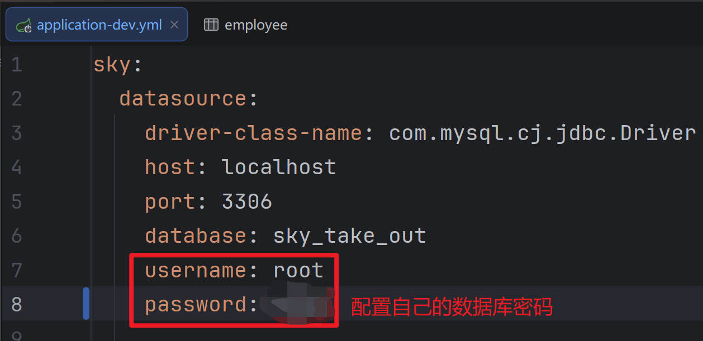

:::

实现思路： 

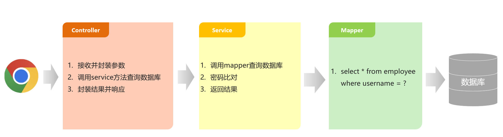

> **注：可以通过`断点调试`跟踪`后端程序的执行过程`**

**1.Controller层**

+ **在sky-server模块中，com.sky.controller.admin.EmployeeController**

```java
/**
     * 登录
     *
     * @param employeeLoginDTO
     * @return
     */
    @PostMapping("/login")
    public Result<EmployeeLoginVO> login(@RequestBody EmployeeLoginDTO employeeLoginDTO) {
        log.info("员工登录：{}", employeeLoginDTO);

        Employee employee = employeeService.login(employeeLoginDTO);

        //登录成功后，生成jwt令牌
        Map<String, Object> claims = new HashMap<>();
        // 将员工id存入claims
        claims.put(JwtClaimsConstant.EMP_ID, employee.getId());
        String token = JwtUtil.createJWT(
                // 管理员的秘钥
                jwtProperties.getAdminSecretKey(),
                // 管理员的过期时间
                jwtProperties.getAdminTtl(),
                // 管理员的claims
                claims);

        // 构建返回对象
        EmployeeLoginVO employeeLoginVO = EmployeeLoginVO.builder()
                // 封装数据
                .id(employee.getId())
                .userName(employee.getUsername())
                .name(employee.getName())
                .token(token)
                .build();

        // 返回结果
        return Result.success(employeeLoginVO);
    }
```


**2.Service层**

+ **在sky-server模块中，com.sky.service.impl.EmployeeServiceImpl**

```java
package com.sky.service.impl;

import com.sky.constant.MessageConstant;
import com.sky.constant.StatusConstant;
import com.sky.dto.EmployeeLoginDTO;
import com.sky.entity.Employee;
import com.sky.exception.AccountLockedException;
import com.sky.exception.AccountNotFoundException;
import com.sky.exception.PasswordErrorException;
import com.sky.mapper.EmployeeMapper;
import com.sky.service.EmployeeService;
import org.springframework.beans.factory.annotation.Autowired;
import org.springframework.stereotype.Service;

@Service
public class EmployeeServiceImpl implements EmployeeService {

    @Autowired
    private EmployeeMapper employeeMapper;

    /**
     * 员工登录
     *
     * @param employeeLoginDTO
     * @return
     */
    public Employee login(EmployeeLoginDTO employeeLoginDTO) {
        // 获取登录信息
        String username = employeeLoginDTO.getUsername();
        String password = employeeLoginDTO.getPassword();

        //1、根据用户名查询数据库中的数据
        Employee employee = employeeMapper.getByUsername(username);

        //2、处理各种异常情况（用户名不存在、密码不对、账号被锁定）
        if (employee == null) {
            //账号不存在
            throw new AccountNotFoundException(MessageConstant.ACCOUNT_NOT_FOUND);
        }

        //密码比对
        // TODO 后期需要进行md5加密，然后再进行比对
        if (!password.equals(employee.getPassword())) {
            //密码错误
            throw new PasswordErrorException(MessageConstant.PASSWORD_ERROR);
        }

        if (employee.getStatus() == StatusConstant.DISABLE) {
            //账号被锁定
            throw new AccountLockedException(MessageConstant.ACCOUNT_LOCKED);
        }

        //3、返回实体对象
        return employee;
    }

}
```


**3.Mapper层**

+ **在sky-server模块中，com.sky.mapper.EmployeeMapper**

```java
package com.sky.mapper;

import com.sky.entity.Employee;
import org.apache.ibatis.annotations.Mapper;
import org.apache.ibatis.annotations.Select;

@Mapper
public interface EmployeeMapper {

    /**
     * 根据用户名查询员工
     * @param username
     * @return
     */
    @Select("select * from employee where username = #{username}")
    Employee getByUsername(String username);

}
```


### JWT令牌加密技术

+ **用户登录流程：**

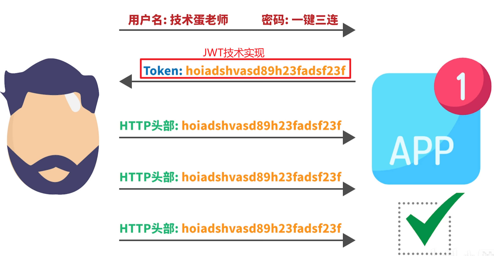

::: tip 

**`JWT（JSON Web Token）`是一种用于`身份验证和授权的开放标准`。它由三部分组成，分别是`头部（Header）`、`载荷（Payload）`和`签名（Signature）`。其中，`签名`是用于`验证令牌的完整性和可信任性`。**

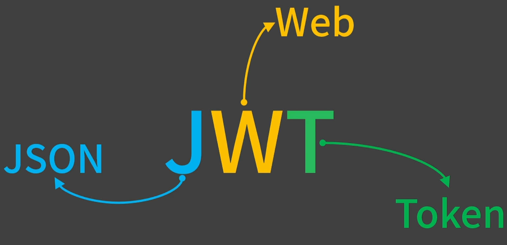

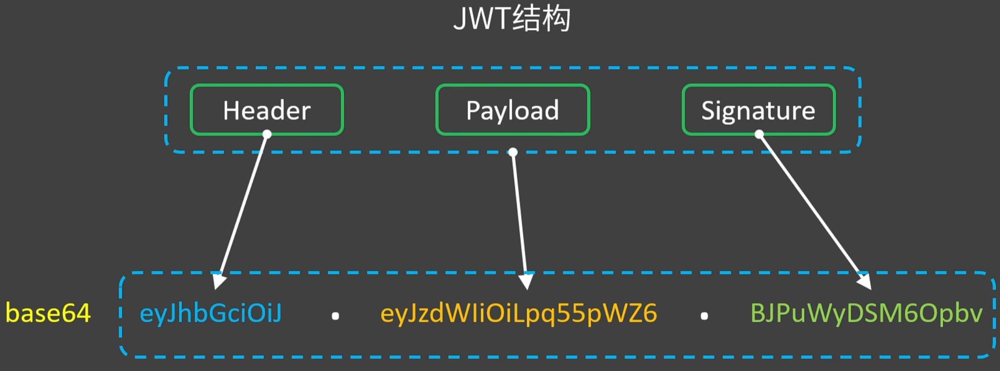

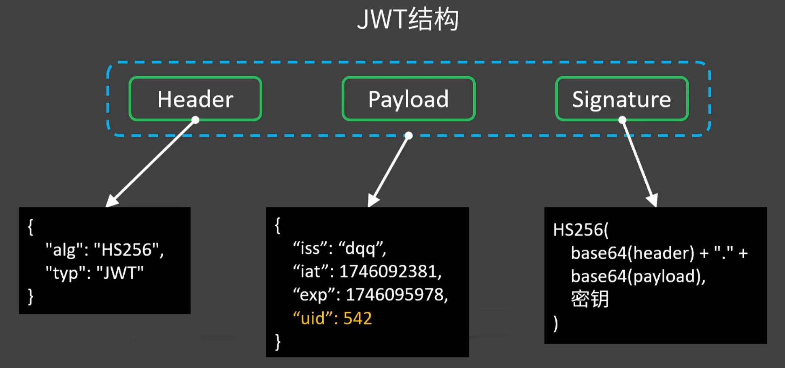

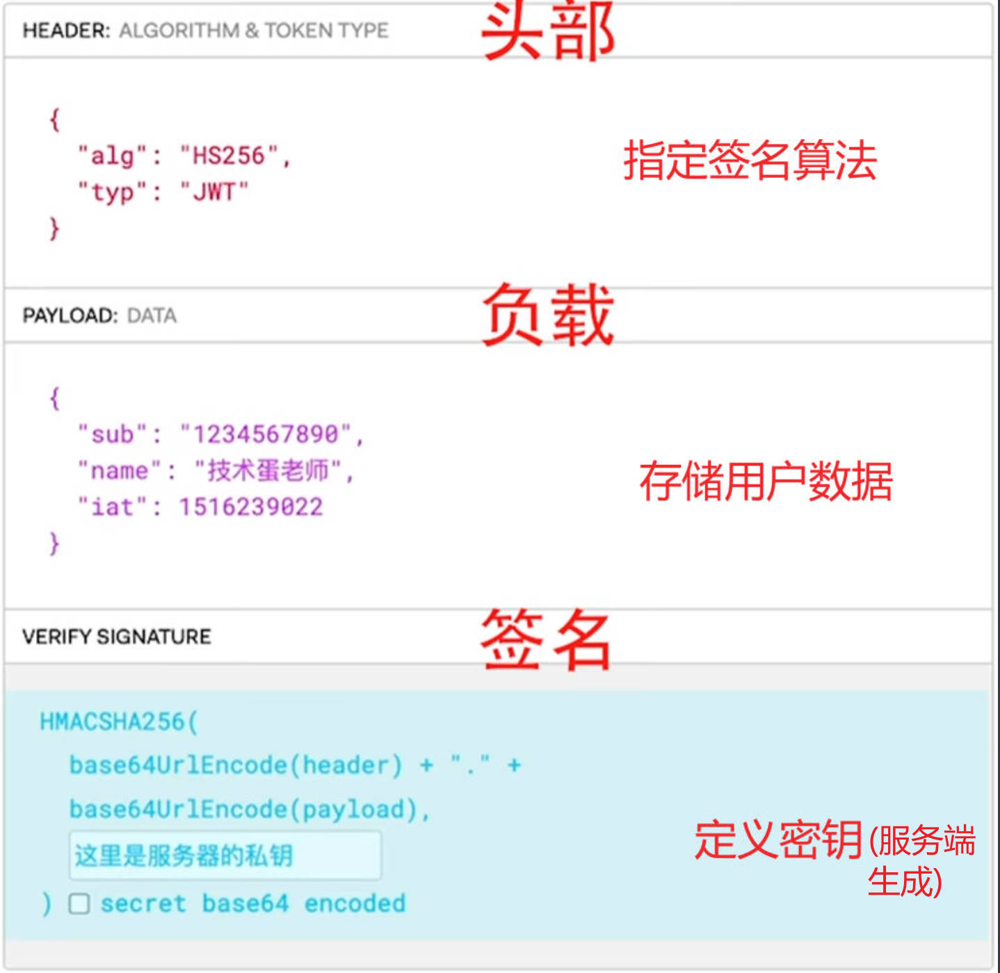

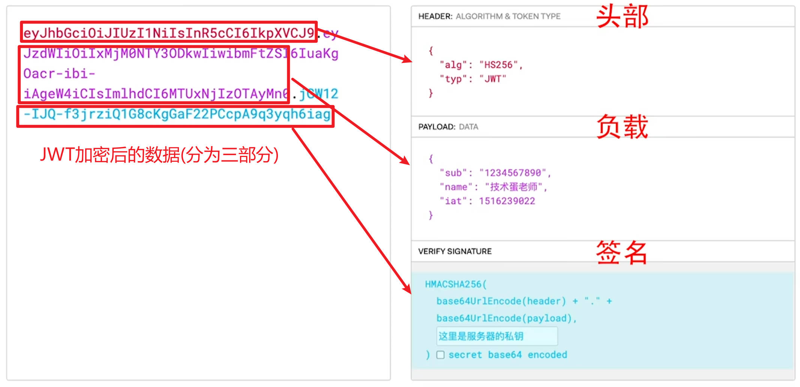

+ **JWT的优势:**

> 1. **`授权信息完全存储在`客户端**
> 2. **服务端`不需要存储任何信息`，`不需要部署分布式存储系统`**

+ **JWT的劣势:**

> 1. **想撤回JWT很难**
> 2. **过期时间尽可能设短，比如从一天改为1小时**
>
> + **Payload里不宜存放敏感信息**
>
> 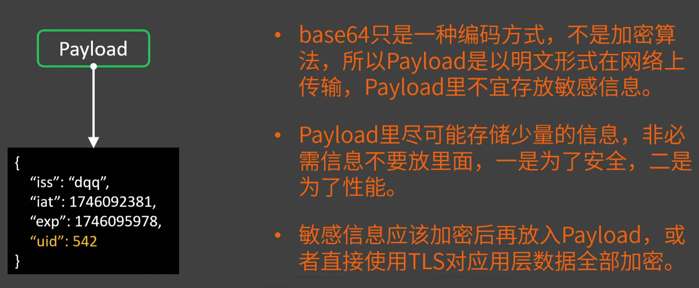
>
> 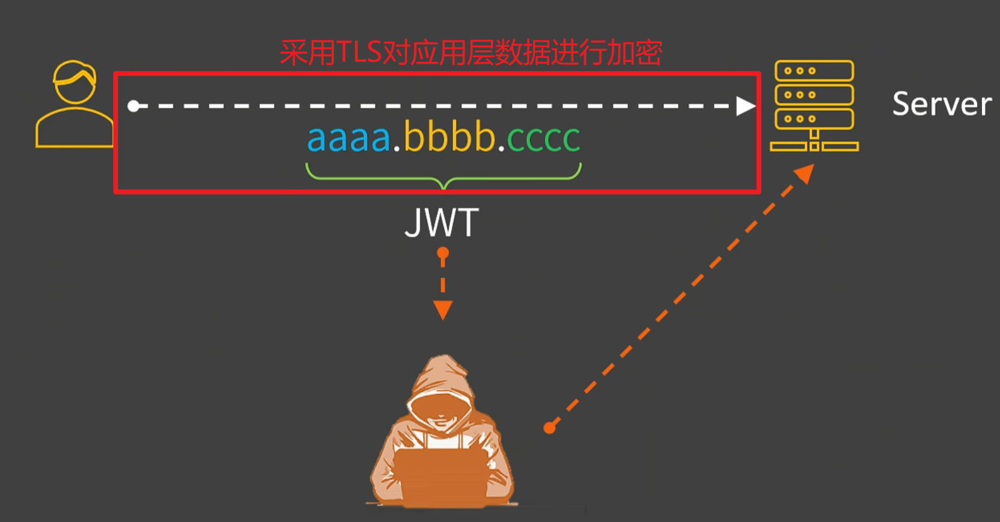

:::

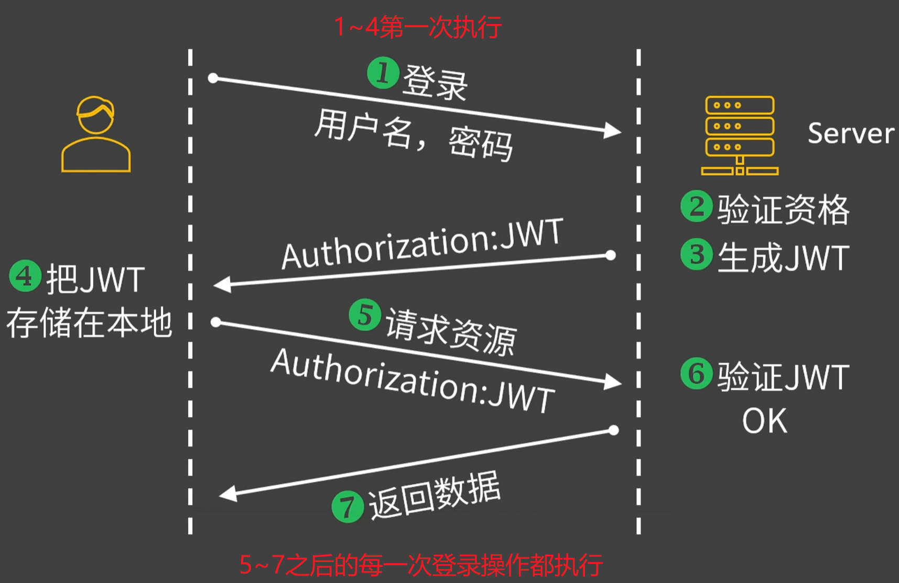


