## 基于注解和AOP的公共字段填充

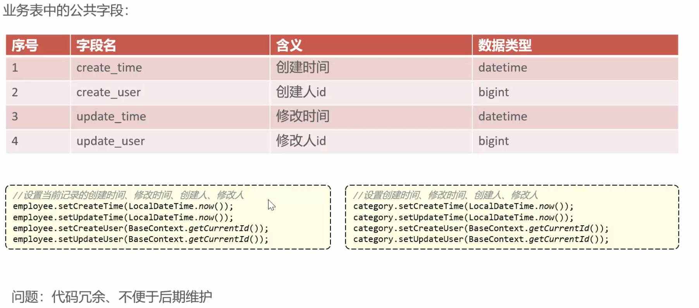

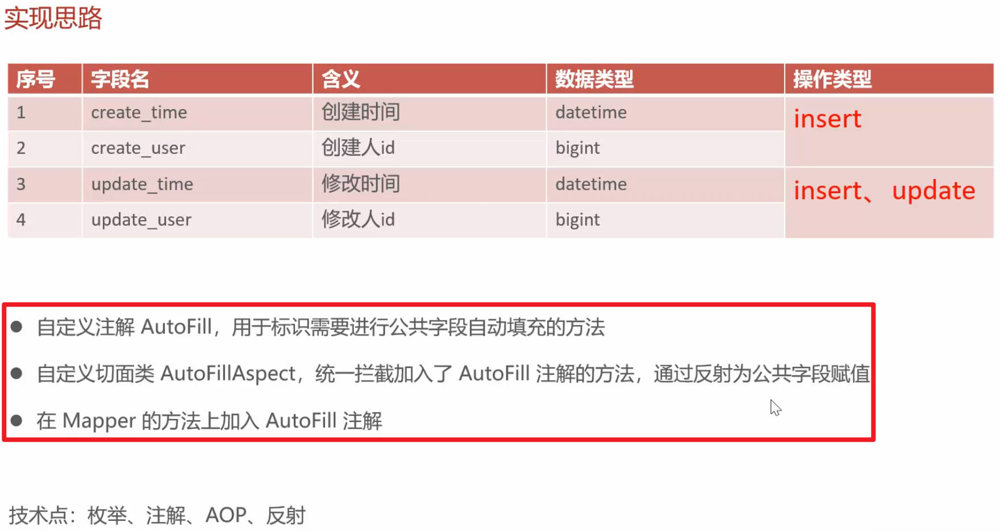

::: tip 

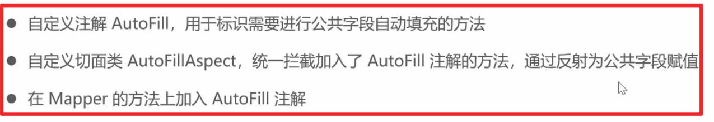

**聚焦到项目：我们的整体思路为：通过注解的方式`标记方法`，利用AOP思想创建一个切面，在切面中实现对标记方式中字段的填充，然后再运行原方法。这样就实现了在`不改动`原方法的前提下，实现了对代码的优化升级。**

**让我们基于整个项目了解一下基于AOP思想的注解开发：**

+ **首先先创建一个注解： AutoFill**

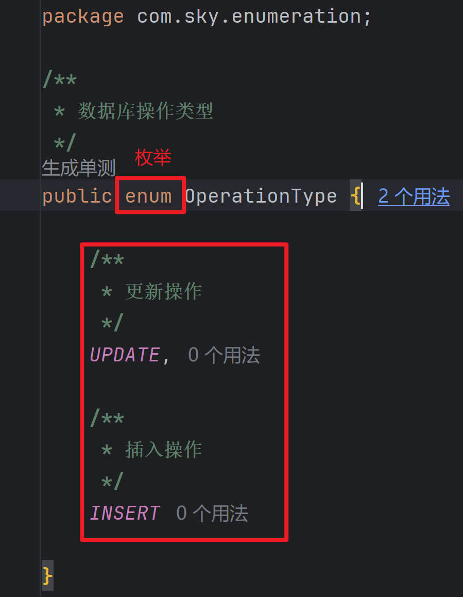

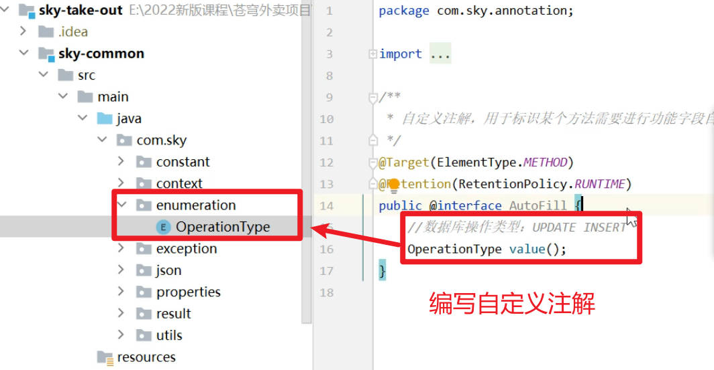

+ **AutoFill.java**

```java
package com.sky.annotation;

import com.sky.enumeration.OperationType;

import java.lang.annotation.ElementType;
import java.lang.annotation.Retention;
import java.lang.annotation.RetentionPolicy;
import java.lang.annotation.Target;

/**
 * 自定义注解，用于标识某个方法需要进行功能字段自动填充处理
 */
@Target(ElementType.METHOD) // 注解作用于方法上
@Retention(RetentionPolicy.RUNTIME) // 注解在运行时可见，可通过反射获取
public @interface AutoFill {
    // 指定填充的操作类型 (UPDATE或INSERT)
    OperationType value();
}
```

> **注解的作用：使用在mapper层，标记`对数据库的操作类型`。这里是因为公共字段的填充只有`修改`和`新增`这两个类业务。我们需要准确的`拦截`这两个数据库层面的操作，`在切面中完成对公共字段的填充`。**


+ **编写AutoFillAspect切面**

> **自定义切面类AutoFillAspect，统一`拦截加入了 AutoFill 注解的方法`，通过`反射`为`公共字段赋值`**


+ **AutoFillAspect.java**

```java
package com.sky.aspect;


import com.sky.annotation.AutoFill;
import com.sky.constant.AutoFillConstant;
import com.sky.context.BaseContext;
import com.sky.enumeration.OperationType;
import lombok.extern.slf4j.Slf4j;
import org.aspectj.lang.JoinPoint;
import org.aspectj.lang.annotation.Aspect;
import org.aspectj.lang.annotation.Before;
import org.aspectj.lang.annotation.Pointcut;
import org.aspectj.lang.reflect.MethodSignature;
import org.springframework.stereotype.Component;

import java.lang.reflect.Method;
import java.time.LocalDateTime;

/**
 * 自定义切面，实现公共字段自动填充处理逻辑
 */
@Aspect // 定义一个切面
@Component // 让Spring管理这个切面
@Slf4j // 方便查看相关日志
public class AutoFillAspect {

    /**
     * 切入点
     */
    // 定义切入点表达式，匹配所有在com.sky.mapper包下的方法，并且这些方法上使用了@AutoFill注解
    @Pointcut("execution(* com.sky.mapper.*.*(..)) && @annotation(com.sky.annotation.AutoFill)")
    public void autoFillPointCut(){}


    /**
     * 前置通知，在通知中进行公共字段的赋值
     */
    @Before("autoFillPointCut()")
    public void autoFill(JoinPoint joinPoint){
        // 打印方法执行的信息
        log.info("开始进行公共字段自动填充...");

        // 获取到当前被拦截的方法上的数据库操作类型
        MethodSignature signature = (MethodSignature) joinPoint.getSignature(); // 方法签名对象
        AutoFill autoFill = signature.getMethod().getAnnotation(AutoFill.class); // 获取到当前方法上的@AutoFill注解对象
        OperationType operationType = autoFill.value(); // 获取到当前方法上的@AutoFill注解的value属性值

        // 获取到当前被拦截的方法的参数--实体对象
        Object[] args = joinPoint.getArgs();
        // 判断参数是否为空，或者长度是否为0
        if(args == null || args.length == 0){
            return;
        }
        Object entity = args[0]; // 获取到当前被拦截的方法的第一个参数--实体对象

        // 准备赋值的数据
        LocalDateTime now = LocalDateTime.now(); // 当前时间
        Long currentId = BaseContext.getCurrentId();// 当前登录用户的id

        // 根据当前不同的操作类型，对实体对象进行赋值
        if(operationType == OperationType.INSERT){
            //为4个公共字段赋值
            try {
                Method setCreateTime = entity.getClass().getDeclaredMethod(AutoFillConstant.SET_CREATE_TIME, LocalDateTime.class);
                Method setCreateUser = entity.getClass().getDeclaredMethod(AutoFillConstant.SET_CREATE_USER, Long.class);
                Method setUpdateTime = entity.getClass().getDeclaredMethod(AutoFillConstant.SET_UPDATE_TIME, LocalDateTime.class);
                Method setUpdateUser = entity.getClass().getDeclaredMethod(AutoFillConstant.SET_UPDATE_USER, Long.class);

                //通过反射为对象属性赋值
                setCreateTime.invoke(entity,now);
                setCreateUser.invoke(entity,currentId);
                setUpdateTime.invoke(entity,now);
                setUpdateUser.invoke(entity,currentId);
            } catch (Exception e) {
                e.printStackTrace();
            }
        }else if(operationType == OperationType.UPDATE){
            //为2个公共字段赋值
            try {
                Method setUpdateTime = entity.getClass().getDeclaredMethod(AutoFillConstant.SET_UPDATE_TIME, LocalDateTime.class);
                Method setUpdateUser = entity.getClass().getDeclaredMethod(AutoFillConstant.SET_UPDATE_USER, Long.class);

                //通过反射为对象属性赋值
                setUpdateTime.invoke(entity,now);
                setUpdateUser.invoke(entity,currentId);
            } catch (Exception e) {
                e.printStackTrace();
            }
        }
    }
}
```

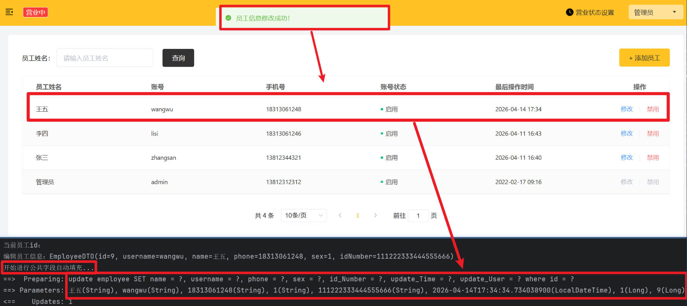

> **这样下来，我们就实现了公共字段的自动填充，我们回顾整个代码逻辑，可以把整个过程总结为两步:**
>
> + **自定义注解（标记类型），通过注解快速标记目标方法**
>
> + **完成切面的逻辑代码，通过切入点表达式快速捕捉需要进行切入的方法，对这些方法进行处理**

:::


## 文件上传(阿里云OSS)

::: note 

+ **阿里云OSS配置步骤:**

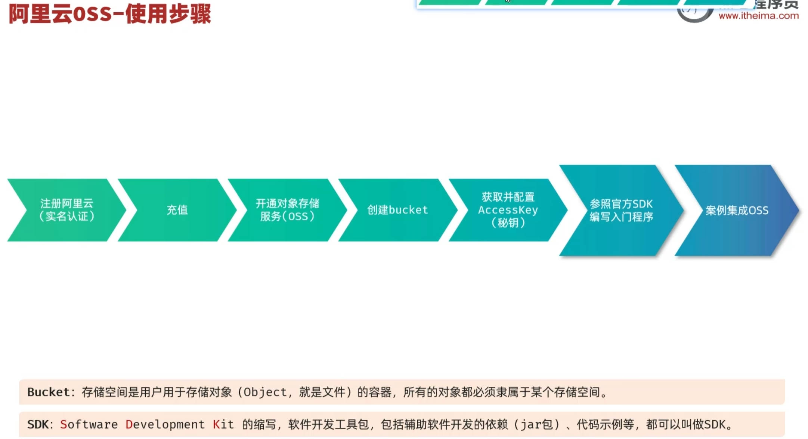

+ **创建Bucket:**

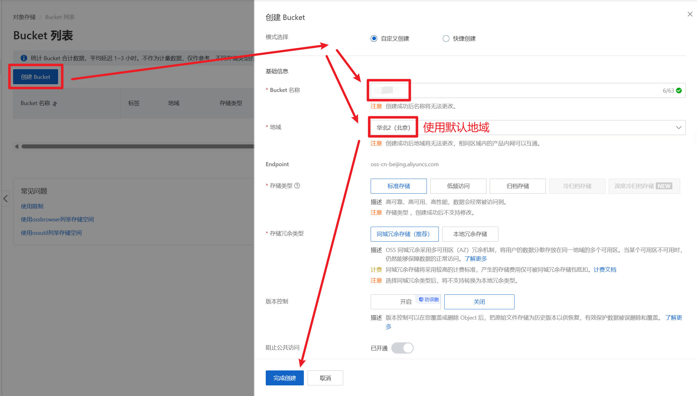

+ **关闭`阻止公共访问`和开启`公共读`**

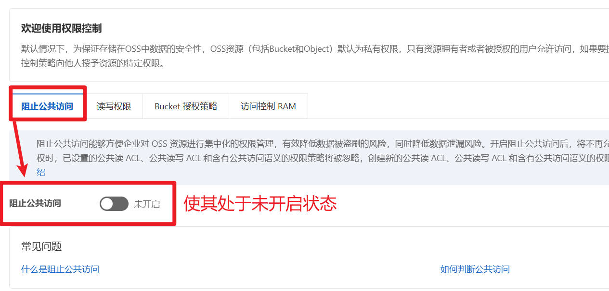

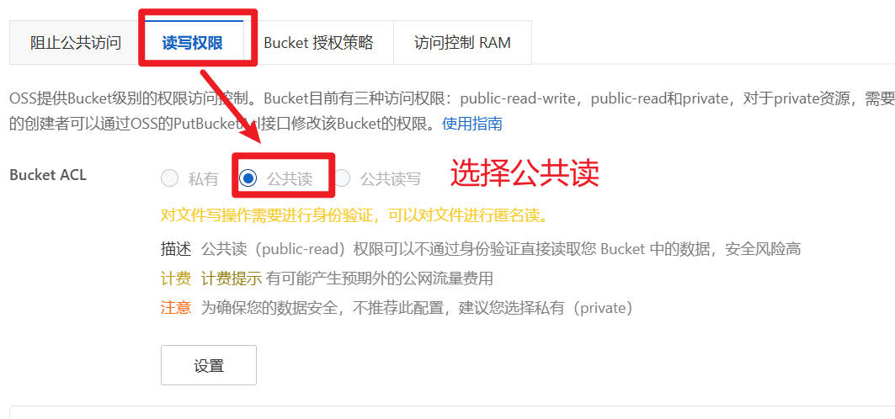

+ **点击 "创建AccessKey":**

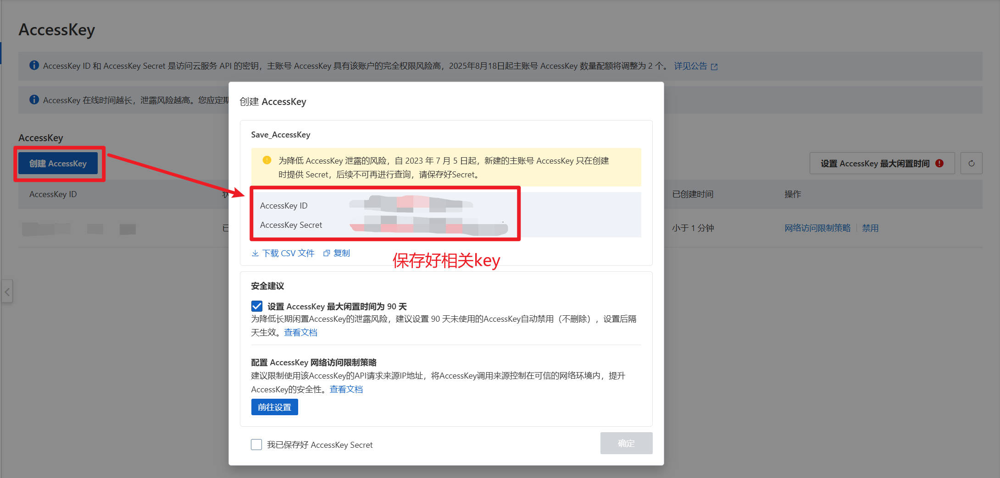

+ **配置AccessKey:**

以**管理员身份**打开CMD命令行，执行如下命令，配置系统的环境变量。

```sql
set OSS_ACCESS_KEY_ID=xxxxxxxxxxxxxxxxxxxxxxxxxxxxxxxxxxxxxxxxxxxx
set OSS_ACCESS_KEY_SECRET=xxxxxxxxxxxxxxxxxxxxxxxxxxxxxxxxxxxxxxxxxx
```

> **注意：将上述的`ACCESS_KEY_ID`与`ACCESS_KEY_SECRET`的值一定要替换成自己的**

+ **执行如下命令，让更改生效**

```shell
setx OSS_ACCESS_KEY_ID "%OSS_ACCESS_KEY_ID%"
setx OSS_ACCESS_KEY_SECRET "%OSS_ACCESS_KEY_SECRET%"
```

+ **执行如下命令，验证环境变量是否生效**

```shell
echo %OSS_ACCESS_KEY_ID%
echo %OSS_ACCESS_KEY_SECRET%
```

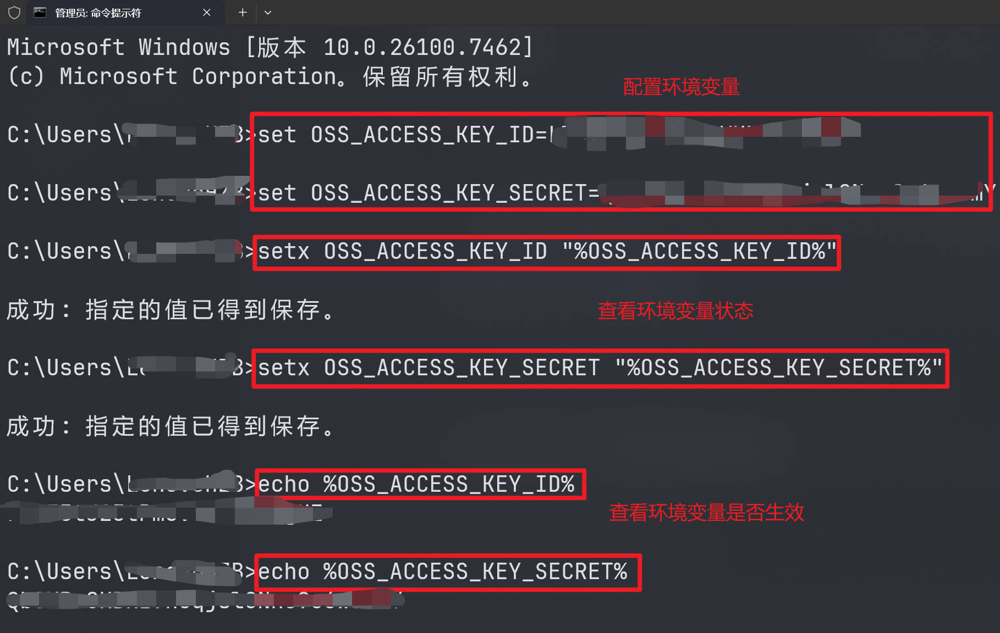

:::

::: tip 

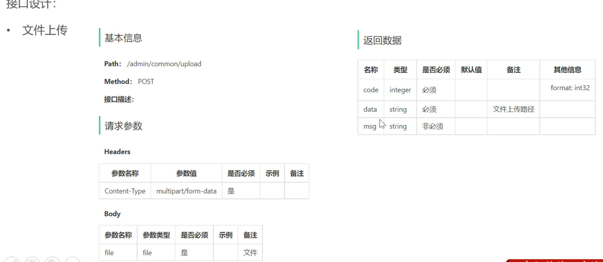

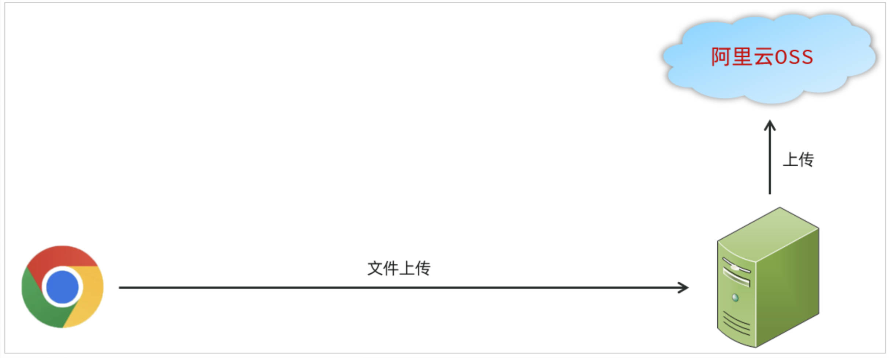

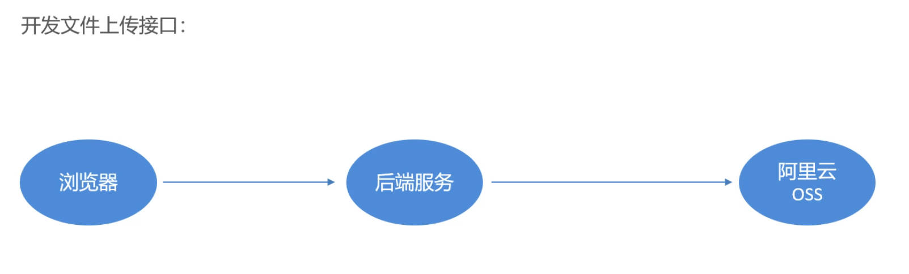

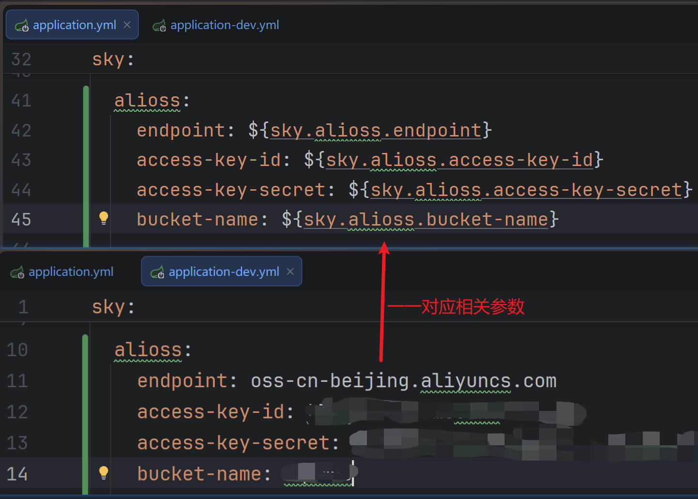

:::

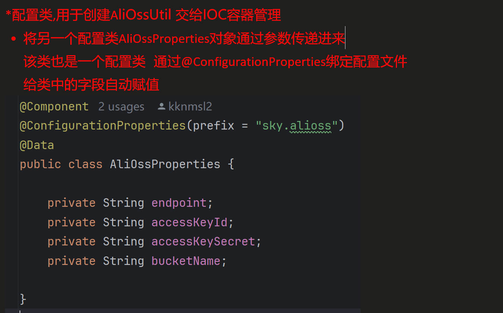

+ **AliOssUtil.java(阿里云OSS上传文件工具类)**

```java
package com.sky.utils;

import com.aliyun.oss.ClientException;
import com.aliyun.oss.OSS;
import com.aliyun.oss.OSSClientBuilder;
import com.aliyun.oss.OSSException;
import lombok.AllArgsConstructor;
import lombok.Data;
import lombok.extern.slf4j.Slf4j;
import java.io.ByteArrayInputStream;

@Data
@AllArgsConstructor
@Slf4j
public class AliOssUtil {

    private String endpoint;
    private String accessKeyId;
    private String accessKeySecret;
    private String bucketName;

    /**
     * 文件上传
     *
     * @param bytes
     * @param objectName
     * @return
     */
    public String upload(byte[] bytes, String objectName) {

        // 创建OSSClient实例。
        OSS ossClient = new OSSClientBuilder().build(endpoint, accessKeyId, accessKeySecret);

        try {
            // 创建PutObject请求。
            ossClient.putObject(bucketName, objectName, new ByteArrayInputStream(bytes));
        } catch (OSSException oe) {
            System.out.println("Caught an OSSException, which means your request made it to OSS, "
                    + "but was rejected with an error response for some reason.");
            System.out.println("Error Message:" + oe.getErrorMessage());
            System.out.println("Error Code:" + oe.getErrorCode());
            System.out.println("Request ID:" + oe.getRequestId());
            System.out.println("Host ID:" + oe.getHostId());
        } catch (ClientException ce) {
            System.out.println("Caught an ClientException, which means the client encountered "
                    + "a serious internal problem while trying to communicate with OSS, "
                    + "such as not being able to access the network.");
            System.out.println("Error Message:" + ce.getMessage());
        } finally {
            if (ossClient != null) {
                ossClient.shutdown();
            }
        }

        //文件访问路径规则 https://BucketName.Endpoint/ObjectName
        StringBuilder stringBuilder = new StringBuilder("https://");
        stringBuilder
                .append(bucketName)
                .append(".")
                .append(endpoint)
                .append("/")
                .append(objectName);

        // 打印上传成功信息
        log.info("文件上传到:{}", stringBuilder.toString());

        // 返回文件访问路径
        return stringBuilder.toString();
    }
}
```

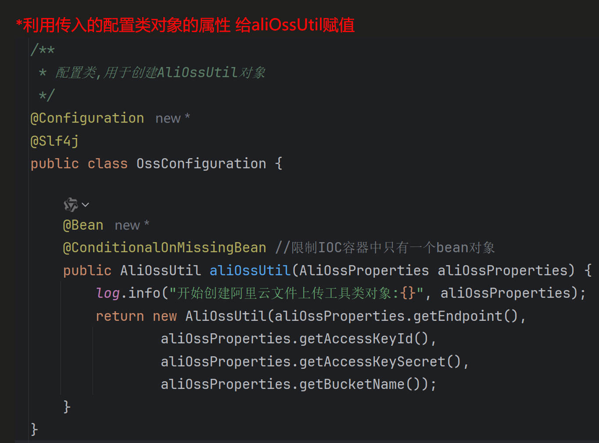

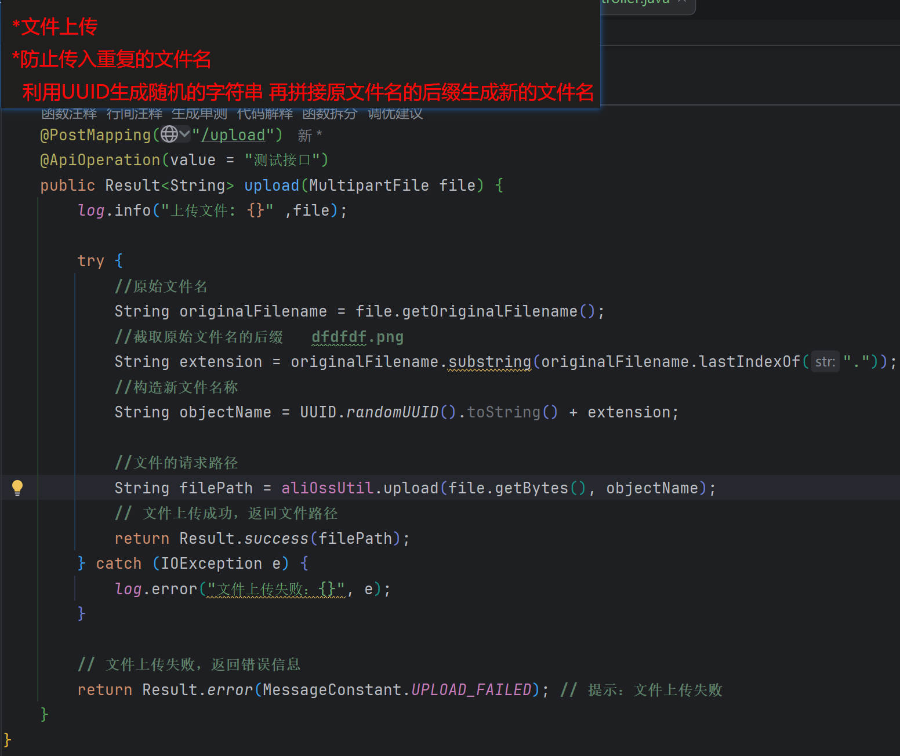


## 新增菜品

> **业务规则：**
>
> + **菜品名称必须是唯一的**
>
> + **菜品必须属于某个分类下，不能单独存在**
>
> + **新增菜品时可以根据情况选择菜品的口味**
>
> + **每个菜品必须对应一张图片**

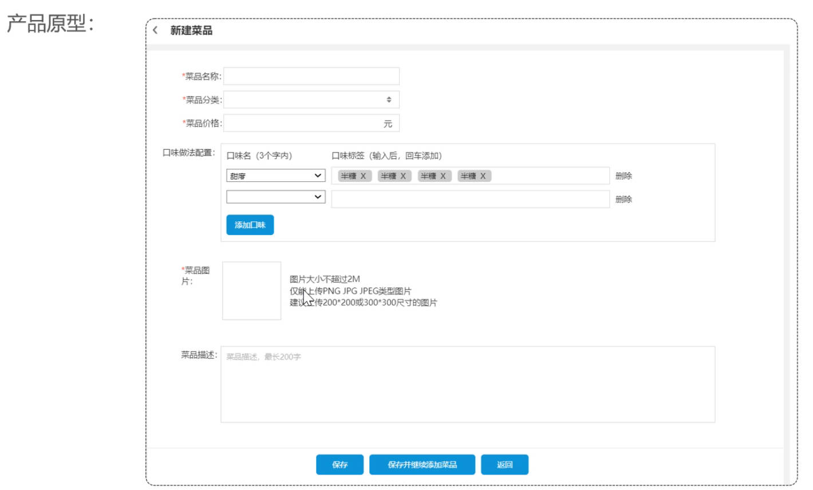

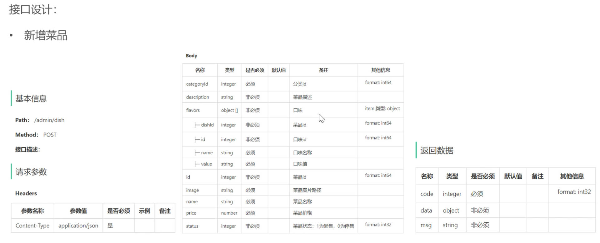

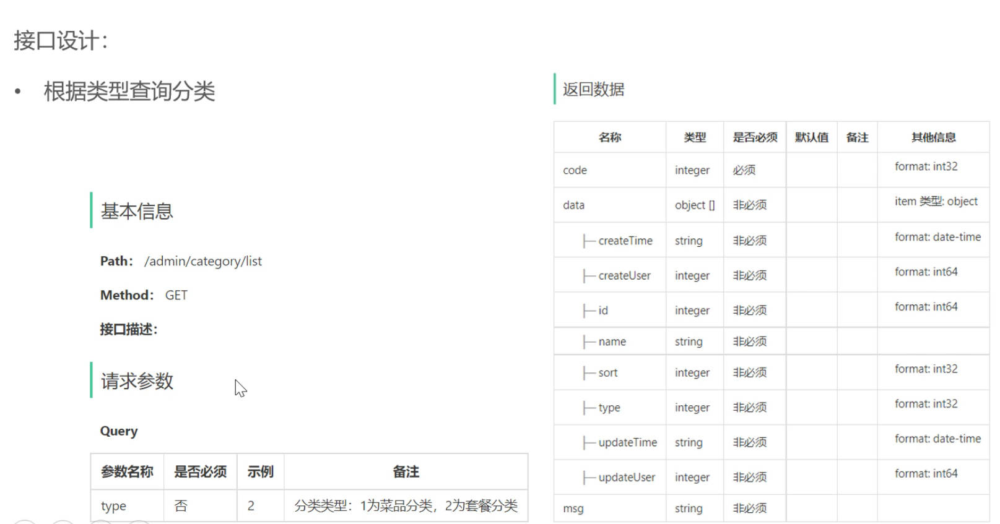

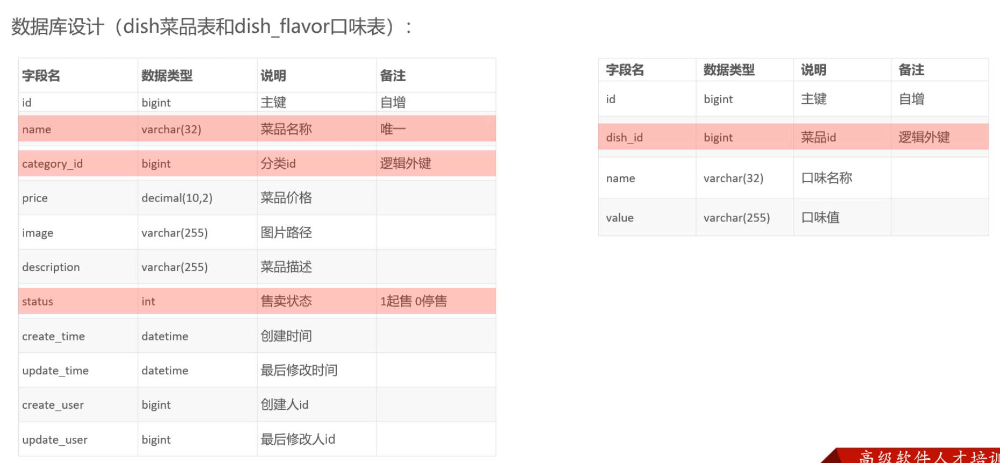

::: tip 


:::


